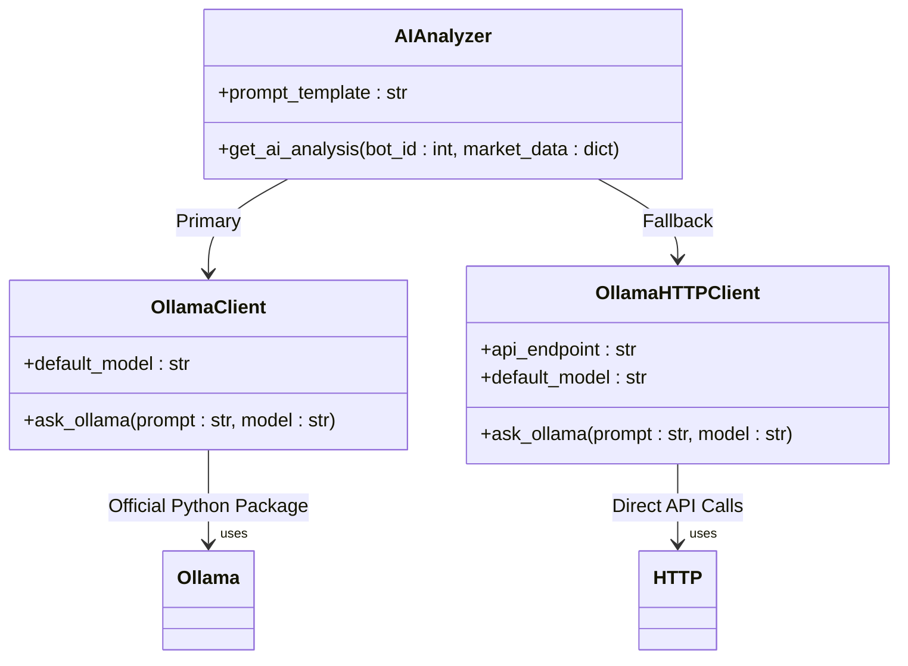
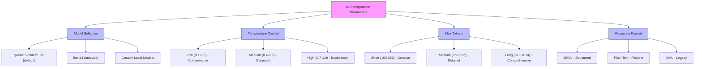
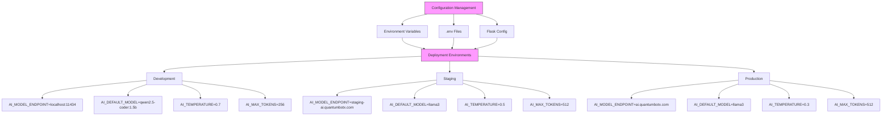
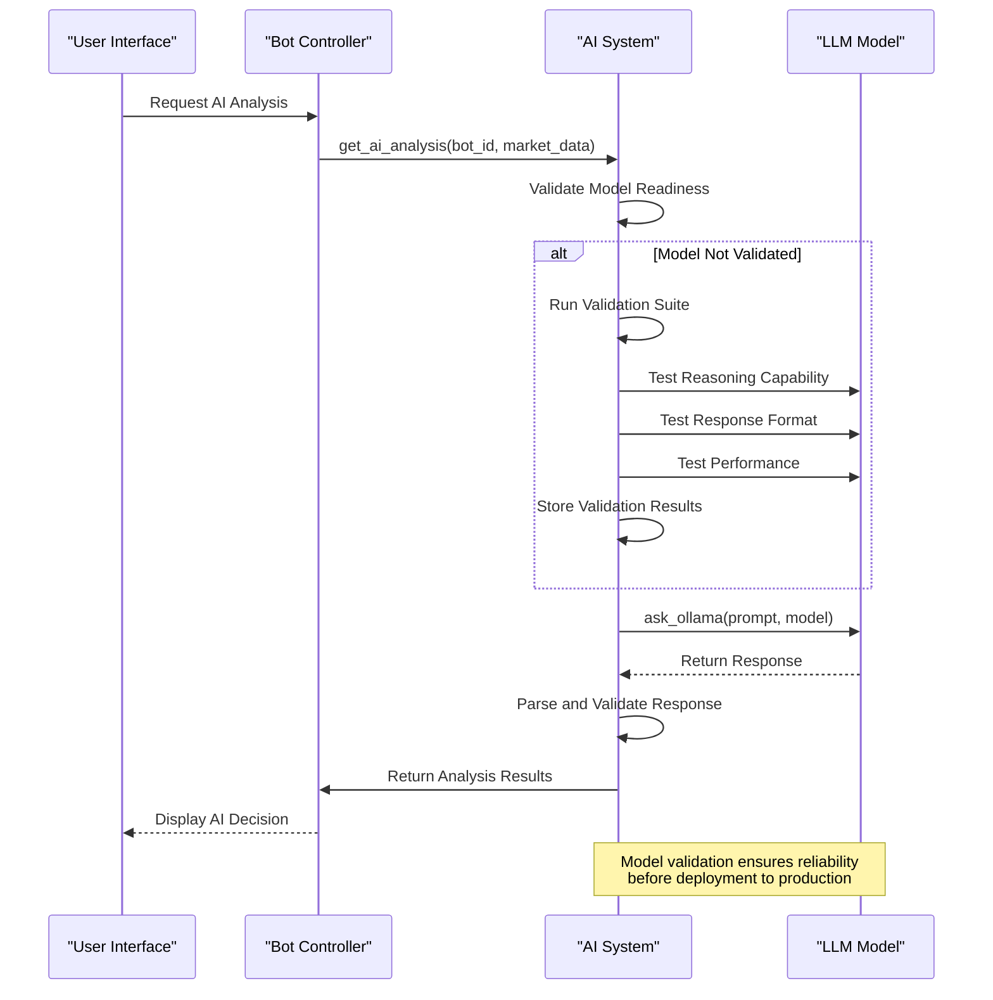
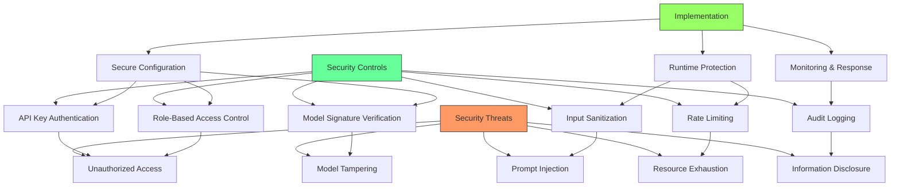
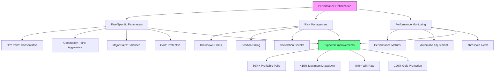

# AI Configuration and Model Management

<cite>
**Referenced Files in This Document**   
- [ollama_client.py](file://core/ai/ollama_client.py)
- [ollama.py](file://core/utils/ollama.py)
- [ai.py](file://core/utils/ai.py)
- [STRATEGY_OPTIMIZATION_GUIDE.md](file://STRATEGY_OPTIMIZATION_GUIDE.md)
</cite>

## Table of Contents
1. [AI Model Selection and Configuration](#ai-model-selection-and-configuration)
2. [Operational Parameters](#operational-parameters)
3. [Environment and Application Settings](#environment-and-application-settings)
4. [Model Switching and Validation](#model-switching-and-validation)
5. [Security Considerations](#security-considerations)
6. [Performance Tuning for Trading](#performance-tuning-for-trading)

## AI Model Selection and Configuration

The QuantumBotX system implements AI model management through two primary client implementations that interface with the Ollama framework. The system supports local model selection with version-specific naming conventions, allowing for precise control over which AI model processes trading analysis requests.

The primary AI client is implemented in `ollama_client.py`, which uses the official Ollama Python package to communicate with locally running Ollama instances. This implementation provides a simple interface for model selection through the `model` parameter in the `ask_ollama` function. The default model is set to "qwen2.5-coder:1.5b", following the Ollama naming convention of "model_name:version_tag". This structure allows users to specify both the model name and its specific version or variant.

An alternative implementation exists in `utils/ollama.py`, which uses direct HTTP requests to the Ollama API endpoint at `http://localhost:11434/api/generate`. This implementation provides redundancy and demonstrates how the system can interface with Ollama through different communication protocols. Both implementations maintain the same function signature and default model, ensuring consistency across the application.

The system currently supports multiple models as evidenced by the AI analysis function in `utils/ai.py`, which specifically references the 'llama3' model for market analysis tasks. This indicates that the system is designed to work with multiple LLMs and can be configured to use different models for different types of analysis.

**Diagram sources**
- [ollama_client.py](file://core/ai/ollama_client.py#L1-L13)
- [ollama.py](file://core/utils/ollama.py#L1-L14)
- [ai.py](file://core/utils/ai.py#L1-L41)

**Section sources**
- [ollama_client.py](file://core/ai/ollama_client.py#L1-L13)
- [ollama.py](file://core/utils/ollama.py#L1-L14)

## Operational Parameters

The AI system in QuantumBotX currently implements model selection as its primary configurable parameter, but does not explicitly expose temperature, max_tokens, or response format preferences in the current codebase. These parameters are critical for controlling AI behavior and response characteristics in trading applications.

Model selection is implemented as a function parameter in both Ollama client implementations, allowing different models to be specified at runtime. The default model "qwen2.5-coder:1.5b" suggests a focus on coding and technical analysis capabilities, while the use of 'llama3' in the AI analysis function indicates a preference for general reasoning and decision-making tasks.

Temperature control, which governs the randomness of AI responses, is not explicitly implemented in the current code. In trading applications, temperature settings are crucial as they directly impact the risk profile of AI-generated trading decisions. Lower temperatures (0.1-0.3) produce more deterministic, conservative responses suitable for risk-averse trading strategies, while higher temperatures (0.7-1.0) generate more creative, exploratory responses that might identify novel market opportunities but with increased risk.

Similarly, max_tokens parameter, which limits the length of AI responses, is not configured in the current implementation. This parameter is important for ensuring that AI responses are concise and focused on trading decisions rather than verbose explanations that could impact system performance.

Response format preferences are also not explicitly controlled, though the system expects structured JSON-like responses that can be parsed for trading decisions. The AI analysis function parses responses to extract "ai_decision", "ai_explanation", and "ai_suggested_strategy" fields, indicating an implicit expectation of structured output.

**Diagram sources**
- [ollama_client.py](file://core/ai/ollama_client.py#L1-L13)
- [ollama.py](file://core/utils/ollama.py#L1-L14)
- [ai.py](file://core/utils/ai.py#L1-L41)

**Section sources**
- [ollama_client.py](file://core/ai/ollama_client.py#L1-L13)
- [ollama.py](file://core/utils/ollama.py#L1-L14)
- [ai.py](file://core/utils/ai.py#L1-L41)

## Environment and Application Settings

The QuantumBotX system uses environment variables and application settings to control AI behavior across different deployment environments, primarily through the Flask application factory pattern implemented in the core initialization module. While specific AI-related environment variables are not explicitly defined in the code, the system architecture supports environment-based configuration through the `load_dotenv()` function and `os.getenv()` calls.

The application factory function in `__init__.py` loads environment variables and configures the application based on the `FLASK_DEBUG` setting, which determines whether the application runs in debug or production mode. This pattern could be extended to include AI-specific environment variables such as `AI_MODEL_ENDPOINT`, `AI_DEFAULT_MODEL`, `AI_TEMPERATURE`, and `AI_MAX_TOKENS` to control AI behavior in different environments.

In development environments, the system could use smaller, faster models with higher temperature settings to facilitate rapid iteration and testing of trading strategies. In production environments, the system would likely use more robust, conservative models with lower temperature settings to minimize risk.

The current implementation shows that the AI clients are configured to connect to `http://localhost:11434`, which suggests a local Ollama server deployment. In different environments, this endpoint could be modified through environment variables to point to different AI service instances, such as cloud-based LLM APIs or dedicated AI servers.

The system's use of the `load_dotenv()` function indicates support for `.env` files, which could contain environment-specific AI configurations. This approach allows for secure management of AI service credentials and configuration without hardcoding values in the source code.

**Diagram sources**
- [__init__.py](file://core/__init__.py#L17-L49)
- [ollama_client.py](file://core/ai/ollama_client.py#L1-L13)
- [ollama.py](file://core/utils/ollama.py#L1-L14)

**Section sources**
- [__init__.py](file://core/__init__.py#L17-L49)
- [ollama_client.py](file://core/ai/ollama_client.py#L1-L13)
- [ollama.py](file://core/utils/ollama.py#L1-L14)

## Model Switching and Validation

The QuantumBotX system currently implements model switching through function parameters rather than a formal model management system. The `ask_ollama` function in both client implementations accepts a `model` parameter that allows different models to be specified at runtime, enabling dynamic model selection based on the specific task or context.

However, the system lacks explicit model capability validation before deployment. There is no code that tests a model's capabilities, response format, or performance characteristics before using it for trading decisions. This represents a potential risk, as an incompatible or poorly performing model could generate erroneous trading signals.

The AI analysis function in `utils/ai.py` demonstrates a form of implicit validation by catching exceptions and returning structured error responses when AI analysis fails. This error handling provides basic resilience but does not proactively validate model capabilities.

A robust model validation process would include testing for:
- Response format consistency
- Reasoning capability with financial data
- Latency and performance characteristics
- Error rate on known test cases
- Security and prompt injection resistance

The system could implement a model validation framework that runs a suite of tests against any new model before allowing it to be used for live trading analysis. This would ensure that only models meeting specific performance and reliability criteria are deployed.

**Diagram sources**
- [ai.py](file://core/utils/ai.py#L1-L41)
- [ollama_client.py](file://core/ai/ollama_client.py#L1-L13)

**Section sources**
- [ai.py](file://core/utils/ai.py#L1-L41)
- [ollama_client.py](file://core/ai/ollama_client.py#L1-L13)

## Security Considerations

The current implementation of AI configuration in QuantumBotX has several security considerations that need to be addressed to prevent unauthorized model access and ensure system integrity. The primary security concern is the lack of authentication and authorization mechanisms for AI model access.

The system currently connects to the Ollama server at `http://localhost:11434` without any authentication, which could allow any process on the same machine to access the AI models. In a multi-user environment, this could lead to unauthorized access to the AI capabilities or resource exhaustion attacks.

Additionally, the system does not validate the source or integrity of downloaded models, which could allow malicious models to be loaded and executed. This represents a significant security risk, as a compromised model could generate fraudulent trading signals or exfiltrate sensitive data.

The error handling in the AI functions reveals detailed error messages that could provide information to potential attackers about the system's internal structure and configuration. While useful for debugging, these detailed error messages should be suppressed in production environments.

To enhance security, the system should implement:
- API key authentication for AI service access
- Model signature verification to ensure integrity
- Rate limiting to prevent abuse
- Input sanitization to prevent prompt injection attacks
- Role-based access control for model selection
- Audit logging of AI interactions

**Diagram sources**
- [ollama.py](file://core/utils/ollama.py#L1-L14)
- [ai.py](file://core/utils/ai.py#L1-L41)

**Section sources**
- [ollama.py](file://core/utils/ollama.py#L1-L14)
- [ai.py](file://core/utils/ai.py#L1-L41)

## Performance Tuning for Trading

The QuantumBotX system employs a strategic approach to tuning AI parameters for optimal trading performance while maintaining system stability, as documented in the STRATEGY_OPTIMIZATION_GUIDE.md file. The optimization strategy focuses on pair-specific parameter tuning to maximize profitability while minimizing risk.

The guide recommends different parameter sets for different currency pairs based on their performance characteristics. For high-performing but risky pairs like EURJPY and USDJPY, the system recommends reducing position sizes and tightening stop-loss levels to mitigate excessive drawdowns. This approach trades some profitability for significantly improved risk management.

For moderately performing commodity currency pairs like USDCAD, NZDUSD, and AUDUSD, the system recommends slightly more aggressive parameters to enhance profitability while maintaining acceptable risk levels. This includes increasing position sizes and take-profit targets to capitalize on favorable market conditions.

For underperforming major pairs like EURUSD and GBPUSD, the system recommends a more conservative approach with reduced position sizes, tighter stops, and more selective entry criteria. This strategy aims to turn losing strategies into consistently profitable ones by reducing exposure and improving trade quality.

The optimization guide also emphasizes the importance of maintaining the system's excellent risk management for XAUUSD (gold), which has demonstrated perfect protection with zero trades executed during volatile conditions. This indicates that the system's emergency brake mechanism is working as intended and should not be modified.

The implementation strategy includes creating pair-specific parameter sets that are automatically applied based on the currency pair being traded. This dynamic parameter adjustment allows the system to optimize performance across different market conditions and asset classes.

**Diagram sources**
- [STRATEGY_OPTIMIZATION_GUIDE.md](file://STRATEGY_OPTIMIZATION_GUIDE.md#L1-L143)

**Section sources**
- [STRATEGY_OPTIMIZATION_GUIDE.md](file://STRATEGY_OPTIMIZATION_GUIDE.md#L1-L143)