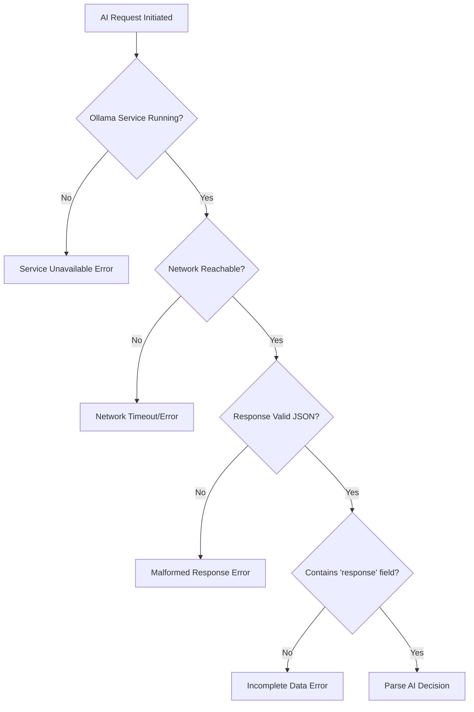
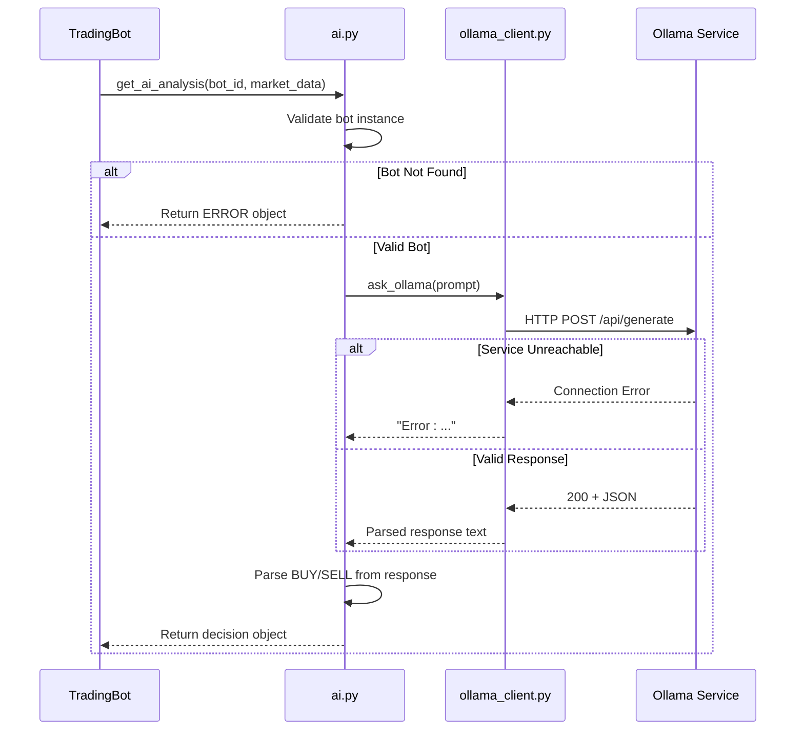
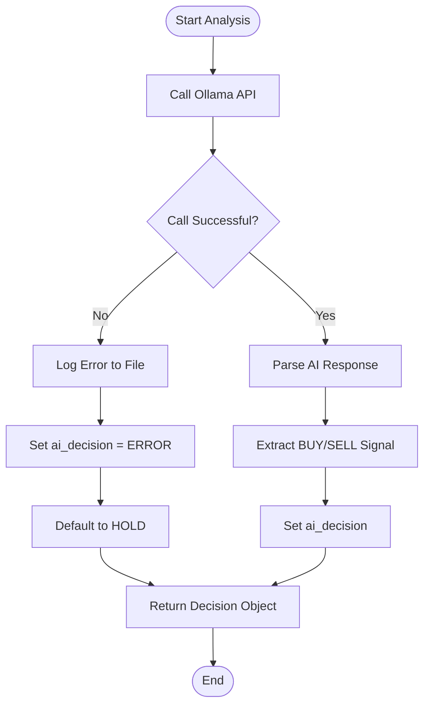

# AI Error Handling and System Resilience

<cite>
**Referenced Files in This Document**   
- [ollama_client.py](file://core/ai/ollama_client.py#L1-L14)
- [ollama.py](file://core/utils/ollama.py#L1-L15)
- [ai.py](file://core/utils/ai.py#L1-L59)
- [logger.py](file://core/utils/logger.py#L1-L26)
- [validation.py](file://core/utils/validation.py#L1-L21)
- [controller.py](file://core/bots/controller.py#L1-L177)
- [trading_bot.py](file://core/bots/trading_bot.py#L1-L170)
- [quantumbotx_hybrid.py](file://core/strategies/quantumbotx_hybrid.py)
</cite>

## Table of Contents
1. [Introduction](#introduction)
2. [Common Failure Modes](#common-failure-modes)
3. [Error Handling Mechanisms](#error-handling-mechanisms)
4. [Retry and Fallback Strategies](#retry-and-fallback-strategies)
5. [Graceful Degradation of Trading Strategies](#graceful-degradation-of-trading-strategies)
6. [Data Validation for AI Outputs](#data-validation-for-ai-outputs)
7. [Error Logging and Alerting](#error-logging-and-alerting)
8. [Monitoring AI Service Health](#monitoring-ai-service-health)
9. [Conclusion](#conclusion)

## Introduction
This document details the error handling and resilience architecture within the QuantumBotX trading system, with a focus on AI-integrated components. The system leverages the Ollama framework for AI-driven market analysis and decision-making. To ensure reliability, multiple layers of error handling, fallback logic, and monitoring are implemented across the codebase. This documentation analyzes the mechanisms that maintain system stability when AI services fail or return invalid data.

**Section sources**
- [ollama_client.py](file://core/ai/ollama_client.py#L1-L14)
- [ai.py](file://core/utils/ai.py#L1-L59)

## Common Failure Modes
The AI-integrated trading system is susceptible to several common failure modes that could disrupt operations or lead to erroneous trades if not properly handled.

### Ollama Service Unavailability
The Ollama AI service runs locally on port 11434. If the service is not running or becomes unresponsive, HTTP requests to `http://localhost:11434/api/generate` will fail. This is a primary point of failure for AI-dependent strategies.

### Network Timeouts
When the `requests.post()` call in the `ollama.py` utility is made, network-level timeouts can occur due to high latency, service overload, or connectivity issues. Although explicit timeout parameters are not set in the current implementation, underlying socket timeouts may still interrupt the request.

### Malformed AI Responses
Even when the Ollama service responds successfully, the returned JSON may lack expected fields (e.g., missing `"response"` key), or the AI-generated content may be ambiguous, contradictory, or contain hallucinated data that does not align with market conditions.

### Strategy Initialization Failures
If a trading bot is configured with a strategy name not present in the `STRATEGY_MAP`, the `TradingBot` class will raise a `ValueError`, preventing the bot from starting. This can occur due to configuration errors or deployment inconsistencies.



**Diagram sources**
- [ollama.py](file://core/utils/ollama.py#L1-L15)
- [ai.py](file://core/utils/ai.py#L1-L59)

**Section sources**
- [ollama.py](file://core/utils/ollama.py#L1-L15)
- [ai.py](file://core/utils/ai.py#L1-L59)

## Error Handling Mechanisms
The system employs structured exception handling at multiple levels to capture and respond to failures in AI services.

### Try-Except Blocks in AI Clients
Both the `ollama_client.py` and `ollama.py` modules wrap AI calls in try-except blocks. Any exception during the request or response parsing is caught, and a formatted error string is returned instead of propagating the exception.

```python
# core/utils/ollama.py
try:
    response = requests.post(
        "http://localhost:11434/api/generate",
        json={"model": model, "prompt": prompt, "stream": False}
    )
    if response.status_code == 200:
        return response.json().get("response", "").strip()
    else:
        return f"Error: {response.status_code} - {response.text}"
except Exception as e:
    return f"Exception during AI call: {e}"
```

### Centralized Error Handling in AI Utility
The `get_ai_analysis()` function in `ai.py` performs comprehensive error handling, including bot instance validation and AI response parsing. It returns a standardized error object with `"ai_decision": "ERROR"` when any issue occurs.



**Diagram sources**
- [ai.py](file://core/utils/ai.py#L1-L59)
- [ollama_client.py](file://core/ai/ollama_client.py#L1-L14)

**Section sources**
- [ai.py](file://core/utils/ai.py#L1-L59)
- [ollama_client.py](file://core/ai/ollama_client.py#L1-L14)

## Retry and Fallback Strategies
While explicit retry mechanisms are not implemented in the current AI client code, the system leverages implicit retry through the bot's polling loop.

### Polling-Based Retry
The `TradingBot.run()` method operates in a continuous loop with a sleep interval defined by `check_interval`. If an AI call fails during one iteration, the bot will automatically retry the analysis in the next cycle after the interval. This provides a basic form of retry without blocking the entire system.

### Circuit Breaker Pattern Absence
The current implementation does not include a circuit breaker pattern. There is no mechanism to detect repeated failures and temporarily stop attempting AI calls. This could lead to excessive logging and resource consumption during prolonged Ollama outages.

### Fallback to HOLD Decision
When AI analysis fails, the `get_ai_analysis()` function defaults to `"ai_decision": "HOLD"`. This prevents the system from making trades based on invalid or missing AI input, effectively serving as a safety fallback.



**Diagram sources**
- [ai.py](file://core/utils/ai.py#L1-L59)
- [trading_bot.py](file://core/bots/trading_bot.py#L1-L170)

**Section sources**
- [ai.py](file://core/utils/ai.py#L1-L59)
- [trading_bot.py](file://core/bots/trading_bot.py#L1-L170)

## Graceful Degradation of Trading Strategies
When AI services are unavailable, the system maintains basic functionality through several degradation mechanisms.

### Hybrid Strategy Resilience
The `quantumbotx_hybrid.py` strategy combines AI analysis with traditional technical indicators. When AI fails, the strategy can fall back to rule-based logic using indicators like RSI, MACD, or Bollinger Bands to generate trading signals. This ensures the bot continues to operate, albeit without AI enhancement.

### Signal Preservation
The `TradingBot` class stores the last successful analysis in `self.last_analysis`. If AI fails in subsequent cycles, the UI and monitoring systems can still display the most recent valid signal, providing continuity for users.

### Non-Critical AI Dependency
AI analysis is treated as an enhancement rather than a core requirement. The main trading logic in `_handle_trade_signal()` relies on the `signal` field, which can be populated by non-AI strategies. This architectural choice ensures that AI failure does not halt the entire trading operation.

**Section sources**
- [trading_bot.py](file://core/bots/trading_bot.py#L1-L170)
- [quantumbotx_hybrid.py](file://core/strategies/quantumbotx_hybrid.py)

## Data Validation for AI Outputs
To prevent erroneous trades based on invalid AI output, the system implements basic validation of AI-generated decisions.

### Keyword-Based Signal Extraction
The `get_ai_analysis()` function uses simple string matching to extract trading decisions:
```python
if "BUY" in explanation.upper():
    decision = "BUY"
elif "SELL" in explanation.upper():
    decision = "SELL"
# Default is HOLD
```
This ensures only clear BUY or SELL signals are acted upon, ignoring ambiguous or neutral responses.

### Input Validation
Before AI analysis, the system validates bot parameters using `validate_bot_params()` in `validation.py`. This ensures critical fields like `lot_size`, `sl_pips`, and `tp_pips` are positive numbers, preventing invalid trade configurations.

```python
# core/utils/validation.py
def validate_bot_params(data):
    errors = []
    if not isinstance(data.get('lot_size'), (int, float)) or data['lot_size'] <= 0:
        errors.append("Lot size must be a positive number.")
    # ... other validations
    return errors
```

**Section sources**
- [ai.py](file://core/utils/ai.py#L1-L59)
- [validation.py](file://core/utils/validation.py#L1-L21)

## Error Logging and Alerting
The system implements comprehensive logging to facilitate debugging and monitoring.

### Structured Logging
The `logger.py` utility configures a logger with both file and console handlers. Log messages include timestamp, log level, and message content in a consistent format:
```
[2023-11-15 10:30:45] [ERROR] Error during AI analysis for bot 123: Connection refused
```

### Exception Tracking
Critical errors include full stack traces via `exc_info=True`, enabling detailed post-mortem analysis:
```python
logger.error(f"Error during AI analysis for bot {bot_id}: {e}", exc_info=True)
```

### Notification System
The `log_activity()` method in `TradingBot` can mark logs as notifications, which are likely displayed in the UI to alert users of critical events like service failures or trade executions.

**Section sources**
- [logger.py](file://core/utils/logger.py#L1-L26)
- [trading_bot.py](file://core/bots/trading_bot.py#L1-L170)

## Monitoring AI Service Health
While dedicated monitoring endpoints are not evident in the code, several mechanisms provide insight into AI service health.

### Log-Based Monitoring
System administrators can monitor the `quantumbotx.log` file for AI-related error messages, such as "Exception during AI call" or "Error: 500", to detect service degradation.

### Status Propagation
AI errors are propagated to the `last_analysis` field with `"signal": "ERROR"`, which is visible in the bot's UI. This allows users to quickly identify when AI services are malfunctioning.

### External Dependencies
The presence of `@humanwhocodes/retry` in `package-lock.json` suggests that retry logic might be intended for future implementation, possibly for monitoring or API health checks.

**Section sources**
- [logger.py](file://core/utils/logger.py#L1-L26)
- [ai.py](file://core/utils/ai.py#L1-L59)
- [package-lock.json](file://package-lock.json#L284-L322)

## Conclusion
The QuantumBotX system implements a robust, multi-layered approach to error handling and resilience in its AI-integrated trading workflows. While explicit retry and circuit breaker patterns are not currently implemented, the system achieves resilience through polling-based retry, graceful degradation to non-AI strategies, comprehensive error logging, and strict data validation. The architecture ensures that AI service failures do not result in erroneous trades or system crashes, maintaining basic functionality even when AI enhancements are unavailable. Future improvements could include implementing formal retry mechanisms with exponential backoff and introducing a circuit breaker to prevent resource exhaustion during prolonged outages.