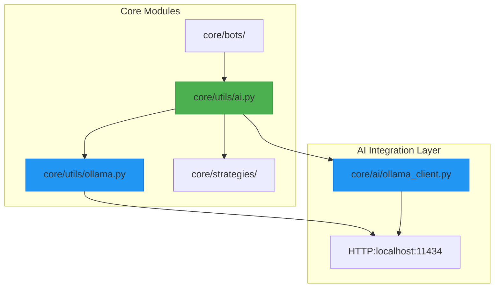
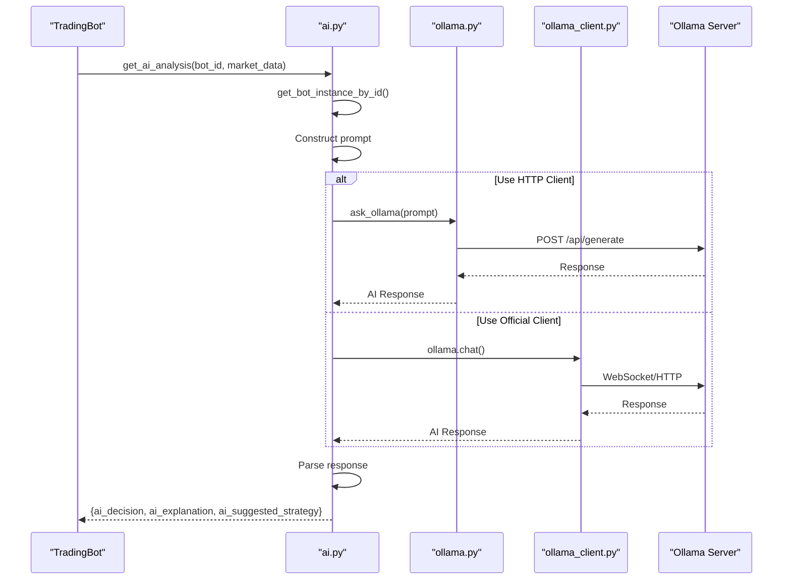
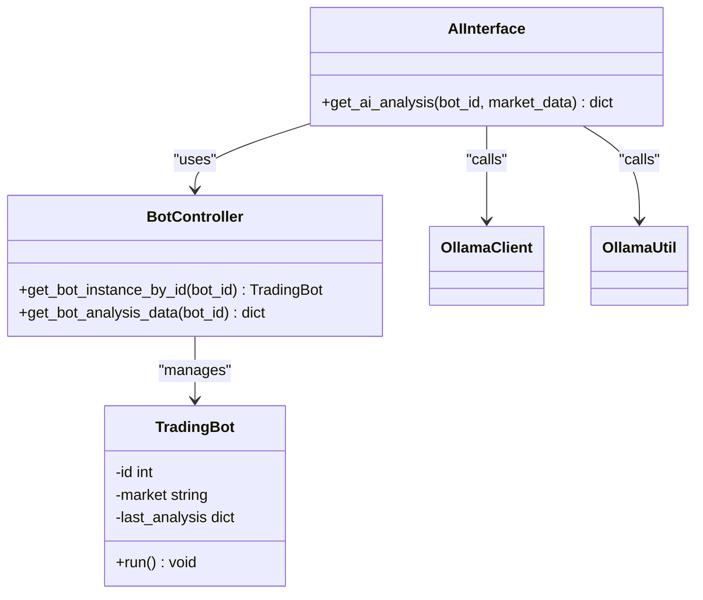
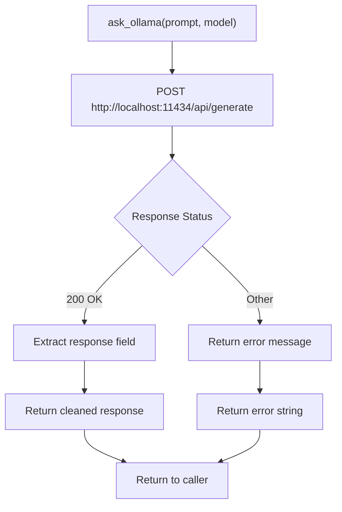
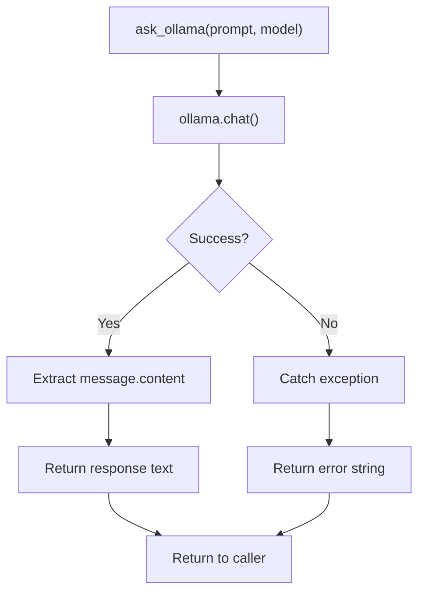
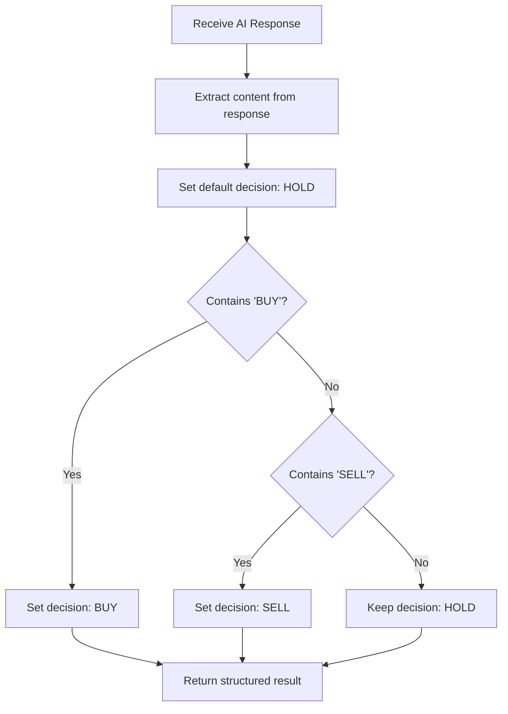

# AI Utility Integration Layer

<cite>
**Referenced Files in This Document**   
- [ai.py](file://core/utils/ai.py#L1-L58)
- [ollama.py](file://core/utils/ollama.py#L1-L14)
- [ollama_client.py](file://core/ai/ollama_client.py#L1-L13)
- [controller.py](file://core/bots/controller.py#L167-L176)
- [trading_bot.py](file://core/bots/trading_bot.py#L13-L168)
</cite>

## Table of Contents
1. [Introduction](#introduction)
2. [Project Structure](#project-structure)
3. [Core Components](#core-components)
4. [Architecture Overview](#architecture-overview)
5. [Detailed Component Analysis](#detailed-component-analysis)
6. [Prompt Engineering Patterns](#prompt-engineering-patterns)
7. [Response Validation and Error Handling](#response-validation-and-error-handling)
8. [Configuration Management](#configuration-management)
9. [Determinism in AI-Assisted Decisions](#determinism-in-ai-assisted-decisions)
10. [Conclusion](#conclusion)

## Introduction
The AI Utility Integration Layer in QuantumBotX serves as a critical bridge between algorithmic trading logic and artificial intelligence models. This document provides a comprehensive analysis of how the system leverages natural language processing through Ollama to enhance trading strategy decision support. The integration enables bots to receive AI-generated market analysis, interpret sentiment, and generate trade signals based on unstructured model output. The design emphasizes reliability, error resilience, and seamless interaction between AI components and core trading functionality.

## Project Structure
The project follows a modular architecture with clear separation of concerns. AI-related utilities are distributed across two primary locations: high-level interfaces in `core/utils/` and dedicated AI clients in `core/ai/`. This structure supports both direct AI integration and abstraction layers for different use cases.



**Diagram sources**
- [ai.py](file://core/utils/ai.py)
- [ollama.py](file://core/utils/ollama.py)
- [ollama_client.py](file://core/ai/ollama_client.py)

**Section sources**
- [ai.py](file://core/utils/ai.py#L1-L58)
- [ollama.py](file://core/utils/ollama.py#L1-L14)

## Core Components
The AI utility layer consists of three core components that work together to provide decision support for trading bots. The `ai.py` module serves as the primary interface between trading logic and AI models, while `ollama.py` and `ollama_client.py` provide alternative methods for communicating with the Ollama AI server. These components enable the system to generate trade signals based on AI analysis of market data.

**Section sources**
- [ai.py](file://core/utils/ai.py#L1-L58)
- [ollama.py](file://core/utils/ollama.py#L1-L14)
- [ollama_client.py](file://core/ai/ollama_client.py#L1-L13)

## Architecture Overview
The AI integration architecture follows a layered pattern where trading bots request analysis through a high-level AI interface, which then communicates with the Ollama server via either the official Python client or direct HTTP requests. The system is designed to be resilient, with fallback mechanisms and error handling at each layer.



**Diagram sources**
- [ai.py](file://core/utils/ai.py#L1-L58)
- [ollama.py](file://core/utils/ollama.py#L1-L14)
- [ollama_client.py](file://core/ai/ollama_client.py#L1-L13)

## Detailed Component Analysis

### AI Interface Module (ai.py)
The `ai.py` module provides the primary interface for AI-assisted trading decisions. It retrieves bot instances, constructs analysis prompts, and processes AI responses into structured trading parameters.



**Diagram sources**
- [ai.py](file://core/utils/ai.py#L1-L58)
- [controller.py](file://core/bots/controller.py#L167-L176)
- [trading_bot.py](file://core/bots/trading_bot.py#L13-L168)

**Section sources**
- [ai.py](file://core/utils/ai.py#L1-L58)

### Ollama Communication Modules
The system provides two distinct approaches for communicating with the Ollama server: a direct HTTP client and the official Ollama Python client. This dual approach offers flexibility and potential fallback options.

#### HTTP-Based Implementation
The `ollama.py` module uses direct HTTP requests to communicate with the Ollama server, providing a lightweight alternative to the official client.



**Diagram sources**
- [ollama.py](file://core/utils/ollama.py#L1-L14)

#### Official Client Implementation
The `ollama_client.py` module uses the official Ollama Python package to interact with the AI server, offering a more feature-rich interface.



**Diagram sources**
- [ollama_client.py](file://core/ai/ollama_client.py#L1-L13)

## Prompt Engineering Patterns
The system employs specific prompt engineering patterns to guide AI models toward generating actionable trading signals. The primary pattern involves instructing the model to analyze market data and make explicit BUY, SELL, or HOLD decisions.

**Key Prompt Structure:**
```
"Analyze the following market data for {bot.market} and decide whether to BUY, SELL, or HOLD..."
```

This pattern is designed to:
- Focus the AI on a specific market instrument
- Constrain the output to three discrete trading actions
- Encourage the model to provide reasoning for its decision
- Facilitate automated parsing of the response

The simplicity of the prompt structure enhances determinism by limiting the range of possible responses, making it easier to validate and interpret the AI's output.

**Section sources**
- [ai.py](file://core/utils/ai.py#L30-L31)

## Response Validation and Error Handling
The system implements robust validation and error handling mechanisms to ensure reliability when processing AI responses.

### Response Parsing Logic
The AI response parsing follows a deterministic pattern that converts unstructured text into structured trading parameters:



**Diagram sources**
- [ai.py](file://core/utils/ai.py#L38-L58)

### Error Handling Mechanisms
The system implements comprehensive error handling at multiple levels:

1. **Bot Instance Validation**: Checks if the requested bot exists before proceeding
2. **Exception Handling**: Catches all exceptions during AI analysis
3. **Fallback Responses**: Returns structured error objects when issues occur
4. **Logging**: Records errors with full traceback information

When errors occur, the system returns a standardized error response:
```json
{
    "ai_decision": "ERROR",
    "ai_explanation": "Detailed error message",
    "ai_suggested_strategy": "N/A"
}
```

This ensures that calling components always receive a predictable response structure, even in failure scenarios.

**Section sources**
- [ai.py](file://core/utils/ai.py#L49-L58)
- [ollama.py](file://core/utils/ollama.py#L5-L13)
- [ollama_client.py](file://core/ai/ollama_client.py#L5-L12)

## Configuration Management
The AI integration layer includes configuration options for model selection and response constraints.

### Model Selection
Both Ollama communication modules support configurable model selection:

- **ollama.py**: Default model is `qwen2.5-coder:1.5b`
- **ollama_client.py**: Default model is `qwen2.5-coder:1.5b`
- **ai.py**: Hardcoded to use `llama3` model

The model parameter is passed as an argument to the `ask_ollama` function, allowing for runtime model selection. However, the `get_ai_analysis` function in `ai.py` currently hardcodes the model choice, which limits flexibility.

### Response Constraints
The system implements response constraints through:
- **Stream Control**: Both implementations set `stream=False` to receive complete responses
- **Timeout Handling**: Network requests are subject to default timeouts
- **Content Extraction**: Only the response text is extracted from the full API response
- **Error Formatting**: Exceptions are converted to human-readable strings

**Section sources**
- [ollama.py](file://core/utils/ollama.py#L3-L4)
- [ollama_client.py](file://core/ai/ollama_client.py#L4-L5)
- [ai.py](file://core/utils/ai.py#L35-L36)

## Determinism in AI-Assisted Decisions
Maintaining determinism in AI-assisted trading decisions is critical for system reliability and reproducibility. The QuantumBotX system employs several strategies to enhance determinism:

### Decision Parsing Determinism
The system uses a simple, rule-based approach to parse AI responses:
- Case-insensitive string matching for "BUY" and "SELL" keywords
- Default to "HOLD" when no action keywords are detected
- Sequential evaluation (BUY checked before SELL)

This deterministic parsing ensures consistent interpretation of AI output regardless of minor variations in response wording.

### State Management
The system maintains clear state boundaries:
- AI analysis is stateless and idempotent
- Results are stored in the bot's `last_analysis` attribute
- Each analysis request is independent of previous requests

### Error State Consistency
The system ensures consistent handling of error states:
- All exceptions result in an "ERROR" decision state
- Error details are preserved in the explanation field
- Strategy suggestions are set to "N/A" in error conditions

### Limitations and Recommendations
Current limitations affecting determinism:
- No temperature or randomness parameters configured in Ollama requests
- No response format constraints (e.g., JSON schema)
- No retry logic for failed AI requests
- No caching of AI responses

**Best Practices for Maintaining Determinism:**
1. **Constrain Response Format**: Use prompts that request specific output formats
2. **Implement Response Validation**: Validate AI output against expected schemas
3. **Set Randomness Parameters**: Configure temperature and seed parameters for reproducibility
4. **Implement Caching**: Cache AI responses to avoid redundant calls
5. **Add Retry Logic**: Implement retry mechanisms for transient failures
6. **Monitor Response Patterns**: Track AI response patterns over time

**Section sources**
- [ai.py](file://core/utils/ai.py#L38-L58)
- [trading_bot.py](file://core/bots/trading_bot.py#L28-L29)

## Conclusion
The AI Utility Integration Layer in QuantumBotX provides a functional bridge between trading logic and AI models, enabling bots to leverage natural language processing for market analysis and decision support. The system demonstrates a practical approach to integrating AI into algorithmic trading, with clear interfaces, error handling, and response parsing. While the current implementation provides basic functionality, opportunities exist to enhance determinism, reliability, and flexibility through improved configuration management, response validation, and error recovery mechanisms. The dual-client approach (HTTP and official client) offers architectural flexibility, though coordination between the two implementations should be considered to avoid fragmentation.