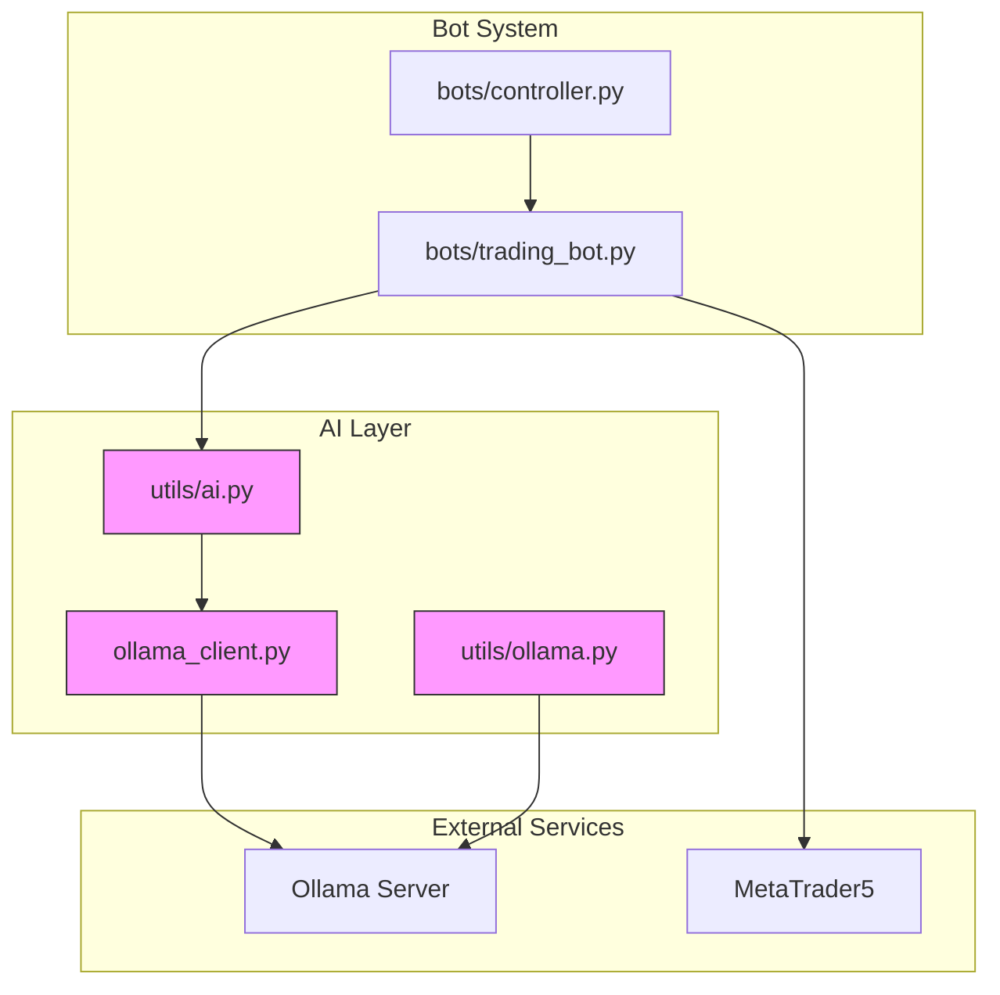
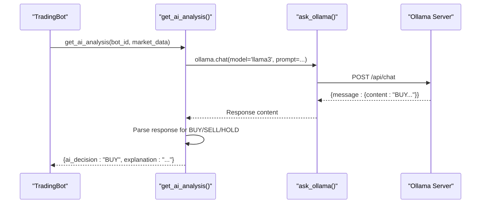
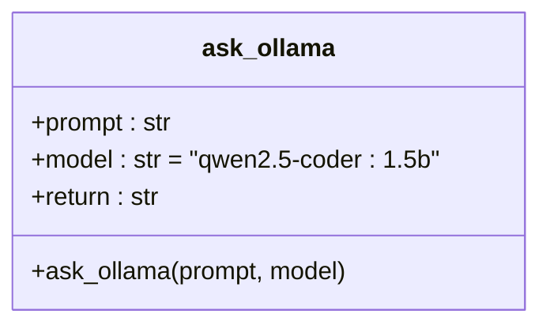
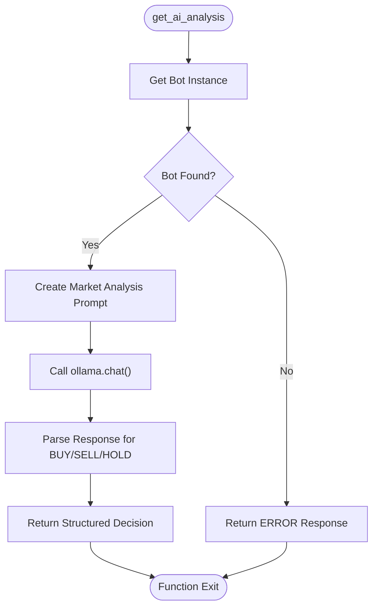
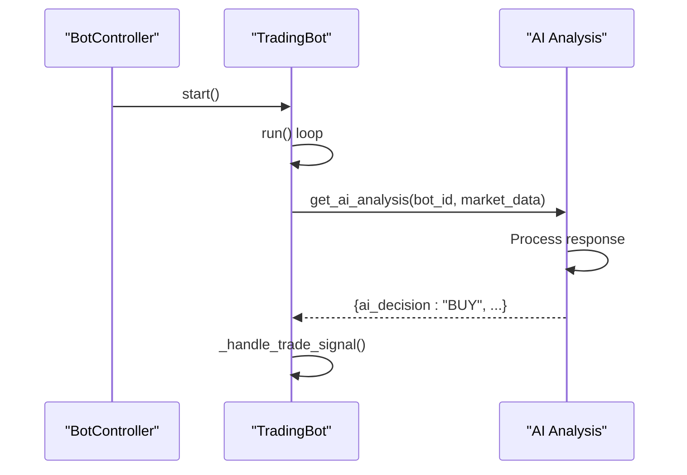
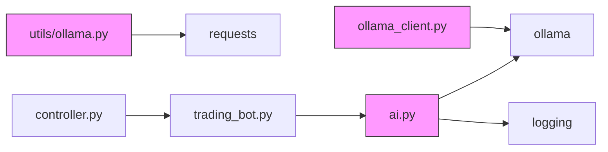

# Ollama Client Architecture

<cite>
**Referenced Files in This Document**   
- [ollama_client.py](file://core/ai/ollama_client.py#L0-L12)
- [ollama.py](file://core/utils/ollama.py#L0-L13)
- [ai.py](file://core/utils/ai.py#L0-L58)
- [controller.py](file://core/bots/controller.py#L0-L176)
- [trading_bot.py](file://core/bots/trading_bot.py#L0-L169)
</cite>

## Table of Contents
1. [Introduction](#introduction)
2. [Project Structure](#project-structure)
3. [Core Components](#core-components)
4. [Architecture Overview](#architecture-overview)
5. [Detailed Component Analysis](#detailed-component-analysis)
6. [Dependency Analysis](#dependency-analysis)
7. [Performance Considerations](#performance-considerations)
8. [Troubleshooting Guide](#troubleshooting-guide)
9. [Conclusion](#conclusion)

## Introduction
This document provides a comprehensive analysis of the Ollama client implementation within the QuantumBotX trading system. It details the architecture, integration points, and functionality of the AI-powered decision-making components that leverage local LLMs via the Ollama framework. The system enables real-time trading decisions by integrating AI analysis into automated trading bots, using natural language processing to interpret market data and generate actionable signals.

## Project Structure
The QuantumBotX project follows a modular, layered architecture with clear separation of concerns. The AI components are primarily located in the `core/ai` and `core/utils` directories, while trading logic resides in `core/bots` and `core/strategies`. The Ollama integration is implemented across multiple files to support both direct client usage and utility-level abstraction.



**Diagram sources**
- [ollama_client.py](file://core/ai/ollama_client.py#L0-L12)
- [ollama.py](file://core/utils/ollama.py#L0-L13)
- [ai.py](file://core/utils/ai.py#L0-L58)
- [controller.py](file://core/bots/controller.py#L0-L176)
- [trading_bot.py](file://core/bots/trading_bot.py#L0-L169)

**Section sources**
- [ollama_client.py](file://core/ai/ollama_client.py#L0-L12)
- [ollama.py](file://core/utils/ollama.py#L0-L13)

## Core Components
The Ollama integration consists of three primary components: the direct client interface in `ollama_client.py`, the HTTP-based utility in `utils/ollama.py`, and the AI analysis service in `utils/ai.py`. These components work together to provide a resilient, multi-pathway interface to local LLMs for trading decision support.

The system uses the `ollama` Python package for direct client communication and falls back to raw HTTP requests when needed. This dual-implementation approach ensures connectivity resilience and provides flexibility in deployment scenarios.

**Section sources**
- [ollama_client.py](file://core/ai/ollama_client.py#L0-L12)
- [ollama.py](file://core/utils/ollama.py#L0-L13)
- [ai.py](file://core/utils/ai.py#L0-L58)

## Architecture Overview
The Ollama client architecture follows a layered pattern where higher-level components abstract the complexity of LLM interactions. Trading bots request AI analysis through the `get_ai_analysis` function, which orchestrates the interaction with the Ollama server via multiple potential pathways.



**Diagram sources**
- [ai.py](file://core/utils/ai.py#L11-L58)
- [ollama_client.py](file://core/ai/ollama_client.py#L0-L12)
- [trading_bot.py](file://core/bots/trading_bot.py#L0-L169)

## Detailed Component Analysis

### Ollama Client Implementation
The `ollama_client.py` file provides a simple wrapper around the Ollama Python client library, exposing a single function `ask_ollama` that sends prompts to a specified model and returns the response content.



**Diagram sources**
- [ollama_client.py](file://core/ai/ollama_client.py#L0-L12)

#### Function Signature and Parameters
The `ask_ollama` function accepts two parameters:
- **prompt**: The input text to send to the LLM
- **model**: The model identifier (defaults to "qwen2.5-coder:1.5b")

The function uses the `ollama.chat()` method with a simple message structure containing a single user role message.

#### Error Handling
The implementation includes basic exception handling that catches all errors and returns them as formatted strings prefixed with "Error:". This ensures that calling functions always receive a string response, even when errors occur.

**Section sources**
- [ollama_client.py](file://core/ai/ollama_client.py#L0-L12)

### Ollama Utility Module
The `utils/ollama.py` module provides an alternative implementation using direct HTTP requests to the Ollama API, offering a fallback mechanism and demonstrating the underlying communication protocol.


#### HTTP Configuration
The utility function makes POST requests to `http://localhost:11434/api/generate` with a JSON payload containing:
- **model**: The model name
- **prompt**: The input text
- **stream**: Set to False for complete responses

#### Response Handling
The function checks for HTTP 200 status and extracts the "response" field from the JSON body. Non-200 responses return formatted error messages with status codes and text.

**Section sources**
- [ollama.py](file://core/utils/ollama.py#L0-L13)

### AI Analysis Service
The `utils/ai.py` module contains the `get_ai_analysis` function that integrates Ollama with the trading system, transforming raw LLM responses into structured trading decisions.



**Diagram sources**
- [ai.py](file://core/utils/ai.py#L11-L58)

#### Request/Response Cycle
The AI analysis function:
1. Retrieves the bot instance using `get_bot_instance_by_id`
2. Constructs a prompt asking for BUY/SELL/HOLD recommendations
3. Calls `ollama.chat()` directly with the 'llama3' model
4. Parses the response content to extract trading signals
5. Returns a structured dictionary with decision, explanation, and strategy

#### Model Parameter Customization
While the current implementation uses default parameters, the Ollama API supports customization of:
- **temperature**: Controls randomness (not currently set)
- **top_p**: Nucleus sampling parameter (not currently set)
- **max_tokens**: Response length limit (not currently set)

These could be added to enhance control over model behavior.

**Section sources**
- [ai.py](file://core/utils/ai.py#L11-L58)

### Integration with Trading Bot System
The AI analysis service is tightly integrated with the trading bot architecture through the controller and bot classes.



**Diagram sources**
- [controller.py](file://core/bots/controller.py#L0-L176)
- [trading_bot.py](file://core/bots/trading_bot.py#L0-L169)

#### Code Example: Using the Ollama Client
```python
# Direct usage of ollama client
response = ask_ollama("Analyze AAPL stock trend", model="llama3")
print(response)

# Integration with AI analysis
result = get_ai_analysis(bot_id=123, market_data=historical_data)
if result["ai_decision"] == "BUY":
    # Execute buy logic
    place_trade(symbol, mt5.ORDER_TYPE_BUY, risk_percent, sl_pips, tp_pips, bot_id)
```

**Section sources**
- [ollama_client.py](file://core/ai/ollama_client.py#L0-L12)
- [ai.py](file://core/utils/ai.py#L11-L58)
- [trading_bot.py](file://core/bots/trading_bot.py#L0-L169)

## Dependency Analysis
The Ollama client implementation has a minimal dependency footprint, relying primarily on the `ollama` Python package and standard library components.



**Diagram sources**
- [ollama_client.py](file://core/ai/ollama_client.py#L0-L12)
- [ollama.py](file://core/utils/ollama.py#L0-L13)
- [ai.py](file://core/utils/ai.py#L0-L58)

## Performance Considerations
The current implementation uses synchronous API calls, which can block the trading bot's main loop during AI analysis. In real-time trading contexts, this introduces latency that may affect responsiveness to market changes.

Thread safety is not explicitly addressed in the current implementation. Since the `ollama` client is used directly within the bot's thread context, concurrent access from multiple bots could potentially cause resource contention, though the HTTP-based nature of Ollama provides some inherent isolation.

The dual implementation (direct client and HTTP utility) provides redundancy but may lead to inconsistent behavior if different endpoints are used for similar purposes. Standardizing on one approach would improve maintainability.

## Troubleshooting Guide
Common connectivity issues include:
- Ollama server not running on localhost:11434
- Model not downloaded or available
- Network configuration blocking localhost connections

To debug connectivity:
1. Verify Ollama server is running: `ollama serve`
2. Test model availability: `ollama run llama3`
3. Check endpoint directly: `curl http://localhost:11434/api/tags`
4. Validate model responses with simple prompts

For validating model outputs, ensure responses contain clear BUY/SELL/HOLD signals as expected by the parsing logic in `get_ai_analysis`. The current implementation is case-insensitive but requires exact keyword matching.

**Section sources**
- [ollama_client.py](file://core/ai/ollama_client.py#L0-L12)
- [ollama.py](file://core/utils/ollama.py#L0-L13)
- [ai.py](file://core/utils/ai.py#L11-L58)

## Conclusion
The Ollama client implementation in QuantumBotX provides a functional integration between local LLMs and automated trading systems. The architecture demonstrates a practical approach to AI-powered decision making, with clear separation between AI processing and trading execution. While the current implementation meets basic requirements, opportunities exist to enhance reliability, performance, and configurability through standardized interfaces, parameter customization, and asynchronous processing patterns.