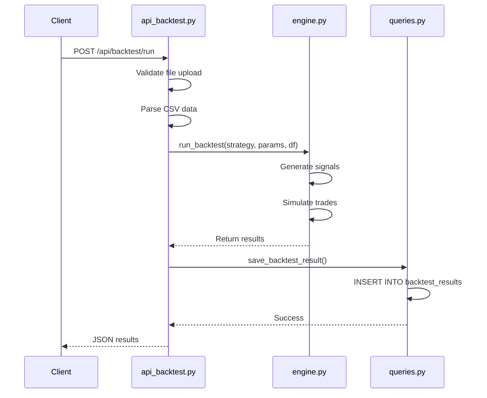
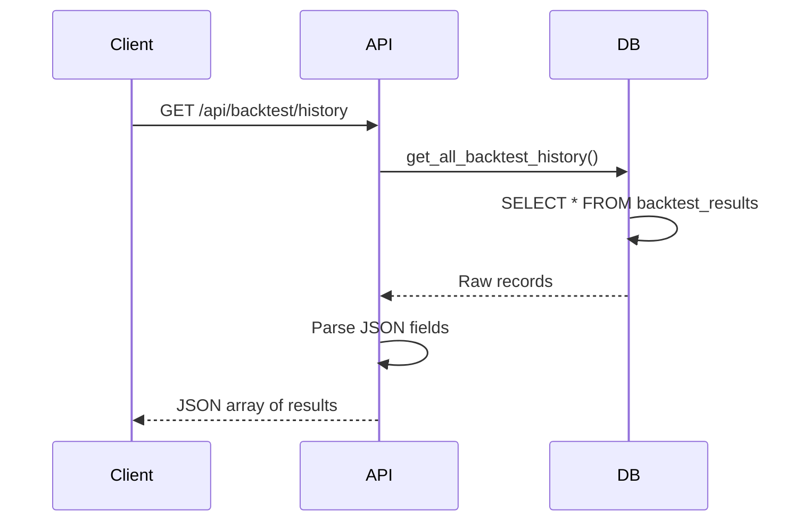
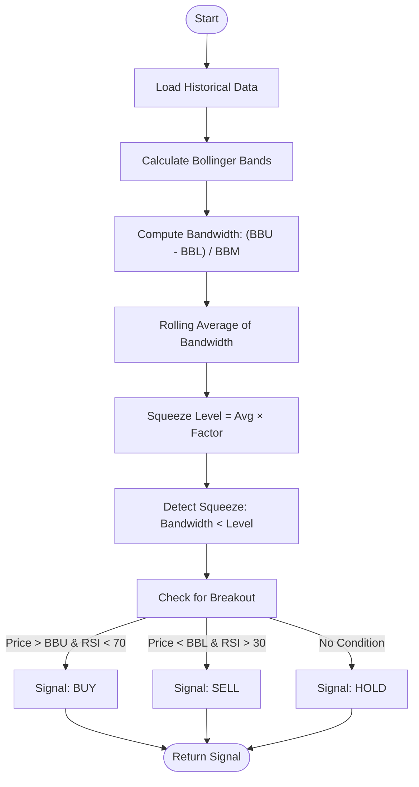
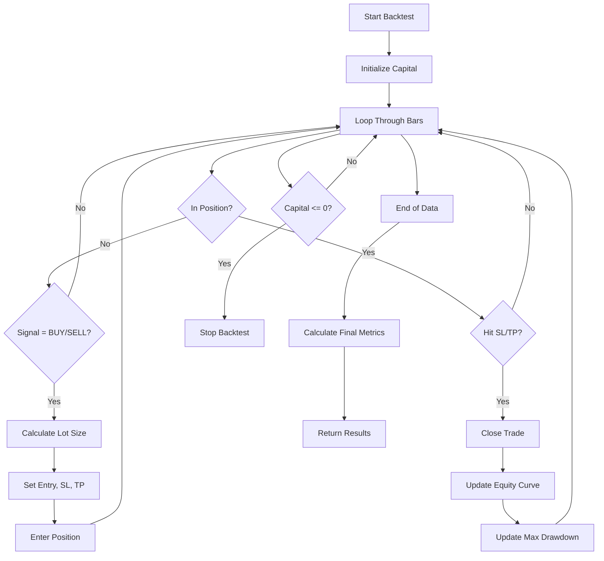
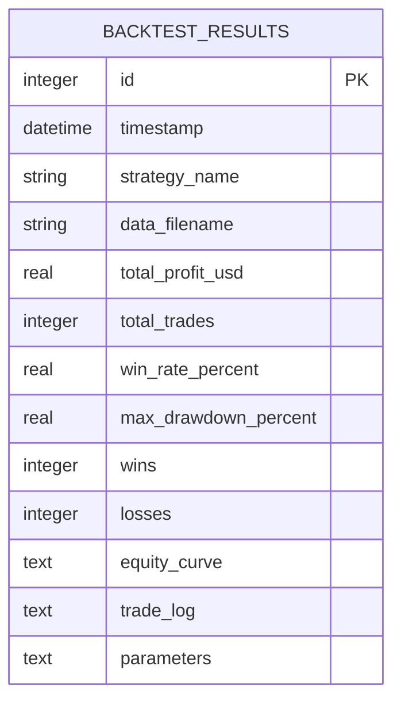

# Backtesting API

<cite>
**Referenced Files in This Document**   
- [api_backtest.py](file://core/routes/api_backtest.py)
- [engine.py](file://core/backtesting/engine.py)
- [strategy_map.py](file://core/strategies/strategy_map.py)
- [bollinger_squeeze.py](file://core/strategies/bollinger_squeeze.py)
- [queries.py](file://core/db/queries.py)
- [init_db.py](file://init_db.py)
</cite>

## Table of Contents
1. [Introduction](#introduction)
2. [API Endpoints](#api-endpoints)
3. [Request and Response Schema](#request-and-response-schema)
4. [Strategy Parameters](#strategy-parameters)
5. [Backtesting Engine Logic](#backtesting-engine-logic)
6. [Database Schema](#database-schema)
7. [Example Requests](#example-requests)
8. [Error Handling](#error-handling)
9. [Security and Validation](#security-and-validation)
10. [Performance Considerations](#performance-considerations)

## Introduction
The Backtesting API in quantumbotx enables users to simulate trading strategies against historical market data to evaluate performance metrics such as total return, win rate, and maximum drawdown. This API supports dynamic strategy execution, risk-adjusted position sizing, and persistent storage of results for analysis. It is designed for integration with both automated trading bots and manual strategy development workflows.

The system leverages Flask for routing, pandas for data processing, and SQLite for result persistence. Strategies are implemented as modular classes and dynamically loaded via a strategy registry. The backtesting engine simulates trades with configurable stop-loss and take-profit levels based on Average True Range (ATR), with special volatility handling for high-risk assets like XAUUSD (Gold).

**Section sources**
- [api_backtest.py](file://core/routes/api_backtest.py#L1-L130)
- [engine.py](file://core/backtesting/engine.py#L1-L317)

## API Endpoints

### POST /api/backtest/run
Initiates a backtest using uploaded historical data and specified strategy parameters.

#### Request Format
- **Method**: POST
- **Content-Type**: multipart/form-data
- **Form Fields**:
  - `file`: CSV file containing historical price data (required)
  - `strategy`: Strategy ID (e.g., `BOLLINGER_SQUEEZE`) (required)
  - `params`: JSON string of strategy and risk parameters (optional)

#### Response
Returns a JSON object with performance metrics, equity curve, and trade log.



**Diagram sources**
- [api_backtest.py](file://core/routes/api_backtest.py#L29-L75)
- [engine.py](file://core/backtesting/engine.py#L10-L317)

**Section sources**
- [api_backtest.py](file://core/routes/api_backtest.py#L29-L75)

### GET /api/backtest/history
Retrieves a list of all previously executed backtest results.

#### Request Format
- **Method**: GET
- **Query Parameters**: None
- **Authentication**: Required (implied)

#### Response
Returns an array of backtest records with parsed JSON fields for equity curve, trade log, and parameters.



**Diagram sources**
- [api_backtest.py](file://core/routes/api_backtest.py#L77-L117)
- [queries.py](file://core/db/queries.py#L169-L174)

**Section sources**
- [api_backtest.py](file://core/routes/api_backtest.py#L77-L117)
- [queries.py](file://core/db/queries.py#L169-L174)

## Request and Response Schema

### Request Parameters
| Field | Type | Required | Description |
|-------|------|----------|-------------|
| `file` | File (CSV) | Yes | Historical price data with columns: `time`, `open`, `high`, `low`, `close`, `volume` |
| `strategy` | String | Yes | Strategy ID from `STRATEGY_MAP` |
| `params` | JSON String | No | Custom parameters for strategy and risk management |

### Response Schema (run endpoint)
```json
{
  "strategy_name": "string",
  "total_trades": "integer",
  "final_capital": "number",
  "total_profit_usd": "number",
  "win_rate_percent": "number",
  "wins": "integer",
  "losses": "integer",
  "max_drawdown_percent": "number",
  "equity_curve": ["array of numbers"],
  "trades": ["array of last 20 trades"]
}
```

### Trade Object Schema
```json
{
  "entry_time": "string",
  "exit_time": "string",
  "entry": "number",
  "exit": "number",
  "profit": "number",
  "reason": "string",
  "position_type": "BUY/SELL"
}
```

**Section sources**
- [api_backtest.py](file://core/routes/api_backtest.py#L29-L117)
- [engine.py](file://core/backtesting/engine.py#L280-L317)

## Strategy Parameters

### Available Strategies
The following strategies are supported via the `strategy` parameter:

| Strategy ID | Name |
|-------------|------|
| `MA_CROSSOVER` | Moving Average Crossover |
| `RSI_CROSSOVER` | RSI Crossover |
| `BOLLINGER_REVERSION` | Bollinger Bands Reversion |
| `BOLLINGER_SQUEEZE` | Bollinger Squeeze Breakout |
| `MERCY_EDGE` | Mercy Edge |
| `quantum_velocity` | Quantum Velocity |
| `PULSE_SYNC` | Pulse Sync |
| `TURTLE_BREAKOUT` | Turtle Breakout |
| `ICHIMOKU_CLOUD` | Ichimoku Cloud |
| `DYNAMIC_BREAKOUT` | Dynamic Breakout |
| `QUANTUMBOTX_HYBRID` | QuantumBotX Hybrid |

**Section sources**
- [strategy_map.py](file://core/strategies/strategy_map.py#L1-L27)

### Bollinger Squeeze Strategy Parameters
This strategy detects low-volatility periods ("squeeze") and generates breakout signals.

| Parameter | Type | Default | Description |
|---------|------|---------|-------------|
| `bb_length` | number | 20 | Bollinger Band length |
| `bb_std` | number | 2.0 | Standard deviation multiplier |
| `squeeze_window` | number | 10 | Rolling window for average bandwidth |
| `squeeze_factor` | number | 0.7 | Multiplier for squeeze threshold |
| `rsi_period` | number | 14 | RSI calculation period |



**Diagram sources**
- [bollinger_squeeze.py](file://core/strategies/bollinger_squeeze.py#L10-L88)

**Section sources**
- [bollinger_squeeze.py](file://core/strategies/bollinger_squeeze.py#L10-L88)

## Backtesting Engine Logic

### Core Workflow
1. **Indicator Calculation**: Compute Bollinger Bands and ATR
2. **Signal Generation**: Detect squeeze and breakout conditions
3. **Trade Simulation**: Execute virtual trades with SL/TP
4. **Position Sizing**: Dynamic lot calculation based on risk percentage
5. **Equity Tracking**: Maintain equity curve and drawdown metrics

### Risk Management
- **Risk Percentage**: Configurable via `lot_size` parameter (default: 1%)
- **Stop-Loss**: Based on ATR multiplier (`sl_pips`)
- **Take-Profit**: Based on ATR multiplier (`tp_pips`)
- **Gold (XAUUSD) Protection**: Aggressive risk reduction with capped lot sizes and reduced ATR multipliers



**Diagram sources**
- [engine.py](file://core/backtesting/engine.py#L10-L317)

**Section sources**
- [engine.py](file://core/backtesting/engine.py#L10-L317)

## Database Schema

### backtest_results Table
Stores all backtest execution results.

| Column | Type | Description |
|-------|------|-------------|
| `id` | INTEGER | Primary key |
| `timestamp` | DATETIME | Execution time |
| `strategy_name` | TEXT | Display name of strategy |
| `data_filename` | TEXT | Original CSV filename |
| `total_profit_usd` | REAL | Net profit in USD |
| `total_trades` | INTEGER | Number of executed trades |
| `win_rate_percent` | REAL | Percentage of winning trades |
| `max_drawdown_percent` | REAL | Maximum drawdown during backtest |
| `wins` | INTEGER | Number of winning trades |
| `losses` | INTEGER | Number of losing trades |
| `equity_curve` | TEXT | JSON array of equity values |
| `trade_log` | TEXT | JSON array of trade objects |
| `parameters` | TEXT | JSON of input parameters |



**Diagram sources**
- [init_db.py](file://init_db.py#L82-L112)

**Section sources**
- [init_db.py](file://init_db.py#L82-L112)
- [api_backtest.py](file://core/routes/api_backtest.py#L29-L38)

## Example Requests

### Run Bollinger Squeeze Backtest
```bash
curl -X POST http://localhost:5000/api/backtest/run \
  -F "file=@XAUUSD_H1_data.csv" \
  -F "strategy=BOLLINGER_SQUEEZE" \
  -F 'params={"bb_length": 20, "bb_std": 2.0, "squeeze_window": 10, "squeeze_factor": 0.7, "rsi_period": 14, "lot_size": 1.0, "sl_pips": 2.0, "tp_pips": 4.0}'
```

### Retrieve Backtest History
```bash
curl -X GET http://localhost:5000/api/backtest/history
```

### Postman Example
- **URL**: `POST /api/backtest/run`
- **Body**: `form-data`
  - `file`: `XAUUSD_H1_data.csv`
  - `strategy`: `BOLLINGER_SQUEEZE`
  - `params`: `{"bb_length": 20, "lot_size": 1.0}`

**Section sources**
- [api_backtest.py](file://core/routes/api_backtest.py#L29-L75)

## Error Handling

### Status Codes
| Code | Meaning | Response Body |
|------|--------|---------------|
| 200 | Success | Results object |
| 400 | Bad Request | `{"error": "Tidak ada file data yang diunggah"}` |
| 500 | Server Error | `{"error": "Terjadi kesalahan saat backtesting: ..."}` |

### Common Errors
- **Missing File**: No file uploaded in request
- **Empty Filename**: File field present but empty
- **Invalid CSV**: Malformed or missing required columns
- **Strategy Not Found**: Invalid `strategy` ID
- **Insufficient Data**: Not enough bars for indicator calculation
- **Database Error**: Failure to save results

**Section sources**
- [api_backtest.py](file://core/routes/api_backtest.py#L31-L33)
- [engine.py](file://core/backtesting/engine.py#L15-L20)

## Security and Validation

### Input Validation
- File upload validation (presence, filename)
- CSV parsing with error handling
- Strategy existence check via `STRATEGY_MAP`
- Parameter type validation (float conversion)
- Risk parameter bounds enforcement

### Data Sanitization
- NaN/Inf values replaced with `null` in JSON output
- JSON fields safely parsed with try-catch blocks
- SQL parameters properly parameterized to prevent injection

**Section sources**
- [api_backtest.py](file://core/routes/api_backtest.py#L31-L75)
- [engine.py](file://core/backtesting/engine.py#L250-L255)

## Performance Considerations

### Optimization Techniques
- **Vectorized Operations**: Pandas TA for indicator calculation
- **In-Memory Processing**: Full dataset loaded before simulation
- **Efficient Loops**: Single-pass backtest simulation
- **Caching**: Not implemented (per-request execution)

### Scalability Notes
- No pagination on history endpoint (entire dataset returned)
- No rate limiting implemented
- SQLite backend may bottleneck under high concurrency
- Large CSV files may cause memory pressure

**Section sources**
- [engine.py](file://core/backtesting/engine.py#L10-L317)
- [api_backtest.py](file://core/routes/api_backtest.py#L77-L117)