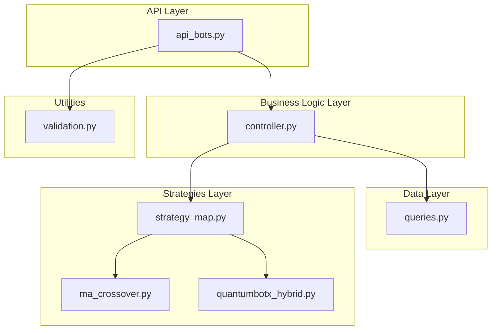
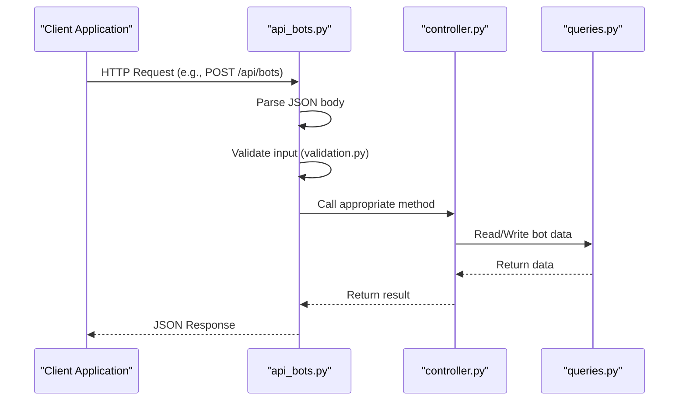
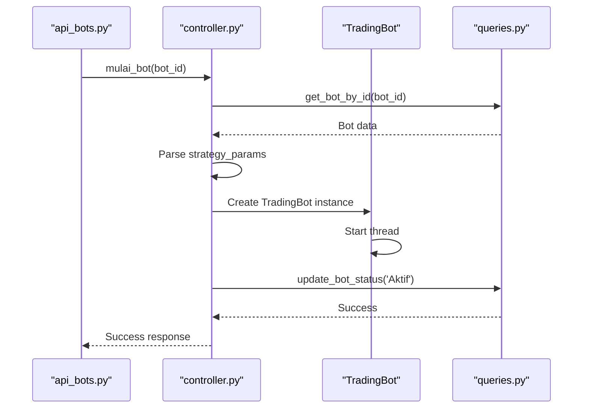
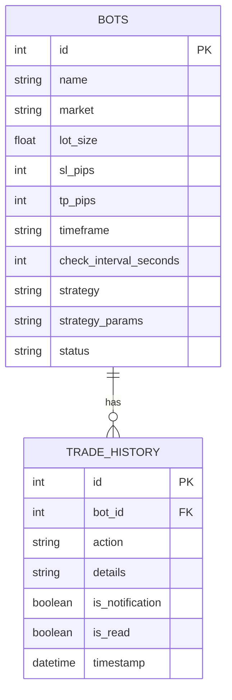
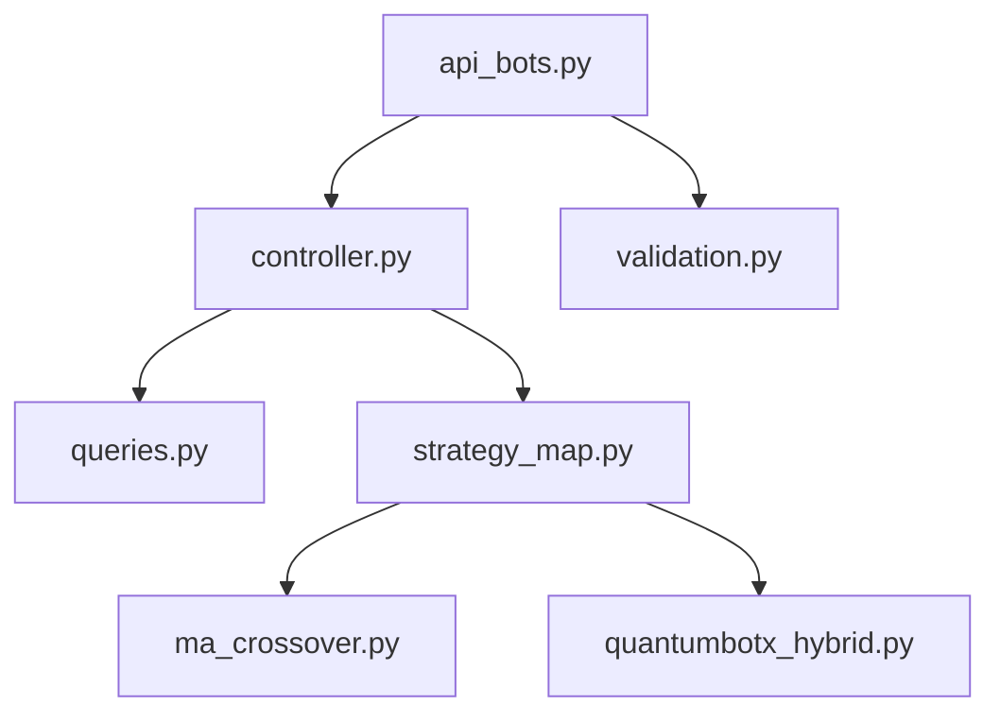

# Bots API

<cite>
**Referenced Files in This Document**   
- [api_bots.py](file://core/routes/api_bots.py)
- [controller.py](file://core/bots/controller.py)
- [queries.py](file://core/db/queries.py)
- [strategy_map.py](file://core/strategies/strategy_map.py)
- [ma_crossover.py](file://core/strategies/ma_crossover.py)
- [quantumbotx_hybrid.py](file://core/strategies/quantumbotx_hybrid.py)
- [validation.py](file://core/utils/validation.py)
</cite>

## Table of Contents
1. [Introduction](#introduction)
2. [Project Structure](#project-structure)
3. [Core Components](#core-components)
4. [Architecture Overview](#architecture-overview)
5. [Detailed Component Analysis](#detailed-component-analysis)
6. [Dependency Analysis](#dependency-analysis)
7. [Performance Considerations](#performance-considerations)
8. [Troubleshooting Guide](#troubleshooting-guide)
9. [Conclusion](#conclusion)

## Introduction
This document provides comprehensive RESTful API documentation for the Bots API endpoints in the quantumbotx application. It details all available HTTP methods (GET, POST, PUT, DELETE) for bot management operations including creation, retrieval, starting, stopping, and deletion. The documentation specifies URL patterns such as /api/bots and /api/bots/<bot_id>, including path parameters and their constraints. Request body schemas are defined for bot configuration, including strategy_type, symbol, timeframe, lot_size, and risk_management settings. Response formats for both success and error cases are detailed, including newly created bot IDs and status updates. The document includes authentication requirements, JSON examples for creating a MA Crossover bot and starting a QuantumBotX Hybrid strategy, lists all possible status codes with descriptions, provides sample curl commands for key operations, explains validation rules for parameters, and documents any dependencies on MT5 connection status.

## Project Structure
The quantumbotx application follows a modular structure with clear separation of concerns. The Bots API functionality is primarily located in the core/routes directory with supporting components in core/bots, core/db, and core/strategies. The application uses Flask as its web framework with Blueprint for modular routing. The project structure organizes code by functionality, with dedicated directories for routes, database operations, bot logic, trading strategies, and utility functions.



**Diagram sources**
- [api_bots.py](file://core/routes/api_bots.py#L1-L167)
- [controller.py](file://core/bots/controller.py#L1-L176)
- [queries.py](file://core/db/queries.py#L1-L174)
- [strategy_map.py](file://core/strategies/strategy_map.py#L1-L27)
- [ma_crossover.py](file://core/strategies/ma_crossover.py#L1-L60)
- [quantumbotx_hybrid.py](file://core/strategies/quantumbotx_hybrid.py#L1-L113)
- [validation.py](file://core/utils/validation.py#L1-L20)

**Section sources**
- [api_bots.py](file://core/routes/api_bots.py#L1-L167)
- [controller.py](file://core/bots/controller.py#L1-L176)
- [queries.py](file://core/db/queries.py#L1-L174)

## Core Components
The Bots API consists of several core components that work together to manage trading bots. The api_bots.py file defines all REST endpoints for bot operations, while controller.py handles the business logic for starting, stopping, and updating bots. The database operations are abstracted in queries.py, which interacts with the SQLite database to perform CRUD operations on bot records. Strategy configurations are managed through the strategy_map.py file, which maps strategy identifiers to their respective implementation classes. Input validation is handled by validation.py, which ensures that required fields are present and properly formatted before processing requests.

**Section sources**
- [api_bots.py](file://core/routes/api_bots.py#L1-L167)
- [controller.py](file://core/bots/controller.py#L1-L176)
- [queries.py](file://core/db/queries.py#L1-L174)
- [strategy_map.py](file://core/strategies/strategy_map.py#L1-L27)
- [validation.py](file://core/utils/validation.py#L1-L20)

## Architecture Overview
The Bots API follows a layered architecture with clear separation between the presentation layer (API endpoints), business logic layer (controller), and data access layer (database queries). When a client makes a request to a Bots API endpoint, the request is first processed by the route handler in api_bots.py, which validates the input and then delegates to the appropriate method in the controller. The controller manages the bot lifecycle, including starting and stopping bot instances, and coordinates with the database layer to persist changes. The database layer abstracts all interactions with the SQLite database, providing a clean interface for CRUD operations on bot records.



**Diagram sources**
- [api_bots.py](file://core/routes/api_bots.py#L1-L167)
- [controller.py](file://core/bots/controller.py#L1-L176)
- [queries.py](file://core/db/queries.py#L1-L174)
- [validation.py](file://core/utils/validation.py#L1-L20)

## Detailed Component Analysis

### Bots API Endpoints
The Bots API provides a comprehensive set of endpoints for managing trading bots. These endpoints follow RESTful conventions and use standard HTTP methods to perform operations on bot resources.

#### API Endpoints Class Diagram
```mermaid
classDiagram
class BotsAPI {
+GET /api/strategies
+GET /api/strategies/{strategy_id}/params
+GET /api/bots
+GET /api/bots/{bot_id}
+POST /api/bots
+PUT /api/bots/{bot_id}
+DELETE /api/bots/{bot_id}
+POST /api/bots/{bot_id}/start
+POST /api/bots/{bot_id}/stop
+POST /api/bots/start_all
+POST /api/bots/stop_all
+GET /api/bots/{bot_id}/analysis
+GET /api/bots/{bot_id}/history
}
class Strategy {
+id : string
+name : string
+description : string
}
class Bot {
+id : int
+name : string
+market : string
+lot_size : float
+sl_pips : int
+tp_pips : int
+timeframe : string
+check_interval_seconds : int
+strategy : string
+strategy_params : JSON
+status : string
}
BotsAPI --> Strategy : "Uses"
BotsAPI --> Bot : "Manages"
```

**Diagram sources**
- [api_bots.py](file://core/routes/api_bots.py#L1-L167)

**Section sources**
- [api_bots.py](file://core/routes/api_bots.py#L1-L167)

### Bot Controller Logic
The bot controller manages the lifecycle of trading bots, including starting, stopping, and updating bot instances. It maintains a dictionary of active bot instances and coordinates between the API layer and the database layer.

#### Bot Controller Sequence Diagram


**Diagram sources**
- [controller.py](file://core/bots/controller.py#L1-L176)
- [queries.py](file://core/db/queries.py#L1-L174)

**Section sources**
- [controller.py](file://core/bots/controller.py#L1-L176)

### Database Schema and Operations
The database layer provides CRUD operations for bot records through the queries.py module. It uses SQLite as the database backend and provides a clean interface for interacting with the bots table.

#### Database Schema


**Diagram sources**
- [queries.py](file://core/db/queries.py#L1-L174)

**Section sources**
- [queries.py](file://core/db/queries.py#L1-L174)

## Dependency Analysis
The Bots API components have well-defined dependencies that follow a unidirectional flow from the API layer down to the data layer. The api_bots.py module depends on controller.py for business logic, which in turn depends on queries.py for data persistence. The controller also depends on strategy_map.py to access strategy implementations. The validation.py module is used directly by the API layer to validate incoming requests before processing.



**Diagram sources**
- [api_bots.py](file://core/routes/api_bots.py#L1-L167)
- [controller.py](file://core/bots/controller.py#L1-L176)
- [queries.py](file://core/db/queries.py#L1-L174)
- [strategy_map.py](file://core/strategies/strategy_map.py#L1-L27)
- [ma_crossover.py](file://core/strategies/ma_crossover.py#L1-L60)
- [quantumbotx_hybrid.py](file://core/strategies/quantumbotx_hybrid.py#L1-L113)
- [validation.py](file://core/utils/validation.py#L1-L20)

**Section sources**
- [api_bots.py](file://core/routes/api_bots.py#L1-L167)
- [controller.py](file://core/bots/controller.py#L1-L176)
- [queries.py](file://core/db/queries.py#L1-L174)

## Performance Considerations
The Bots API is designed with performance in mind, particularly for operations that involve external systems like MetaTrader 5. The controller maintains a dictionary of active bot instances to avoid repeated database queries when checking bot status. Database operations are wrapped in transactions to ensure data consistency and improve performance. The API endpoints are designed to return only the necessary data, minimizing payload size. For endpoints that retrieve historical data, pagination or limiting the result set is implemented to prevent performance degradation with large datasets.

## Troubleshooting Guide
When troubleshooting issues with the Bots API, consider the following common scenarios:

1. **Bot fails to start**: Check if the MT5 connection is active and the symbol is available in the market watch. Verify that the bot configuration parameters are valid.

2. **Database errors**: Ensure the SQLite database file is writable and not locked by another process. Check the application logs for specific database error messages.

3. **Invalid strategy parameters**: Verify that the strategy parameters match the expected format for the selected strategy type. Use the /api/strategies/{strategy_id}/params endpoint to retrieve the valid parameters for a strategy.

4. **Authentication issues**: Although the current implementation does not include authentication, ensure that the client is sending properly formatted JSON requests with all required fields.

**Section sources**
- [controller.py](file://core/bots/controller.py#L1-L176)
- [queries.py](file://core/db/queries.py#L1-L174)
- [api_bots.py](file://core/routes/api_bots.py#L1-L167)

## Conclusion
The Bots API in the quantumbotx application provides a comprehensive interface for managing automated trading bots. It follows RESTful principles with well-defined endpoints for all bot operations. The architecture separates concerns between API handling, business logic, and data persistence, making the system maintainable and extensible. The API supports various trading strategies through a pluggable strategy system and provides detailed error responses to aid in debugging. While the current implementation lacks authentication and rate limiting, it provides a solid foundation for bot management that could be enhanced with these features in the future.