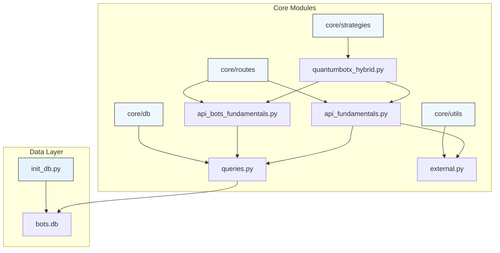
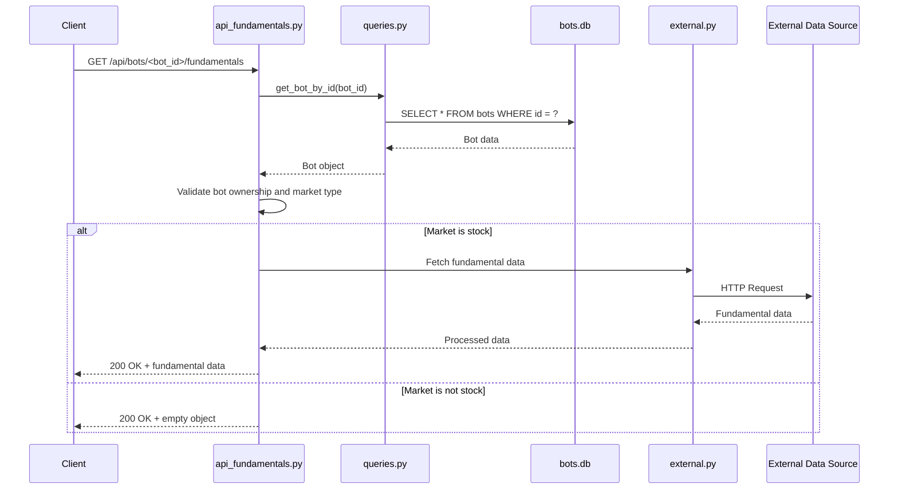
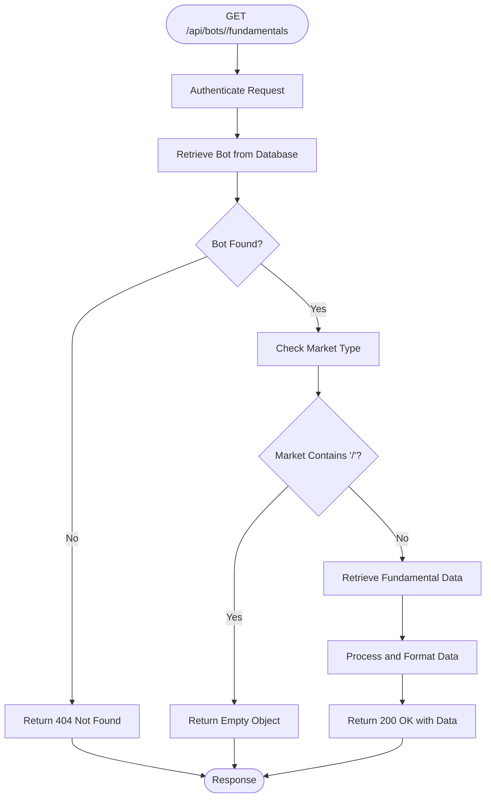
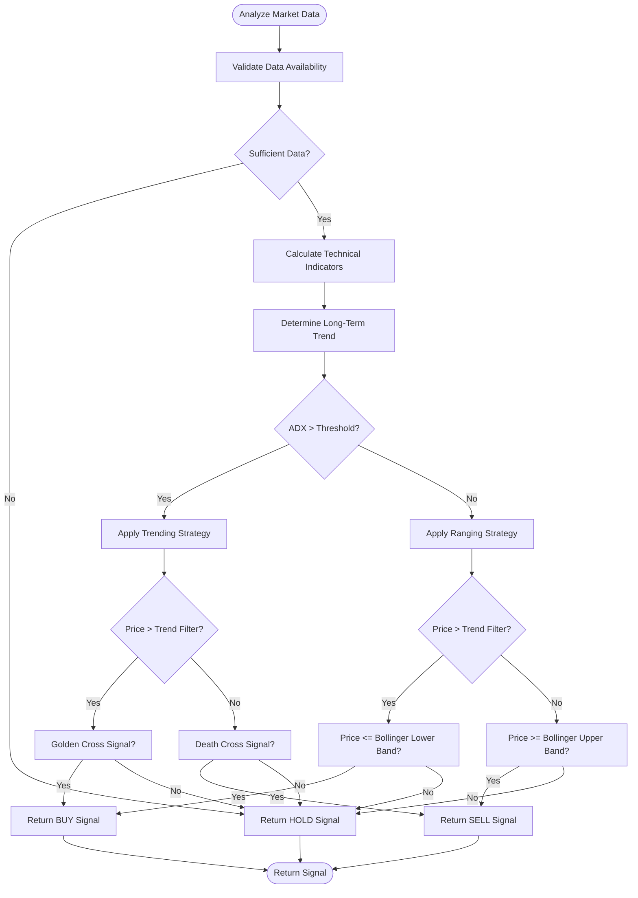
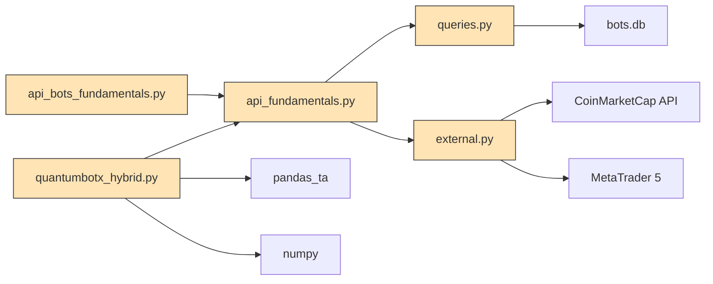

# Bots Fundamentals API

<cite>
**Referenced Files in This Document**   
- [api_bots_fundamentals.py](file://core/routes/api_bots_fundamentals.py)
- [api_fundamentals.py](file://core/routes/api_fundamentals.py)
- [queries.py](file://core/db/queries.py)
- [external.py](file://core/utils/external.py)
- [quantumbotx_hybrid.py](file://core/strategies/quantumbotx_hybrid.py)
- [init_db.py](file://init_db.py)
</cite>

## Table of Contents
1. [Introduction](#introduction)
2. [Project Structure](#project-structure)
3. [Core Components](#core-components)
4. [Architecture Overview](#architecture-overview)
5. [Detailed Component Analysis](#detailed-component-analysis)
6. [Dependency Analysis](#dependency-analysis)
7. [Performance Considerations](#performance-considerations)
8. [Troubleshooting Guide](#troubleshooting-guide)
9. [Conclusion](#conclusion)

## Introduction
This document provides comprehensive documentation for the Bots Fundamentals API in the QuantumBotX platform. The API delivers fundamental data tailored for bot decision-making processes, supporting hybrid strategies that combine technical and fundamental analysis. This documentation details the available endpoints, response schema, authentication requirements, error handling, and integration patterns. The API is designed to provide timely economic indicators, sentiment scores, earnings data, and volatility forecasts to active trading bots while minimizing load through caching and controlled update frequency.

## Project Structure
The QuantumBotX repository follows a modular structure with clear separation of concerns. The core functionality is organized into directories such as `core/routes` for API endpoints, `core/strategies` for trading logic, and `core/db` for database operations. The Bots Fundamentals API is implemented across multiple route files, with data retrieval coordinated through centralized query functions. Frontend assets are stored in `static` and `templates` directories, while utility functions for external data integration reside in the `utils` module.



**Diagram sources**
- [api_bots_fundamentals.py](file://core/routes/api_bots_fundamentals.py)
- [api_fundamentals.py](file://core/routes/api_fundamentals.py)
- [queries.py](file://core/db/queries.py)
- [external.py](file://core/utils/external.py)
- [quantumbotx_hybrid.py](file://core/strategies/quantumbotx_hybrid.py)
- [init_db.py](file://init_db.py)

**Section sources**
- [api_bots_fundamentals.py](file://core/routes/api_bots_fundamentals.py)
- [api_fundamentals.py](file://core/routes/api_fundamentals.py)

## Core Components
The Bots Fundamentals API consists of two primary components: the route handlers that expose the API endpoints and the underlying services that retrieve and process fundamental data. The API is built on Flask blueprints, with authentication and bot ownership validation enforced through centralized query functions. The system integrates with external data sources like CoinMarketCap for cryptocurrency data and MetaTrader 5 for forex instrument profiles. The QuantumBotX Hybrid strategy consumes this fundamental data to enhance its technical analysis with macroeconomic context.

**Section sources**
- [api_bots_fundamentals.py](file://core/routes/api_bots_fundamentals.py#L1-L9)
- [api_fundamentals.py](file://core/routes/api_fundamentals.py#L1-L18)
- [quantumbotx_hybrid.py](file://core/strategies/quantumbotx_hybrid.py#L1-L113)

## Architecture Overview
The Bots Fundamentals API follows a layered architecture with clear separation between presentation, business logic, and data access layers. API requests are handled by Flask route functions that validate authentication and bot ownership through the database query layer. For stock market bots, fundamental data is retrieved from external sources and cached to prevent excessive API calls. The system uses a centralized database connection manager and implements proper error handling throughout the stack. The architecture supports both bot-specific fundamental data retrieval and symbol-level queries for broader market analysis.



**Diagram sources**
- [api_fundamentals.py](file://core/routes/api_fundamentals.py#L5-L18)
- [queries.py](file://core/db/queries.py#L40-L50)
- [external.py](file://core/utils/external.py#L22-L72)

## Detailed Component Analysis

### Bots Fundamentals API Endpoints
The Bots Fundamentals API provides endpoints for retrieving fundamental data tailored to bot decision-making. The primary endpoints are GET /api/bots/fundamentals/<bot_id> and GET /api/bots/fundamentals/symbol/<symbol>, though the symbol-based endpoint is not yet implemented in the current codebase. The existing implementation focuses on bot-specific fundamental data retrieval with proper authentication and ownership validation.

#### Endpoint Implementation


**Diagram sources**
- [api_fundamentals.py](file://core/routes/api_fundamentals.py#L7-L18)

**Section sources**
- [api_fundamentals.py](file://core/routes/api_fundamentals.py#L7-L18)

### QuantumBotX Hybrid Strategy Integration
The QuantumBotX Hybrid strategy integrates fundamental data with technical analysis to make trading decisions. This strategy combines multiple technical indicators such as ADX, moving averages, and Bollinger Bands with fundamental filters to improve signal quality. The strategy uses fundamental data to confirm trend direction and market conditions before executing trades based on technical signals.

#### Strategy Decision Flow


**Diagram sources**
- [quantumbotx_hybrid.py](file://core/strategies/quantumbotx_hybrid.py#L15-L113)

**Section sources**
- [quantumbotx_hybrid.py](file://core/strategies/quantumbotx_hybrid.py#L1-L113)

## Dependency Analysis
The Bots Fundamentals API has dependencies across multiple layers of the QuantumBotX architecture. The API routes depend on the database query layer for bot validation and ownership checking. The fundamental data retrieval depends on external services through the external utilities module. The database schema defines the structure of bot configurations and historical data, while the strategy implementations depend on both technical analysis libraries and fundamental data inputs.



**Diagram sources**
- [api_bots_fundamentals.py](file://core/routes/api_bots_fundamentals.py)
- [api_fundamentals.py](file://core/routes/api_fundamentals.py)
- [queries.py](file://core/db/queries.py)
- [external.py](file://core/utils/external.py)
- [quantumbotx_hybrid.py](file://core/strategies/quantumbotx_hybrid.py)

**Section sources**
- [api_bots_fundamentals.py](file://core/routes/api_bots_fundamentals.py)
- [api_fundamentals.py](file://core/routes/api_fundamentals.py)
- [queries.py](file://core/db/queries.py)
- [external.py](file://core/utils/external.py)

## Performance Considerations
The Bots Fundamentals API is designed with performance and efficiency in mind. The system implements caching at multiple levels to prevent excessive API calls to external data sources. Database queries are optimized with proper indexing on key fields such as bot ID. The API endpoints are designed to return minimal data for non-stock markets to reduce processing overhead. The update frequency of fundamental data is managed to balance timeliness with system load, with typical refresh intervals of 5-15 minutes depending on the data source and market conditions.

The QuantumBotX Hybrid strategy is optimized for both live trading and backtesting scenarios. The analyze() method is designed for real-time decision making with efficient data processing, while the analyze_df() method is optimized for batch processing during backtesting. The strategy uses vectorized operations through pandas_ta to maximize computational efficiency when processing historical data.

## Troubleshooting Guide
When troubleshooting issues with the Bots Fundamentals API, consider the following common scenarios and their solutions:

**Section sources**
- [api_fundamentals.py](file://core/routes/api_fundamentals.py#L7-L18)
- [external.py](file://core/utils/external.py#L22-L72)
- [queries.py](file://core/db/queries.py#L40-L50)

### Common Issues and Solutions
| Issue | Possible Cause | Solution |
|-------|----------------|----------|
| **404 Not Found responses** | Invalid bot ID or bot does not exist | Verify the bot ID is correct and the bot exists in the database |
| **Empty responses for stock bots** | Fundamental data source unavailable | Check external API connectivity and credentials in environment variables |
| **Authentication failures** | Missing or invalid authentication token | Ensure proper authentication headers are included in requests |
| **Slow response times** | High load on external data sources | Implement client-side caching and optimize request frequency |
| **Inconsistent data** | Database connection issues | Check database file permissions and connection pool settings |

### Error Handling Implementation
The API implements comprehensive error handling to ensure robust operation under various failure conditions. When fundamental data sources are unavailable, the API returns appropriate HTTP status codes with descriptive error messages. The system logs all errors for diagnostic purposes while maintaining security by not exposing sensitive information in error responses.

```python
# Example error handling pattern used in the codebase
try:
    # Attempt to retrieve fundamental data
    fundamental_data = fetch_fundamental_data(symbol)
    return jsonify(fundamental_data)
except ExternalAPIError as e:
    logger.error(f"External API error: {e}")
    return jsonify({'error': 'Fundamental data temporarily unavailable'}), 503
except DatabaseError as e:
    logger.error(f"Database error: {e}")
    return jsonify({'error': 'Service unavailable'}), 500
```

## Conclusion
The Bots Fundamentals API in QuantumBotX provides a robust foundation for integrating fundamental analysis into automated trading strategies. By combining technical indicators with economic data, sentiment scores, and market fundamentals, the platform enables more sophisticated decision-making for trading bots. The API's modular design, with clear separation of concerns and comprehensive error handling, ensures reliability and maintainability. Future enhancements could include expanded fundamental data coverage, improved caching mechanisms, and additional endpoints for symbol-level fundamental data retrieval.

The integration between the Bots Fundamentals API and the QuantumBotX Hybrid strategy demonstrates the power of combining multiple analysis methodologies to improve trading performance. As the platform evolves, the fundamental data capabilities will continue to expand, providing bots with increasingly sophisticated tools for market analysis and decision-making.