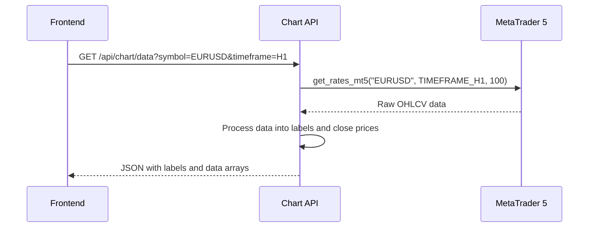
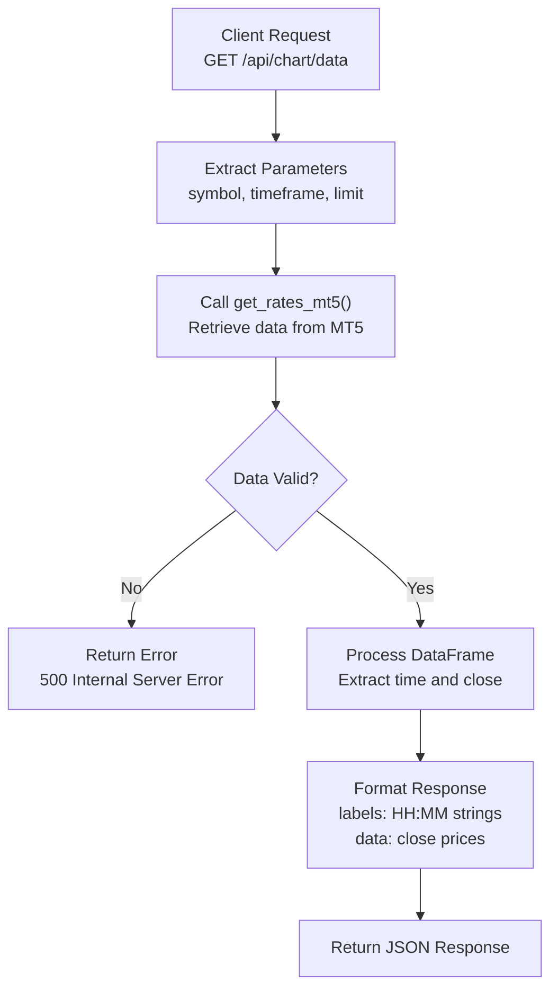

# Chart Data API

<cite>
**Referenced Files in This Document**   
- [api_chart.py](file://core/routes/api_chart.py#L1-L21)
- [mt5.py](file://core/utils/mt5.py#L37-L65)
- [mt5.py](file://core/utils/mt5.py#L0-L35)
- [dashboard.js](file://static/js/dashboard.js#L78-L123)
</cite>

## Table of Contents
1. [Introduction](#introduction)
2. [API Endpoint Specification](#api-endpoint-specification)
3. [Response Schema](#response-schema)
4. [Data Retrieval and Preprocessing](#data-retrieval-and-preprocessing)
5. [Frontend Integration](#frontend-integration)
6. [Error Handling](#error-handling)
7. [Usage Examples](#usage-examples)

## Introduction
The Chart Data API in quantumbotx provides OHLCV (Open, High, Low, Close, Volume) data for financial instruments, optimized for chart visualization. This API serves as the primary data source for rendering price charts in the application's frontend. The endpoint retrieves historical market data from MetaTrader 5 (MT5) and formats it for immediate use with charting libraries.

**Section sources**
- [api_chart.py](file://core/routes/api_chart.py#L1-L21)

## API Endpoint Specification
The Chart Data API exposes a single RESTful endpoint for retrieving chart data:

**Endpoint**: `GET /api/chart/data`

### Parameters
The endpoint accepts the following query parameters:

| Parameter | Type | Required | Default | Description |
|---------|------|--------|--------|-----------|
| **symbol** | string | No | EURUSD | Trading symbol (e.g., EURUSD, XAUUSD, GBPJPY) |
| **timeframe** | string | No | H1 | Chart timeframe (M1, M5, H1, H4, D1, W1, MN1) |
| **limit** | integer | No | 100 | Number of candlesticks to retrieve (maximum 1000) |

The API currently uses a fixed timeframe of H1 (1-hour) in the implementation, though the TIMEFRAME_MAP constant indicates support for multiple timeframe options.



**Diagram sources**
- [api_chart.py](file://core/routes/api_chart.py#L1-L21)
- [mt5.py](file://core/utils/mt5.py#L37-L65)

**Section sources**
- [api_chart.py](file://core/routes/api_chart.py#L1-L21)
- [mt5.py](file://core/utils/mt5.py#L37-L65)

## Response Schema
The API returns a JSON object containing two arrays: labels and data.

### Response Structure
```json
{
  "labels": ["10:00", "11:00", "12:00", ...],
  "data": [1.0850, 1.0852, 1.0848, ...]
}
```

### Field Descriptions
- **labels**: Array of time strings formatted as "HH:MM" representing the timestamp of each candle
- **data**: Array of closing prices corresponding to each timestamp

The current implementation only returns the closing price for chart rendering, despite retrieving full OHLCV data from MT5. For backtesting visualization, the complete OHLCV data would need to be exposed.

**Section sources**
- [api_chart.py](file://core/routes/api_chart.py#L1-L21)

## Data Retrieval and Preprocessing
The Chart Data API retrieves market data from MetaTrader 5 and processes it for frontend consumption.

### Data Flow


**Diagram sources**
- [api_chart.py](file://core/routes/api_chart.py#L1-L21)
- [mt5.py](file://core/utils/mt5.py#L37-L65)

### Data Retrieval Process
The `get_rates_mt5()` function in `core/utils/mt5.py` handles the interaction with MetaTrader 5:

1. Calls `mt5.copy_rates_from_pos()` to retrieve historical rates
2. Converts the returned NumPy array to a pandas DataFrame
3. Converts the Unix timestamp to a datetime object
4. Sets the datetime as the DataFrame index
5. Returns the processed DataFrame

The function includes error handling for cases where data cannot be retrieved from MT5.

### Preprocessing Steps
The API performs the following preprocessing on the retrieved data:
- Extracts the datetime index and formats it as "HH:MM" strings for the labels array
- Extracts the 'close' column values for the data array
- Converts both arrays to lists for JSON serialization

**Section sources**
- [api_chart.py](file://core/routes/api_chart.py#L1-L21)
- [mt5.py](file://core/utils/mt5.py#L37-L65)

## Frontend Integration
The Chart Data API is integrated with Chart.js in the frontend for visualization.

### JavaScript Implementation
```javascript
async function updatePriceChart(symbol = 'EURUSD') {
    try {
        const response = await fetch(`/api/chart/data?symbol=${symbol}`);
        const chartData = await response.json();

        const ctx = document.getElementById('priceChart');
        
        if (priceChart) {
            priceChart.data.labels = chartData.labels;
            priceChart.data.datasets[0].data = chartData.data;
            priceChart.update();
        } else {
            priceChart = new Chart(ctx, {
                type: 'line',
                data: {
                    labels: chartData.labels,
                    datasets: [{
                        label: symbol,
                        data: chartData.data,
                        borderColor: '#3B82F6',
                        backgroundColor: 'rgba(59, 130, 246, 0.05)',
                        borderWidth: 2,
                        fill: true,
                        tension: 0.4
                    }]
                },
                options: {
                    responsive: true,
                    maintainAspectRatio: false,
                    plugins: { legend: { display: false } },
                    scales: {
                        y: { beginAtZero: false },
                        x: { grid: { display: false } }
                    }
                }
            });
        }
    } catch (error) {
        console.error('[Chart] Gagal update grafik:', error);
    }
}
```

### Integration Recommendations
For optimal integration with charting libraries:

**Chart.js Integration**:
- Use the labels array for the x-axis timestamps
- Use the data array for the y-axis price values
- Implement responsive design for different screen sizes
- Add loading states during data retrieval
- Include error handling for failed requests

**TradingView Integration**:
To integrate with TradingView, the API would need to be extended to provide complete OHLCV data in the format expected by TradingView's Lightweight Charts:

```json
[
  {
    "time": 1640995200,
    "open": 1.0850,
    "high": 1.0860,
    "low": 1.0840,
    "close": 1.0852,
    "volume": 1000
  }
]
```

**Section sources**
- [dashboard.js](file://static/js/dashboard.js#L78-L123)
- [api_chart.py](file://core/routes/api_chart.py#L1-L21)

## Error Handling
The Chart Data API includes basic error handling for data retrieval failures.

### Error Response
When data cannot be retrieved from MT5, the API returns:
```json
{
  "error": "Gagal mengambil data grafik"
}
```
With HTTP status code 500 (Internal Server Error).

### Error Conditions
The API returns an error response when:
- The requested symbol is not available in MT5
- MT5 connection fails
- No data is returned from the MT5 API
- The retrieved DataFrame is empty

The current implementation does not validate the symbol or timeframe parameters before making the MT5 call, which could lead to unnecessary API calls for invalid parameters.

**Section sources**
- [api_chart.py](file://core/routes/api_chart.py#L1-L21)
- [mt5.py](file://core/utils/mt5.py#L37-L65)

## Usage Examples
### Sample API Requests
**Retrieve default chart data:**
```bash
curl "http://localhost:5000/api/chart/data"
```

**Retrieve data for a specific symbol:**
```bash
curl "http://localhost:5000/api/chart/data?symbol=XAUUSD"
```

**Retrieve data with custom limit:**
```bash
curl "http://localhost:5000/api/chart/data?symbol=EURUSD&limit=50"
```

### Sample Response
```json
{
  "labels": ["10:00", "11:00", "12:00", "13:00", "14:00"],
  "data": [1.0850, 1.0852, 1.0848, 1.0855, 1.0860]
}
```

### Backtesting Visualization Example
For backtesting visualization with 100-candle sequences:

```json
{
  "labels": ["00:00", "01:00", "02:00", ..., "23:00"],
  "data": [1.0850, 1.0852, 1.0848, ..., 1.0920]
}
```

This represents 100 hourly candles for a 4-day period, suitable for strategy backtesting visualization.

### Current Limitations and Recommendations
The current implementation has several limitations:
- Only returns closing prices, not full OHLCV data
- Fixed timeframe (H1) despite parameter support
- No pagination support via offset parameter
- No date range filtering
- Limited error responses without specific error codes
- No caching mechanism for improved performance

**Recommendations for Enhancement:**
1. Extend the response schema to include full OHLCV data for each candle
2. Implement proper timeframe parameter handling using the TIMEFRAME_MAP
3. Add support for date range parameters (from and to)
4. Implement pagination with limit and offset parameters
5. Add caching strategy to reduce MT5 API calls
6. Implement comprehensive error handling with specific error codes
7. Add rate limiting to prevent abuse
8. Support multiple charting library formats (e.g., TradingView format)

**Section sources**
- [api_chart.py](file://core/routes/api_chart.py#L1-L21)
- [mt5.py](file://core/utils/mt5.py#L37-L65)
- [dashboard.js](file://static/js/dashboard.js#L78-L123)