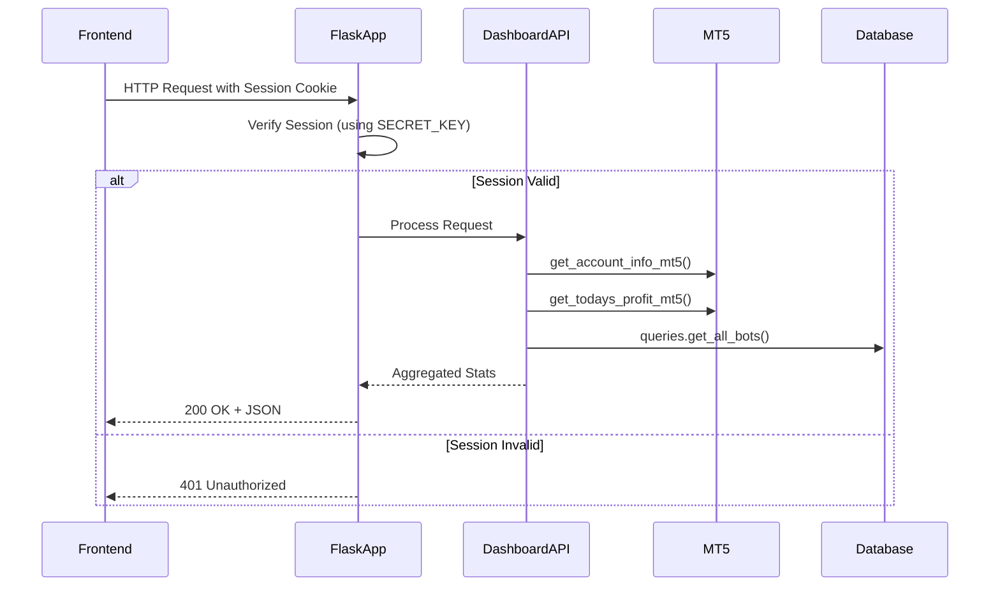
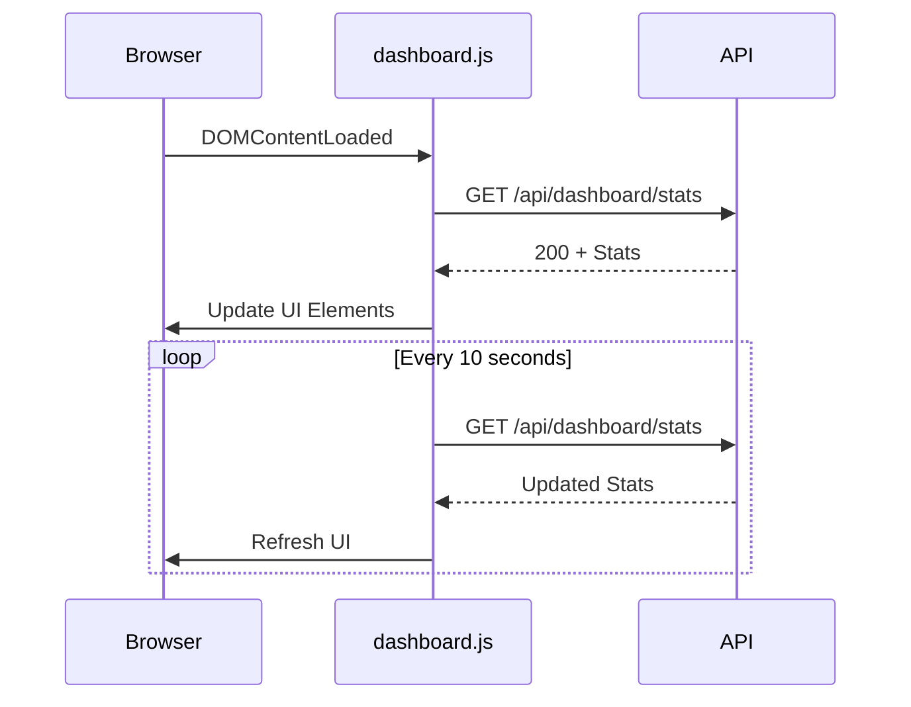

# Dashboard API

<cite>
**Referenced Files in This Document**   
- [api_dashboard.py](file://core/routes/api_dashboard.py)
- [queries.py](file://core/db/queries.py)
- [mt5.py](file://core/utils/mt5.py)
- [dashboard.js](file://static/js/dashboard.js)
- [api_profile.py](file://core/routes/api_profile.py)
- [create_app.py](file://core/__init__.py)
</cite>

## Table of Contents
1. [Introduction](#introduction)
2. [API Endpoint Overview](#api-endpoint-overview)
3. [Response Schema](#response-schema)
4. [Authentication and Access Control](#authentication-and-access-control)
5. [Data Sources and Real-Time Integration](#data-sources-and-real-time-integration)
6. [Frontend Consumption and Polling Behavior](#frontend-consumption-and-polling-behavior)
7. [Error Handling and Status Codes](#error-handling-and-status-codes)
8. [Caching and Performance Considerations](#caching-and-performance-considerations)
9. [Sample JSON Response](#sample-json-response)
10. [Testing the Endpoint](#testing-the-endpoint)

## Introduction

The Dashboard API in quantumbotx provides a centralized endpoint for aggregating key performance metrics used to power the user interface. This document details the `/api/dashboard/stats` endpoint, which combines data from active trading bots, MetaTrader 5 (MT5) connections, and database-stored configurations to deliver real-time insights into portfolio health, bot activity, and market performance. The API is designed to support dynamic dashboard rendering with efficient data retrieval and structured error handling.

## API Endpoint Overview

The primary dashboard endpoint is:

**GET** `/api/dashboard/stats`

This endpoint returns a JSON payload containing aggregated statistics relevant to the user's trading environment. It is designed to be lightweight and fast, aggregating data from multiple backend systems into a single response for frontend consumption.

**Section sources**
- [api_dashboard.py](file://core/routes/api_dashboard.py#L9-L27)

## Response Schema

The response includes the following key fields:

- **equity**: Current account equity value retrieved from MT5
- **todays_profit**: Total profit generated today from closed trades
- **active_bots_count**: Number of bots currently running (status = "Aktif")
- **total_bots**: Total number of configured bots in the system
- **active_bots**: Array of active bot objects with name and market

```json
{
  "equity": 12543.67,
  "todays_profit": 245.30,
  "active_bots_count": 3,
  "total_bots": 5,
  "active_bots": [
    {
      "name": "EURUSD Scalper",
      "market": "Forex"
    },
    {
      "name": "Gold Momentum",
      "market": "Commodities"
    },
    {
      "name": "Tech Stocks AI",
      "market": "Stocks"
    }
  ]
}
```

**Section sources**
- [api_dashboard.py](file://core/routes/api_dashboard.py#L15-L25)

## Authentication and Access Control

Based on code analysis, the application uses session-based authentication with Flask's built-in session management. The `SECRET_KEY` is configured in the application factory, indicating that signed cookies are used to maintain user sessions.

User authentication is implemented through a database-stored user record (see `users` table in `init_db.py`) with password hashing via `werkzeug.security`. The `/api/profile` endpoint confirms that user data is retrieved based on a fixed user ID (ID=1), suggesting a single-user application model.

Although no explicit authentication decorator is visible on the dashboard route, the presence of session configuration and user-specific endpoints indicates that access control is expected to be handled at the application level, likely through middleware or route protection not explicitly shown in the current codebase.



**Diagram sources**
- [api_dashboard.py](file://core/routes/api_dashboard.py)
- [mt5.py](file://core/utils/mt5.py)
- [queries.py](file://core/db/queries.py)
- [create_app.py](file://core/__init__.py)

**Section sources**
- [api_profile.py](file://core/routes/api_profile.py#L15-L20)
- [create_app.py](file://core/__init__.py#L45)

## Data Sources and Real-Time Integration

The dashboard aggregates data from three primary sources:

1. **MetaTrader 5 Connection**: Real-time account data including equity and daily profit
2. **SQLite Database**: Bot configuration and status information
3. **In-Memory State**: Active bot statuses managed by the bot controller

The integration flow is as follows:

```mermaid
flowchart TD
A[Dashboard API Request] --> B{Fetch MT5 Data}
B --> C[get_account_info_mt5()]
B --> D[get_todays_profit_mt5()]
A --> E{Query Database}
E --> F[get_all_bots()]
F --> G[Filter Active Bots]
C --> H[Aggregate Data]
D --> H
G --> H
H --> I[Return JSON Response]
```

**Diagram sources**
- [api_dashboard.py](file://core/routes/api_dashboard.py)
- [mt5.py](file://core/utils/mt5.py)
- [queries.py](file://core/db/queries.py)

**Section sources**
- [api_dashboard.py](file://core/routes/api_dashboard.py#L10-L25)
- [mt5.py](file://core/utils/mt5.py#L30-L75)
- [queries.py](file://core/db/queries.py#L5-L15)

## Frontend Consumption and Polling Behavior

The frontend JavaScript (`dashboard.js`) consumes the API with automatic polling to keep the UI updated:

- **Dashboard Stats**: Refreshed every 10 seconds
- **Bot List**: Refreshed every 5 seconds
- **Price Chart**: Updated on page load (no auto-refresh shown)

The client implements error handling with console logging but does not display user-facing error messages for dashboard failures, potentially leading to stale data display.



**Diagram sources**
- [dashboard.js](file://static/js/dashboard.js#L23-L45)

**Section sources**
- [dashboard.js](file://static/js/dashboard.js#L23-L45)

## Error Handling and Status Codes

The endpoint implements comprehensive error handling:

| Status Code | Meaning | Trigger Condition |
|-------------|-------|-------------------|
| 200 | OK | Successful response with complete data |
| 500 | Internal Server Error | Exception during data retrieval from MT5 or database |

The API does not currently implement 401 Unauthorized responses explicitly, but the application's session system suggests that unauthenticated requests would be rejected at the middleware level before reaching this endpoint.

Error responses follow the format:
```json
{
  "error": "Gagal mengambil statistik dashboard: [error details]"
}
```

The system handles partial data failures by returning default values (0 for numeric fields, empty arrays) rather than failing the entire request when possible.

**Section sources**
- [api_dashboard.py](file://core/routes/api_dashboard.py#L26-L27)

## Caching and Performance Considerations

The dashboard API does not implement server-side caching. Each request triggers fresh data retrieval from both MT5 and the database.

Performance optimizations include:
- Single database query for all bots (`get_all_bots()`)
- Efficient list comprehension for active bot filtering
- Direct MT5 API calls without intermediate processing

Recommended frontend polling intervals:
- **10 seconds** for dashboard stats (balance, profit)
- **5 seconds** for bot status (more volatile)
- **Manual refresh** for historical data

Frequent polling of MT5 endpoints may impact broker server performance and should be monitored.

**Section sources**
- [api_dashboard.py](file://core/routes/api_dashboard.py#L10-L25)
- [dashboard.js](file://static/js/dashboard.js#L178-L184)

## Sample JSON Response

```json
{
  "equity": 15230.45,
  "todays_profit": 321.80,
  "active_bots_count": 2,
  "total_bots": 4,
  "active_bots": [
    {
      "name": "EURUSD Quantum",
      "market": "Forex"
    },
    {
      "name": "XAUUSD Squeeze",
      "market": "Commodities"
    }
  ]
}
```

This response indicates a healthy trading environment with $15,230.45 in equity, $321.80 profit today, and half of the configured bots currently active.

**Section sources**
- [api_dashboard.py](file://core/routes/api_dashboard.py#L15-L25)

## Testing the Endpoint

Use the following curl command to test the dashboard API:

```bash
curl -X GET "http://localhost:5000/api/dashboard/stats" \
  -H "Content-Type: application/json" \
  -H "Cookie: session=your_session_cookie_if_required"
```

For unauthenticated testing during development:
```bash
curl -X GET "http://localhost:5000/api/dashboard/stats"
```

The response will contain the aggregated dashboard statistics in JSON format. Ensure the MT5 terminal is connected and the application is running before testing.

**Section sources**
- [api_dashboard.py](file://core/routes/api_dashboard.py)
- [run.py](file://run.py#L45-L51)