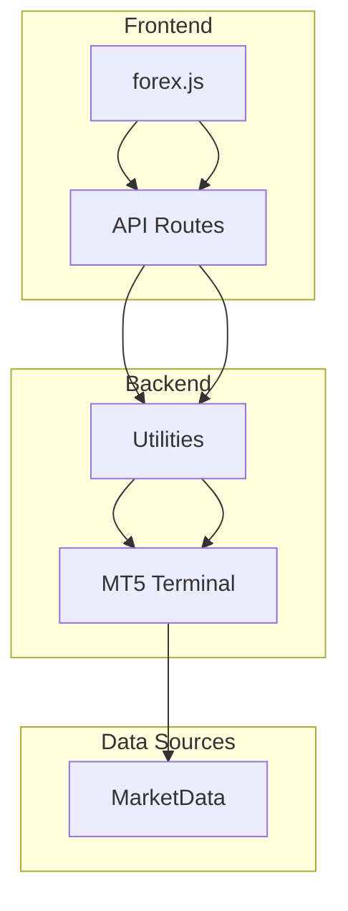
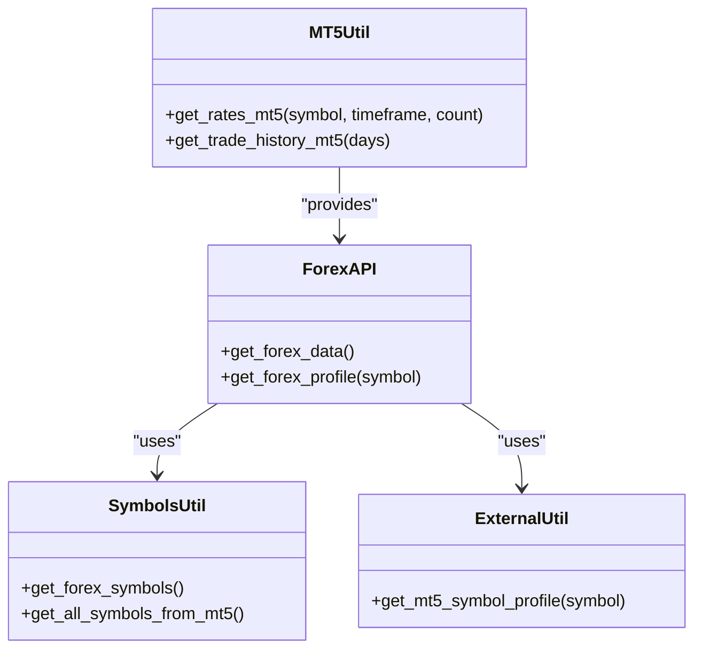
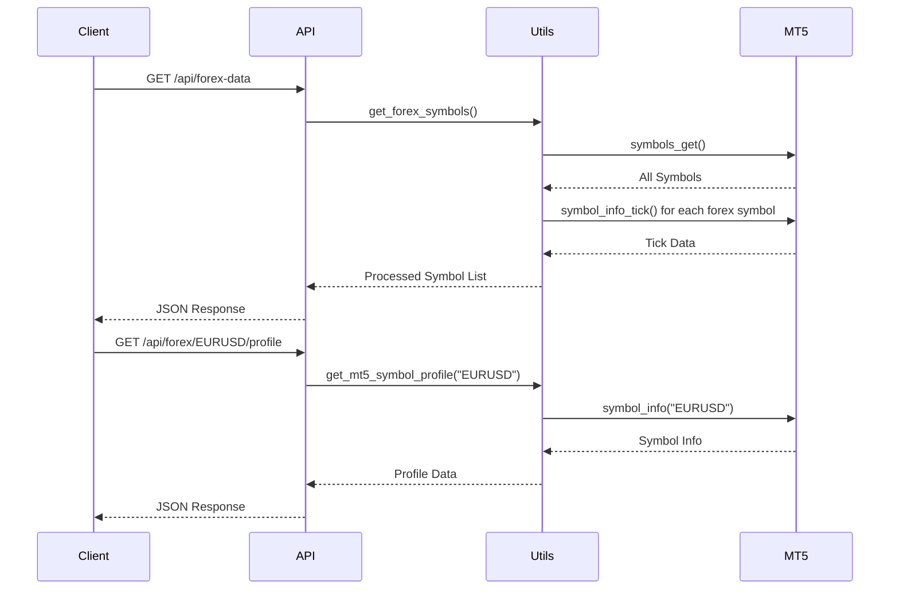
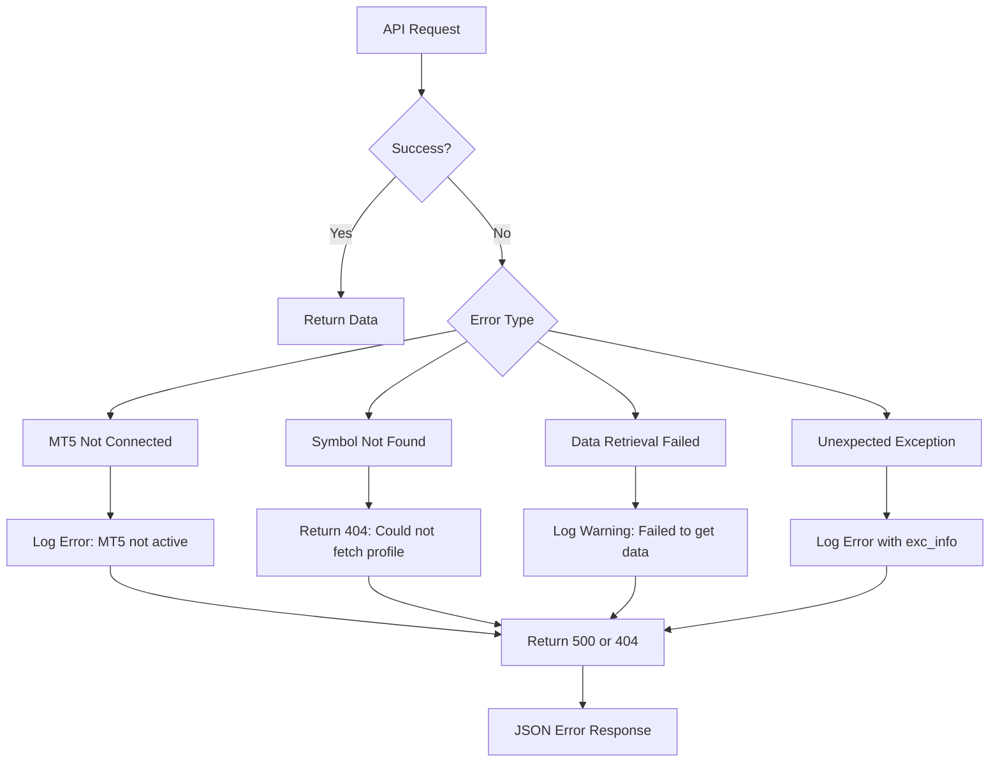

# Forex Market Data API

<cite>
**Referenced Files in This Document**   
- [api_forex.py](file://core/routes/api_forex.py#L1-L23)
- [api_history.py](file://core/routes/api_history.py#L1-L51)
- [symbols.py](file://core/utils/symbols.py#L1-L85)
- [external.py](file://core/utils/external.py#L1-L72)
- [mt5.py](file://core/utils/mt5.py#L1-L144)
</cite>

## Table of Contents
1. [Introduction](#introduction)
2. [Project Structure](#project-structure)
3. [Core Components](#core-components)
4. [API Endpoints Overview](#api-endpoints-overview)
5. [Detailed Endpoint Analysis](#detailed-endpoint-analysis)
6. [Data Flow and Processing](#data-flow-and-processing)
7. [Error Handling and Status Codes](#error-handling-and-status-codes)
8. [Performance and Rate Limiting](#performance-and-rate-limiting)
9. [Usage Examples](#usage-examples)
10. [Conclusion](#conclusion)

## Introduction
The Forex Market Data API in quantumbotx provides real-time and historical foreign exchange pricing data through a RESTful interface. This API serves as the primary interface for retrieving currency pair information, current market prices, and historical candlestick data for algorithmic trading and analysis. The system integrates with MetaTrader 5 (MT5) to source live market data and exposes this information through optimized endpoints designed for both frontend applications and automated trading systems.

The API supports three main categories of functionality: available currency pairs, real-time pricing, and historical data retrieval. All endpoints are designed to provide structured JSON responses with consistent error handling and performance optimization through direct MT5 integration.

**Section sources**
- [api_forex.py](file://core/routes/api_forex.py#L1-L23)
- [api_history.py](file://core/routes/api_history.py#L1-L51)

## Project Structure
The Forex Market Data API is organized within the quantumbotx project using a modular Flask-based architecture. The core API functionality resides in the `core/routes` directory, with supporting utilities in the `core/utils` module. The system follows a separation of concerns pattern, with route handlers, data retrieval logic, and external integrations maintained in distinct modules.

Key structural components include:
- **API Routes**: Located in `core/routes/`, containing Flask Blueprints for different API domains
- **Utilities**: Found in `core/utils/`, providing MT5 integration, symbol management, and external API connectivity
- **Data Processing**: Implemented through pandas DataFrames for time series manipulation
- **Frontend Integration**: JavaScript files in `static/js/` that consume the API endpoints



**Diagram sources**
- [api_forex.py](file://core/routes/api_forex.py#L1-L23)
- [symbols.py](file://core/utils/symbols.py#L1-L85)
- [external.py](file://core/utils/external.py#L1-L72)

**Section sources**
- [api_forex.py](file://core/routes/api_forex.py#L1-L23)
- [symbols.py](file://core/utils/symbols.py#L1-L85)

## Core Components
The Forex Market Data API consists of several interconnected components that work together to deliver market data efficiently. The primary components include route handlers, symbol management utilities, MT5 integration functions, and profile data retrieval mechanisms.

The API leverages Flask Blueprints to organize endpoints under logical groupings. The forex-specific routes are defined in `api_forex.py`, while historical data functionality is located in `api_history.py`. These routes depend on utility functions in the `core/utils` directory for actual data retrieval from MT5.

Key data structures include:
- **Forex Symbol List**: Array of currency pairs with metadata (name, description, ask, bid, spread, digits)
- **Symbol Profile**: Detailed instrument information including contract specifications and margin requirements
- **Historical Rates**: OHLCV (Open, High, Low, Close, Volume) candle data in DataFrame format



**Diagram sources**
- [api_forex.py](file://core/routes/api_forex.py#L1-L23)
- [symbols.py](file://core/utils/symbols.py#L1-L85)
- [external.py](file://core/utils/external.py#L1-L72)
- [mt5.py](file://core/utils/mt5.py#L1-L144)

**Section sources**
- [api_forex.py](file://core/routes/api_forex.py#L1-L23)
- [symbols.py](file://core/utils/symbols.py#L1-L85)
- [external.py](file://core/utils/external.py#L1-L72)

## API Endpoints Overview
The Forex Market Data API provides several endpoints for accessing market data, instrument profiles, and historical information. These endpoints are designed to support both real-time trading applications and historical analysis workflows.

The primary endpoints include:
- **GET /api/forex-data**: Retrieves a list of available forex currency pairs with current pricing
- **GET /api/forex/{symbol}/profile**: Returns detailed metadata about a specific currency pair
- **GET /api/history**: Provides historical trade data from MT5
- **GET /api/bots/{bot_id}/history**: Returns trade history for a specific trading bot

These endpoints follow RESTful conventions with JSON responses and appropriate HTTP status codes. The API is designed to be consumed by both frontend applications (via JavaScript) and external services.

```mermaid
flowchart TD
A[Client Request] --> B{Endpoint}
B --> C[/api/forex-data]
B --> D[/api/forex/{symbol}/profile]
B --> E[/api/history]
B --> F[/api/bots/{bot_id}/history]
C --> G[Get Forex Symbols]
D --> H[Get Symbol Profile]
E --> I[Get Trade History]
F --> J[Get Bot History]
G --> K[MT5 Integration]
H --> K
I --> K
J --> K
K --> L[Return JSON Response]
```

**Diagram sources**
- [api_forex.py](file://core/routes/api_forex.py#L1-L23)
- [api_history.py](file://core/routes/api_history.py#L1-L51)

**Section sources**
- [api_forex.py](file://core/routes/api_forex.py#L1-L23)
- [api_history.py](file://core/routes/api_history.py#L1-L51)

## Detailed Endpoint Analysis
This section provides in-depth analysis of each Forex Market Data API endpoint, including request parameters, response schemas, and implementation details.

### GET /api/forex-data
Retrieves a list of available forex currency pairs with current market pricing.

**Request**
```
GET /api/forex-data
```

**Response Schema**
```json
[
  {
    "name": "EURUSD",
    "description": "Euro vs US Dollar",
    "ask": 1.08573,
    "bid": 1.08563,
    "spread": 10,
    "digits": 5
  }
]
```

**Implementation**
The endpoint calls `get_forex_symbols()` from `symbols.py`, which queries MT5 for all symbols with a path starting with "forex\\". For each forex symbol, it retrieves the current tick data (ask, bid) and includes spread and digit information.

**Section sources**
- [api_forex.py](file://core/routes/api_forex.py#L10-L18)
- [symbols.py](file://core/utils/symbols.py#L67-L84)

### GET /api/forex/{symbol}/profile
Retrieves detailed metadata about a specific currency pair.

**Request**
```
GET /api/forex/EURUSD/profile
```

**Response Schema**
```json
{
  "name": "Euro vs US Dollar",
  "symbol": "EURUSD",
  "currency_base": "EUR",
  "currency_profit": "USD",
  "digits": 5,
  "spread": 10,
  "trade_contract_size": 100000,
  "volume_min": 0.01,
  "volume_max": 100,
  "volume_step": 0.01,
  "margin_initial": 1000,
  "margin_maintenance": 500
}
```

**Implementation**
The endpoint calls `get_mt5_symbol_profile()` from `external.py`, which retrieves symbol information from MT5. The function checks if the MT5 connection is active before querying symbol details.

**Section sources**
- [api_forex.py](file://core/routes/api_forex.py#L20-L23)
- [external.py](file://core/utils/external.py#L55-L72)

### GET /api/history
Retrieves historical trade data from MT5.

**Request**
```
GET /api/history
```

**Response Schema**
```json
[
  {
    "ticket": 123456789,
    "symbol": "EURUSD",
    "volume": 0.1,
    "price": 1.0856,
    "profit": 15.25,
    "type": 0,
    "time": "2023-12-01T10:30:45"
  }
]
```

**Implementation**
The endpoint calls `get_trade_history_mt5()` from `mt5.py`, which retrieves closed deals from the past 30 days. The function filters for entry type 1 (closed positions) and converts deal objects to dictionaries.

**Section sources**
- [api_history.py](file://core/routes/api_history.py#L10-L13)
- [mt5.py](file://core/utils/mt5.py#L115-L144)

## Data Flow and Processing
The Forex Market Data API follows a consistent data flow pattern for retrieving and processing market information from MT5.



**Diagram sources**
- [api_forex.py](file://core/routes/api_forex.py#L1-L23)
- [symbols.py](file://core/utils/symbols.py#L1-L85)
- [external.py](file://core/utils/external.py#L1-L72)

**Section sources**
- [api_forex.py](file://core/routes/api_forex.py#L1-L23)
- [symbols.py](file://core/utils/symbols.py#L1-L85)
- [external.py](file://core/utils/external.py#L1-L72)

## Error Handling and Status Codes
The Forex Market Data API implements comprehensive error handling to provide meaningful feedback for various failure scenarios.

### Error Responses
- **404 Not Found**: Returned when a requested symbol profile cannot be retrieved from MT5
- **500 Internal Server Error**: Returned for unexpected exceptions during data retrieval
- **400 Bad Request**: Used in other API endpoints for invalid input parameters

### Common Error Scenarios
1. **MT5 Connection Failure**: When the MT5 terminal is not running or disconnected
2. **Invalid Symbol**: When requesting profile data for a non-existent currency pair
3. **Data Retrieval Failure**: When MT5 functions return None or empty results

The API uses Python's logging module to record errors with stack traces for debugging purposes, while returning user-friendly error messages in JSON responses.



**Diagram sources**
- [external.py](file://core/utils/external.py#L55-L72)
- [mt5.py](file://core/utils/mt5.py#L1-L144)

**Section sources**
- [external.py](file://core/utils/external.py#L55-L72)
- [mt5.py](file://core/utils/mt5.py#L1-L144)

## Performance and Rate Limiting
The Forex Market Data API is designed with performance considerations to minimize the impact on MT5 and provide responsive data access.

### Caching Strategy
While explicit caching mechanisms are not implemented in the analyzed code, the API design incorporates performance optimizations:
- Direct MT5 integration reduces intermediate processing
- Efficient symbol filtering using path prefixes
- Batch data retrieval where appropriate

The frontend JavaScript (`forex.js`) implements client-side polling with a 10-second interval, which serves as a de facto rate limiting mechanism:

```javascript
// Refresh data every 10 seconds
setInterval(fetchForexData, 10000);
```

### Optimization Opportunities
1. **Server-side Caching**: Implement Redis or in-memory caching for frequently accessed data
2. **Connection Pooling**: Maintain persistent MT5 connections to reduce initialization overhead
3. **Request Batching**: Allow multiple symbol requests in a single API call
4. **WebSocket Integration**: For real-time updates without polling

The current implementation relies on the MT5 terminal's built-in performance characteristics and the efficiency of the MetaTrader5 Python package.

**Section sources**
- [symbols.py](file://core/utils/symbols.py#L1-L85)
- [static/js/forex.js](file://static/js/forex.js#L1-L25)

## Usage Examples
This section provides practical examples of how to use the Forex Market Data API.

### Sample curl Commands

**Get Available Forex Pairs**
```bash
curl -X GET "http://localhost:5000/api/forex-data" \
  -H "Content-Type: application/json"
```

**Get EUR/USD Profile**
```bash
curl -X GET "http://localhost:5000/api/forex/EURUSD/profile" \
  -H "Content-Type: application/json"
```

**Get Historical Data**
```bash
curl -X GET "http://localhost:5000/api/history" \
  -H "Content-Type: application/json"
```

### Sample Responses

**Current EUR/USD Pricing**
```json
{
  "name": "EURUSD",
  "description": "Euro vs US Dollar",
  "ask": 1.08573,
  "bid": 1.08563,
  "spread": 10,
  "digits": 5
}
```

**Historical Candle Data Structure**
While not directly exposed in the current endpoints, historical data would follow this OHLCV format:
```json
{
  "time": "2023-12-01T10:00:00",
  "open": 1.08560,
  "high": 1.08580,
  "low": 1.08550,
  "close": 1.08570,
  "volume": 12345
}
```

**Pair Metadata**
```json
{
  "name": "Euro vs US Dollar",
  "symbol": "EURUSD",
  "currency_base": "EUR",
  "currency_profit": "USD",
  "digits": 5,
  "pip_size": 0.0001,
  "leverage": 30,
  "trading_hours": "24/5",
  "spread": 10,
  "trade_contract_size": 100000,
  "volume_min": 0.01,
  "volume_max": 100,
  "volume_step": 0.01
}
```

**Section sources**
- [api_forex.py](file://core/routes/api_forex.py#L1-L23)
- [symbols.py](file://core/utils/symbols.py#L1-L85)
- [external.py](file://core/utils/external.py#L1-L72)

## Conclusion
The Forex Market Data API in quantumbotx provides a robust interface for accessing real-time and historical forex market data through integration with MetaTrader 5. The API exposes essential endpoints for retrieving available currency pairs, current pricing, instrument profiles, and historical trade data.

Key strengths of the current implementation include:
- Clean separation of concerns between route handlers and utility functions
- Direct MT5 integration for up-to-date market data
- Consistent JSON response formats
- Comprehensive error handling

Potential areas for enhancement include implementing server-side caching to reduce MT5 load, adding explicit rate limiting to prevent abuse, and expanding the historical data endpoints to support configurable timeframes and date ranges. The API serves as a solid foundation for algorithmic trading applications and market analysis tools within the quantumbotx ecosystem.