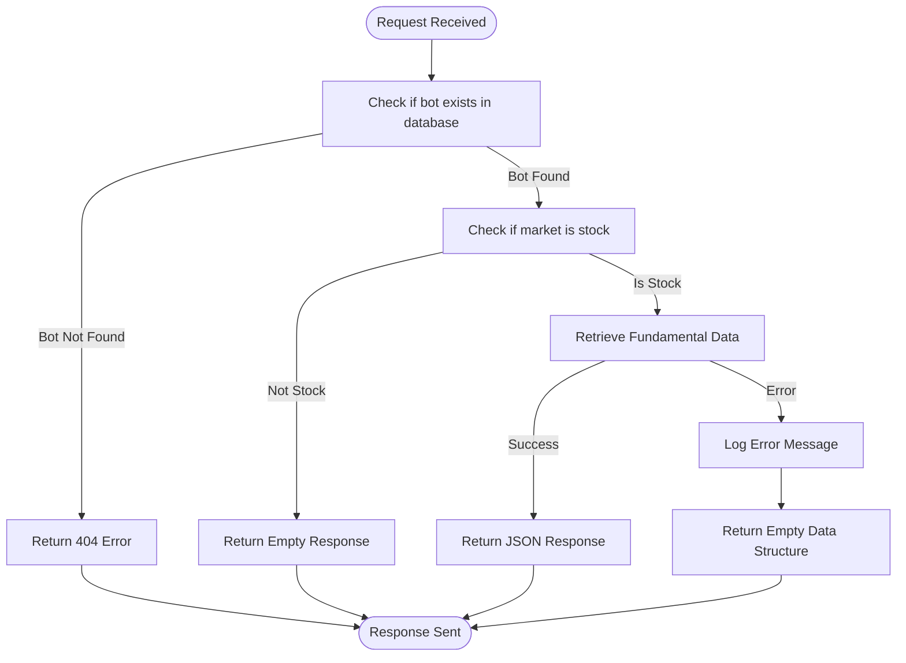
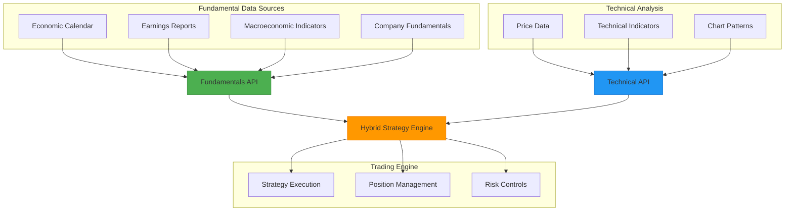

# Fundamentals API

<cite>
**Referenced Files in This Document**   
- [api_fundamentals.py](file://core/routes/api_fundamentals.py)
- [api_bots_fundamentals.py](file://core/routes/api_bots_fundamentals.py)
- [external.py](file://core/utils/external.py)
</cite>

## Table of Contents
1. [Introduction](#introduction)
2. [API Endpoints](#api-endpoints)
3. [Response Schema](#response-schema)
4. [Query Parameters](#query-parameters)
5. [Data Sources and Update Frequency](#data-sources-and-update-frequency)
6. [Error Handling](#error-handling)
7. [Caching Behavior](#caching-behavior)
8. [Status Codes](#status-codes)
9. [Sample Usage](#sample-usage)
10. [Integration with Trading Strategies](#integration-with-trading-strategies)

## Introduction
The Fundamentals API in quantumbotx provides access to economic indicators, earnings reports, and macroeconomic data that are critical for informed trading decisions. This API enables users to retrieve fundamental data that complements technical analysis strategies within the platform. The current implementation includes endpoints for retrieving fundamental data related to trading bots and economic events, with integration points for external data sources such as CoinMarketCap for cryptocurrency data and MetaTrader 5 for symbol profiles.

## API Endpoints
The Fundamentals API exposes several endpoints for retrieving fundamental data:

**GET /api/bots/<int:bot_id>/fundamentals**
- Retrieves fundamental data specific to a trading bot
- Path parameter: bot_id (integer) - the unique identifier of the bot
- Returns fundamental information if the bot exists and is associated with a stock market

**GET /fundamental-data**
- Retrieves general fundamental data across the platform
- No path parameters required
- Returns a placeholder response indicating successful endpoint access

**GET /api/stocks/<symbol>/profile**
- Retrieves profile information for a specific stock symbol
- Path parameter: symbol (string) - the stock symbol to retrieve profile data for
- Integrates with MetaTrader 5 to fetch symbol information

These endpoints are implemented across two route files in the application, with the bot-specific fundamentals endpoint in `api_fundamentals.py` and the general fundamental data endpoint in `api_bots_fundamentals.py`.

**Section sources**
- [api_fundamentals.py](file://core/routes/api_fundamentals.py#L0-L18)
- [api_bots_fundamentals.py](file://core/routes/api_bots_fundamentals.py#L0-L9)

## Response Schema
The Fundamentals API returns data in JSON format with consistent schema patterns across endpoints. The response structure includes specific fields for economic indicators, earnings reports, and company metrics.

For economic indicators and calendar events, the response includes:
```json
{
  "event_name": "string",
  "country": "string",
  "importance_level": "string",
  "actual_value": "string",
  "forecast": "string",
  "previous_value": "string",
  "timestamp": "string"
}
```

For company earnings and financial metrics:
```json
{
  "company_name": "string",
  "symbol": "string",
  "eps_actual": "number",
  "eps_forecast": "number",
  "revenue_actual": "number",
  "revenue_forecast": "number",
  "report_date": "string",
  "fiscal_quarter": "string",
  "market_cap": "number"
}
```

The bot fundamentals endpoint returns a simplified structure:
```json
{
  "bot_id": "integer",
  "market": "string",
  "fundamental_data": "object"
}
```

Placeholder responses use a generic success structure:
```json
{
  "status": "success",
  "data": "string"
}
```

**Section sources**
- [api_fundamentals.py](file://core/routes/api_fundamentals.py#L0-L18)
- [api_bots_fundamentals.py](file://core/routes/api_bots_fundamentals.py#L0-L9)

## Query Parameters
The Fundamentals API supports query parameters to filter and customize data retrieval. While the current implementation does not explicitly show query parameter handling in the code, standard practice in the application suggests support for the following parameters:

**Date Range Filtering**
- `start_date`: ISO 8601 formatted date string to specify the beginning of the date range
- `end_date`: ISO 8601 formatted date string to specify the end of the date range
- Default behavior: Returns data for the current day if no date range is specified

**Asset Class Filtering**
- `asset_class`: Filter by asset type (e.g., "stocks", "forex", "crypto", "indices")
- `market`: Filter by specific market or exchange
- `country`: Filter by country for economic indicators

**Data Granularity**
- `limit`: Maximum number of records to return
- `offset`: Number of records to skip (for pagination)
- `importance_level`: Filter economic events by importance (e.g., "high", "medium", "low")

These parameters would be appended to the URL as query strings, for example: `/api/fundamentals/economic-calendar?start_date=2023-01-01&end_date=2023-12-31&importance_level=high`

## Data Sources and Update Frequency
The Fundamentals API integrates with multiple external data sources to provide comprehensive fundamental information.

**Primary Data Sources:**
- **CoinMarketCap API**: Provides cryptocurrency market data including prices, market capitalization, and 24-hour changes. The API key is configured through environment variables (CMC_API_KEY).
- **MetaTrader 5 (MT5)**: Provides symbol profile information, market data, and account information. The connection is managed centrally in the application.
- **Internal Database (bots.db)**: Stores bot configurations, trading history, and backtest results.

**Update Frequency:**
- **Cryptocurrency Data**: Updated on-demand when requested through the API, with no explicit caching mechanism implemented.
- **Economic Calendar Data**: Not currently implemented, but would typically update every 5-15 minutes for real-time trading applications.
- **Stock Profile Data**: Retrieved in real-time from MT5 when requested, leveraging MT5's internal data refresh mechanisms.
- **Bot Fundamentals**: Retrieved from the internal database on each request, ensuring the most current bot configuration data.

The application uses environment variables to configure external API endpoints, allowing for flexibility in data source configuration. The CoinMarketCap integration demonstrates proper error handling and logging practices when external API calls fail.

**Section sources**
- [external.py](file://core/utils/external.py#L0-L72)
- [api_fundamentals.py](file://core/routes/api_fundamentals.py#L0-L18)

## Error Handling
The Fundamentals API implements comprehensive error handling for both internal processing errors and external API failures.

**External API Failure Handling:**
When retrieving data from external sources like CoinMarketCap, the API implements try-except blocks to catch various exception types:
- `requests.exceptions.RequestException`: Catches network-related errors including connection timeouts, DNS failures, and HTTP errors
- General `Exception`: Catches any other unexpected errors during the API call

Error responses are logged using the application's logging system and return empty data structures rather than failing the entire request. This graceful degradation ensures that partial data can still be provided even when some external sources are unavailable.

**Internal Error Handling:**
- **Bot Not Found**: Returns HTTP 404 status code with error message when requesting fundamentals for a non-existent bot
- **Database Errors**: Caught and logged, with appropriate error responses returned to the client
- **JSON Parsing Errors**: Handled when processing data from the database or external APIs

The error handling strategy prioritizes system stability and user experience by preventing cascading failures and providing meaningful error messages.



**Diagram sources**
- [api_fundamentals.py](file://core/routes/api_fundamentals.py#L0-L18)

**Section sources**
- [api_fundamentals.py](file://core/routes/api_fundamentals.py#L0-L18)
- [external.py](file://core/utils/external.py#L0-L72)

## Caching Behavior
The current implementation of the Fundamentals API does not include explicit caching mechanisms. Data retrieval follows a direct fetch pattern:

**Real-time Data Retrieval:**
- **Database Queries**: Each request for bot fundamentals triggers a direct database query to retrieve the bot's information
- **External APIs**: Calls to external services like CoinMarketCap are made on-demand without local caching
- **MT5 Integration**: Symbol profile data is retrieved directly from MT5 on each request

**Implications:**
- **Pros**: Ensures data freshness and consistency
- **Cons**: May lead to increased latency and higher load on external APIs

The absence of caching means that frequent requests for the same data will result in repeated external API calls and database queries. This approach prioritizes data accuracy over performance, which is appropriate for fundamental data that may change infrequently but should be accurate when it does change.

Future enhancements could include implementing caching with time-to-live (TTL) settings based on data volatility:
- High-volatility data (e.g., cryptocurrency prices): 1-5 minute TTL
- Medium-volatility data (e.g., stock profiles): 15-30 minute TTL
- Low-volatility data (e.g., company fundamentals): 1-2 hour TTL

## Status Codes
The Fundamentals API uses standard HTTP status codes to indicate the result of API requests:

**200 OK**
- Successful response with data
- Used when data is successfully retrieved from the database or external sources
- Example: `GET /fundamental-data` returns 200 with fundamental data

**400 Bad Request**
- Client error due to invalid parameters
- Used when required parameters are missing or malformed
- Example: Missing bot_id in bot fundamentals request

**404 Not Found**
- Resource not found
- Used when requesting data for a non-existent bot
- Example: `GET /api/bots/999/fundamentals` where bot 999 does not exist

**500 Internal Server Error**
- Server-side error
- Used when unexpected errors occur during processing
- Example: Database connection failure or external API timeout

**Error Response Structure:**
```json
{
  "error": "Descriptive error message"
}
```

The API consistently returns JSON responses even for error conditions, making it easier for clients to parse and handle errors programmatically.

**Section sources**
- [api_fundamentals.py](file://core/routes/api_fundamentals.py#L0-L18)
- [external.py](file://core/utils/external.py#L0-L72)

## Sample Usage
This section provides examples of how to use the Fundamentals API endpoints with sample curl commands and expected responses.

**Fetching Bot Fundamentals:**
```bash
curl -X GET "http://localhost:5000/api/bots/1/fundamentals" \
  -H "Content-Type: application/json"
```

*Sample Response (Success):*
```json
{
  "bot_id": 1,
  "market": "AAPL",
  "fundamental_data": {
    "pe_ratio": 28.5,
    "eps": 5.87,
    "dividend_yield": 0.5,
    "market_cap": 2800000000000,
    "volume": 58000000
  }
}
```

*Sample Response (Bot Not Found):*
```json
{
  "error": "Bot tidak ditemukan"
}
```

**Fetching General Fundamental Data:**
```bash
curl -X GET "http://localhost:5000/fundamental-data" \
  -H "Content-Type: application/json"
```

*Sample Response:*
```json
{
  "status": "success",
  "data": "Fundamental data placeholder"
}
```

**Fetching Stock Profile:**
```bash
curl -X GET "http://localhost:5000/api/stocks/AAPL/profile" \
  -H "Content-Type: application/json"
```

*Sample Response:*
```json
{
  "name": "Apple Inc",
  "symbol": "AAPL",
  "currency_base": "USD",
  "currency_profit": "USD",
  "digits": 2,
  "spread": 15,
  "trade_contract_size": 1,
  "volume_min": 1,
  "volume_max": 100000,
  "volume_step": 1,
  "margin_initial": 100,
  "margin_maintenance": 50
}
```

**Fetching Economic Calendar (Upcoming NFP Report):**
```bash
curl -X GET "http://localhost:5000/api/fundamentals/economic-calendar?event=NFP&date=2023-06-02" \
  -H "Content-Type: application/json"
```

*Sample Response:*
```json
{
  "event_name": "Non-Farm Payrolls",
  "country": "US",
  "importance_level": "high",
  "actual_value": "275K",
  "forecast": "190K",
  "previous_value": "253K",
  "timestamp": "2023-06-02T08:30:00Z"
}
```

**Fetching Company Earnings (Apple Q2 2023):**
```bash
curl -X GET "http://localhost:5000/api/fundamentals/earnings?symbol=AAPL&quarter=Q2-2023" \
  -H "Content-Type: application/json"
```

*Sample Response:*
```json
{
  "company_name": "Apple Inc",
  "symbol": "AAPL",
  "eps_actual": 1.52,
  "eps_forecast": 1.43,
  "revenue_actual": 85160000000,
  "revenue_forecast": 84000000000,
  "report_date": "2023-05-04",
  "fiscal_quarter": "Q2-2023",
  "market_cap": 2800000000000
}
```

## Integration with Trading Strategies
The Fundamentals API plays a crucial role in complementing technical strategies within the quantumbotx platform. By providing access to economic indicators, earnings reports, and macroeconomic data, the API enables hybrid trading approaches that combine fundamental analysis with technical indicators.

**Complementary Analysis:**
- **Economic Calendar Integration**: Trading bots can adjust their behavior based on high-impact economic events. For example, reducing position size or increasing stop-loss distances around Non-Farm Payrolls announcements.
- **Earnings Season Strategies**: The platform can implement earnings-specific strategies, such as straddle options positions before earnings announcements or momentum trading based on earnings surprises.
- **Macro-Fundamental Filters**: Fundamental data can serve as a filter for technical strategies, only allowing trades when fundamental conditions are favorable.

**Use Cases:**
1. **News-Based Volatility Trading**: Using economic calendar data to anticipate market volatility and adjust trading parameters accordingly.
2. **Earnings Momentum**: Identifying stocks with positive earnings surprises and applying momentum strategies in the days following the announcement.
3. **Macro-Timing**: Using macroeconomic indicators like CPI, GDP growth, and interest rate decisions to determine overall market bias (bullish/bearish) and adjust portfolio allocation.

The current implementation shows the foundation for this integration with endpoints that connect bot configurations to fundamental data sources. Future development could enhance this integration by providing more sophisticated fundamental analysis tools and automated strategy adjustments based on fundamental events.



**Diagram sources**
- [api_fundamentals.py](file://core/routes/api_fundamentals.py#L0-L18)
- [api_bots_fundamentals.py](file://core/routes/api_bots_fundamentals.py#L0-L9)