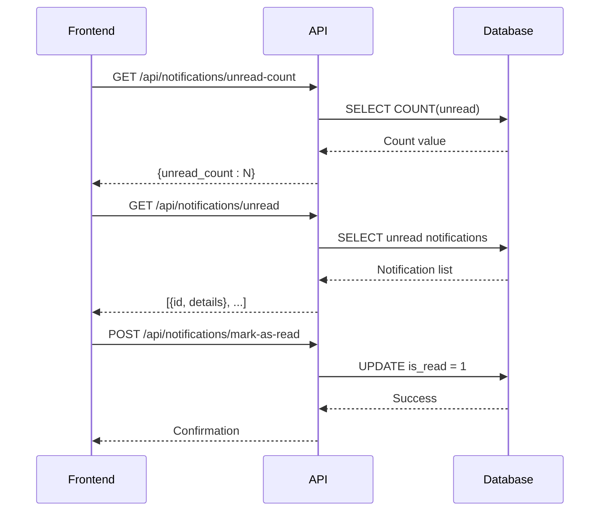
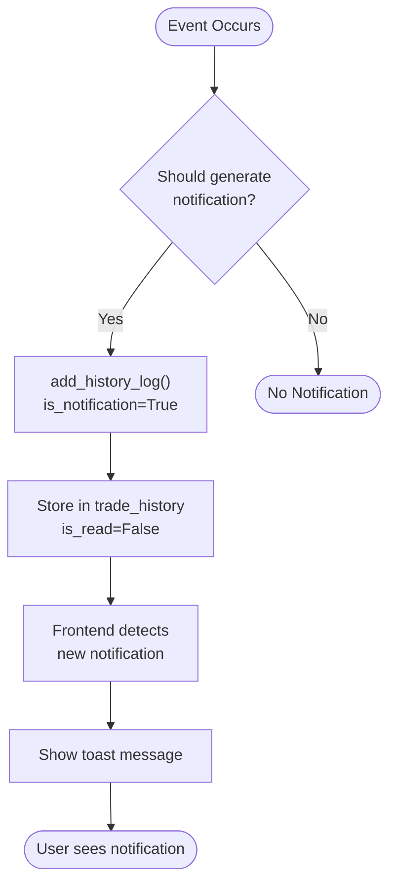
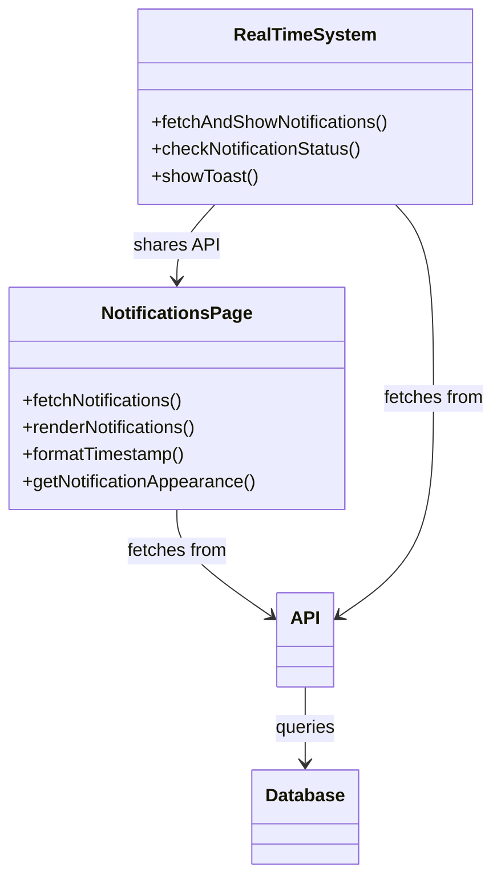
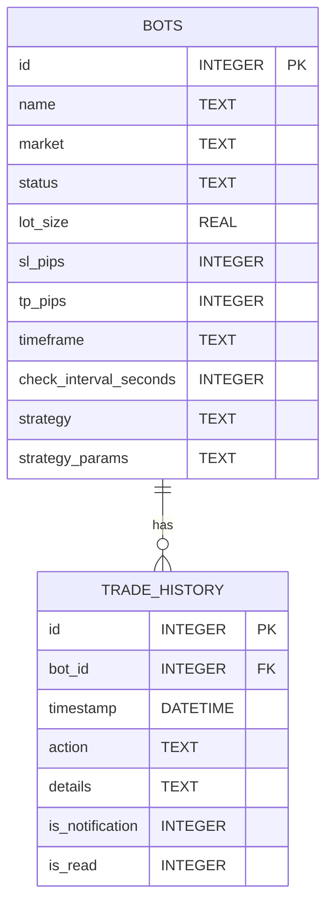

# Notifications API

<cite>
**Referenced Files in This Document**   
- [api_notifications.py](file://core/routes/api_notifications.py)
- [queries.py](file://core/db/queries.py)
- [init_db.py](file://init_db.py)
- [notifications.js](file://static/js/notifications.js)
- [main.js](file://static/js/main.js)
- [notifications.html](file://templates/notifications.html)
</cite>

## Table of Contents
1. [Introduction](#introduction)
2. [API Endpoints](#api-endpoints)
3. [Response Schema](#response-schema)
4. [Query Parameters](#query-parameters)
5. [Authentication and User Context](#authentication-and-user-context)
6. [Notification Generation](#notification-generation)
7. [Error Handling](#error-handling)
8. [Client-Side Implementation](#client-side-implementation)
9. [Sample Usage](#sample-usage)
10. [Database Schema](#database-schema)

## Introduction

The Notifications API in quantumbotx provides a RESTful interface for managing user notifications generated by trading bots, system events, and trade executions. The API enables users to retrieve their notification history, mark notifications as read, and check unread counts. Notifications are displayed in the web interface through both toast messages and a dedicated notifications page.

The system is built on a Flask backend with SQLite storage, where notifications are stored as special entries in the trade history table. The frontend uses JavaScript to fetch notifications and update their read status in real time.

**Section sources**
- [api_notifications.py](file://core/routes/api_notifications.py#L1-L52)
- [notifications.html](file://templates/notifications.html#L1-L16)

## API Endpoints

The Notifications API provides three main endpoints for retrieving and managing notifications:

### GET /api/notifications
Retrieves all notifications for the current user. When this endpoint is accessed, all notifications are automatically marked as read. This endpoint is used when the user visits the notifications page.

### GET /api/notifications/unread-count
Returns the count of unread notifications. This endpoint is used to update the notification badge in the UI.

### GET /api/notifications/unread
Retrieves only unread notifications, typically used for displaying toast notifications.

### PUT /api/notifications/mark-as-read
Marks specific notifications as read by their IDs. This endpoint accepts a POST request with a JSON body containing an array of notification IDs.



**Diagram sources**
- [api_notifications.py](file://core/routes/api_notifications.py#L1-L52)
- [queries.py](file://core/db/queries.py#L104-L163)

**Section sources**
- [api_notifications.py](file://core/routes/api_notifications.py#L1-L52)

## Response Schema

### Notification List Response
When retrieving notifications, the API returns an array of notification objects with the following properties:

- **id**: Unique identifier for the notification
- **action**: Type of action that triggered the notification
- **details**: Detailed message about the notification
- **is_read**: Boolean indicating whether the notification has been read
- **timestamp**: ISO 8601 timestamp of when the notification was created
- **bot_name**: Name of the bot that generated the notification

Example response:
```json
[
  {
    "id": 123,
    "action": "BUY_EXECUTED",
    "details": "Bought 0.1 lots of EUR/USD at 1.0850",
    "is_read": false,
    "timestamp": "2023-12-07T14:30:45.123456",
    "bot_name": "EUR/USD Momentum Bot"
  },
  {
    "id": 122,
    "action": "BOT_STARTED",
    "details": "Trading bot started successfully",
    "is_read": true,
    "timestamp": "2023-12-07T14:25:30.123456",
    "bot_name": "Gold Trend Follower"
  }
]
```

### Unread Count Response
The unread count endpoint returns a simple object with the count of unread notifications:

```json
{
  "unread_count": 3
}
```

### Mark as Read Response
The mark-as-read endpoint returns a confirmation message:

```json
{
  "message": "3 notifications marked as read."
}
```

**Section sources**
- [api_notifications.py](file://core/routes/api_notifications.py#L1-L52)
- [queries.py](file://core/db/queries.py#L104-L163)

## Query Parameters

The current implementation does not support query parameters for pagination or filtering. All notifications are returned in a single response, ordered by timestamp in descending order (newest first).

Future enhancements could include:
- **page**: Page number for pagination
- **limit**: Number of notifications per page
- **read_status**: Filter by read status (read, unread, all)
- **type**: Filter by notification type (info, warning, error)
- **bot_id**: Filter by specific bot ID

The database schema supports filtering by these criteria, but the API endpoints currently return all notifications without filtering options.

**Section sources**
- [api_notifications.py](file://core/routes/api_notifications.py#L1-L52)

## Authentication and User Context

The Notifications API relies on session-based authentication to identify the current user. All notification operations are performed in the context of the authenticated user's session.

When a user logs in, their session is established, and all subsequent API calls automatically operate within that user's context. The API does not require explicit user identification in requests, as the user context is derived from the session.

The notification system is designed to be multi-user, with each user having their own set of notifications based on the bots they own or manage. The database queries automatically filter notifications by the current user's bots through the bot_id foreign key relationship.

**Section sources**
- [api_notifications.py](file://core/routes/api_notifications.py#L1-L52)
- [queries.py](file://core/db/queries.py#L104-L163)

## Notification Generation

Notifications are generated from various events within the trading system, including bot operations, trade executions, and system alerts. The system uses the `add_history_log` function to create notification entries in the database.

### Event Types
Notifications are triggered by the following types of events:

- **Bot Operations**: Bot start, stop, configuration changes
- **Trade Executions**: Buy/sell orders executed, position closures
- **System Alerts**: Errors, warnings, system status changes
- **Strategy Events**: Strategy-specific events like signal generation

### Creation Process
When an event occurs that should generate a notification, the system calls `add_history_log` with `is_notification=True`:

```python
add_history_log(bot_id, action, details, is_notification=True)
```

This creates a record in the trade_history table with `is_notification=1` and `is_read=0`, making it visible as a new notification.



**Diagram sources**
- [queries.py](file://core/db/queries.py#L79-L89)
- [main.js](file://static/js/main.js#L37-L94)

**Section sources**
- [queries.py](file://core/db/queries.py#L79-L89)
- [main.js](file://static/js/main.js#L37-L94)

## Error Handling

The Notifications API implements comprehensive error handling to ensure reliability and provide meaningful feedback to clients.

### Server-Side Error Handling
Each API endpoint is wrapped in a try-catch block that handles exceptions and returns appropriate HTTP status codes:

- **500 Internal Server Error**: For database errors or unhandled exceptions
- **400 Bad Request**: For invalid request data (e.g., missing IDs in mark-as-read)
- **401 Unauthorized**: For unauthenticated requests (implied by session system)
- **404 Not Found**: If the endpoint is not available

Database operations include specific error handling for SQLite exceptions, with errors logged for debugging purposes.

### Client-Side Error Handling
The frontend JavaScript includes error handling for all API calls:

- Failed notification fetches display an error message in the UI
- Failed mark-as-read operations are logged to the console
- Network errors are handled gracefully without breaking the user experience

The system is designed to be resilient, allowing the application to continue functioning even if the notification system experiences temporary issues.

**Section sources**
- [api_notifications.py](file://core/routes/api_notifications.py#L1-L52)
- [notifications.js](file://static/js/notifications.js#L25-L62)
- [main.js](file://static/js/main.js#L56-L94)

## Client-Side Implementation

The client-side notification system consists of two main components: the notifications page and real-time toast notifications.

### Notifications Page
The notifications page (`notifications.html`) displays all notifications in a list format. The `notifications.js` file handles:

- Fetching all notifications from `/api/notifications`
- Rendering notifications with appropriate icons and colors based on action type
- Formatting timestamps for display
- Automatically marking all notifications as read when the page loads

### Real-Time Toasts
The `main.js` file implements a real-time notification system that:

- Checks for unread notifications every 10 seconds
- Displays new notifications as toast messages
- Updates the notification badge count
- Automatically marks toast notifications as read when displayed

The system uses different visual indicators based on notification type:
- **Buy**: Green arrow up icon
- **Sell**: Red arrow down icon
- **Start**: Blue play circle icon
- **Stop**: Yellow pause circle icon
- **Error**: Red exclamation triangle icon
- **Other**: Gray info circle icon



**Diagram sources**
- [notifications.js](file://static/js/notifications.js#L1-L62)
- [main.js](file://static/js/main.js#L1-L95)
- [api_notifications.py](file://core/routes/api_notifications.py#L1-L52)

**Section sources**
- [notifications.js](file://static/js/notifications.js#L1-L62)
- [main.js](file://static/js/main.js#L1-L95)
- [notifications.html](file://templates/notifications.html#L1-L16)

## Sample Usage

### Fetching All Notifications
```bash
curl -X GET "http://localhost:5000/api/notifications" \
  -H "Content-Type: application/json"
```

### Fetching Unread Count
```bash
curl -X GET "http://localhost:5000/api/notifications/unread-count" \
  -H "Content-Type: application/json"
```

### Fetching Unread Notifications
```bash
curl -X GET "http://localhost:5000/api/notifications/unread" \
  -H "Content-Type: application/json"
```

### Marking Notifications as Read
```bash
curl -X POST "http://localhost:5000/api/notifications/mark-as-read" \
  -H "Content-Type: application/json" \
  -d '{"ids": [123, 124, 125]}'
```

### Expected Responses
**Successful notification fetch:**
```json
[
  {
    "id": 123,
    "action": "BUY_EXECUTED",
    "details": "Bought 0.1 lots of EUR/USD at 1.0850",
    "is_read": false,
    "timestamp": "2023-12-07T14:30:45.123456",
    "bot_name": "EUR/USD Momentum Bot"
  }
]
```

**Unread count response:**
```json
{
  "unread_count": 1
}
```

**Mark as read response:**
```json
{
  "message": "3 notifications marked as read."
}
```

**Error response:**
```json
{
  "error": "Failed to fetch notifications: database error"
}
```

**Section sources**
- [api_notifications.py](file://core/routes/api_notifications.py#L1-L52)
- [queries.py](file://core/db/queries.py#L104-L163)

## Database Schema

Notifications are stored in the `trade_history` table, which serves as a unified log for bot activities and notifications. The table structure is defined in `init_db.py`:

```sql
CREATE TABLE IF NOT EXISTS trade_history (
    id INTEGER PRIMARY KEY AUTOINCREMENT,
    bot_id INTEGER NOT NULL,
    timestamp DATETIME DEFAULT CURRENT_TIMESTAMP,
    action TEXT NOT NULL,
    details TEXT,
    is_notification INTEGER NOT NULL DEFAULT 0,
    is_read INTEGER NOT NULL DEFAULT 0,
    FOREIGN KEY (bot_id) REFERENCES bots (id) ON DELETE CASCADE
);
```

### Key Fields
- **id**: Primary key, unique identifier
- **bot_id**: Foreign key linking to the bots table
- **timestamp**: When the event occurred
- **action**: Category of the event (e.g., "BUY_EXECUTED")
- **details**: Human-readable description
- **is_notification**: Flag indicating if this should appear as a notification
- **is_read**: Flag indicating if the user has seen the notification

The schema uses integer values (0/1) for boolean flags, which is standard for SQLite. The `is_notification` flag determines whether an activity log entry appears in the notifications interface, while `is_read` tracks user interaction with the notification.



**Diagram sources**
- [init_db.py](file://init_db.py#L49-L78)
- [queries.py](file://core/db/queries.py#L79-L89)

**Section sources**
- [init_db.py](file://init_db.py#L49-L78)
- [queries.py](file://core/db/queries.py#L79-L89)