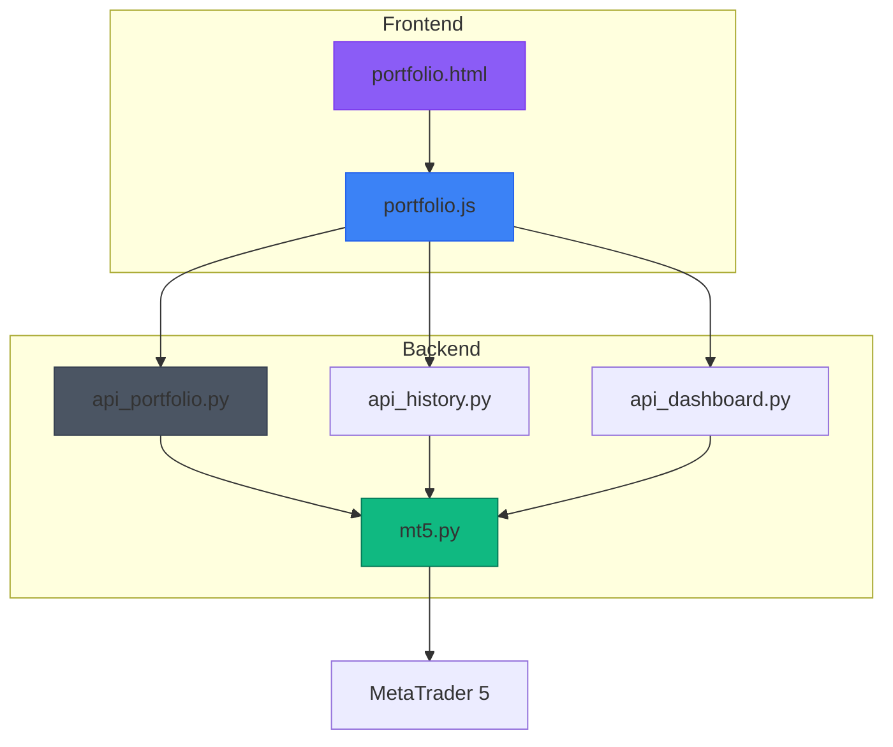
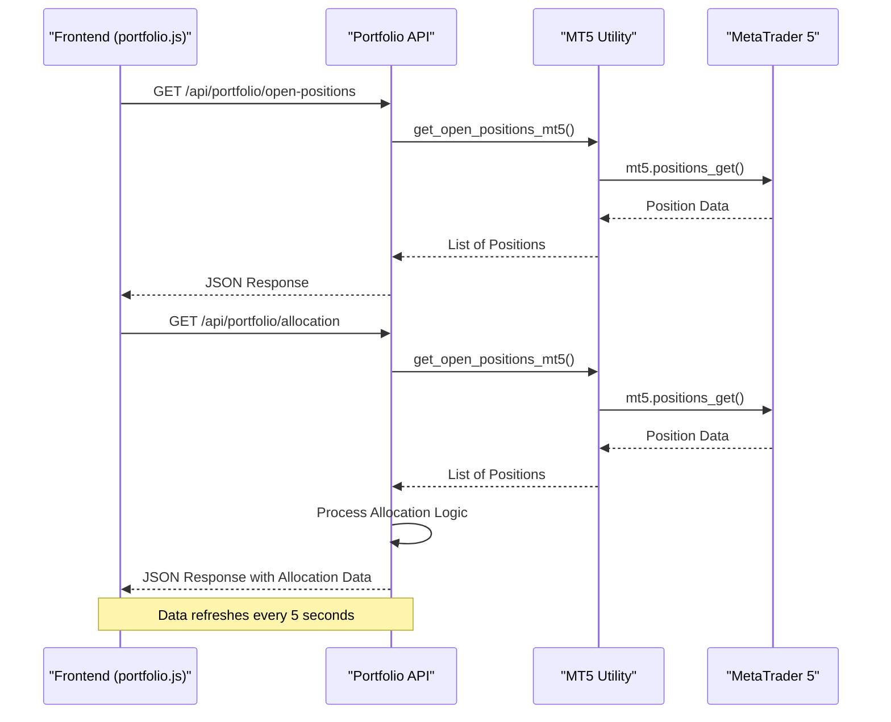
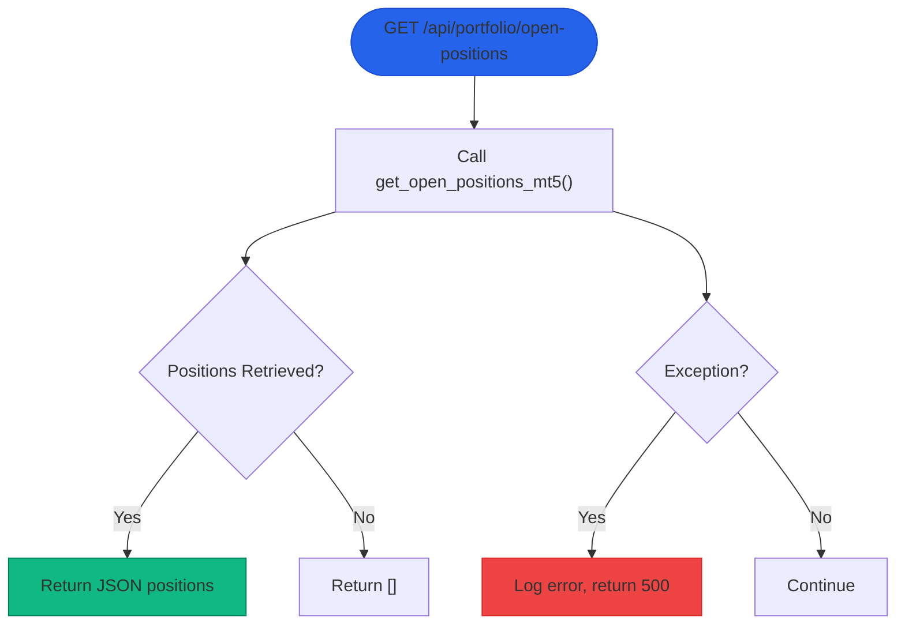
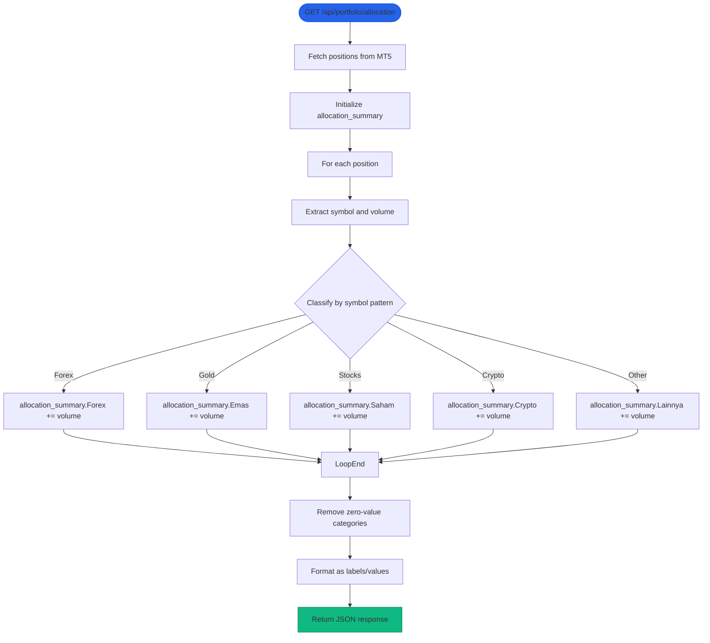
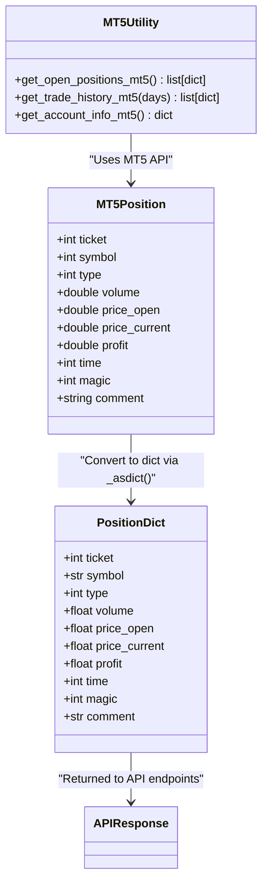
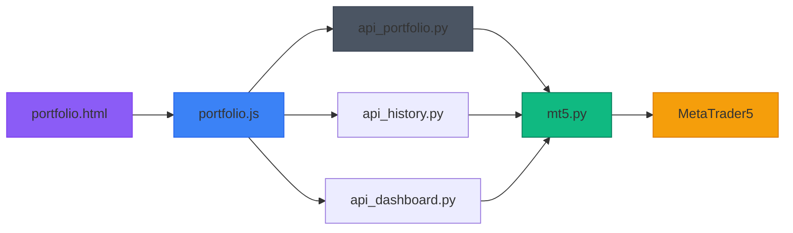

# Portfolio API

<cite>
**Referenced Files in This Document**   
- [api_portfolio.py](file://core/routes/api_portfolio.py)
- [mt5.py](file://core/utils/mt5.py)
- [portfolio.js](file://static/js/portfolio.js)
- [portfolio.html](file://templates/portfolio.html)
- [api_history.py](file://core/routes/api_history.py)
- [api_dashboard.py](file://core/routes/api_dashboard.py)
</cite>

## Table of Contents
1. [Introduction](#introduction)
2. [Project Structure](#project-structure)
3. [Core Components](#core-components)
4. [Architecture Overview](#architecture-overview)
5. [Detailed Component Analysis](#detailed-component-analysis)
6. [Dependency Analysis](#dependency-analysis)
7. [Performance Considerations](#performance-considerations)
8. [Troubleshooting Guide](#troubleshooting-guide)
9. [Conclusion](#conclusion)

## Introduction
This document provides comprehensive RESTful API documentation for the Portfolio API in the quantumbotx system. The Portfolio API enables real-time access to trading positions, asset allocation data, and performance metrics synchronized with MetaTrader 5 (MT5). It supports frontend visualization of open positions, profit/loss trends, and asset distribution. The API is designed for integration with dashboard components and trading analytics tools, providing critical data for portfolio monitoring and decision-making.

## Project Structure
The quantumbotx project follows a modular Flask-based architecture with clear separation of concerns. The Portfolio API resides within the `core/routes` directory as a Flask Blueprint, while data retrieval logic is encapsulated in utility modules. Frontend components are organized in static and template directories, enabling a clean separation between backend services and user interface.



**Diagram sources**
- [api_portfolio.py](file://core/routes/api_portfolio.py)
- [mt5.py](file://core/utils/mt5.py)
- [portfolio.js](file://static/js/portfolio.js)
- [portfolio.html](file://templates/portfolio.html)

**Section sources**
- [api_portfolio.py](file://core/routes/api_portfolio.py)
- [mt5.py](file://core/utils/mt5.py)

## Core Components
The Portfolio API consists of two primary endpoints: `/open-positions` and `/allocation`. These endpoints retrieve real-time trading data from MT5 through utility functions and format it for frontend consumption. The system integrates with MT5's position and deal history APIs to provide comprehensive portfolio visibility. The frontend components use JavaScript to periodically fetch this data and update visualizations including tables, line charts, and doughnut charts.

**Section sources**
- [api_portfolio.py](file://core/routes/api_portfolio.py#L1-L57)
- [mt5.py](file://core/utils/mt5.py#L55-L65)
- [portfolio.js](file://static/js/portfolio.js#L0-L150)

## Architecture Overview
The Portfolio API operates as a middleware layer between the MT5 trading platform and the web frontend. It follows a request-response pattern where HTTP GET requests trigger data retrieval from MT5, processing, and JSON response generation. The architecture emphasizes real-time data synchronization with automatic error handling for connection failures.



**Diagram sources**
- [api_portfolio.py](file://core/routes/api_portfolio.py)
- [mt5.py](file://core/utils/mt5.py)
- [portfolio.js](file://static/js/portfolio.js)

## Detailed Component Analysis

### Portfolio API Endpoints
The Portfolio API provides two endpoints for retrieving portfolio data. The `/open-positions` endpoint returns raw position data from MT5, while the `/allocation` endpoint processes this data to provide asset distribution metrics.

#### Open Positions Endpoint


**Diagram sources**
- [api_portfolio.py](file://core/routes/api_portfolio.py#L10-L18)

#### Asset Allocation Endpoint


**Diagram sources**
- [api_portfolio.py](file://core/routes/api_portfolio.py#L20-L57)

### Data Retrieval from MT5
The `get_open_positions_mt5()` function in the MT5 utility module serves as the primary interface to the MetaTrader 5 platform. It handles the conversion of MT5's native position objects into JSON-serializable dictionaries.



**Diagram sources**
- [mt5.py](file://core/utils/mt5.py#L55-L65)

## Dependency Analysis
The Portfolio API has a clear dependency chain that starts from the frontend and terminates at the MT5 platform. Understanding these dependencies is crucial for troubleshooting and system maintenance.



**Diagram sources**
- [portfolio.html](file://templates/portfolio.html)
- [portfolio.js](file://static/js/portfolio.js)
- [api_portfolio.py](file://core/routes/api_portfolio.py)
- [mt5.py](file://core/utils/mt5.py)
- [api_history.py](file://core/routes/api_history.py)
- [api_dashboard.py](file://core/routes/api_dashboard.py)

**Section sources**
- [api_portfolio.py](file://core/routes/api_portfolio.py)
- [mt5.py](file://core/utils/mt5.py)
- [portfolio.js](file://static/js/portfolio.js)

## Performance Considerations
The Portfolio API is designed for real-time data delivery with a 5-second refresh interval. This balance between data freshness and system load is critical for maintaining responsiveness without overwhelming the MT5 connection. The implementation includes error handling to prevent cascading failures during MT5 connectivity issues. Caching is not implemented at the API level, meaning each request triggers a fresh MT5 data pull, which ensures data accuracy but increases MT5 load under high request volumes.

## Troubleshooting Guide
This section addresses common issues encountered with the Portfolio API and provides resolution steps.

### Connection Timeouts to MT5
**Symptoms**: 
- API returns 500 error with message
- Frontend displays "Failed to load data" message
- Console shows "Error saat get_open_positions_mt5" in logs

**Causes**:
- MT5 terminal not running
- Incorrect account credentials
- Network connectivity issues
- MT5 server overload

**Solutions**:
1. Verify MT5 terminal is running and logged in
2. Check account credentials in configuration
3. Restart MT5 terminal and application
4. Verify network connectivity to MT5 server
5. Check MT5 logs for specific error codes

### Stale or Missing Positions
**Symptoms**:
- Portfolio shows outdated positions
- Closed positions still appear in UI
- Position count mismatch with MT5

**Causes**:
- Synchronization delay
- MT5 data refresh rate
- API polling interval limitations

**Solutions**:
1. Force refresh by restarting the application
2. Manually refresh MT5 market data
3. Verify MT5 connection status
4. Check if positions are truly closed in MT5

### Error Handling Implementation
The API implements comprehensive error handling to maintain stability during MT5 connectivity issues:

```python
try:
    positions = get_open_positions_mt5()
    return jsonify(positions)
except Exception as e:
    return jsonify({"error": str(e)}), 500
```

The frontend also includes error handling for failed API requests:

```javascript
catch (error) {
    console.error("Gagal mengambil data portfolio:", error);
    portfolioTableBody.innerHTML = `<tr><td colspan="6" class="p-4 text-center text-red-500">Gagal memuat data: ${error.message}</td></tr>`;
}
```

**Section sources**
- [mt5.py](file://core/utils/mt5.py#L55-L65)
- [api_portfolio.py](file://core/routes/api_portfolio.py#L10-L18)
- [portfolio.js](file://static/js/portfolio.js#L85-L92)

## Conclusion
The Portfolio API in quantumbotx provides essential functionality for monitoring real-time trading positions and asset allocation. By integrating with MetaTrader 5, it delivers accurate, up-to-date portfolio information to the web interface. The system's architecture prioritizes reliability and real-time performance, with comprehensive error handling for MT5 connectivity issues. Future enhancements could include caching mechanisms, WebSocket-based real-time updates, and more sophisticated performance analytics. The current implementation effectively serves the core requirements of position tracking and portfolio visualization.