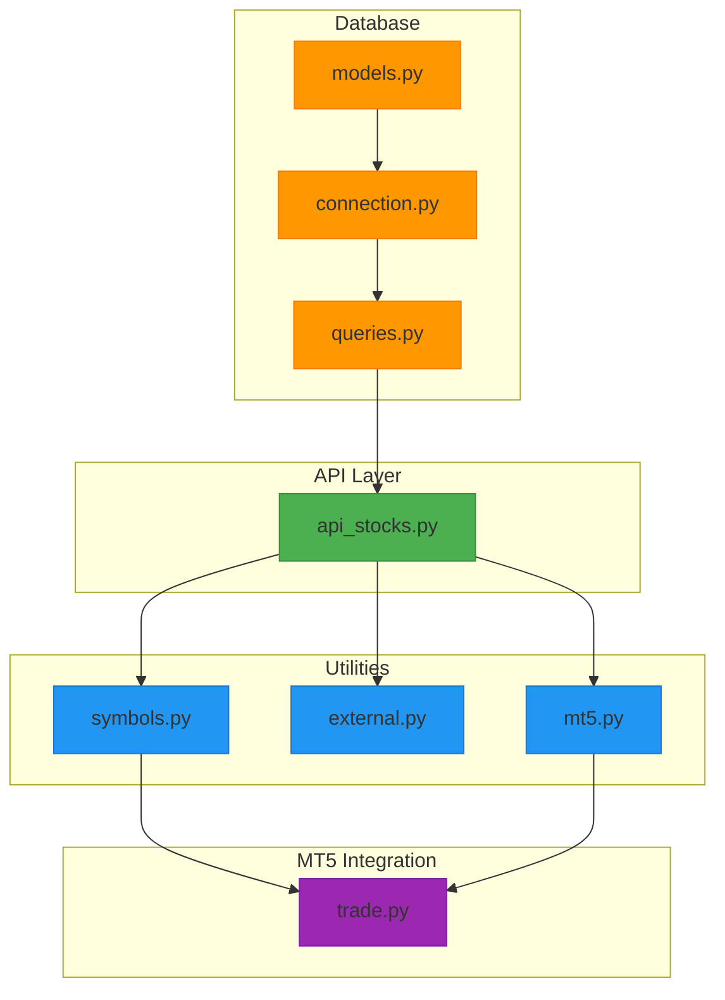
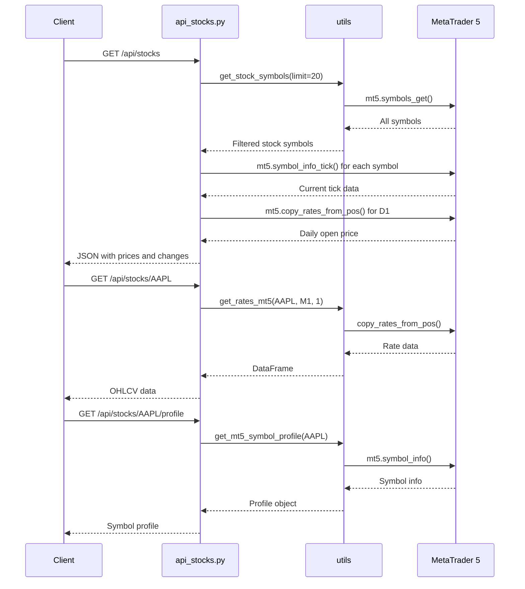
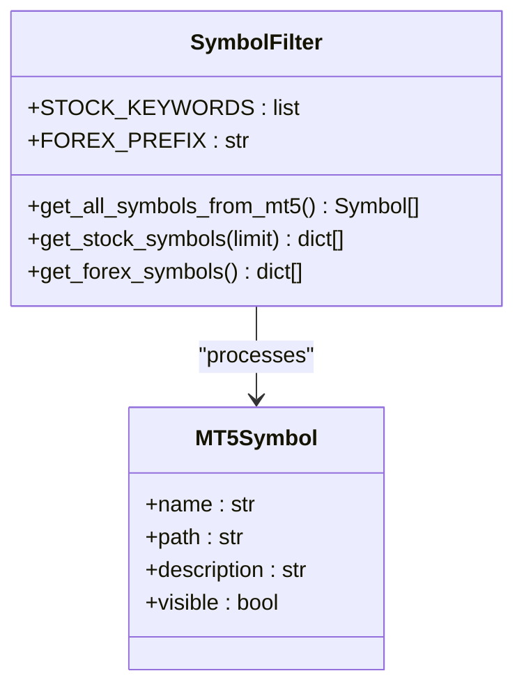
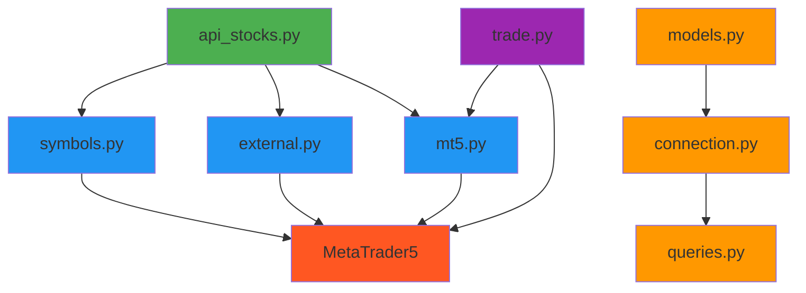

# Stocks API

<cite>
**Referenced Files in This Document**   
- [api_stocks.py](file://core/routes/api_stocks.py)
- [symbols.py](file://core/utils/symbols.py)
- [external.py](file://core/utils/external.py)
- [mt5.py](file://core/utils/mt5.py)
- [models.py](file://core/db/models.py)
- [connection.py](file://core/db/connection.py)
- [queries.py](file://core/db/queries.py)
- [trade.py](file://core/mt5/trade.py)
</cite>

## Table of Contents
1. [Introduction](#introduction)
2. [Project Structure](#project-structure)
3. [Core Components](#core-components)
4. [Architecture Overview](#architecture-overview)
5. [Detailed Component Analysis](#detailed-component-analysis)
6. [Dependency Analysis](#dependency-analysis)
7. [Performance Considerations](#performance-considerations)
8. [Troubleshooting Guide](#troubleshooting-guide)
9. [Conclusion](#conclusion)

## Introduction
The Stocks API in quantumbotx provides RESTful endpoints for retrieving real-time and historical stock market data via integration with MetaTrader 5 (MT5). This document details the available endpoints, response schemas, query parameters, data integration mechanisms, error handling, and usage examples. The API supports retrieval of stock symbols, current pricing, and detailed historical data, with filtering capabilities and caching considerations. All data is sourced directly from MT5 in real time, with no persistent storage of stock data in the local database.

## Project Structure
The quantumbotx project follows a modular structure with clear separation of concerns. The Stocks API resides in the `core/routes` directory, while supporting utilities for symbol handling, MT5 interaction, and database operations are organized in dedicated submodules. Key directories include:
- `core/routes/`: Contains Flask blueprints for API endpoints
- `core/utils/`: Houses utility functions for MT5, symbols, and external services
- `core/db/`: Manages SQLite database interactions for bot and trade logging
- `core/mt5/`: Implements trading logic and order execution via MT5
- `static/js/`: Frontend JavaScript for consuming API data
- `templates/`: HTML templates for UI rendering



**Diagram sources**
- [api_stocks.py](file://core/routes/api_stocks.py#L1-L98)
- [symbols.py](file://core/utils/symbols.py#L1-L86)
- [mt5.py](file://core/utils/mt5.py#L1-L145)
- [models.py](file://core/db/models.py#L1-L21)
- [trade.py](file://core/mt5/trade.py#L1-L153)

**Section sources**
- [api_stocks.py](file://core/routes/api_stocks.py#L1-L98)
- [core/utils](file://core/utils#L1-L1)
- [core/db](file://core/db#L1-L1)

## Core Components
The Stocks API is built around several core components that handle symbol discovery, data retrieval, and MT5 integration. The primary entry point is `api_stocks.py`, which defines the REST endpoints. It relies on utility modules to interact with MT5 for real-time pricing and symbol metadata. Stock symbol filtering is performed using path-based keyword matching in `symbols.py`, while `mt5.py` provides a wrapper for MT5 data retrieval functions. The system does not persist stock data locally; all responses are generated from live MT5 queries.

**Section sources**
- [api_stocks.py](file://core/routes/api_stocks.py#L1-L98)
- [symbols.py](file://core/utils/symbols.py#L1-L86)
- [mt5.py](file://core/utils/mt5.py#L1-L145)

## Architecture Overview
The Stocks API follows a service-oriented architecture where HTTP requests are routed to Flask endpoints that orchestrate data retrieval from MT5. There is no intermediate caching layer; all data is fetched in real time. The architecture emphasizes direct integration with MT5 for both market data and trading operations, with the web API serving as a thin translation layer between HTTP and MT5 protocols.



**Diagram sources**
- [api_stocks.py](file://core/routes/api_stocks.py#L1-L98)
- [symbols.py](file://core/utils/symbols.py#L1-L86)
- [mt5.py](file://core/utils/mt5.py#L1-L145)
- [external.py](file://core/utils/external.py#L1-L73)

## Detailed Component Analysis

### Stocks API Endpoints
The Stocks API provides three main endpoints for retrieving stock data, all implemented in `api_stocks.py`. These endpoints retrieve data directly from MT5 without local caching.

#### GET /api/stocks
Retrieves current pricing data for the top 20 most actively traded stocks.

```mermaid
flowchart TD
Start([GET /api/stocks]) --> GetSymbols["get_stock_symbols(limit=20)"]
GetSymbols --> CheckEmpty{"Symbols empty?"}
CheckEmpty --> |Yes| ReturnEmpty[Return []]
CheckEmpty --> |No| LoopStart[For each symbol]
LoopStart --> GetTick["mt5.symbol_info_tick(symbol)"]
GetTick --> CheckTick{"Tick valid?"}
CheckTick --> |No| Skip[Skip symbol]
CheckTick --> |Yes| GetDaily["mt5.copy_rates_from_pos(D1, 0, 1)"]
GetDaily --> CheckDaily{"Daily data exists?"}
CheckDaily --> |No| Skip
CheckDaily --> |Yes| Calculate["change = ask - daily_open"]
Calculate --> Append[Append to result]
Append --> LoopEnd{All symbols processed?}
LoopEnd --> |No| LoopStart
LoopEnd --> |Yes| ReturnJSON["Return jsonify(result)"]
```

**Diagram sources**
- [api_stocks.py](file://core/routes/api_stocks.py#L15-L65)

#### GET /api/stocks/{symbol}
Retrieves the most recent minute-bar OHLCV data for a specific stock.

```mermaid
flowchart TD
Start([GET /api/stocks/{symbol}]) --> GetRates["get_rates_mt5(symbol, M1, 1)"]
GetRates --> CheckData{"Data valid?"}
CheckData --> |No| ReturnError["Return 404"]
CheckData --> |Yes| Extract["df.iloc[-1]"]
Extract --> Format["Format as JSON"]
Format --> Return["Return jsonify()"]
```

**Diagram sources**
- [api_stocks.py](file://core/routes/api_stocks.py#L67-L80)
- [mt5.py](file://core/utils/mt5.py#L25-L45)

#### GET /api/stocks/{symbol}/profile
Retrieves detailed metadata about a stock symbol from MT5.

```mermaid
flowchart TD
Start([GET /api/stocks/{symbol}/profile]) --> GetProfile["get_mt5_symbol_profile(symbol)"]
GetProfile --> CheckProfile{"Profile exists?"}
CheckProfile --> |No| Return404["Return 404"]
CheckProfile --> |Yes| ReturnJSON["Return jsonify(profile)"]
```

**Diagram sources**
- [api_stocks.py](file://core/routes/api_stocks.py#L10-L13)
- [external.py](file://core/utils/external.py#L50-L72)

### Symbol Filtering Mechanism
The system identifies stock symbols by analyzing the `path` property of MT5 symbols using keyword matching.



**Diagram sources**
- [symbols.py](file://core/utils/symbols.py#L1-L86)

## Dependency Analysis
The Stocks API has a clear dependency hierarchy with minimal circular references. The API routes depend on utility modules, which in turn depend on the MT5 SDK. Database modules are used for bot operations but not for stock data persistence.



**Diagram sources**
- [api_stocks.py](file://core/routes/api_stocks.py#L1-L98)
- [symbols.py](file://core/utils/symbols.py#L1-L86)
- [external.py](file://core/utils/external.py#L1-L73)
- [mt5.py](file://core/utils/mt5.py#L1-L145)
- [models.py](file://core/db/models.py#L1-L21)
- [trade.py](file://core/mt5/trade.py#L1-L153)

## Performance Considerations
The Stocks API retrieves data in real time from MT5 with no caching mechanism, which means each request incurs network latency to the MT5 terminal. The `/api/stocks` endpoint processes up to 20 symbols sequentially, which can lead to increased response times during market hours. There is no rate limiting or request queuing implemented at the API level. For high-frequency use cases, clients should implement their own caching strategy.

## Troubleshooting Guide
Common issues with the Stocks API typically relate to MT5 connectivity, symbol availability, or configuration errors.

**Section sources**
- [api_stocks.py](file://core/routes/api_stocks.py#L1-L98)
- [symbols.py](file://core/utils/symbols.py#L1-L86)
- [external.py](file://core/utils/external.py#L1-L73)
- [mt5.py](file://core/utils/mt5.py#L1-L145)

### Error: "Could not fetch symbol profile from MT5"
This occurs when the requested symbol does not exist in MT5 or the MT5 connection is inactive. Verify:
- MT5 terminal is running and connected
- Symbol is visible in Market Watch
- Correct symbol spelling is used

### Error: Empty response from /api/stocks
This indicates no stock symbols were found. Check:
- `STOCK_KEYWORDS` in `symbols.py` match your broker's symbol path conventions
- Stock symbols are present in MT5 with paths containing keywords like "stock", "share", or "equity"
- MT5 connection is established

### Error: "Cannot connect to MT5"
Ensure:
- MT5 terminal is running
- No firewall is blocking the connection
- The correct account credentials are configured in the application

## Conclusion
The Stocks API in quantumbotx provides a straightforward interface for accessing stock market data through MetaTrader 5. It offers three main endpoints for retrieving symbol lists, current prices, and historical data, with all information sourced directly from MT5 in real time. The system does not cache stock data locally, ensuring freshness but potentially impacting performance under heavy load. Integration is achieved through well-defined utility modules that abstract MT5 interactions. For production use, implementing response caching and error retry mechanisms would enhance reliability and performance.