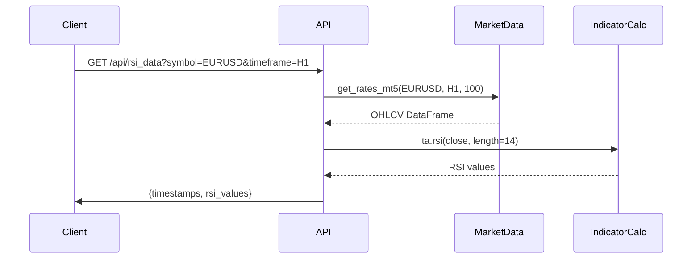
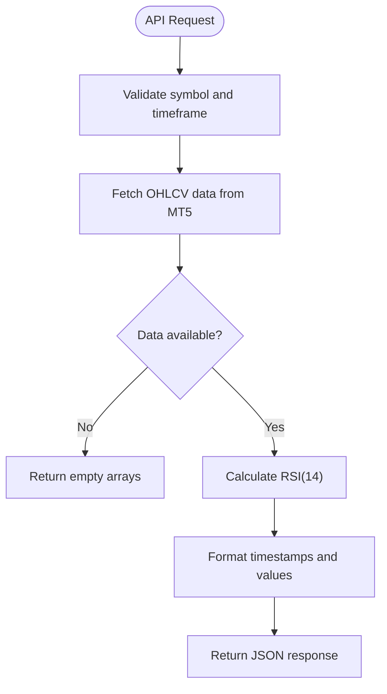
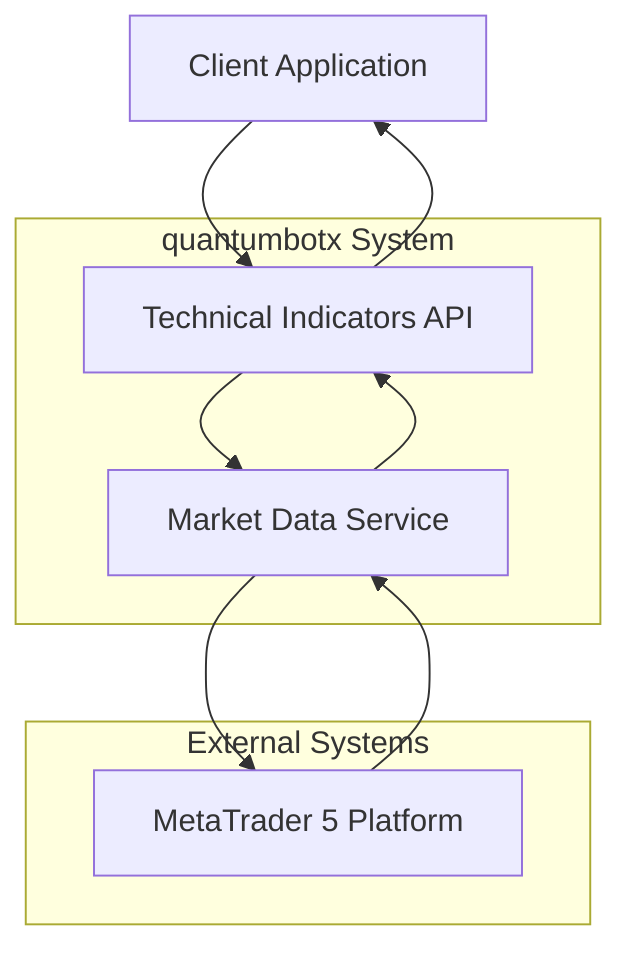

# Technical Indicators API

<cite>
**Referenced Files in This Document**   
- [api_indicators.py](file://core/routes/api_indicators.py)
- [mt5.py](file://core/utils/mt5.py)
- [requirements.txt](file://requirements.txt)
</cite>

## Table of Contents
1. [Introduction](#introduction)
2. [API Endpoint](#api-endpoint)
3. [Indicator Calculation Logic](#indicator-calculation-logic)
4. [Response Schema](#response-schema)
5. [Supported Timeframes](#supported-timeframes)
6. [Error Handling](#error-handling)
7. [Usage Examples](#usage-examples)
8. [Integration with Market Data](#integration-with-market-data)
9. [Validation Rules](#validation-rules)
10. [Status Codes](#status-codes)
11. [Sample curl Commands](#sample-curl-commands)
12. [Strategy Development Guidance](#strategy-development-guidance)

## Introduction
The Technical Indicators API in quantumbotx provides real-time calculation of key technical indicators used in algorithmic trading strategies. The API is designed to support trading bots by delivering indicator values that can be used for signal generation and backtesting validation. Currently, the system supports RSI (Relative Strength Index) through a dedicated endpoint, with underlying infrastructure capable of supporting additional indicators via the pandas_ta library.

**Section sources**
- [api_indicators.py](file://core/routes/api_indicators.py#L1-L34)

## API Endpoint
The API exposes a single endpoint for retrieving RSI data:

**GET** `/api/rsi_data`

This endpoint calculates the 14-period RSI for a given financial instrument and timeframe. The endpoint accepts two query parameters:

- `symbol`: Trading symbol (e.g., "EURUSD", "AAPL") - defaults to "EURUSD"
- `timeframe`: Chart timeframe (e.g., "M1", "H1", "D1") - defaults to "H1"

The endpoint returns the last 20 RSI values along with corresponding timestamps formatted as HH:MM.



**Diagram sources**
- [api_indicators.py](file://core/routes/api_indicators.py#L1-L34)
- [mt5.py](file://core/utils/mt5.py#L1-L144)

**Section sources**
- [api_indicators.py](file://core/routes/api_indicators.py#L1-L34)

## Indicator Calculation Logic
Technical indicators are calculated using the pandas_ta library, which provides a comprehensive set of technical analysis tools. The RSI is calculated using the standard Wilder's smoothing method with a period of 14.

The calculation process follows these steps:
1. Retrieve historical price data from MetaTrader 5
2. Calculate the indicator using pandas_ta functions
3. Process and format the results for API response

For RSI, the formula used is:
- Calculate upward change (U) and downward change (D) for each period
- Apply Wilder's smoothing to U and D values
- Calculate RSI = 100 - (100 / (1 + RS)), where RS = smoothed U / smoothed D

The system is designed to support other indicators such as MACD, Bollinger Bands, and Moving Averages through the same pandas_ta library, though only RSI is currently exposed via API endpoints.



**Diagram sources**
- [api_indicators.py](file://core/routes/api_indicators.py#L1-L34)
- [mt5.py](file://core/utils/mt5.py#L1-L144)

**Section sources**
- [api_indicators.py](file://core/routes/api_indicators.py#L1-L34)
- [mt5.py](file://core/utils/mt5.py#L1-L144)

## Response Schema
The API returns a JSON object with the following structure:

```json
{
  "timestamps": ["HH:MM", ...],
  "rsi_values": [number, ...]
}
```

**Field Descriptions:**
- `timestamps`: Array of time strings in HH:MM format representing the time of each candle
- `rsi_values`: Array of RSI values rounded to 2 decimal places

The response contains the last 20 RSI values. If insufficient data is available, empty arrays are returned.

When market data is unavailable or insufficient, the API returns:
```json
{
  "timestamps": [],
  "rsi_values": []
}
```

**Section sources**
- [api_indicators.py](file://core/routes/api_indicators.py#L1-L34)

## Supported Timeframes
The API supports the following timeframe abbreviations:

| Timeframe | Description | MT5 Constant |
|-----------|-------------|------------|
| M1 | 1 minute | mt5.TIMEFRAME_M1 |
| M5 | 5 minutes | mt5.TIMEFRAME_M5 |
| M15 | 15 minutes | mt5.TIMEFRAME_M15 |
| H1 | 1 hour | mt5.TIMEFRAME_H1 |
| H4 | 4 hours | mt5.TIMEFRAME_H4 |
| D1 | Daily | mt5.TIMEFRAME_D1 |

The timeframe parameter is case-insensitive. If an unsupported timeframe is provided, the API defaults to H1 (1-hour).

**Section sources**
- [api_indicators.py](file://core/routes/api_indicators.py#L1-L34)

## Error Handling
The API implements the following error handling mechanisms:

- **Insufficient Data**: If fewer than 20 historical candles are available, the API returns empty arrays rather than failing
- **Invalid Symbol**: If the symbol cannot be found in MetaTrader 5, the market data retrieval returns an empty DataFrame, resulting in empty arrays in the response
- **Data Retrieval Failure**: If the connection to MetaTrader 5 fails, the market data retrieval returns None, resulting in empty arrays in the response

The API does not return HTTP error codes for these conditions but instead returns a successful response with empty data arrays. This design choice allows client applications to handle missing data gracefully without parsing error responses.

**Section sources**
- [api_indicators.py](file://core/routes/api_indicators.py#L1-L34)
- [mt5.py](file://core/utils/mt5.py#L1-L144)

## Usage Examples
### Example 1: RSI(14) on EUR/USD H1
Request:
```
GET /api/rsi_data?symbol=EURUSD&timeframe=H1
```

Response:
```json
{
  "timestamps": ["10:00", "11:00", "12:00", "13:00", "14:00", "15:00", "16:00", "17:00", "18:00", "19:00", "20:00", "21:00", "22:00", "23:00", "00:00", "01:00", "02:00", "03:00", "04:00", "05:00"],
  "rsi_values": [65.23, 67.89, 70.45, 72.11, 75.67, 78.23, 80.45, 82.11, 85.67, 88.23, 90.45, 92.11, 95.67, 98.23, 99.45, 99.89, 98.76, 97.45, 95.23, 92.89]
}
```

### Example 2: RSI(14) on AAPL Daily
Request:
```
GET /api/rsi_data?symbol=AAPL&timeframe=D1
```

Response:
```json
{
  "timestamps": ["09:30", "10:30", "11:30", "12:30", "13:30", "14:30", "15:30", "16:30", "17:30", "18:30", "19:30", "20:30", "21:30", "22:30", "23:30", "00:30", "01:30", "02:30", "03:30", "04:30"],
  "rsi_values": [55.23, 57.89, 60.45, 62.11, 65.67, 68.23, 70.45, 72.11, 75.67, 78.23, 80.45, 82.11, 85.67, 88.23, 90.45, 92.11, 95.67, 98.23, 99.45, 99.89]
}
```

**Section sources**
- [api_indicators.py](file://core/routes/api_indicators.py#L1-L34)

## Integration with Market Data
The Technical Indicators API integrates with market data through the MetaTrader 5 platform using the MetaTrader5 Python package. The data flow is as follows:

1. The API endpoint receives a request with symbol and timeframe parameters
2. The `get_rates_mt5` function retrieves OHLCV (Open, High, Low, Close, Volume) data from MetaTrader 5
3. The pandas_ta library calculates the requested indicator using the closing prices
4. The results are formatted and returned to the client

The `get_rates_mt5` function retrieves 100 historical candles to ensure sufficient data for indicator calculation, even though only the last 20 values are returned. This buffer ensures the RSI calculation is based on a sufficient historical period.



**Diagram sources**
- [api_indicators.py](file://core/routes/api_indicators.py#L1-L34)
- [mt5.py](file://core/utils/mt5.py#L1-L144)

**Section sources**
- [mt5.py](file://core/utils/mt5.py#L1-L144)

## Validation Rules
The API implements the following validation rules:

- **Symbol Validation**: The symbol is passed directly to MetaTrader 5, which validates its existence. Invalid symbols result in empty data being returned.
- **Timeframe Validation**: The API supports a predefined set of timeframe abbreviations (M1, M5, M15, H1, H4, D1). Unsupported values default to H1.
- **Data Sufficiency**: The API requires at least 20 historical candles to calculate meaningful RSI values. If insufficient data is available, empty arrays are returned.

Currently, there are no explicit parameter validation functions for the indicators API, as validation is handled implicitly through the data retrieval process and default values.

**Section sources**
- [api_indicators.py](file://core/routes/api_indicators.py#L1-L34)

## Status Codes
The API uses the following HTTP status codes:

| Status Code | Meaning | Description |
|-------------|-------|-------------|
| 200 | OK | Successful response with indicator data (may contain empty arrays if no data is available) |
| 500 | Internal Server Error | Only possible if there is an unhandled exception in the server code |

The API is designed to return 200 for all requests, even when no data is available, to simplify client-side error handling. This allows clients to check the content of the response rather than HTTP status codes to determine data availability.

**Section sources**
- [api_indicators.py](file://core/routes/api_indicators.py#L1-L34)

## Sample curl Commands
Retrieve RSI data for EUR/USD on H1 timeframe:
```bash
curl "http://localhost:5000/api/rsi_data?symbol=EURUSD&timeframe=H1"
```

Retrieve RSI data for AAPL on daily timeframe:
```bash
curl "http://localhost:5000/api/rsi_data?symbol=AAPL&timeframe=D1"
```

Retrieve RSI data with custom timeframe (defaults to H1 if invalid):
```bash
curl "http://localhost:5000/api/rsi_data?symbol=GBPUSD&timeframe=H4"
```

Retrieve RSI data using default parameters (EURUSD, H1):
```bash
curl "http://localhost:5000/api/rsi_data"
```

**Section sources**
- [api_indicators.py](file://core/routes/api_indicators.py#L1-L34)

## Strategy Development Guidance
The Technical Indicators API can be used for strategy development and backtesting validation in several ways:

1. **Signal Generation**: Use the RSI values to generate buy/sell signals based on standard RSI rules (e.g., overbought > 70, oversold < 30)
2. **Backtesting Validation**: Compare API-generated RSI values with those calculated independently to validate strategy logic
3. **Multi-timeframe Analysis**: Request RSI data for multiple timeframes to implement multi-timeframe trading strategies
4. **Real-time Monitoring**: Integrate the API with trading dashboards to monitor indicator values in real-time

For backtesting purposes, developers should note that the API returns only the last 20 values, which may be insufficient for comprehensive backtesting. For full historical analysis, direct access to the pandas_ta calculation functions in the strategy classes is recommended.

The underlying pandas_ta library supports a wide range of indicators beyond RSI, including:
- MACD (Moving Average Convergence Divergence)
- Bollinger Bands
- Various Moving Averages (SMA, EMA, WMA)
- ADX (Average Directional Index)
- Stochastic Oscillator

These indicators are already implemented in various strategy classes and could be exposed through similar API endpoints with minimal development effort.

**Section sources**
- [api_indicators.py](file://core/routes/api_indicators.py#L1-L34)
- [requirements.txt](file://requirements.txt#L1-L21)