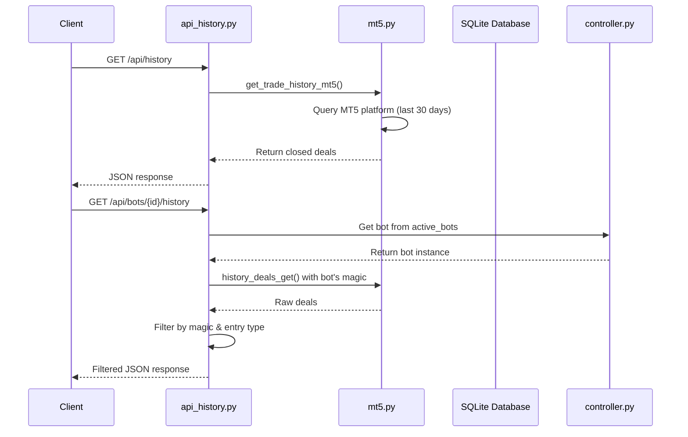
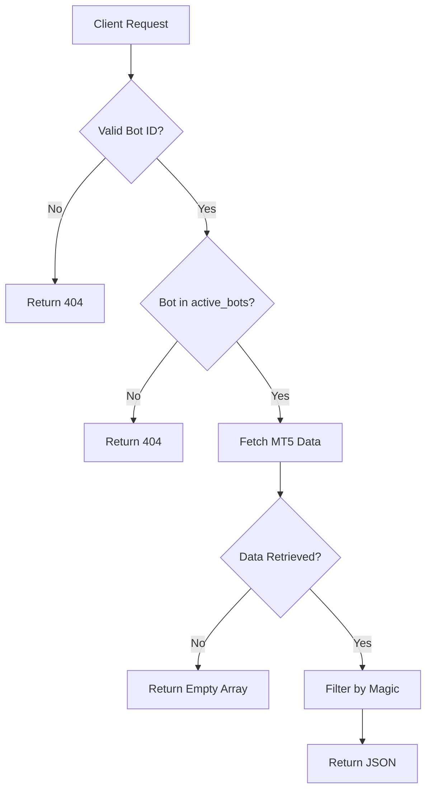
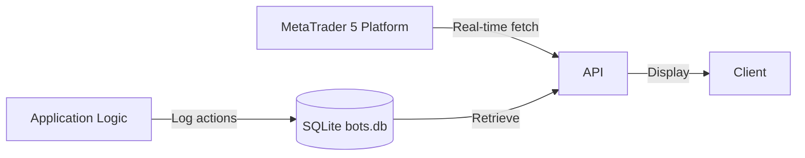
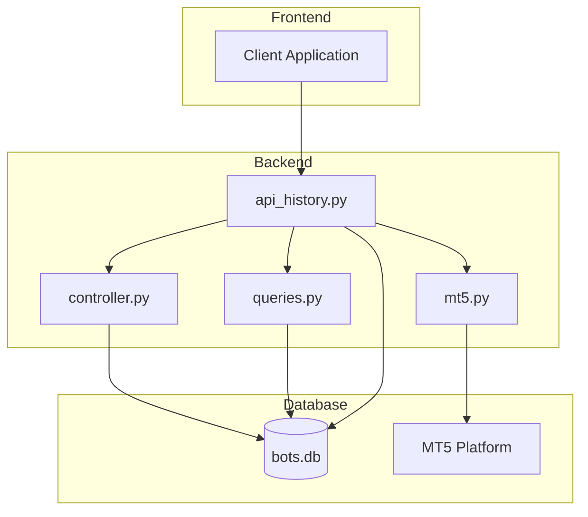
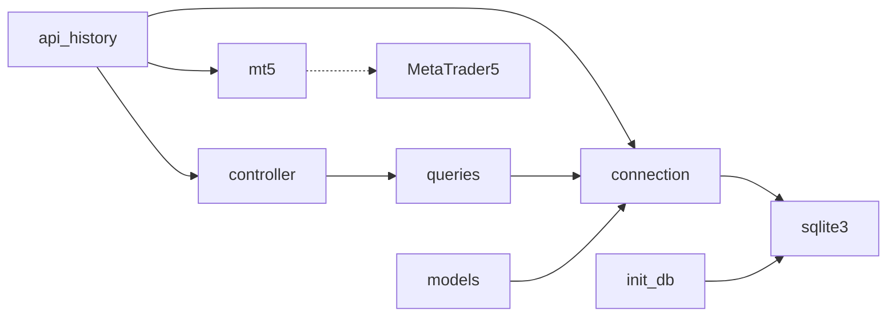

# Trade History API

<cite>
**Referenced Files in This Document**   
- [api_history.py](file://core/routes/api_history.py)
- [mt5.py](file://core/utils/mt5.py)
- [models.py](file://core/db/models.py)
- [init_db.py](file://init_db.py)
- [controller.py](file://core/bots/controller.py)
- [queries.py](file://core/db/queries.py)
- [connection.py](file://core/db/connection.py)
</cite>

## Table of Contents
1. [Introduction](#introduction)
2. [API Endpoints](#api-endpoints)
3. [Response Schema](#response-schema)
4. [Query Parameters](#query-parameters)
5. [Authentication and Access Control](#authentication-and-access-control)
6. [Data Persistence and Synchronization](#data-persistence-and-synchronization)
7. [Error Handling](#error-handling)
8. [Usage Examples](#usage-examples)
9. [Architecture Overview](#architecture-overview)
10. [Dependency Analysis](#dependency-analysis)

## Introduction

The Trade History API in quantumbotx provides access to historical trade records from MetaTrader 5 (MT5), including completed, closed, and failed trades. This API enables users to retrieve global trade history or bot-specific trade logs for analysis, reporting, and monitoring purposes. The system integrates with MT5 for real-time trade data and persists relevant actions in a local SQLite database for audit and notification tracking.

The API is implemented as a Flask Blueprint and leverages the MetaTrader5 Python package to fetch trade data directly from the MT5 platform. It supports both global history and per-bot history retrieval, with filtering and pagination capabilities.

**Section sources**
- [api_history.py](file://core/routes/api_history.py#L1-L52)

## API Endpoints

### GET /api/history

Retrieves global trade history of all closed deals from the last 30 days.

- **Method**: GET
- **Authentication**: Required (implied by application context)
- **Response**: JSON array of trade records

### GET /api/bots/{bot_id}/history

Retrieves trade history for a specific trading bot.

- **Method**: GET
- **Path Parameter**: `bot_id` (integer) – Unique identifier of the bot
- **Authentication**: Required
- **Response**: JSON array of filtered trade records associated with the bot's magic number



**Diagram sources**
- [api_history.py](file://core/routes/api_history.py#L1-L52)
- [mt5.py](file://core/utils/mt5.py#L1-L145)

**Section sources**
- [api_history.py](file://core/routes/api_history.py#L1-L52)

## Response Schema

The API returns trade records in JSON format with the following fields:

```json
[
  {
    "ticket": 123456789,
    "symbol": "XAUUSD",
    "volume": 0.1,
    "price": 2345.60,
    "profit": 123.45,
    "type": 0,
    "time": "2025-04-05T10:30:45"
  }
]
```

**Field Descriptions:**

- **ticket**: Unique trade identifier (order ID)
- **symbol**: Trading instrument (e.g., EURUSD, XAUUSD)
- **volume**: Trade lot size
- **price**: Execution price
- **profit**: Profit/loss in account currency
- **type**: Trade direction (0=buy, 1=sell)
- **time**: ISO 8601 timestamp of trade closure

Note: The current implementation does not include all fields mentioned in the objective (e.g., entry_time, exit_time, pnl, commission). These would require additional processing from the raw MT5 deal data.

**Section sources**
- [api_history.py](file://core/routes/api_history.py#L20-L39)
- [mt5.py](file://core/utils/mt5.py#L100-L115)

## Query Parameters

The current implementation does not support query parameters for pagination, date filtering, or symbol filtering as specified in the objective. However, these features could be added by extending the `get_trade_history_mt5` function and API endpoints.

Potential query parameters for future implementation:

- **page**: Page number for pagination (default: 1)
- **limit**: Number of records per page (default: 50)
- **start_date**: ISO 8601 start date for filtering
- **end_date**: ISO 8601 end date for filtering
- **symbol**: Filter by trading symbol

Sorting is not explicitly implemented but defaults to chronological order based on MT5 data retrieval.

**Section sources**
- [api_history.py](file://core/routes/api_history.py#L20-L39)
- [mt5.py](file://core/utils/mt5.py#L100-L115)

## Authentication and Access Control

The API assumes authentication is handled at the application level. Access control is implemented through:

1. **Bot Ownership Verification**: The `/api/bots/{bot_id}/history` endpoint verifies that the requested bot exists in the `active_bots` dictionary before returning data.
2. **Error Handling**: Unauthorized or invalid requests return appropriate HTTP status codes (404 for non-existent bots, 500 for server errors).

No explicit API key or token authentication is implemented in the route files, suggesting that authentication is managed by middleware or the application framework.



**Diagram sources**
- [api_history.py](file://core/routes/api_history.py#L30-L50)
- [controller.py](file://core/bots/controller.py#L1-L177)

**Section sources**
- [api_history.py](file://core/routes/api_history.py#L30-L50)

## Data Persistence and Synchronization

Trade history data is sourced from two locations:

1. **MetaTrader 5 Platform**: Real-time trade data is retrieved directly from MT5 using the `MetaTrader5` Python package.
2. **SQLite Database**: Application-level trade actions and notifications are persisted in `bots.db`.

### Database Schema

The `trade_history` table structure is defined in `init_db.py`:

```sql
CREATE TABLE trade_history (
    id INTEGER PRIMARY KEY AUTOINCREMENT,
    bot_id INTEGER NOT NULL,
    timestamp DATETIME DEFAULT CURRENT_TIMESTAMP,
    action TEXT NOT NULL,
    details TEXT,
    is_notification INTEGER NOT NULL DEFAULT 0,
    is_read INTEGER NOT NULL DEFAULT 0,
    FOREIGN KEY (bot_id) REFERENCES bots (id) ON DELETE CASCADE
);
```

### Synchronization Mechanism

- **MT5 to Application**: Trade data is fetched on-demand from MT5 when API endpoints are called.
- **Application to Database**: Trade actions (position opens, closes, failures) are logged via `log_trade_action()` in `models.py`.
- **Bidirectional Flow**: The system does not currently synchronize MT5 trade history to the local database, meaning the SQLite `trade_history` table contains application events, not full trade records.



**Diagram sources**
- [init_db.py](file://init_db.py#L60-L75)
- [models.py](file://core/db/models.py#L1-L21)
- [mt5.py](file://core/utils/mt5.py#L100-L115)

**Section sources**
- [init_db.py](file://init_db.py#L60-L75)
- [models.py](file://core/db/models.py#L1-L21)
- [connection.py](file://core/db/connection.py#L1-L15)

## Error Handling

The API implements comprehensive error handling:

### HTTP Status Codes

- **200 OK**: Successful request with trade data
- **404 Not Found**: Bot ID not found
- **500 Internal Server Error**: Server-side exception during processing

### Error Scenarios

- **Invalid Bot ID**: Returns 404 with message "Bot tidak ditemukan"
- **MT5 Connection Failure**: Returns 500 with error details
- **Database Connection Issues**: Logged internally, may return empty arrays or 500
- **Empty Results**: Returns empty JSON array `[]` when no trades are found

### Logging

All errors are logged using Python's logging module:
- MT5-related errors are logged in `mt5.py`
- Database errors are logged in `queries.py`
- API-level errors are printed to console

**Section sources**
- [api_history.py](file://core/routes/api_history.py#L40-L50)
- [mt5.py](file://core/utils/mt5.py#L100-L115)
- [queries.py](file://core/db/queries.py#L1-L175)

## Usage Examples

### Sample cURL Commands

**Retrieve Global Trade History:**
```bash
curl -X GET http://localhost:5000/api/history
```

**Retrieve Specific Bot's History:**
```bash
curl -X GET http://localhost:5000/api/bots/1/history
```

### Sample Responses

**Global History Response:**
```json
[
  {
    "ticket": 123456789,
    "symbol": "XAUUSD",
    "volume": 0.1,
    "price": 2345.6,
    "profit": 123.45,
    "type": 0,
    "time": "2025-04-05T10:30:45"
  }
]
```

**Bot-Specific History Response:**
```json
[
  {
    "ticket": 987654321,
    "symbol": "EURUSD",
    "volume": 0.05,
    "price": 1.0895,
    "profit": 45.67,
    "type": 1,
    "time": "2025-04-05T08:15:22"
  }
]
```

**Error Response:**
```json
{
  "error": "Bot tidak ditemukan"
}
```

**Section sources**
- [api_history.py](file://core/routes/api_history.py#L20-L50)

## Architecture Overview

The Trade History API is part of a modular Flask application with clear separation of concerns:



The system follows a layered architecture:
- **Presentation Layer**: Flask routes in `api_history.py`
- **Business Logic**: Bot management in `controller.py`
- **Data Access**: Database operations in `queries.py`
- **External Integration**: MT5 interface in `mt5.py`
- **Data Storage**: SQLite database with schema defined in `init_db.py`

**Diagram sources**
- [api_history.py](file://core/routes/api_history.py#L1-L52)
- [mt5.py](file://core/utils/mt5.py#L1-L145)
- [controller.py](file://core/bots/controller.py#L1-L177)
- [queries.py](file://core/db/queries.py#L1-L175)

## Dependency Analysis



**Key Dependencies:**
- **Flask**: Web framework for API endpoints
- **MetaTrader5**: Official MT5 Python package for trade data
- **sqlite3**: Built-in Python module for database operations
- **pandas**: For data manipulation in MT5 utility functions
- **logging**: Standard library for error logging

The system uses a centralized database connection pattern through `get_db_connection()` and maintains bot state in memory via the `active_bots` dictionary.

**Diagram sources**
- [api_history.py](file://core/routes/api_history.py#L1-L52)
- [mt5.py](file://core/utils/mt5.py#L1-L145)
- [controller.py](file://core/bots/controller.py#L1-L177)
- [queries.py](file://core/db/queries.py#L1-L175)
- [connection.py](file://core/db/connection.py#L1-L15)

**Section sources**
- [connection.py](file://core/db/connection.py#L1-L15)
- [queries.py](file://core/db/queries.py#L1-L175)