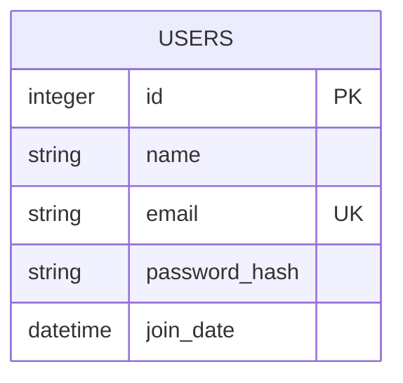
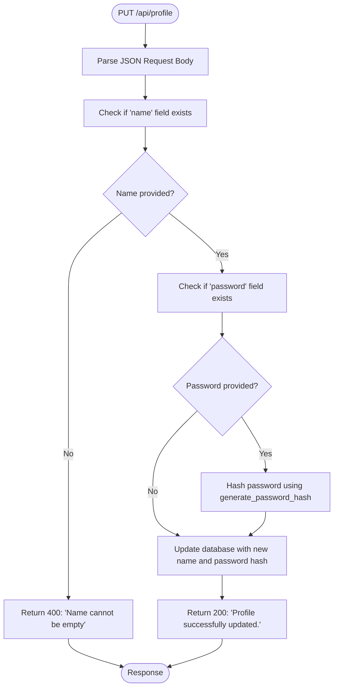
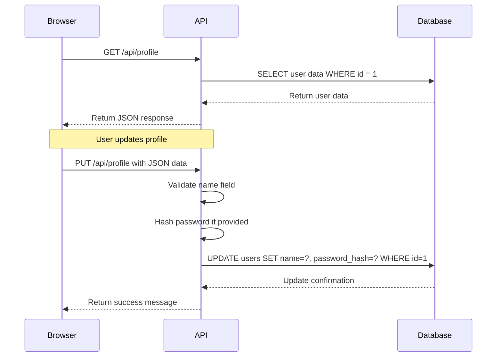

# User Profile API

<cite>
**Referenced Files in This Document**   
- [api_profile.py](file://core/routes/api_profile.py#L1-L39)
- [init_db.py](file://init_db.py#L49-L55)
- [validation.py](file://core/utils/validation.py#L1-L20)
- [profile.js](file://static/js/profile.js#L1-L60)
- [profile.html](file://templates/profile.html#L1-L28)
</cite>

## Table of Contents
1. [User Profile API Overview](#user-profile-api-overview)
2. [API Endpoints](#api-endpoints)
3. [Profile Data Schema](#profile-data-schema)
4. [Authentication and Security](#authentication-and-security)
5. [Input Validation Rules](#input-validation-rules)
6. [Error Responses](#error-responses)
7. [Example Requests and Usage](#example-requests-and-usage)
8. [Client-Side Implementation](#client-side-implementation)
9. [Security Considerations](#security-considerations)

## User Profile API Overview

The User Profile API in quantumbotx provides endpoints for managing user profile information. Currently, the API supports retrieving and updating basic user details such as name and password. The implementation is centered around a single user ID (ID = 1), suggesting a single-user application model.

The API is implemented as a Flask Blueprint in the `api_profile.py` file and interacts directly with a SQLite database to persist user data. The user profile functionality is accessible via the `/api/profile` endpoint with support for HTTP GET and PUT methods.

This documentation details the available endpoints, request/response formats, data schema, validation rules, and usage examples for the User Profile API.

**Section sources**
- [api_profile.py](file://core/routes/api_profile.py#L1-L39)

## API Endpoints

### GET /api/profile
Retrieves the current user's profile information.

**Request**
- Method: GET
- URL: `/api/profile`
- Headers: None required
- Body: None

**Response**
- Status: 200 OK
- Content-Type: application/json
- Body: User profile data

```json
{
  "id": 1,
  "name": "Admin User",
  "email": "admin@quantumbotx.com",
  "join_date": "01 Jan 2023"
}
```

### PUT /api/profile
Updates the user's profile information.

**Request**
- Method: PUT
- URL: `/api/profile`
- Headers: `Content-Type: application/json`
- Body: JSON object with profile data to update

```json
{
  "name": "Updated Name",
  "password": "newpassword123"
}
```

**Response**
- Status: 200 OK
- Content-Type: application/json
- Body: Success message

```json
{
  "message": "Profile successfully updated."
}
```

**Section sources**
- [api_profile.py](file://core/routes/api_profile.py#L15-L39)

## Profile Data Schema

The user profile data structure is defined by the `users` table in the SQLite database. The schema includes both readable and writable fields.

### Database Schema
```sql
CREATE TABLE IF NOT EXISTS users (
    id INTEGER PRIMARY KEY AUTOINCREMENT,
    name TEXT NOT NULL,
    email TEXT NOT NULL UNIQUE,
    password_hash TEXT NOT NULL,
    join_date DATETIME DEFAULT CURRENT_TIMESTAMP
);
```

### Field Definitions

**Read-only Fields**
- **id**: Unique identifier for the user (integer, auto-incremented)
- **email**: User's email address (string, read-only)
- **join_date**: Date when the user account was created (string, formatted as "DD Mon YYYY")

**Writable Fields**
- **name**: Full name of the user (string, required)
- **password**: New password for the user (string, optional, write-only)

The API currently does not support updating the email address, which is treated as immutable. Password updates are handled securely by hashing the password before storage using `werkzeug.security.generate_password_hash`.



**Diagram sources**
- [init_db.py](file://init_db.py#L49-L55)

**Section sources**
- [init_db.py](file://init_db.py#L49-L55)
- [api_profile.py](file://core/routes/api_profile.py#L1-L39)

## Authentication and Security

The User Profile API currently does not implement explicit authentication mechanisms such as session tokens or API keys. The endpoints are accessible without authentication, which represents a significant security concern for a production application.

The API operates under an implicit assumption of a single-user system, as evidenced by the hardcoded user ID (1) in all database queries. This design choice eliminates the need for user identification but severely limits the application to single-user scenarios.

Password handling is implemented securely using the `werkzeug.security.generate_password_hash` function, which creates a secure hash of the password before storing it in the database. This prevents plaintext password storage and enhances security in case of database breaches.

The lack of authentication means that any client can access and modify the user profile, making the current implementation suitable only for development or trusted network environments.

**Section sources**
- [api_profile.py](file://core/routes/api_profile.py#L1-L39)

## Input Validation Rules

The User Profile API implements basic input validation to ensure data integrity.

### Required Fields
- **name**: Must be provided in PUT requests
- Validation: Returns 400 error if name is empty or not provided

### Data Type Validation
- **name**: Must be a string
- **password**: If provided, must be a string

### Business Rules
- Name cannot be empty
- Email cannot be modified through the API
- Password, if provided, is always hashed before storage

The validation is implemented directly in the `update_profile` function, checking for the presence of the name field in the request data. More comprehensive validation could be added to verify string length, format, and other constraints.



**Diagram sources**
- [api_profile.py](file://core/routes/api_profile.py#L25-L39)
- [validation.py](file://core/utils/validation.py#L1-L20)

**Section sources**
- [api_profile.py](file://core/routes/api_profile.py#L25-L39)
- [validation.py](file://core/utils/validation.py#L1-L20)

## Error Responses

The User Profile API returns standardized error responses with appropriate HTTP status codes.

### 400 Bad Request
Returned when the request contains invalid data.

**Example**
```json
{
  "error": "Name cannot be empty"
}
```

**Trigger Conditions**
- Missing 'name' field in PUT request
- Empty name value

### 404 Not Found
Returned when the requested user does not exist.

**Example**
```json
{
  "error": "User not found"
}
```

**Trigger Conditions**
- User with ID = 1 does not exist in the database

### 500 Internal Server Error
Returned when an unexpected error occurs on the server.

**Example**
```json
{
  "error": "Failed to update profile: database error"
}
```

**Trigger Conditions**
- Database connection failures
- SQL execution errors

### Success Response
**Status**: 200 OK
```json
{
  "message": "Profile successfully updated."
}
```

**Section sources**
- [api_profile.py](file://core/routes/api_profile.py#L1-L39)

## Example Requests and Usage

### Retrieve User Profile
```bash
curl -X GET http://localhost:5000/api/profile
```

**Response**
```json
{
  "id": 1,
  "name": "Admin User",
  "email": "admin@quantumbotx.com",
  "join_date": "01 Jan 2023"
}
```

### Update User Name Only
```bash
curl -X PUT http://localhost:5000/api/profile \
  -H "Content-Type: application/json" \
  -d '{"name": "Reynov Christian"}'
```

**Response**
```json
{
  "message": "Profile successfully updated."
}
```

### Update User Name and Password
```bash
curl -X PUT http://localhost:5000/api/profile \
  -H "Content-Type: application/json" \
  -d '{"name": "Reynov Christian", "password": "newsecurepassword123"}'
```

**Response**
```json
{
  "message": "Profile successfully updated."
}
```

### Error Response Example
```bash
curl -X PUT http://localhost:5000/api/profile \
  -H "Content-Type: application/json" \
  -d '{"password": "newpassword"}'
```

**Response**
```json
{
  "error": "Name cannot be empty"
}
```

**Section sources**
- [api_profile.py](file://core/routes/api_profile.py#L1-L39)

## Client-Side Implementation

The User Profile API is consumed by the frontend JavaScript code in `profile.js`, which handles the user interface interactions for profile management.

### JavaScript Implementation
```javascript
// Function to load profile data
const loadProfile = async () => {
    try {
        const response = await fetch('/api/profile');
        if (!response.ok) throw new Error('Failed to load profile data');
        const user = await response.json();
        
        // Populate form fields
        profileNameInput.value = user.name;
        profileEmailInput.value = user.email;
        displayName.textContent = user.name;
        joinDate.textContent = `Joined since: ${user.join_date}`;
    } catch (error) {
        console.error('Error:', error);
        alert('Cannot load profile.');
    }
};

// Function to save profile changes
const saveProfile = async (e) => {
    e.preventDefault();
    
    const name = profileNameInput.value;
    const password = profilePasswordInput.value;
    
    const dataToUpdate = { name };
    if (password) {
        dataToUpdate.password = password;
    }
    
    try {
        const response = await fetch('/api/profile', {
            method: 'PUT',
            headers: { 'Content-Type': 'application/json' },
            body: JSON.stringify(dataToUpdate),
        });
        const result = await response.json();
        if (!response.ok) throw new Error(result.error || 'Failed to update profile');
        alert(result.message);
        profilePasswordInput.value = '';
        loadProfile();
    } catch (error) {
        alert('Failed to update profile: ' + error.message);
    }
};
```

The client-side code implements a form submission handler that collects the user's name and optional password, then sends a PUT request to the API endpoint. Upon successful update, it clears the password field and reloads the profile data to reflect changes.



**Diagram sources**
- [api_profile.py](file://core/routes/api_profile.py#L1-L39)
- [profile.js](file://static/js/profile.js#L1-L60)

**Section sources**
- [profile.js](file://static/js/profile.js#L1-L60)
- [profile.html](file://templates/profile.html#L1-L28)

## Security Considerations

The current implementation of the User Profile API has several security implications that should be addressed in production environments.

### Current Security Measures
- **Password Hashing**: Passwords are hashed using `werkzeug.security.generate_password_hash` before storage, preventing plaintext password exposure.
- **Input Validation**: Basic validation ensures that the name field is not empty before updating the profile.
- **Read-only Email**: The email field is not modifiable through the API, preventing unauthorized email changes.

### Security Risks
- **No Authentication**: The API endpoints are accessible without any authentication, allowing any client to read and modify the user profile.
- **Single-user Assumption**: The hardcoded user ID (1) limits the application to single-user scenarios and prevents multi-user support.
- **No Rate Limiting**: There are no mechanisms to prevent brute force attacks or excessive requests to the profile endpoints.
- **No Input Sanitization**: Beyond checking for empty names, there is no validation of input length, format, or potential malicious content.

### Recommended Security Enhancements
1. **Implement Authentication**: Add session-based authentication or API key validation to protect the endpoints.
2. **Add Rate Limiting**: Implement rate limiting to prevent abuse of the API endpoints.
3. **Enhance Input Validation**: Validate input length, format, and sanitize content to prevent injection attacks.
4. **Implement CSRF Protection**: Add CSRF tokens to prevent cross-site request forgery attacks.
5. **Add HTTPS Enforcement**: Ensure all API communications occur over encrypted connections.
6. **Implement Proper Error Handling**: Avoid exposing internal error details to clients in production.

The current implementation is suitable for development and testing but requires significant security enhancements before deployment to production environments.

**Section sources**
- [api_profile.py](file://core/routes/api_profile.py#L1-L39)
- [profile.js](file://static/js/profile.js#L1-L60)