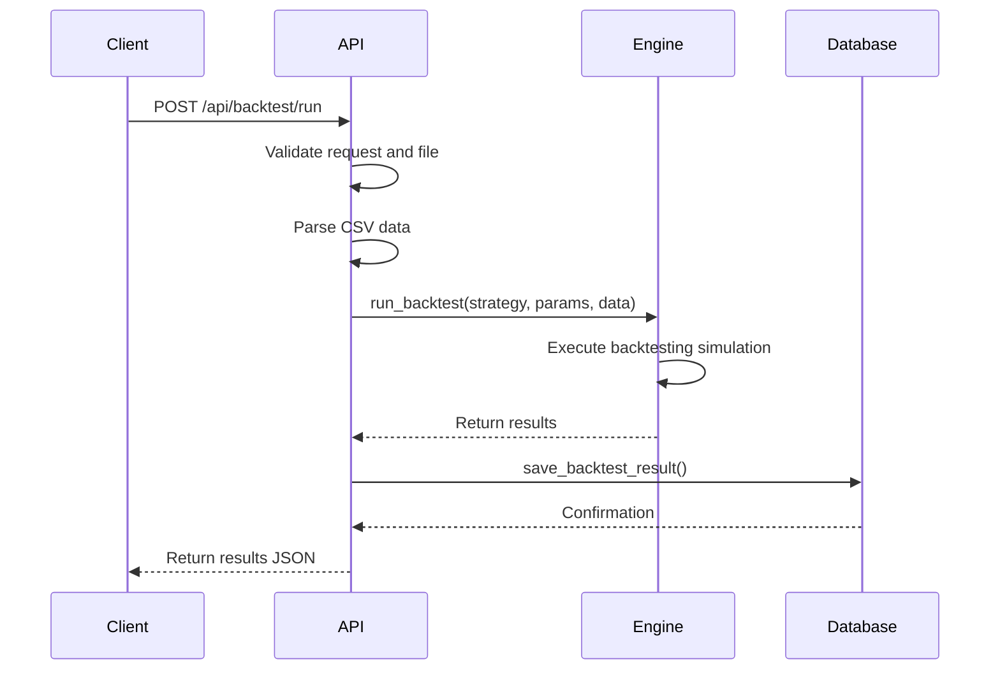
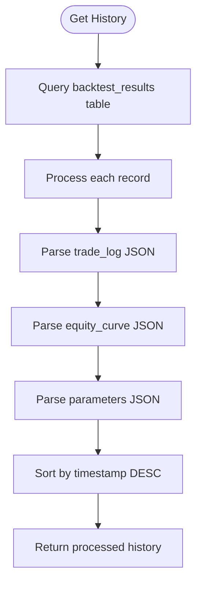
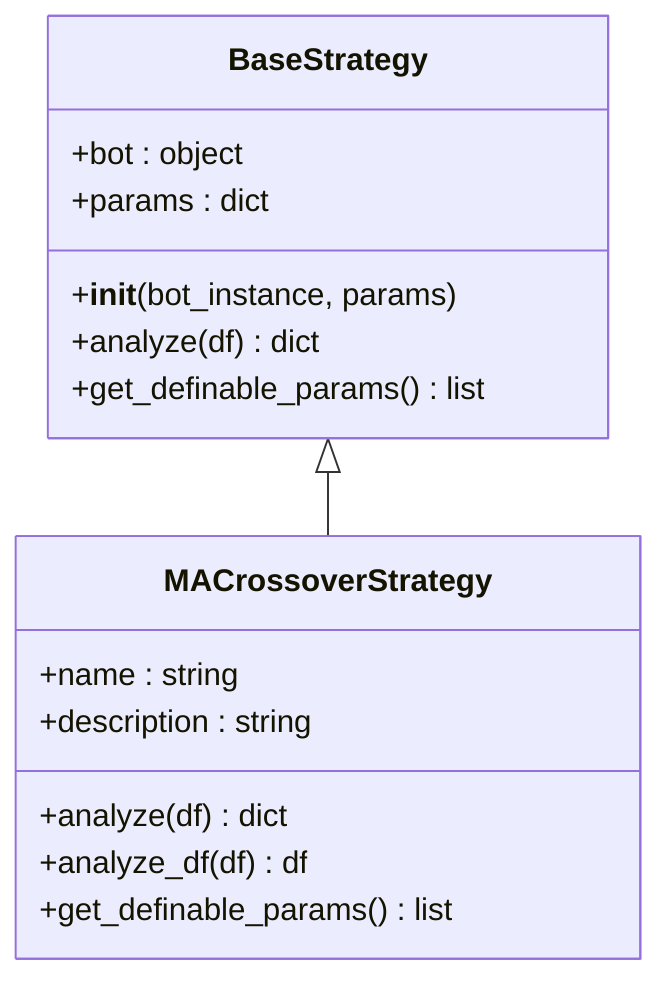
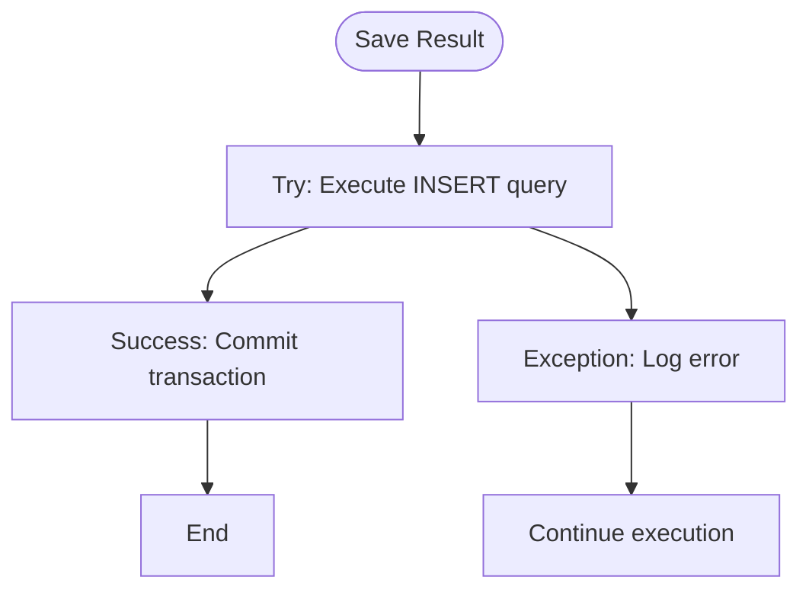

# Backtesting API

<cite>
**Referenced Files in This Document**   
- [api_backtest.py](file://core/routes/api_backtest.py#L0-L130)
- [engine.py](file://core/backtesting/engine.py#L0-L317)
- [strategy_map.py](file://core/strategies/strategy_map.py#L0-L27)
- [ma_crossover.py](file://core/strategies/ma_crossover.py#L0-L60)
- [base_strategy.py](file://core/strategies/base_strategy.py#L0-L28)
- [queries.py](file://core/db/queries.py#L0-L174)
</cite>

## Table of Contents
1. [Introduction](#introduction)
2. [Backtesting API Endpoints](#backtesting-api-endpoints)
3. [Request Parameters](#request-parameters)
4. [Response Schemas](#response-schemas)
5. [Usage Examples](#usage-examples)
6. [Integration with Backtesting Engine](#integration-with-backtesting-engine)
7. [Data Storage and History](#data-storage-and-history)
8. [Strategy Implementation](#strategy-implementation)
9. [Error Handling](#error-handling)
10. [Performance and Execution Model](#performance-and-execution-model)

## Introduction
The Backtesting API provides endpoints for running historical simulations of trading strategies, retrieving results, and accessing backtest history. The system enables users to evaluate strategy performance using historical market data with configurable parameters. This documentation details the available endpoints, request and response formats, integration with the backtesting engine, and data storage mechanisms.

**Section sources**
- [api_backtest.py](file://core/routes/api_backtest.py#L0-L130)

## Backtesting API Endpoints

### POST /api/backtest/run
Initiates a backtest simulation with the specified strategy and parameters. The endpoint accepts a CSV file containing historical market data and returns the backtest results upon completion.

**Request Parameters**
- `file`: CSV file containing historical market data with a "time" column
- `strategy`: Strategy ID (e.g., "MA_CROSSOVER")
- `params`: JSON string containing strategy-specific parameters

**Response**
Returns a JSON object containing the backtest results or an error message.

### GET /api/backtest/history
Retrieves the complete history of previously executed backtests, including results and parameters. Results are returned in descending order by timestamp.

**Response**
Returns an array of backtest records with parsed JSON fields for trade logs, equity curves, and parameters.



**Diagram sources**
- [api_backtest.py](file://core/routes/api_backtest.py#L59-L130)
- [engine.py](file://core/backtesting/engine.py#L0-L317)

**Section sources**
- [api_backtest.py](file://core/routes/api_backtest.py#L59-L130)

## Request Parameters

### Core Parameters
The following parameters are required when running a backtest:

**File Upload**
- **file**: CSV file containing historical market data
  - Required columns: `time`, `open`, `high`, `low`, `close`, `volume`
  - The `time` column must be parseable as datetime

**Form Parameters**
- **strategy**: Strategy identifier from the available strategies
  - Example values: "MA_CROSSOVER", "RSI_CROSSOVER", "BOLLINGER_SQUEEZE"
- **params**: JSON string containing strategy-specific parameters
  - Default: `{}` (empty object)

### Strategy-Specific Parameters
Each strategy defines its own configurable parameters. For example, the MA Crossover strategy accepts:

- **fast_period**: Period for the fast moving average (default: 20)
- **slow_period**: Period for the slow moving average (default: 50)

### Backtesting Configuration Parameters
The backtesting engine supports the following configuration parameters:

- **lot_size**: Risk percentage of capital per trade (default: 1.0)
- **sl_pips**: Stop-loss multiplier based on ATR (default: 2.0)
- **tp_pips**: Take-profit multiplier based on ATR (default: 4.0)

**Section sources**
- [api_backtest.py](file://core/routes/api_backtest.py#L70-L83)
- [engine.py](file://core/backtesting/engine.py#L35-L55)
- [ma_crossover.py](file://core/strategies/ma_crossover.py#L0-L60)

## Response Schemas

### Success Response (200)
```json
{
  "strategy_name": "string",
  "total_trades": "integer",
  "final_capital": "number",
  "total_profit_usd": "number",
  "win_rate_percent": "number",
  "wins": "integer",
  "losses": "integer",
  "max_drawdown_percent": "number",
  "equity_curve": ["number"],
  "trades": [
    {
      "entry_time": "string",
      "exit_time": "string",
      "entry": "number",
      "exit": "number",
      "profit": "number",
      "reason": "string",
      "position_type": "string"
    }
  ]
}
```

### Error Response (400)
```json
{
  "error": "string"
}
```

### Error Response (500)
```json
{
  "error": "string"
}
```

### Backtest History Response
```json
[
  {
    "id": "integer",
    "strategy_name": "string",
    "data_filename": "string",
    "total_profit_usd": "number",
    "total_trades": "integer",
    "win_rate_percent": "number",
    "max_drawdown_percent": "number",
    "wins": "integer",
    "losses": "integer",
    "equity_curve": ["number"],
    "trade_log": [
      {
        "entry_time": "string",
        "exit_time": "string",
        "entry": "number",
        "exit": "number",
        "profit": "number",
        "reason": "string",
        "position_type": "string"
      }
    ],
    "parameters": {
      "strategy": "string",
      "lot_size": "number",
      "sl_pips": "number",
      "tp_pips": "number"
    },
    "timestamp": "string"
  }
]
```

**Section sources**
- [api_backtest.py](file://core/routes/api_backtest.py#L100-L130)
- [engine.py](file://core/backtesting/engine.py#L280-L317)

## Usage Examples

### Running a MA Crossover Backtest
Example curl command to run a backtest using the MA Crossover strategy:

```bash
curl -X POST \
  http://localhost:5000/api/backtest/run \
  -H "Content-Type: multipart/form-data" \
  -F "file=@XAUUSD_H1_data.csv" \
  -F "strategy=MA_CROSSOVER" \
  -F 'params={"fast_period": 10, "slow_period": 30, "lot_size": 1.0, "sl_pips": 1.5, "tp_pips": 3.0}'
```

### Retrieving Backtest History
Example curl command to retrieve all backtest results:

```bash
curl -X GET http://localhost:5000/api/backtest/history
```

### Response Example
Sample response from a successful backtest:

```json
{
  "strategy_name": "Moving Average Crossover",
  "total_trades": 24,
  "final_capital": 12450.33,
  "total_profit_usd": 2450.33,
  "win_rate_percent": 62.5,
  "wins": 15,
  "losses": 9,
  "max_drawdown_percent": 12.4,
  "equity_curve": [10000, 10150, 10230, 10180, 10320, 10450, 10670, 10520, 10890, 11230, 11560, 11890, 12120, 12450.33],
  "trades": [
    {
      "entry_time": "2023-01-15 08:00:00",
      "exit_time": "2023-01-15 12:00:00",
      "entry": 1925.4,
      "exit": 1935.8,
      "profit": 1040.0,
      "reason": "TP",
      "position_type": "BUY"
    }
  ]
}
```

**Section sources**
- [api_backtest.py](file://core/routes/api_backtest.py#L59-L130)
- [ma_crossover.py](file://core/strategies/ma_crossover.py#L0-L60)

## Integration with Backtesting Engine

### Architecture Overview
The Backtesting API integrates with the core backtesting engine to execute simulations. The API handles request processing and response formatting, while the engine performs the actual backtesting logic.

```mermaid
graph TB
A[Client Request] --> B[API Route]
B --> C{Validate Request}
C --> |Invalid| D[Return Error]
C --> |Valid| E[Parse CSV Data]
E --> F[Call run_backtest()]
F --> G[Backtesting Engine]
G --> H[Strategy Execution]
H --> I[Position Management]
I --> J[Result Calculation]
J --> K[Return Results]
K --> L[Save to Database]
L --> M[Return Response]
```

**Diagram sources**
- [api_backtest.py](file://core/routes/api_backtest.py#L59-L130)
- [engine.py](file://core/backtesting/engine.py#L0-L317)

### Execution Flow
1. The API receives a POST request with a CSV file and parameters
2. The CSV file is parsed into a pandas DataFrame
3. The strategy ID is used to instantiate the appropriate strategy class
4. The backtesting engine executes the simulation on historical data
5. Results are processed and returned to the API
6. The API saves successful results to the database
7. Results are returned to the client

**Section sources**
- [api_backtest.py](file://core/routes/api_backtest.py#L59-L130)
- [engine.py](file://core/backtesting/engine.py#L0-L317)

## Data Storage and History

### Database Schema
Backtest results are stored in the `backtest_results` table with the following columns:

- **strategy_name**: Name of the executed strategy
- **data_filename**: Original filename of the uploaded data
- **total_profit_usd**: Total profit in USD
- **total_trades**: Number of completed trades
- **win_rate_percent**: Percentage of winning trades
- **max_drawdown_percent**: Maximum drawdown percentage
- **wins**: Number of winning trades
- **losses**: Number of losing trades
- **equity_curve**: JSON array of equity values
- **trade_log**: JSON array of trade details
- **parameters**: JSON object of input parameters
- **timestamp**: Timestamp of execution

### History Retrieval
The GET /api/backtest/history endpoint retrieves all stored backtest results and processes JSON fields:



**Diagram sources**
- [queries.py](file://core/db/queries.py#L150-L174)
- [api_backtest.py](file://core/routes/api_backtest.py#L85-L130)

**Section sources**
- [queries.py](file://core/db/queries.py#L150-L174)
- [api_backtest.py](file://core/routes/api_backtest.py#L85-L130)

## Strategy Implementation

### Strategy Interface
All strategies inherit from the BaseStrategy class and implement the required methods:



**Diagram sources**
- [base_strategy.py](file://core/strategies/base_strategy.py#L0-L28)
- [ma_crossover.py](file://core/strategies/ma_crossover.py#L0-L60)

### Available Strategies
The system supports multiple trading strategies through the STRATEGY_MAP:

- **MA_CROSSOVER**: Moving Average Crossover strategy
- **RSI_CROSSOVER**: RSI Crossover strategy
- **BOLLINGER_REVERSION**: Bollinger Bands Reversion strategy
- **BOLLINGER_SQUEEZE**: Bollinger Squeeze strategy
- **MERCY_EDGE**: Mercy Edge strategy
- **QUANTUM_VELOCITY**: Quantum Velocity strategy
- **PULSE_SYNC**: Pulse Sync strategy
- **TURTLE_BREAKOUT**: Turtle Breakout strategy
- **ICHIMOKU_CLOUD**: Ichimoku Cloud strategy
- **DYNAMIC_BREAKOUT**: Dynamic Breakout strategy

**Section sources**
- [strategy_map.py](file://core/strategies/strategy_map.py#L0-L27)
- [ma_crossover.py](file://core/strategies/ma_crossover.py#L0-L60)

## Error Handling

### API Error Responses
The API returns appropriate HTTP status codes and error messages:

- **400 Bad Request**: Missing file, empty filename, or invalid data
- **500 Internal Server Error**: Exception during backtesting execution

### Data Validation
The system performs validation at multiple levels:

- File validation (presence and non-empty)
- CSV parsing with error handling
- Parameter validation and default values
- NaN/Inf value sanitization before database storage

### Database Error Handling
Database operations include comprehensive error handling:



**Diagram sources**
- [api_backtest.py](file://core/routes/api_backtest.py#L25-L57)
- [queries.py](file://core/db/queries.py#L0-L174)

**Section sources**
- [api_backtest.py](file://core/routes/api_backtest.py#L25-L57)
- [queries.py](file://core/db/queries.py#L0-L174)

## Performance and Execution Model

### Synchronous Execution
The backtesting API operates synchronously—the client request blocks until the simulation completes. This model is appropriate for backtesting due to the relatively short execution time of historical simulations.

### Gold Market Special Handling
The system implements special risk management for XAUUSD (Gold) trading:

- **Reduced risk percentage**: Maximum 1% risk per trade
- **Smaller ATR multipliers**: SL capped at 1.0, TP capped at 2.0
- **Fixed lot sizes**: Maximum 0.03 lots regardless of calculation
- **Volatility-based adjustments**: Further reductions during high volatility periods

### Position Sizing Logic
The backtesting engine uses dynamic position sizing based on:

- Account capital
- Risk percentage parameter
- Stop-loss distance (ATR-based)
- Instrument type (Forex vs. Gold)

For Gold (XAUUSD), the system uses an extreme conservative approach with fixed micro lot sizes to prevent account destruction during volatile periods.

**Section sources**
- [engine.py](file://core/backtesting/engine.py#L35-L217)
- [api_backtest.py](file://core/routes/api_backtest.py#L70-L83)