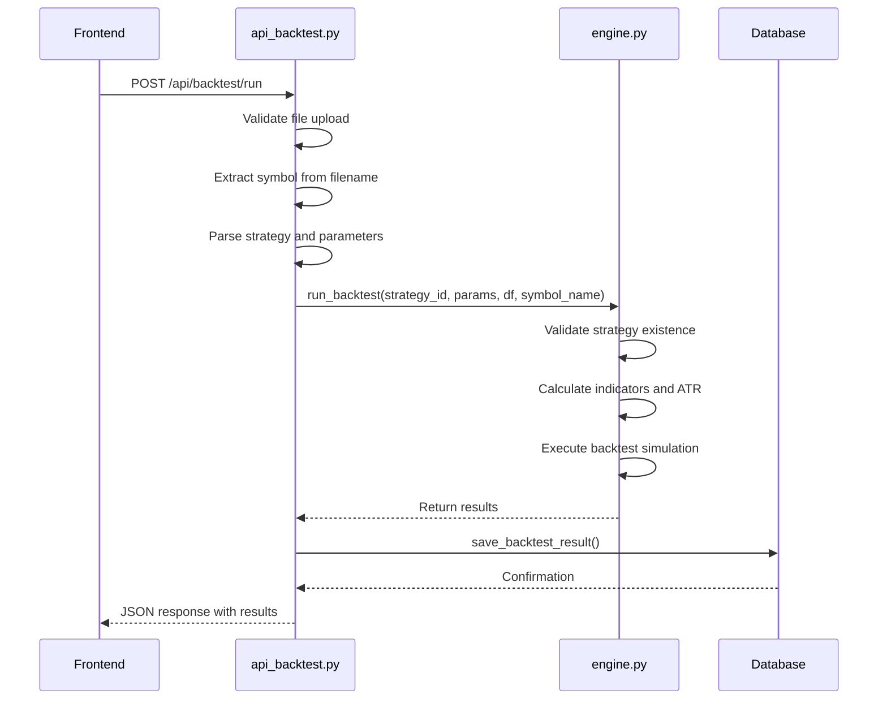
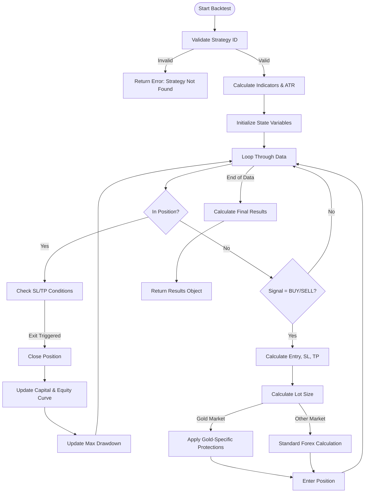
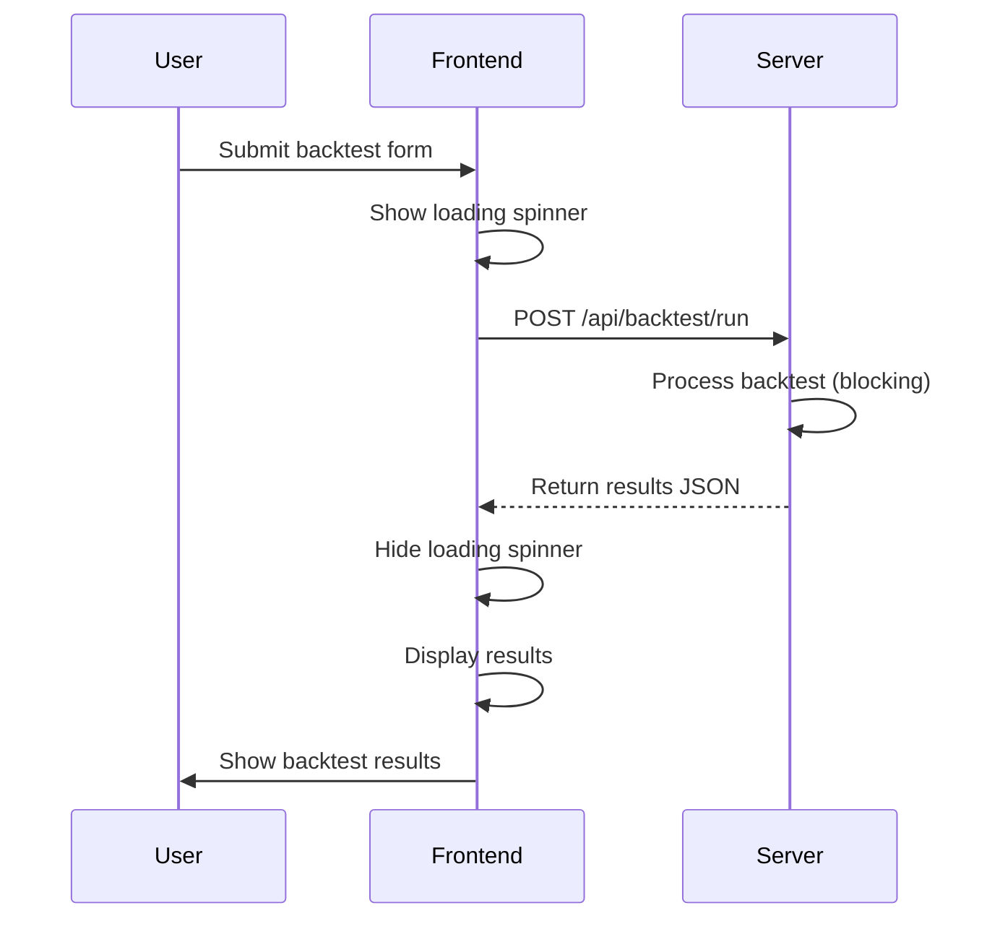

# Backtesting Configuration and Workflow

<cite>
**Referenced Files in This Document**   
- [api_backtest.py](file://core/routes/api_backtest.py)
- [engine.py](file://core/backtesting/engine.py)
- [strategy_map.py](file://core/strategies/strategy_map.py)
- [bollinger_squeeze.py](file://core/strategies/bollinger_squeeze.py)
- [bollinger_squeeze_test.py](file://core/strategies/bollinger_squeeze_test.py)
- [backtesting.js](file://static/js/backtesting.js)
- [backtesting.html](file://templates/backtesting.html)
- [queries.py](file://core/db/queries.py)
- [init_db.py](file://init_db.py)
</cite>

## Table of Contents
1. [Backtesting Configuration and Workflow](#backtesting-configuration-and-workflow)
2. [Backtesting Configuration Parameters](#backtesting-configuration-parameters)
3. [Backtesting API and Parameter Validation](#backtesting-api-and-parameter-validation)
4. [Backtesting Engine Execution Logic](#backtesting-engine-execution-logic)
5. [Asynchronous Execution and Status Management](#asynchronous-execution-and-status-management)
6. [Step-by-Step Example: Bollinger Squeeze Strategy](#step-by-step-example-bollinger-squeeze-strategy)
7. [Result Interpretation and Visualization](#result-interpretation-and-visualization)
8. [Troubleshooting Common Issues](#troubleshooting-common-issues)
9. [Database Storage and Retrieval](#database-storage-and-retrieval)

## Backtesting Configuration Parameters

The backtesting system requires several configuration parameters to execute a simulation. These parameters are collected through the user interface and validated before processing.

**Core Configuration Parameters:**
- **Strategy Selection**: User selects from available strategies (e.g., BOLLINGER_SQUEEZE, MA_CROSSOVER)
- **Historical Data**: CSV file upload containing time series data with columns including 'time', 'open', 'high', 'low', 'close', and optionally 'volume'
- **Symbol**: Automatically extracted from the filename (e.g., "XAUUSD_H1_data.csv" → "XAUUSD")
- **Timeframe**: Inferred from the data or filename
- **Risk Management Parameters**: 
  - **SL (Stop Loss)**: ATR multiplier (default: 2.0)
  - **TP (Take Profit)**: ATR multiplier (default: 4.0)
  - **Risk Percentage**: Percentage of capital to risk per trade

**Strategy-Specific Parameters:**
Each strategy defines its own set of configurable parameters. For example, the Bollinger Squeeze strategy includes:
- **bb_length**: Length of Bollinger Bands (default: 20)
- **bb_std**: Standard deviation for Bollinger Bands (default: 2.0)
- **squeeze_window**: Window for calculating average bandwidth (default: 10)
- **squeeze_factor**: Factor for determining squeeze threshold (default: 0.7)
- **rsi_period**: Period for RSI calculation (default: 14)

**Section sources**
- [backtesting.html](file://templates/backtesting.html#L0-L67)
- [backtesting.js](file://static/js/backtesting.js#L0-L171)
- [bollinger_squeeze.py](file://core/strategies/bollinger_squeeze.py#L0-L88)

## Backtesting API and Parameter Validation

The backtesting API endpoint `/api/backtest/run` handles the submission and validation of backtesting requests. The API processes multipart form data containing the strategy selection, historical data file, and configuration parameters.



**Diagram sources**
- [api_backtest.py](file://core/routes/api_backtest.py#L0-L130)
- [engine.py](file://core/backtesting/engine.py#L0-L317)

**Section sources**
- [api_backtest.py](file://core/routes/api_backtest.py#L0-L130)

The API performs the following validation steps:
1. **File Validation**: Checks if a file was uploaded and has a valid filename
2. **Data Parsing**: Uses pandas to read the CSV file and parse the 'time' column as dates
3. **Strategy Validation**: Verifies the selected strategy exists in the STRATEGY_MAP
4. **Parameter Extraction**: Parses strategy parameters from the form data
5. **Symbol Detection**: Extracts the symbol name from the filename for accurate market detection

If any validation fails, the API returns an appropriate error response with HTTP status code 400 or 500.

## Backtesting Engine Execution Logic

The backtesting engine in `engine.py` implements the core simulation logic. It processes historical data, generates trading signals, manages positions, and calculates performance metrics.



**Diagram sources**
- [engine.py](file://core/backtesting/engine.py#L0-L317)

**Section sources**
- [engine.py](file://core/backtesting/engine.py#L0-L317)

The execution process follows these key steps:

1. **Strategy Initialization**: The engine retrieves the strategy class from STRATEGY_MAP and creates an instance with a MockBot object
2. **Indicator Calculation**: The strategy analyzes the data frame to generate signals, and the engine calculates ATR (Average True Range) for position sizing
3. **State Management**: The engine maintains state variables including current position status, capital, equity curve, and drawdown metrics
4. **Trade Execution**: For each bar, the engine checks for exit conditions (SL/TP) and entry conditions (strategy signals)
5. **Position Sizing**: The engine calculates lot size based on risk percentage and ATR, with special handling for gold/XAUUSD markets
6. **Result Compilation**: After processing all data, the engine calculates final performance metrics

The engine implements special protections for gold (XAUUSD) trading due to its high volatility:
- Maximum risk percentage capped at 1.0%
- Reduced ATR multipliers for SL (1.0) and TP (2.0)
- Fixed small lot sizes (0.01-0.03) with additional reductions during high volatility periods
- Emergency brake if estimated risk exceeds 5% of capital

## Asynchronous Execution and Status Management

The backtesting system uses a synchronous HTTP request-response model rather than true asynchronous execution with status polling. When a user submits a backtest request, the frontend displays a loading spinner and waits for the server to complete the simulation and return results.



**Diagram sources**
- [backtesting.js](file://static/js/backtesting.js#L0-L171)
- [api_backtest.py](file://core/routes/api_backtest.py#L0-L130)

**Section sources**
- [backtesting.js](file://static/js/backtesting.js#L0-L171)

The frontend JavaScript (`backtesting.js`) manages the user experience during backtest execution:
1. Disables the run button and shows a loading spinner
2. Submits the form data via fetch API
3. Waits for the response
4. Hides the loading spinner and re-enables the button
5. Displays the results or error message

Since the backtest runs synchronously on the server, there is no need for status polling. The HTTP request remains open until the simulation completes. For long-running backtests, this could potentially lead to timeout issues, but the current implementation does not include timeout handling or asynchronous job queuing.

## Step-by-Step Example: Bollinger Squeeze Strategy

This section walks through a complete example of running a Bollinger Squeeze strategy backtest.

### Step 1: Strategy Selection and Parameter Configuration

The user selects "Bollinger Squeeze Breakout" from the strategy dropdown in the UI. The frontend automatically loads the strategy-specific parameters:

```json
[
  {"name": "bb_length", "label": "BB Length", "type": "number", "default": 20},
  {"name": "bb_std", "label": "BB Std Dev", "type": "number", "default": 2.0, "step": 0.1},
  {"name": "squeeze_window", "label": "Squeeze Window", "type": "number", "default": 10},
  {"name": "squeeze_factor", "label": "Squeeze Factor", "type": "number", "default": 0.7, "step": 0.1},
  {"name": "rsi_period", "label": "RSI Period", "type": "number", "default": 14}
]
```

The user can modify these parameters or accept the defaults. They also set the risk management parameters:
- SL (ATR Multiplier): 2.0
- TP (ATR Multiplier): 4.0

### Step 2: Data Upload and API Request

The user uploads a CSV file named "XAUUSD_H1_2023.csv" containing historical price data. When they click "Run Backtest", the frontend constructs a multipart form request:

```
POST /api/backtest/run
Content-Type: multipart/form-data

Form Data:
- file: XAUUSD_H1_2023.csv (CSV content)
- strategy: BOLLINGER_SQUEEZE
- sl_atr_multiplier: 2.0
- tp_atr_multiplier: 4.0
- params: {"bb_length":20,"bb_std":2.0,"squeeze_window":10,"squeeze_factor":0.7,"rsi_period":14}
```

**Section sources**
- [backtesting.html](file://templates/backtesting.html#L0-L67)
- [backtesting.js](file://static/js/backtesting.js#L0-L171)

### Step 3: Engine Processing

The backtesting engine processes the request:

1. **Strategy Initialization**: Creates a BollingerSqueezeStrategy instance
2. **Indicator Calculation**: 
   - Calculates Bollinger Bands (20,2.0)
   - Computes bandwidth and average bandwidth (window=10)
   - Sets squeeze level (average bandwidth × 0.7)
   - Calculates RSI (period=14)
3. **Signal Generation**: Identifies squeeze conditions and breakouts
4. **Trade Simulation**: Executes trades based on signals with SL/TP levels
5. **Position Sizing**: Applies gold market protections due to XAUUSD symbol detection

### Step 4: Result Generation

The engine returns a results object:

```json
{
  "strategy_name": "Bollinger Squeeze Breakout",
  "total_trades": 45,
  "final_capital": 12436.50,
  "total_profit_usd": 2436.50,
  "win_rate_percent": 62.22,
  "wins": 28,
  "losses": 17,
  "max_drawdown_percent": 18.45,
  "equity_curve": [10000, 10025, 10018, ...],
  "trades": [
    {
      "entry_time": "2023-01-15 08:00:00",
      "exit_time": "2023-01-15 12:00:00",
      "entry": 1925.30,
      "exit": 1942.80,
      "profit": 175.00,
      "reason": "TP",
      "position_type": "BUY"
    }
  ]
}
```

## Result Interpretation and Visualization

The frontend displays backtest results in a comprehensive format that includes performance metrics, equity curve visualization, and trade log.

**Key Performance Metrics:**
- **Total Profit**: Net profit in USD from all trades
- **Max Drawdown**: Maximum peak-to-trough decline as a percentage
- **Win Rate**: Percentage of winning trades
- **Total Trades**: Number of trades executed
- **Wins/Losses**: Count of winning and losing trades

The equity curve is visualized using Chart.js, showing the growth of capital over time. The trade log displays the last 20 trades with entry/exit prices, profit/loss, and exit reason (SL/TP).

Users can also access the backtest history page to view and compare previous simulations. Each historical backtest can be examined in detail, showing the same metrics and visualizations as the live results.

**Section sources**
- [backtesting.js](file://static/js/backtesting.js#L0-L171)
- [backtesting.html](file://templates/backtesting.html#L0-L67)

## Troubleshooting Common Issues

This section addresses common problems users may encounter when running backtests.

### Missing or Invalid Data
**Symptoms**: "Data tidak cukup untuk analisa" error, empty results, or simulation failure
**Causes and Solutions**:
- **Insufficient data rows**: Ensure the CSV file has enough data for the strategy's lookback period (e.g., Bollinger Squeeze needs at least 30+ bars)
- **Incorrect column names**: Verify the CSV has required columns: 'time', 'open', 'high', 'low', 'close', 'volume' (optional)
- **Date parsing issues**: Ensure the 'time' column is in a recognizable datetime format
- **Missing values**: Check for NaN or empty cells in the price data

### Invalid Parameters
**Symptoms**: Error messages during backtest submission
**Causes and Solutions**:
- **Strategy not selected**: Always select a strategy from the dropdown
- **Non-numeric parameter values**: Enter numbers in parameter fields, not text
- **Extreme parameter values**: Avoid excessively large or small values that could cause calculation issues

### Stalled or Failed Simulations
**Symptoms**: Loading spinner continues indefinitely, timeout errors
**Causes and Solutions**:
- **Large data files**: Reduce the date range or timeframe of the historical data
- **Server timeout**: The current implementation lacks timeout handling; restart the server if needed
- **Memory issues**: Ensure the server has sufficient memory for large datasets

### Unexpected Results
**Symptoms**: Poor performance metrics, fewer trades than expected, or illogical results
**Causes and Solutions**:
- **Inappropriate parameter values**: Review and adjust strategy parameters based on market conditions
- **Market regime changes**: The strategy may not perform well in certain market conditions (trending vs. ranging)
- **Overfitting**: Avoid optimizing parameters to perfection on historical data; test on out-of-sample data

**Section sources**
- [engine.py](file://core/backtesting/engine.py#L0-L317)
- [api_backtest.py](file://core/routes/api_backtest.py#L0-L130)
- [backtesting.js](file://static/js/backtesting.js#L0-L171)

## Database Storage and Retrieval

Backtest results are stored in the SQLite database for future reference and analysis. The `backtest_results` table schema is defined in `init_db.py`:

```sql
CREATE TABLE IF NOT EXISTS backtest_results (
    id INTEGER PRIMARY KEY AUTOINCREMENT,
    timestamp DATETIME DEFAULT CURRENT_TIMESTAMP,
    strategy_name TEXT NOT NULL,
    data_filename TEXT NOT NULL,
    total_profit_usd REAL NOT NULL,
    total_trades INTEGER NOT NULL,
    win_rate_percent REAL NOT NULL,
    max_drawdown_percent REAL NOT NULL,
    wins INTEGER NOT NULL,
    losses INTEGER NOT NULL,
    equity_curve TEXT, -- Stored as JSON
    trade_log TEXT,    -- Stored as JSON
    parameters TEXT    -- Stored as JSON
);
```

```mermaid
erDiagram
BACKTEST_RESULTS {
int id PK
datetime timestamp
string strategy_name
string data_filename
float total_profit_usd
int total_trades
float win_rate_percent
float max_drawdown_percent
int wins
int losses
string equity_curve JSON
string trade_log JSON
string parameters JSON
}
```

**Diagram sources**
- [init_db.py](file://init_db.py#L80-L114)

**Section sources**
- [init_db.py](file://init_db.py#L80-L114)
- [queries.py](file://core/db/queries.py#L165-L173)
- [api_backtest.py](file://core/routes/api_backtest.py#L25-L83)

The system stores results through the `save_backtest_result()` function, which:
1. Sanitizes data by replacing NaN and infinite values with NULL
2. Extracts key metrics from the results object
3. Serializes the equity curve, trade log, and parameters as JSON strings
4. Inserts the record into the database

Historical backtests are retrieved via the `/api/backtest/history` endpoint, which calls `get_all_backtest_history()` from `queries.py`. The results are processed to parse JSON fields and returned as a list of backtest records for display in the UI.