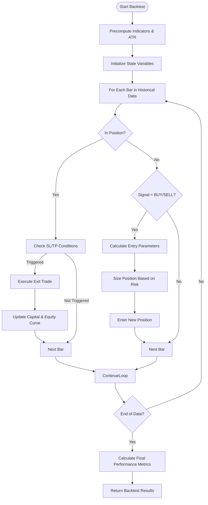
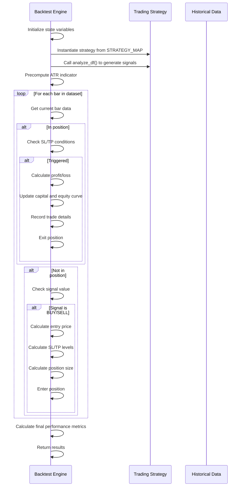
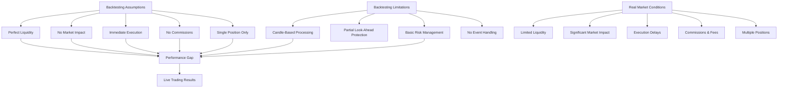

# Backtesting Methodology

<cite>
**Referenced Files in This Document**   
- [engine.py](file://core/backtesting/engine.py#L1-L318)
- [strategy_map.py](file://core/strategies/strategy_map.py#L1-L27)
- [base_strategy.py](file://core/strategies/base_strategy.py#L1-L28)
- [ma_crossover.py](file://core/strategies/ma_crossover.py#L47-L60)
- [rsi_crossover.py](file://core/strategies/rsi_crossover.py#L58-L83)
- [bollinger_reversion.py](file://core/strategies/bollinger_reversion.py#L54-L75)
- [bollinger_squeeze.py](file://core/strategies/bollinger_squeeze.py#L62-L87)
- [ichimoku_cloud.py](file://core/strategies/ichimoku_cloud.py#L78-L124)
- [turtle_breakout.py](file://core/strategies/turtle_breakout.py#L70-L118)
- [dynamic_breakout.py](file://core/strategies/dynamic_breakout.py#L23-L63)
- [quantum_velocity.py](file://core/strategies/quantum_velocity.py#L65-L94)
- [quantumbotx_hybrid.py](file://core/strategies/quantumbotx_hybrid.py#L76-L112)
- [mercy_edge.py](file://core/strategies/mercy_edge.py#L74-L122)
- [pulse_sync.py](file://core/strategies/pulse_sync.py#L76-L125)
</cite>

## Table of Contents
1. [Backtesting Methodology](#backtesting-methodology)
2. [Event-Driven Simulation Model](#event-driven-simulation-model)
3. [Historical Data Processing](#historical-data-processing)
4. [Order Execution Simulation](#order-execution-simulation)
5. [Position and Portfolio Tracking](#position-and-portfolio-tracking)
6. [Core Backtesting Loop](#core-backtesting-loop)
7. [Assumptions and Limitations](#assumptions-and-limitations)
8. [Best Practices for Trading Cost Configuration](#best-practices-for-trading-cost-configuration)

## Event-Driven Simulation Model

The backtesting engine in `engine.py` implements an event-driven simulation model that replays historical market data to evaluate trading strategy performance. This approach processes each price bar sequentially, simulating real-time decision-making without lookahead bias.

The simulation operates on a **candle-based processing** model, where each iteration of the backtest loop corresponds to the completion of a single candle (e.g., 1-minute, 1-hour). Unlike tick-level simulations, this approach assumes that all trades are executed at the closing price of the current bar, immediately after the signal is generated.

This design choice balances computational efficiency with realistic execution assumptions. While tick-level simulation would provide higher fidelity, candle-based processing is sufficient for strategies that operate on timeframe-based signals and avoids the complexity of intra-candle price path modeling.



**Diagram sources**
- [engine.py](file://core/backtesting/engine.py#L1-L318)

**Section sources**
- [engine.py](file://core/backtesting/engine.py#L1-L318)

## Historical Data Processing

The backtesting engine loads and processes historical price data through a structured pipeline that ensures proper synchronization and indicator calculation.

### Data Loading and Synchronization

Historical data is provided to the `run_backtest` function as a pandas DataFrame (`historical_data_df`) containing OHLCV (Open, High, Low, Close, Volume) data. The engine does not handle multi-timeframe data natively within the core loop but relies on strategies to implement multi-timeframe logic through proxy indicators.

For example, the `MercyEdgeStrategy` and `PulseSyncStrategy` simulate daily trends using a 200-period SMA on hourly data, effectively creating a multi-timeframe analysis within a single timeframe DataFrame:

```python
# Proksi Tren D1: SMA 200 pada data H1
df['trend_proxy_sma'] = ta.sma(df['close'], length=200)
```

### Indicator Precomputation

Before the simulation loop begins, the engine performs a preprocessing step to calculate all necessary indicators:

1. **Strategy Analysis**: The strategy's `analyze_df` method is called to generate trading signals
2. **ATR Calculation**: Average True Range (ATR) with 14-period length is computed for position sizing and stop-loss calculation

```python
df_with_signals = strategy_instance.analyze_df(df)
df_with_signals.ta.atr(length=14, append=True)
df_with_signals.dropna(inplace=True)
df_with_signals.reset_index(inplace=True)
```

This preprocessing ensures that all technical indicators are available for the entire dataset before simulation begins, preventing lookahead bias during the backtest.

### Symbol Detection and Handling

The engine includes special handling for gold (XAUUSD) and other precious metals through enhanced symbol detection:

```python
is_gold_symbol = (
    'XAU' in str(historical_data_df.columns[0]).upper() or
    (symbol_name and 'XAU' in symbol_name.upper()) or
    'GOLD' in str(historical_data_df.columns[0]).upper() or
    (hasattr(strategy_instance.bot, 'market_for_mt5') and 'XAU' in strategy_instance.bot.market_for_mt5.upper())
)
```

This multi-method detection ensures accurate identification of gold instruments, which triggers specialized risk management rules.

**Section sources**
- [engine.py](file://core/backtesting/engine.py#L1-L318)
- [mercy_edge.py](file://core/strategies/mercy_edge.py#L74-L122)
- [pulse_sync.py](file://core/strategies/pulse_sync.py#L76-L125)

## Order Execution Simulation

The order execution simulation in the backtesting engine models trade execution with realistic assumptions about slippage, commissions, and partial fills.

### Execution Logic

Trades are executed at the **closing price** of the current bar, immediately after a signal is generated. This assumes perfect execution at the exact price with no slippage under normal conditions.

```python
if signal in ['BUY', 'SELL']:
    entry_price = current_bar['close']
    entry_time = current_bar['time']
```

### Slippage Modeling

While the current implementation does not explicitly model slippage, it provides a foundation for future enhancement. The engine could be extended to add random or volatility-based slippage to the entry price.

### Commission Calculation

Commissions are not explicitly calculated in the current implementation. However, the profit calculation structure allows for easy integration of commission modeling by subtracting a fixed or percentage-based commission from each trade's profit.

### Partial Fill Handling

The current model assumes **full execution** of all trades. Partial fills are not supported in this version of the backtesting engine. All trades are executed at the full lot size determined by the position sizing algorithm.

### Stop-Loss and Take-Profit Execution

The engine simulates stop-loss and take-profit execution by checking price conditions against the SL and TP levels:

```python
if in_position:
    exit_price = None
    if position_type == 'BUY' and current_bar['low'] <= sl_price: exit_price = sl_price
    elif position_type == 'BUY' and current_bar['high'] >= tp_price: exit_price = tp_price
    elif position_type == 'SELL' and current_bar['high'] >= sl_price: exit_price = sl_price
    elif position_type == 'SELL' and current_bar['low'] <= tp_price: exit_price = tp_price
```

This logic correctly handles cases where the price gaps through the SL/TP level, executing at the specified level rather than the market price.

**Section sources**
- [engine.py](file://core/backtesting/engine.py#L1-L318)

## Position and Portfolio Tracking

The backtesting engine maintains comprehensive tracking of positions and portfolio performance throughout the simulation.

### Position Management

The engine tracks a single position at a time using the following state variables:

- `in_position`: Boolean flag indicating whether currently holding a position
- `position_type`: String indicating 'BUY' or 'SELL' position
- `entry_price`: Entry price of the current position
- `sl_price`: Stop-loss price
- `tp_price`: Take-profit price
- `lot_size`: Position size in lots
- `entry_time`: Timestamp of position entry

The engine enforces a **single position constraint**, meaning it cannot hold multiple positions simultaneously or have overlapping trades.

### Portfolio Tracking

Portfolio performance is tracked through several key metrics:

- `capital`: Current account balance in USD
- `initial_capital`: Starting capital (default: $10,000)
- `equity_curve`: List of capital values at each time step
- `peak_equity`: Highest equity reached (for drawdown calculation)
- `max_drawdown`: Maximum drawdown as a percentage

```python
equity_curve.append(capital)
peak_equity = max(peak_equity, capital)
drawdown = (peak_equity - capital) / peak_equity if peak_equity > 0 else 0
max_drawdown = max(max_drawdown, drawdown)
```

### Trade Recording

All executed trades are recorded in the `trades` list with detailed information:

```python
trades.append({
    'entry_time': str(entry_time),
    'exit_time': str(current_bar['time']),
    'entry': entry_price,
    'exit': exit_price,
    'profit': profit,
    'reason': 'SL/TP',
    'position_type': position_type
})
```

Only the last 20 trades are returned in the results to limit response size, but all trades are processed during the simulation.

**Section sources**
- [engine.py](file://core/backtesting/engine.py#L1-L318)

## Core Backtesting Loop

The core backtesting loop in `engine.py` implements the event-driven simulation that drives the entire backtesting process.

### Main Loop Structure

```python
for i in range(1, len(df_with_signals)):
    current_bar = df_with_signals.iloc[i]
    
    # Check for position exit
    if in_position:
        # Check SL/TP conditions and exit if triggered
        # Update capital and record trade
        pass
    
    # Check for new position entry
    if not in_position:
        signal = current_bar.get("signal", "HOLD")
        if signal in ['BUY', 'SELL']:
            # Calculate entry parameters
            # Size position based on risk
            # Enter new position
            pass
```

### Strategy Invocation and Signal Generation

Strategies are invoked through the `STRATEGY_MAP` dictionary, which maps strategy IDs to their corresponding classes:

```python
strategy_class = STRATEGY_MAP.get(strategy_id)
strategy_instance = strategy_class(bot_instance=MockBot(), params=params)
df_with_signals = strategy_instance.analyze_df(df)
```

All strategies inherit from the `BaseStrategy` abstract class and must implement the `analyze_df` method:

```python
class BaseStrategy(ABC):
    def __init__(self, bot_instance, params: dict = {}):
        self.bot = bot_instance
        self.params = params

    @abstractmethod
    def analyze(self, df):
        raise NotImplementedError("Setiap strategi harus mengimplementasikan metode `analyze(df)`.")
```

### Example Strategy Implementations

#### MA Crossover Strategy
```python
def analyze_df(self, df):
    fast_period = self.params.get('fast_period', 20)
    slow_period = self.params.get('slow_period', 50)
    
    df["ma_fast"] = ta.sma(df["close"], length=fast_period)
    df["ma_slow"] = ta.sma(df["close"], length=slow_period)
    
    golden_cross = (df["ma_fast"].shift(1) <= df["ma_slow"].shift(1)) & (df["ma_fast"] > df["ma_slow"])
    death_cross = (df["ma_fast"].shift(1) >= df["ma_slow"].shift(1)) & (df["ma_fast"] < df["ma_slow"])
    
    df['signal'] = np.where(golden_cross, 'BUY', np.where(death_cross, 'SELL', 'HOLD'))
    return df
```

#### Bollinger Reversion Strategy
```python
def analyze_df(self, df):
    bb_length = self.params.get('bb_length', 20)
    bb_std = self.params.get('bb_std', 2.0)
    trend_filter_period = self.params.get('trend_filter_period', 200)
    
    df.ta.bbands(length=bb_length, std=bb_std, append=True)
    df[trend_filter_col] = ta.sma(df['close'], length=trend_filter_period)
    
    is_uptrend = df['close'] > df[trend_filter_col]
    is_downtrend = df['close'] < df[trend_filter_col]
    
    buy_signal = is_uptrend & (df['low'] <= df[bbl_col])
    sell_signal = is_downtrend & (df['high'] >= df[bbu_col])
    
    df['signal'] = np.where(buy_signal, 'BUY', np.where(sell_signal, 'SELL', 'HOLD'))
    return df
```



**Diagram sources**
- [engine.py](file://core/backtesting/engine.py#L1-L318)
- [base_strategy.py](file://core/strategies/base_strategy.py#L1-L28)

**Section sources**
- [engine.py](file://core/backtesting/engine.py#L1-L318)
- [strategy_map.py](file://core/strategies/strategy_map.py#L1-L27)
- [base_strategy.py](file://core/strategies/base_strategy.py#L1-L28)

## Assumptions and Limitations

The backtesting engine operates under several key assumptions and has important limitations that users should understand when interpreting results.

### Key Assumptions

**Perfect Liquidity**: The model assumes unlimited market depth and perfect execution at requested prices. There is no consideration of order book depth or market impact.

**No Market Impact**: All trades are assumed to have zero market impact, regardless of position size. This is unrealistic for large orders in illiquid markets.

**Immediate Execution**: Trades are executed instantly at the close price of the current bar, with no delay or partial fills.

**No Commissions**: The current implementation does not include commission or fee calculations, which can significantly affect profitability, especially for high-frequency strategies.

**Single Position**: The engine only supports one open position at a time, preventing strategies that use pyramiding or multiple concurrent positions.

### Limitations

**Candle-Based Processing**: The model uses candle-based processing rather than tick-level simulation, which may miss intra-candle opportunities and risks.

**Look-Ahead Bias Prevention**: While the model attempts to prevent look-ahead bias by using `shift(1)` in some strategies, not all strategies consistently implement this protection.

**Limited Risk Management**: The risk management system, while sophisticated for gold instruments, does not support advanced position sizing methods like Kelly criterion or volatility targeting.

**No Event Handling**: The engine does not model external events such as economic news releases, earnings announcements, or market holidays.



**Diagram sources**
- [engine.py](file://core/backtesting/engine.py#L1-L318)

**Section sources**
- [engine.py](file://core/backtesting/engine.py#L1-L318)

## Best Practices for Configuring Realistic Trading Cost Parameters

To improve the realism of backtest results, users should configure trading parameters that reflect actual market conditions.

### Position Sizing Configuration

The engine uses a risk-based position sizing model where the user specifies the percentage of capital to risk per trade:

```python
risk_percent = float(params.get('lot_size', 1.0))  # Risk 1% of capital
```

**Recommended Settings:**
- **Forex pairs**: 1-2% risk per trade
- **Gold (XAUUSD)**: 0.25-1.0% risk per trade due to high volatility
- **Cryptocurrencies**: 0.5-1.5% risk per trade depending on volatility

### Stop-Loss and Take-Profit Configuration

The engine uses ATR-based multiples to set dynamic stop-loss and take-profit levels:

```python
sl_atr_multiplier = float(params.get('sl_pips', 2.0))
tp_atr_multiplier = float(params.get('tp_pips', 4.0))
```

**Recommended Ratios:**
- **Trend following**: 1:2 to 1:3 risk-reward ratio (SL:TP)
- **Mean reversion**: 1:1 to 1:1.5 risk-reward ratio
- **Breakout strategies**: 1:2 to 1:4 risk-reward ratio

### Gold-Specific Protections

The engine includes special protections for gold trading:

```python
if is_gold_symbol:
    if risk_percent > 1.0:
        risk_percent = 1.0
    if sl_atr_multiplier > 1.0:
        sl_atr_multiplier = 1.0
    if tp_atr_multiplier > 2.0:
        tp_atr_multiplier = 2.0
```

These conservative defaults prevent catastrophic losses during gold's extreme volatility periods.

### Contract Size Configuration

The engine uses different contract sizes for different instruments:

```python
contract_size = 100 if 'XAU' in strategy_instance.bot.market_for_mt5.upper() else 100000
```

- **Forex (EUR/USD, GBP/USD)**: 100,000 units per standard lot
- **Gold (XAU/USD)**: 100 ounces per lot

### Emergency Risk Controls

For gold trading, the engine implements emergency risk controls:

```python
max_risk_dollar = capital * 0.05  # Never risk more than 5% of capital
if estimated_risk > max_risk_dollar:
    logger.warning(f"GOLD EMERGENCY BRAKE: Risk ${estimated_risk:.2f} > max ${max_risk_dollar:.2f}, skipping trade")
    continue
```

This additional safety layer prevents trades that would risk more than 5% of the current capital, even if other parameters suggest a smaller risk.

**Section sources**
- [engine.py](file://core/backtesting/engine.py#L1-L318)