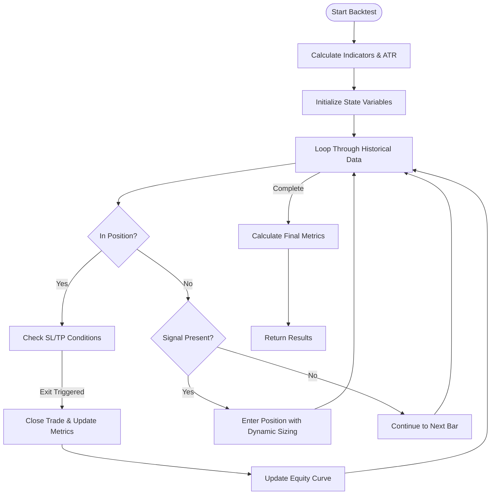
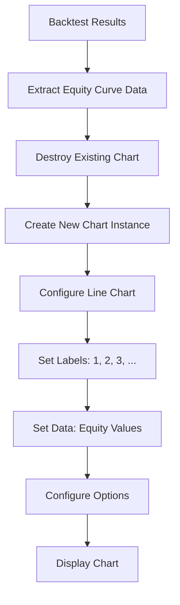
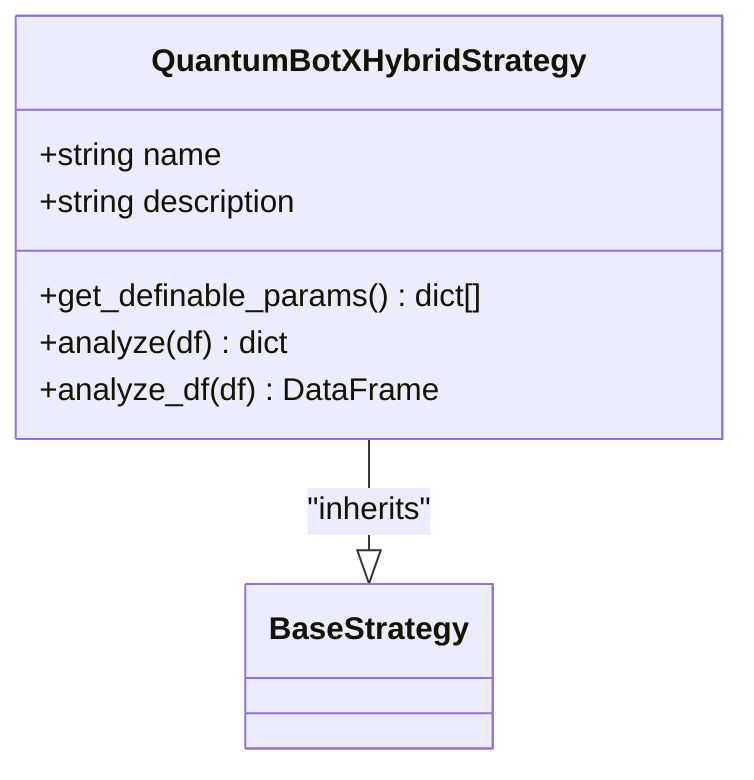
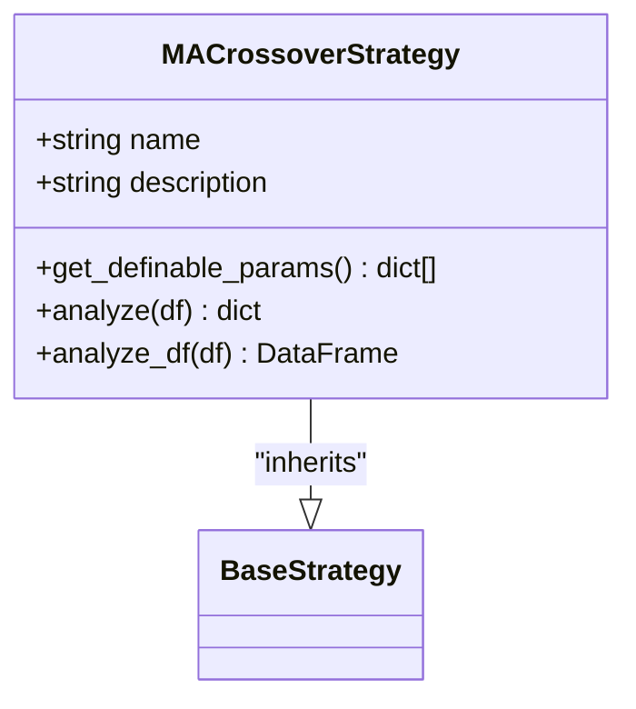

# Performance Metrics

<cite>
**Referenced Files in This Document**   
- [engine.py](file://core/backtesting/engine.py)
- [backtesting.js](file://static/js/backtesting.js)
- [backtesting_analyzer.html](file://backtesting_analyzer.html)
- [strategy_map.py](file://core/strategies/strategy_map.py)
- [quantumbotx_hybrid.py](file://core/strategies/quantumbotx_hybrid.py)
- [ma_crossover.py](file://core/strategies/ma_crossover.py)
- [rsi_crossover.py](file://core/strategies/rsi_crossover.py)
</cite>

## Table of Contents
1. [Introduction](#introduction)
2. [Core Performance Metrics](#core-performance-metrics)
3. [Risk-Adjusted Return Metrics](#risk-adjusted-return-metrics)
4. [Code Implementation Analysis](#code-implementation-analysis)
5. [Frontend Visualization](#frontend-visualization)
6. [Strategy Impact on Metrics](#strategy-impact-on-metrics)
7. [Benchmarking and Evaluation](#benchmarking-and-evaluation)
8. [Common Pitfalls in Performance Evaluation](#common-pitfalls-in-performance-evaluation)
9. [Conclusion](#conclusion)

## Introduction
This document provides a comprehensive analysis of the performance metrics calculated by the QuantumBotX backtesting engine. The system evaluates trading strategy effectiveness through a combination of profitability, risk, and efficiency metrics. The analysis is based on the codebase located in the `` directory, with primary focus on the backtesting engine implementation and its integration with frontend visualization components. The metrics serve as critical indicators for assessing strategy robustness, enabling traders to make informed decisions about strategy deployment and optimization.

## Core Performance Metrics

The backtesting engine calculates several fundamental performance metrics that provide insight into a strategy's profitability and trading behavior. These metrics are computed from trade history and equity curve data during the backtesting process.

### Total Return
Total return measures the overall profitability of a trading strategy over the backtesting period. It is calculated as the difference between the final capital and the initial capital.

**Formula**:  
Total Return = Final Capital - Initial Capital

In the codebase, this is implemented in `engine.py` where `total_profit` is derived from the difference between the ending `capital` and the `initial_capital` of 10,000.0 units. The result is returned as `total_profit_usd` in the backtest results.

### Win Rate
Win rate represents the percentage of profitable trades out of the total number of trades executed by the strategy.

**Formula**:  
Win Rate = (Number of Winning Trades / Total Number of Trades) × 100

The implementation in `engine.py` counts winning trades with `wins = len([t for t in trades if t['profit'] > 0])` and calculates the win rate as `(wins / len(trades) * 100) if trades else 0`. This value is returned as `win_rate_percent` in the results dictionary.

### Maximum Drawdown
Maximum drawdown measures the largest peak-to-trough decline in the equity curve, representing the maximum loss experienced by the strategy during the backtesting period.

**Formula**:  
Maximum Drawdown = max(Peak Equity - Trough Equity) / Peak Equity

In the code, `max_drawdown` is tracked throughout the backtest with `drawdown = (peak_equity - capital) / peak_equity if peak_equity > 0 else 0` and updated with `max_drawdown = max(max_drawdown, drawdown)`. The final value is converted to a percentage and returned as `max_drawdown_percent`.

### Total Trades
This metric counts the total number of trades executed by the strategy during the backtesting period. It is simply the length of the trades list: `len(trades)`.

### Wins and Losses
The engine separately tracks the number of winning and losing trades, providing insight into the strategy's trading frequency and distribution of outcomes. Wins are trades with positive profit, while losses are trades with negative profit.

**Section sources**
- [engine.py](file://core/backtesting/engine.py#L270-L313)

## Risk-Adjusted Return Metrics

While the current implementation focuses on core performance metrics, risk-adjusted return metrics such as Sharpe ratio, Sortino ratio, profit factor, and expectancy are not currently calculated by the backtesting engine. These metrics would provide additional insight into the efficiency of returns relative to risk taken.

### Sharpe Ratio
The Sharpe ratio measures excess return per unit of total risk (standard deviation of returns). A higher Sharpe ratio indicates better risk-adjusted performance.

**Formula**:  
Sharpe Ratio = (Strategy Return - Risk-Free Rate) / Standard Deviation of Strategy Returns

### Sortino Ratio
The Sortino ratio is similar to the Sharpe ratio but focuses specifically on downside risk, penalizing only negative volatility.

**Formula**:  
Sortino Ratio = (Strategy Return - Risk-Free Rate) / Standard Deviation of Negative Returns

### Profit Factor
Profit factor measures the ratio of gross profits to gross losses, indicating the strategy's ability to generate profit relative to its losses.

**Formula**:  
Profit Factor = Total Profit from Winning Trades / Total Loss from Losing Trades

### Expectancy
Expectancy represents the average amount a trader can expect to win or lose per trade.

**Formula**:  
Expectancy = (Win Rate × Average Win) - (Loss Rate × Average Loss)

These risk-adjusted metrics are not currently implemented in the backtesting engine but would provide valuable additional context for strategy evaluation.

## Code Implementation Analysis

The performance metrics are calculated within the `run_backtest` function in `engine.py`. The function processes historical data, executes trades according to the specified strategy, and computes metrics based on the resulting trade history and equity curve.

### Backtesting Engine Logic
The engine follows a four-step process:
1. **Indicator Pre-calculation**: The strategy analyzes the data frame and technical indicators are calculated, including ATR (Average True Range).
2. **State Initialization**: Trading state variables are initialized, including initial capital, position status, and equity tracking.
3. **Data Loop**: The engine iterates through historical data, executing trades based on strategy signals and managing position entry/exit.
4. **Result Calculation**: After processing all data, final performance metrics are calculated and returned.



**Diagram sources**
- [engine.py](file://core/backtesting/engine.py#L1-L317)

### Trade Execution and Profit Calculation
When a trade is closed, profit is calculated based on the entry and exit prices, position type, and lot size. The code accounts for different contract sizes for different instruments (100 for XAUUSD, 100,000 for Forex).

```python
# Simplified profit calculation
profit_multiplier = lot_size * contract_size
if position_type == 'BUY':
    profit = (exit_price - entry_price) * profit_multiplier
else: # SELL
    profit = (entry_price - exit_price) * profit_multiplier
```

The engine includes safeguards to ensure profit values are finite and valid before updating the capital.

### Gold Market Special Handling
The system includes special handling for XAUUSD (gold) trading, implementing more conservative risk parameters due to the instrument's high volatility. This includes capping risk percentage at 1.0%, reducing stop-loss and take-profit ATR multipliers, and applying additional lot size restrictions.

```python
# Gold-specific risk management
if is_gold_symbol:
    if risk_percent > 1.0:
        risk_percent = 1.0
    if sl_atr_multiplier > 1.0:
        sl_atr_multiplier = 1.0
    if tp_atr_multiplier > 2.0:
        tp_atr_multiplier = 2.0
```

This specialized handling directly impacts performance metrics for gold strategies, typically resulting in lower profit potential but significantly reduced drawdowns.

**Section sources**
- [engine.py](file://core/backtesting/engine.py#L90-L119)

## Frontend Visualization

Performance metrics are displayed to users through the backtesting interface, providing a clear visual representation of strategy performance.

### Metric Display
The frontend displays six primary metrics in a grid layout: Total Profit, Max Drawdown, Win Rate, Total Trades, Wins, and Losses. Each metric is presented with appropriate styling to indicate its nature (green for positive values like profit, red for negative values like drawdown).

```javascript
// Frontend metric display
resultsSummary.innerHTML = `
    <div class="p-4 bg-gray-50 rounded-lg">
        <p class="text-sm text-gray-500">Total Profit</p>
        <p class="text-2xl font-bold text-green-600">${data.total_profit_usd.toFixed(2)} $</p>
    </div>
    <div class="p-4 bg-gray-50 rounded-lg">
        <p class="text-sm text-gray-500">Max Drawdown</p>
        <p class="text-2xl font-bold text-red-600">${data.max_drawdown_percent.toFixed(2)}%</p>
    </div>
    <!-- Additional metrics -->
`;
```

### Equity Curve Visualization
The equity curve is visualized using Chart.js, showing the growth of capital over time. This line chart provides insight into the consistency of returns and the timing of drawdowns.



**Diagram sources**
- [backtesting.js](file://static/js/backtesting.js#L130-L171)

The equity curve visualization helps users identify periods of strong performance and significant drawdowns, complementing the numerical metrics.

**Section sources**
- [backtesting.js](file://static/js/backtesting.js#L109-L122)
- [backtesting.js](file://static/js/backtesting.js#L130-L171)

## Strategy Impact on Metrics

Different trading strategies implemented in the system generate distinct performance profiles, affecting the calculated metrics in unique ways.

### QuantumBotX Hybrid Strategy
The QuantumBotXHybridStrategy combines multiple indicators including ADX, Moving Averages, and Bollinger Bands with a long-term trend filter. This hybrid approach aims to adapt to different market conditions:

- **Trending Markets**: Uses MA crossovers when ADX indicates a strong trend
- **Ranging Markets**: Uses Bollinger Band reversals when ADX indicates a ranging market
- **Long-term Trend Filter**: Only takes trades in the direction of the 200-period SMA

This multi-condition approach typically results in a moderate win rate with controlled drawdowns, as trades are only taken when multiple conditions align.



**Diagram sources**
- [quantumbotx_hybrid.py](file://core/strategies/quantumbotx_hybrid.py#L1-L113)

### MA Crossover Strategy
The MACrossoverStrategy is a simpler trend-following strategy based on the crossover of two moving averages. It generates signals when a faster MA crosses above (BUY) or below (SELL) a slower MA.

This strategy typically performs well in strongly trending markets but may generate losses in ranging markets due to whipsaws. The performance metrics often show a lower win rate but potentially higher profit factors when trends are strong.



**Diagram sources**
- [ma_crossover.py](file://core/strategies/ma_crossover.py#L1-L60)

### RSI Crossover Strategy
The RSICrossoverStrategy uses momentum indicators, generating signals when the RSI crosses above a moving average of itself in an uptrend, or below in a downtrend.

This strategy tends to perform well in markets with clear momentum but may struggle in choppy conditions. The win rate and drawdown characteristics depend heavily on the chosen RSI and MA periods.

**Section sources**
- [strategy_map.py](file://core/strategies/strategy_map.py#L1-L27)
- [quantumbotx_hybrid.py](file://core/strategies/quantumbotx_hybrid.py#L1-L113)
- [ma_crossover.py](file://core/strategies/ma_crossover.py#L1-L60)
- [rsi_crossover.py](file://core/strategies/rsi_crossover.py#L1-L62)

## Benchmarking and Evaluation

The system currently lacks explicit benchmarking against baseline strategies, but the performance metrics provide a foundation for comparative analysis.

### Baseline Comparison
To properly evaluate strategy performance, comparisons should be made against:
- **Buy and Hold**: A simple strategy of purchasing and holding the asset throughout the period
- **Random Entry**: A strategy with random trade entries to establish a performance floor
- **Market Index**: For stock strategies, comparison against relevant market indices

The current metrics (total return, win rate, max drawdown) can be used to compare the strategy against these baselines, but annualized return calculations would be needed for proper time-adjusted comparisons.

### Performance Rating System
The test files in the codebase (e.g., `test_multi_currency.py`) implement a simple performance rating system based on profit, win rate, and drawdown:
- **EXCELLENT**: Profit > $1,000, Win Rate > 60%, Drawdown < 10%
- **GOOD**: Profit > $500, Win Rate > 50%, Drawdown < 15%
- **FAIR**: Profit > $0, Drawdown < 20%
- **POOR**: Absolute profit < $1,000, Drawdown < 25%
- **DANGEROUS**: Other cases

This rating system provides a quick assessment of strategy quality but should be supplemented with risk-adjusted metrics for a comprehensive evaluation.

## Common Pitfalls in Performance Evaluation

### Overfitting
Overfitting occurs when a strategy is excessively optimized to historical data, resulting in excellent backtest performance but poor real-world results. The current system is vulnerable to overfitting due to:
- Multiple strategy parameters that can be tuned
- Lack of walk-forward optimization
- No out-of-sample testing framework

### Look-Ahead Bias
Look-ahead bias occurs when future information is inadvertently used in the backtest. The current implementation appears to avoid this by processing data sequentially, but careful validation is needed to ensure indicators are calculated correctly without future data leakage.

### Survivorship Bias
The system may be subject to survivorship bias if it only tests on assets that have performed well historically, ignoring those that were delisted or performed poorly.

### Transaction Cost Omission
The current backtest does not appear to account for transaction costs (spreads, commissions, slippage), which can significantly impact profitability, especially for high-frequency strategies.

### Market Regime Dependence
Many strategies perform well in specific market conditions (trending or ranging) but poorly in others. The evaluation should consider performance across different market regimes, which the current metrics alone cannot fully capture.

## Conclusion
The QuantumBotX backtesting engine implements a solid foundation of core performance metrics including total return, win rate, and maximum drawdown. These metrics are calculated from trade history and equity curve data, providing essential insights into strategy performance. The system includes sophisticated risk management features, particularly for volatile instruments like XAUUSD.

However, the current implementation lacks key risk-adjusted return metrics such as Sharpe ratio, Sortino ratio, profit factor, and expectancy, which would provide a more comprehensive evaluation of strategy efficiency. Additionally, annualized return calculations are not implemented, limiting the ability to compare strategies across different time periods.

The frontend visualization effectively presents the core metrics and equity curve, enabling users to quickly assess strategy performance. Different trading strategies in the system generate distinct performance profiles, with the hybrid approach aiming to adapt to various market conditions.

To improve the performance evaluation framework, future enhancements should include:
1. Implementation of risk-adjusted return metrics
2. Annualized return calculations
3. Benchmarking against baseline strategies
4. Walk-forward optimization to reduce overfitting
5. Incorporation of transaction costs
6. Market regime analysis

These improvements would provide a more robust and reliable assessment of trading strategy performance, helping users make better-informed decisions about strategy deployment.