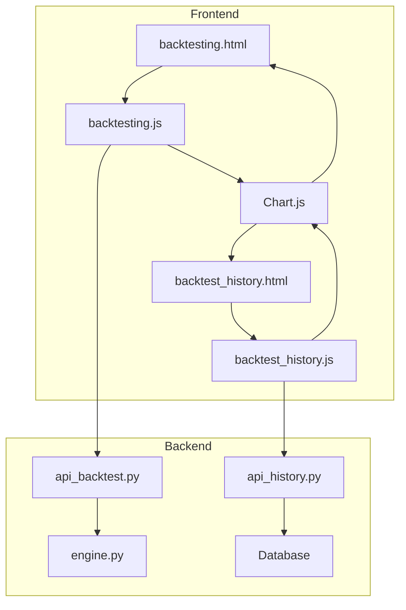
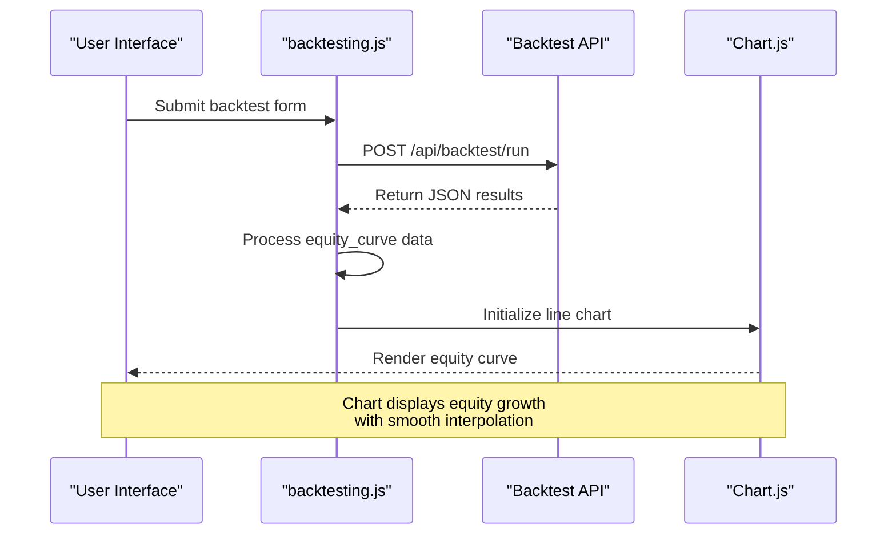
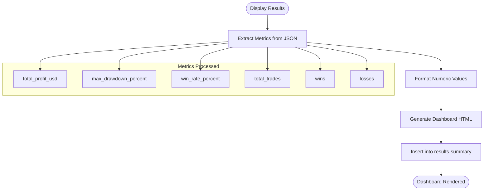
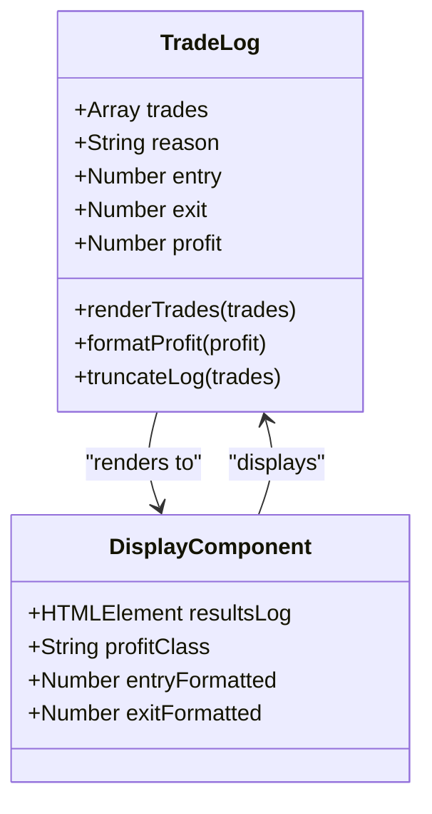
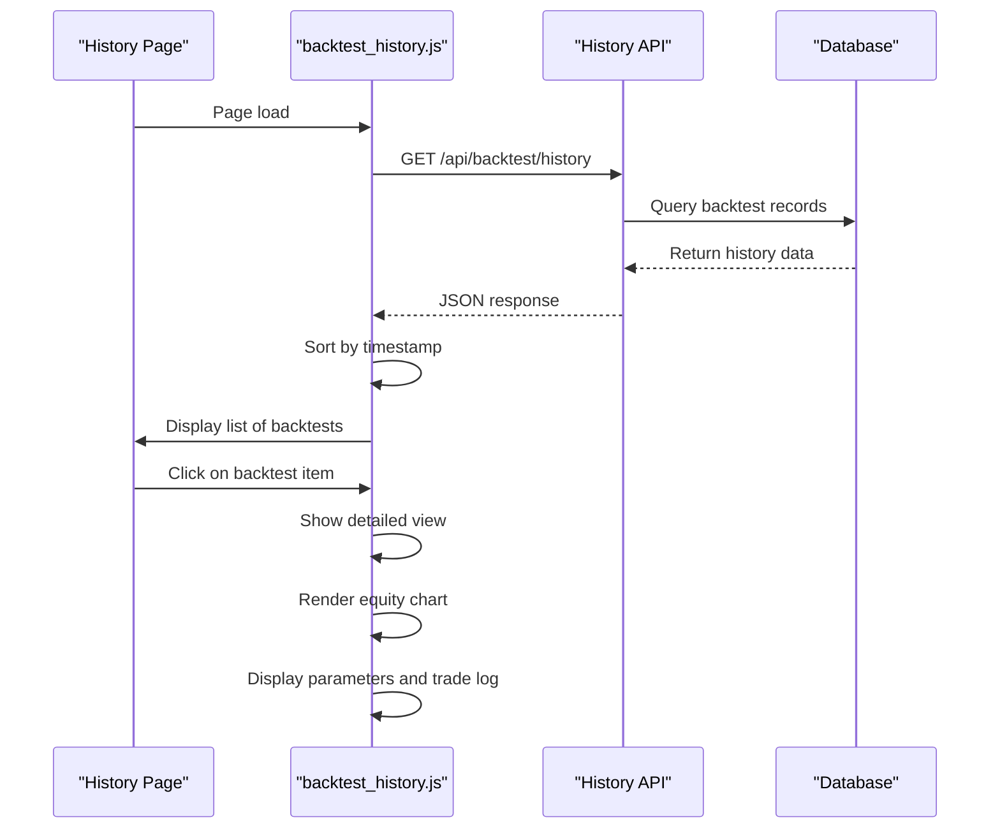
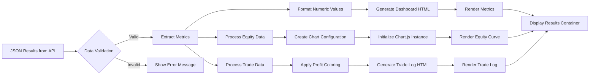
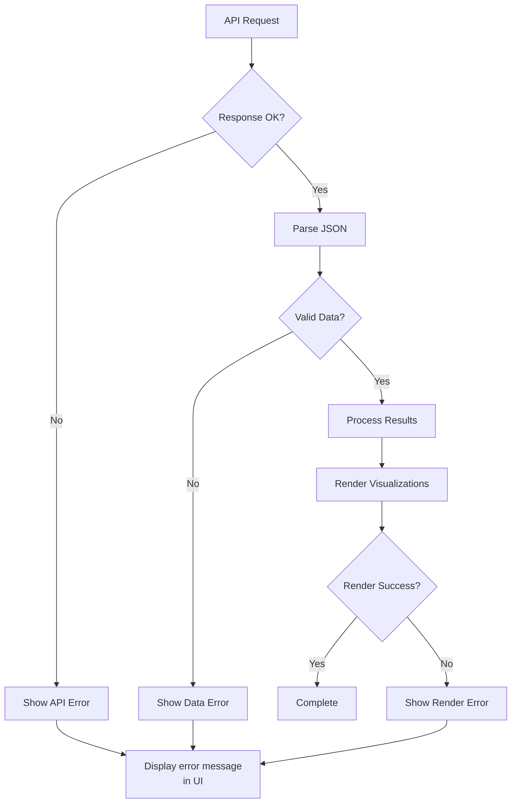

# Result Visualization

<cite>
**Referenced Files in This Document**   
- [backtesting_analyzer.html](file://backtesting_analyzer.html)
- [static/js/backtesting.js](file://static/js/backtesting.js)
- [static/js/backtest_history.js](file://static/js/backtest_history.js)
- [templates/backtesting.html](file://templates/backtesting.html)
- [templates/backtest_history.html](file://templates/backtest_history.html)
</cite>

## Table of Contents
1. [Introduction](#introduction)
2. [Visualization Architecture](#visualization-architecture)
3. [Core Components](#core-components)
4. [Equity Curve Rendering](#equity-curve-rendering)
5. [Metrics Dashboard](#metrics-dashboard)
6. [Trade Log Visualization](#trade-log-visualization)
7. [Historical Backtest Analysis](#historical-backtest-analysis)
8. [Data Processing Workflow](#data-processing-workflow)
9. [Performance Considerations](#performance-considerations)
10. [Error Handling and Validation](#error-handling-and-validation)

## Introduction
The backtesting result visualization system provides comprehensive graphical analysis of trading strategy performance. This system renders key performance metrics, equity curves, and trade logs through interactive web interfaces. The visualization framework is built on Chart.js for data plotting and integrates with backend APIs to process JSON-formatted backtest results. The system supports both real-time backtest visualization and historical result analysis, enabling users to evaluate strategy effectiveness through multiple visual dimensions including equity growth, drawdown patterns, and trade distribution.

## Visualization Architecture
The visualization system follows a client-server architecture where backtest results are generated on the server and transmitted to the client for rendering. The frontend components are implemented using JavaScript with Chart.js for data visualization, while the backend exposes REST APIs to serve backtest data.

**Diagram sources**
- [backtesting_analyzer.html](file://backtesting_analyzer.html)
- [static/js/backtesting.js](file://static/js/backtesting.js)
- [static/js/backtest_history.js](file://static/js/backtest_history.js)

**Section sources**
- [backtesting_analyzer.html](file://backtesting_analyzer.html)
- [static/js/backtesting.js](file://static/js/backtesting.js)

## Core Components
The visualization system consists of three main components: the real-time backtest visualizer, the historical backtest analyzer, and the ATR-based risk assessment tool. The real-time visualizer processes results from the backtesting engine and displays them immediately after execution, while the historical analyzer retrieves stored results from the database. The ATR analyzer provides risk management insights by calculating dynamic stop-loss and take-profit levels based on market volatility.

**Section sources**
- [backtesting_analyzer.html](file://backtesting_analyzer.html)
- [static/js/backtesting.js](file://static/js/backtesting.js)

## Equity Curve Rendering
The equity curve visualization displays the growth of trading capital over the backtest period. This is implemented using Chart.js line charts with specific configuration for financial data representation.

**Diagram sources**
- [static/js/backtesting.js](file://static/js/backtesting.js#L150-L171)
- [templates/backtesting.html](file://templates/backtesting.html#L50-L53)

The equity curve is rendered in the `displayEquityChart` function which initializes a Chart.js line chart with the following properties:
- **Type**: Line chart with smooth interpolation (tension: 0.1)
- **Data**: Equity values plotted against trade number (1, 2, 3, ...)
- **Styling**: Blue border (rgb(59, 130, 246)) with light blue fill (rgba(59, 130, 246, 0.1))
- **Interactivity**: Responsive design with no point markers (pointRadius: 0)
- **Axes**: Y-axis does not start at zero to better show equity fluctuations

## Metrics Dashboard
The metrics dashboard displays key performance indicators in a grid layout, providing a quick overview of strategy effectiveness. Six primary metrics are displayed: total profit, maximum drawdown, win rate, total trades, wins, and losses.

**Diagram sources**
- [static/js/backtesting.js](file://static/js/backtesting.js#L120-L130)
- [templates/backtesting.html](file://templates/backtesting.html#L49-L50)

The dashboard uses color coding to indicate performance:
- **Green**: Positive metrics (total profit, wins, win rate)
- **Red**: Negative metrics (maximum drawdown)
- **Blue**: Neutral metrics (trade counts)
Each metric card includes a descriptive label and the formatted value with appropriate units ($, %, or count).

## Trade Log Visualization
The trade log visualization displays detailed information about individual trades, allowing users to analyze specific trade outcomes and patterns.

**Diagram sources**
- [static/js/backtesting.js](file://static/js/backtesting.js#L132-L149)
- [static/js/backtest_history.js](file://static/js/backtest_history.js#L240-L285)

The trade log implementation includes:
- **Profit coloring**: Winning trades in green, losing trades in red
- **Data formatting**: Prices displayed to 4 decimal places, profits to 2 decimal places
- **Log truncation**: Only the most recent 20 trades are displayed to maintain performance
- **Comprehensive details**: Entry price, exit price, profit/loss, and exit reason for each trade
- **Responsive design**: Scrollable container with fixed height for large trade histories

## Historical Backtest Analysis
The historical backtest analysis system allows users to review and compare previous backtest runs through a dedicated interface.

**Diagram sources**
- [static/js/backtest_history.js](file://static/js/backtest_history.js#L33-L100)
- [templates/backtest_history.html](file://templates/backtest_history.html)

Key features of the historical analysis system:
- **Chronological sorting**: Backtests are sorted by timestamp in descending order (newest first)
- **Summary view**: List displays strategy name, market, timestamp, and profit for quick scanning
- **Detailed view**: Clicking a backtest shows comprehensive results including equity curve, parameters, and trade log
- **Data parsing**: Handles both string and array formats for equity curve and trade log data
- **Error resilience**: Graceful handling of missing or malformed data with appropriate error messages

## Data Processing Workflow
The data processing workflow converts raw backtest results from the API into visual representations through a series of transformation steps.

**Diagram sources**
- [static/js/backtesting.js](file://static/js/backtesting.js#L100-L171)
- [static/js/backtest_history.js](file://static/js/backtest_history.js#L102-L301)

The workflow includes several critical processing steps:
- **Data validation**: Checking for required fields and valid data types
- **Format conversion**: Parsing string representations of arrays into JavaScript objects
- **Error handling**: Try-catch blocks around JSON parsing and chart initialization
- **Memory management**: Destroying previous chart instances before creating new ones to prevent memory leaks
- **Responsive rendering**: Ensuring charts resize properly on different screen sizes

## Performance Considerations
The visualization system implements several performance optimizations to handle large backtest datasets efficiently.

**Section sources**
- [static/js/backtesting.js](file://static/js/backtesting.js#L150-L155)
- [static/js/backtest_history.js](file://static/js/backtest_history.js#L200-L220)

Key performance features:
- **Chart destruction**: Existing Chart.js instances are destroyed before creating new ones to prevent memory leaks
- **Data sampling**: For very large trade histories, only the most recent trades are displayed
- **Efficient rendering**: Using innerHTML for batch updates rather than individual DOM manipulations
- **Responsive design**: Charts are configured to maintain aspect ratio across different screen sizes
- **Asynchronous loading**: Data is fetched asynchronously to prevent UI blocking
- **Memory management**: Variables are properly scoped and references are cleaned up when no longer needed

The system also includes performance monitoring through console logging, which helps identify bottlenecks during development and debugging.

## Error Handling and Validation
The visualization system implements comprehensive error handling to ensure robust operation under various failure conditions.

**Diagram sources**
- [static/js/backtesting.js](file://static/js/backtesting.js#L108-L118)
- [static/js/backtest_history.js](file://static/js/backtest_history.js#L40-L50)

Error handling strategies include:
- **API error handling**: Catching network errors and HTTP status errors
- **JSON parsing protection**: Using try-catch blocks around JSON.parse() operations
- **Data validation**: Checking for required fields and valid data types before processing
- **Graceful degradation**: Displaying partial results when some data is missing
- **User feedback**: Clear error messages displayed in the UI
- **Console logging**: Detailed error information logged for debugging purposes

The system also validates numeric values to prevent NaN or infinite values from breaking the visualization, ensuring that all displayed numbers are properly formatted and meaningful.