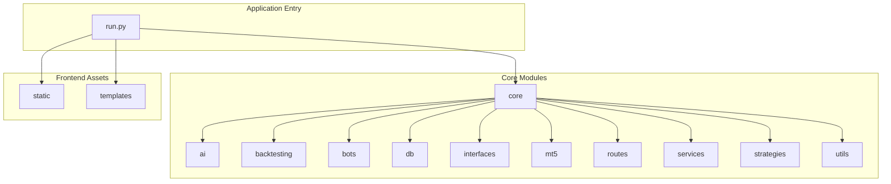
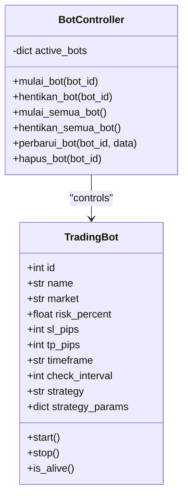
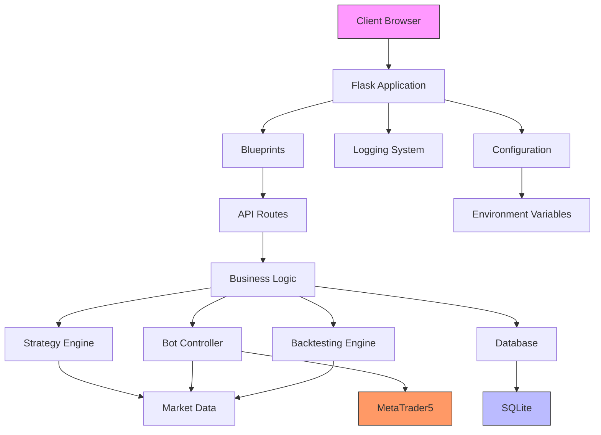
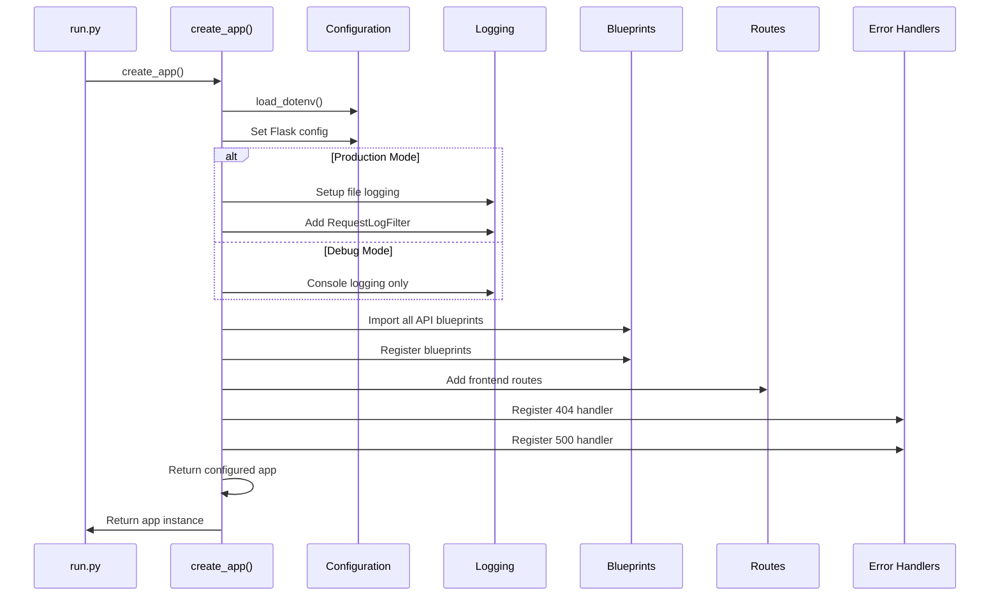

# Application Factory Pattern

<cite>
**Referenced Files in This Document**   
- [core/__init__.py](file://core/__init__.py#L17-L137)
- [run.py](file://run.py#L1-L52)
- [core/utils/logger.py](file://core/utils/logger.py#L1-L26)
- [core/routes/api_bots.py](file://core/routes/api_bots.py#L1-L168)
- [core/routes/api_backtest.py](file://core/routes/api_backtest.py#L1-L131)
- [core/bots/controller.py](file://core/bots/controller.py#L1-L177)
- [core/db/queries.py](file://core/db/queries.py#L1-L175)
- [core/strategies/strategy_map.py](file://core/strategies/strategy_map.py#L1-L28)
</cite>

## Table of Contents
1. [Introduction](#introduction)
2. [Project Structure Overview](#project-structure-overview)
3. [Application Factory Implementation](#application-factory-implementation)
4. [Blueprint Registration and Route Management](#blueprint-registration-and-route-management)
5. [Logging Configuration](#logging-configuration)
6. [Core Components and Dependencies](#core-components-and-dependencies)
7. [Architecture Overview](#architecture-overview)
8. [Detailed Component Analysis](#detailed-component-analysis)
9. [Dependency Analysis](#dependency-analysis)
10. [Best Practices and Extensibility](#best-practices-and-extensibility)
11. [Conclusion](#conclusion)

## Introduction
This document provides comprehensive documentation for the Flask application factory pattern implemented in the QuantumBotX trading system. The application factory pattern, centered around the `create_app()` function in `core/__init__.py`, enables a modular, testable, and configurable Flask application architecture. This pattern allows for environment-specific configuration, separation of concerns, and clean initialization of application components including logging, routing, and error handling. The design supports multiple application instances, facilitates testing, and promotes extensibility through blueprint-based modular routing.

## Project Structure Overview
The QuantumBotX project follows a feature-based modular structure with clear separation of concerns. The core application logic resides in the `core` directory, which contains specialized submodules for different functional areas including AI, backtesting, bots, database operations, trading interfaces, API routes, strategies, and utilities. Static assets and templates are organized in dedicated directories, while the main application entry point is defined in `run.py`. This structure supports the application factory pattern by allowing independent development and registration of components.



**Diagram sources**
- [core/__init__.py](file://core/__init__.py#L1-L137)
- [run.py](file://run.py#L1-L52)

**Section sources**
- [core/__init__.py](file://core/__init__.py#L1-L137)
- [run.py](file://run.py#L1-L52)

## Application Factory Implementation
The application factory pattern is implemented in the `create_app()` function within `core/__init__.py`. This function creates and configures a Flask application instance with environment-aware settings, logging, and component registration. The factory pattern enables creation of multiple application instances with different configurations, which is essential for testing and deployment flexibility.

```python
def create_app():
    load_dotenv()
    
    app = Flask(
        __name__, 
        instance_relative_config=True,
        template_folder='../templates',
        static_folder='../static'
    )    
    app.config['SECRET_KEY'] = os.getenv('SECRET_KEY', 'your-secret-key-here')
```

The factory function initializes the Flask app with relative paths to templates and static files, loads environment variables via `python-dotenv`, and sets the secret key from environment configuration. This approach ensures configuration is externalized and environment-specific, supporting different settings for development, testing, and production.

**Section sources**
- [core/__init__.py](file://core/__init__.py#L17-L49)

## Blueprint Registration and Route Management
The application factory registers multiple API blueprints that encapsulate route definitions for different functional areas. This modular approach promotes separation of concerns and makes the codebase more maintainable. Each blueprint corresponds to a specific domain such as bots, backtesting, portfolio management, and market data.

```mermaid
flowchart TD
A[create_app()] --> B[Import Blueprints]
B --> C[api_dashboard]
B --> D[api_chart]
B --> E[api_bots]
B --> F[api_profile]
B --> G[api_portfolio]
B --> H[api_history]
B --> I[api_notifications]
B --> J[api_stocks]
B --> K[api_forex]
B --> L[api_fundamentals]
B --> M[api_backtest]
C --> N[Register Blueprints]
D --> N
E --> N
F --> N
G --> N
H --> N
I --> N
J --> N
K --> N
L --> N
M --> N
N --> O[Flask App with Routes]
```

**Diagram sources**
- [core/__init__.py](file://core/__init__.py#L51-L85)

**Section sources**
- [core/__init__.py](file://core/__init__.py#L51-L85)
- [core/routes/api_bots.py](file://core/routes/api_bots.py#L1-L168)
- [core/routes/api_backtest.py](file://core/routes/api_backtest.py#L1-L131)

The blueprint registration process follows a consistent pattern:
1. Import the blueprint from the routes module
2. Register the blueprint with the application instance
3. Each blueprint contains its own route definitions and business logic

For example, the `api_bots` blueprint handles all bot-related operations including creation, management, and control:

```python
from .routes.api_bots import api_bots
app.register_blueprint(api_bots)
```

This blueprint exposes endpoints for:
- Retrieving strategy lists and parameters
- Managing bot lifecycle (start, stop, update)
- Accessing bot analysis and history
- Creating and deleting trading bots

Similarly, the `api_backtest` blueprint manages backtesting operations, allowing users to run strategy simulations on historical data and retrieve backtest results.

## Logging Configuration
The application implements a dual logging strategy that differs between debug and production environments. In production mode, the application configures file-based logging with rotation to prevent log files from growing indefinitely. In debug mode, only console logging is enabled to facilitate development.

```mermaid
flowchart TD
A[create_app()] --> B{FLASK_DEBUG?}
B --> |False| C[Configure File Logging]
C --> D[Create logs/ directory]
D --> E[Setup RotatingFileHandler]
E --> F[5 files, 5MB each]
F --> G[Add RequestLogFilter]
G --> H[Log to app.log]
B --> |True| I[Console Logging Only]
I --> J[Debug Mode Message]
```

**Diagram sources**
- [core/__init__.py](file://core/__init__.py#L25-L49)

**Section sources**
- [core/__init__.py](file://core/__init__.py#L25-L49)
- [core/utils/logger.py](file://core/utils/logger.py#L1-L26)

The logging configuration includes a custom `RequestLogFilter` that filters out frequently occurring, low-value requests such as periodic notification checks, reducing log noise:

```python
class RequestLogFilter(logging.Filter):
    def filter(self, record):
        msg = record.getMessage()
        paths_to_ignore = [
            "GET /api/notifications/unread-count",
            "GET /api/bots/analysis"
        ]
        return not any(path in msg for path in paths_to_ignore)
```

Additionally, a separate logging utility in `core/utils/logger.py` provides a centralized logger for the QuantumBotX application with configurable log levels and output format:

```python
logger = logging.getLogger("QuantumBotX")
logger.setLevel(getattr(logging, LOG_LEVEL, logging.INFO))
```

## Core Components and Dependencies
The application factory integrates with several core components that provide essential functionality. These components are initialized and connected through the factory pattern, ensuring proper dependency management and startup sequence.

### Bot Management System
The bot controller in `core/bots/controller.py` manages the lifecycle of trading bots, including startup, shutdown, and state management. The application factory does not directly initialize this component, but the bot system is activated during application startup in `run.py`.



**Diagram sources**
- [core/bots/controller.py](file://core/bots/controller.py#L1-L177)
- [core/bots/trading_bot.py](file://core/bots/trading_bot.py#L1-L100)

**Section sources**
- [core/bots/controller.py](file://core/bots/controller.py#L1-L177)

### Database Access Layer
The database module provides a clean abstraction for data persistence operations. The `get_db_connection()` function establishes connections to the SQLite database, while the `queries.py` module defines all database operations using parameterized queries to prevent SQL injection.

```python
def get_all_bots():
    """Mengambil semua data bot dari database."""
    try:
        with get_db_connection() as conn:
            bots = conn.execute('SELECT * FROM bots ORDER BY id DESC').fetchall()
            return [dict(row) for row in bots]
    except sqlite3.Error as e:
        logger.error(f"Database error saat mengambil semua bot: {e}")
        return []
```

**Section sources**
- [core/db/queries.py](file://core/db/queries.py#L1-L175)
- [core/db/connection.py](file://core/db/connection.py#L1-L15)

### Strategy Management
Trading strategies are managed through a strategy map pattern that registers all available strategies in a central dictionary. This allows dynamic strategy selection and parameter configuration through the API.

```python
STRATEGY_MAP = {
    'MA_CROSSOVER': MACrossoverStrategy,
    'QUANTUMBOTX_HYBRID': QuantumBotXHybridStrategy,
    'RSI_CROSSOVER': RSICrossoverStrategy,
    # ... other strategies
}
```

All strategies inherit from `BaseStrategy`, which defines the abstract interface for analysis methods:

```python
class BaseStrategy(ABC):
    def __init__(self, bot_instance, params: dict = {}):
        self.bot = bot_instance
        self.params = params

    @abstractmethod
    def analyze(self, df):
        raise NotImplementedError("Setiap strategi harus mengimplementasikan metode `analyze(df)`.")
```

**Section sources**
- [core/strategies/strategy_map.py](file://core/strategies/strategy_map.py#L1-L28)
- [core/strategies/base_strategy.py](file://core/strategies/base_strategy.py#L1-L29)

## Architecture Overview
The QuantumBotX application follows a layered architecture with clear separation between presentation, business logic, and data access layers. The Flask application factory serves as the integration point that wires together these components into a cohesive system.



**Diagram sources**
- [core/__init__.py](file://core/__init__.py#L17-L137)
- [run.py](file://run.py#L1-L52)
- [core/bots/controller.py](file://core/bots/controller.py#L1-L177)

**Section sources**
- [core/__init__.py](file://core/__init__.py#L17-L137)
- [run.py](file://run.py#L1-L52)

The architecture demonstrates several key design principles:
- **Separation of Concerns**: Each component has a well-defined responsibility
- **Dependency Injection**: Components are connected through the application factory
- **Configuration Management**: Settings are externalized via environment variables
- **Error Handling**: Comprehensive error handling at both route and application levels
- **Extensibility**: New features can be added through additional blueprints

## Detailed Component Analysis

### Application Factory Flow
The complete initialization sequence of the application factory follows a specific order to ensure proper component setup and dependency resolution.



**Diagram sources**
- [core/__init__.py](file://core/__init__.py#L17-L137)
- [run.py](file://run.py#L1-L52)

**Section sources**
- [core/__init__.py](file://core/__init__.py#L17-L137)
- [run.py](file://run.py#L1-L52)

### Blueprint Registration Process
The blueprint registration process is a critical part of the application factory that enables modular route management. Each blueprint is imported and registered in sequence, allowing for independent development and testing of API endpoints.

```python
# Import all API blueprints
from .routes.api_dashboard import api_dashboard
from .routes.api_chart import api_chart
from .routes.api_bots import api_bots
# ... other imports

# Register all blueprints
app.register_blueprint(api_dashboard)
app.register_blueprint(api_chart)
app.register_blueprint(api_bots)
# ... other registrations
```

This approach provides several benefits:
- **Modularity**: Each API domain is self-contained
- **Namespace Management**: Blueprints provide URL prefixes automatically
- **Independent Testing**: Blueprints can be tested in isolation
- **Lazy Loading**: Blueprints are only imported when needed

### Frontend Route Configuration
In addition to API blueprints, the application factory configures frontend routes that serve HTML templates. These routes handle navigation within the single-page application interface.

```python
@app.route('/')
def dashboard():
    return render_template('index.html', active_page='dashboard')

@app.route('/trading_bots')
def bots_page():
    return render_template('trading_bots.html', active_page='trading_bots')
```

Each frontend route renders a specific template and passes context variables to control the UI state, such as the active navigation tab.

### Error Handling Implementation
The application factory configures comprehensive error handling for both client and server errors:

```python
@app.errorhandler(404)
def not_found_error(error):
    return render_template('404.html'), 404

@app.errorhandler(500)
def internal_error(error):
    app.logger.error(f"Internal Server Error: {error}", exc_info=True)
    return render_template('500.html'), 500
```

The 500 error handler includes detailed logging with exception traceback information, which is essential for debugging production issues.

**Section sources**
- [core/__init__.py](file://core/__init__.py#L123-L137)

## Dependency Analysis
The application factory serves as the central dependency injection point for the QuantumBotX system. It manages dependencies between various components and ensures proper initialization order.

```mermaid
graph LR
A[create_app()] --> B[Flask Instance]
A --> C[Configuration]
A --> D[Logging System]
B --> E[Blueprints]
E --> F[api_bots]
E --> G[api_backtest]
E --> H[Other APIs]
F --> I[Bot Controller]
F --> J[Strategy Map]
G --> K[Backtesting Engine]
I --> L[Database]
J --> M[Strategy Classes]
K --> L
L --> N[SQLite DB]
style A fill:#cfc,stroke:#333
style N fill:#bbf,stroke:#333
```

**Diagram sources**
- [core/__init__.py](file://core/__init__.py#L17-L137)
- [core/routes/api_bots.py](file://core/routes/api_bots.py#L1-L168)
- [core/routes/api_backtest.py](file://core/routes/api_backtest.py#L1-L131)

Key dependency relationships include:
- The application factory depends on configuration and environment variables
- API blueprints depend on business logic components
- Business logic components depend on data access layers
- The entire system depends on proper initialization sequence

The `run.py` file serves as the application entry point and manages additional dependencies such as MetaTrader5 connection initialization:

```python
if __name__ == '__main__':
    try:
        if initialize_mt5(ACCOUNT, PASSWORD, SERVER):
            logging.info("Koneksi MT5 berhasil diinisialisasi dari run.py.")
            ambil_semua_bot()
            atexit.register(shutdown_app)
    except Exception as e:
        logging.critical(f"GAGAL total saat inisialisasi MT5 di run.py: {e}", exc_info=True)
    
    app.run(
        debug=os.getenv('FLASK_DEBUG', 'False').lower() == 'true',
        host=os.getenv('FLASK_HOST', '127.0.0.1'),
        port=int(os.getenv('FLASK_PORT', 5000)),
        use_reloader=False
    )
```

**Section sources**
- [run.py](file://run.py#L1-L52)

## Best Practices and Extensibility
The application factory implementation follows several Flask best practices that enhance maintainability, testability, and scalability.

### Configuration Management
The application uses environment variables for configuration, allowing different settings for development, testing, and production environments without code changes:

```python
app.config['SECRET_KEY'] = os.getenv('SECRET_KEY', 'your-secret-key-here')
```

### Testability
The factory pattern enables easy creation of application instances for testing with custom configurations:

```python
def create_app(config_name='testing'):
    # Load appropriate configuration
    # Create app with test-specific settings
    return app
```

### Modularity
The blueprint-based architecture allows for easy addition of new features by creating new route modules and registering them in the factory:

```python
from .routes.api_new_feature import api_new_feature
app.register_blueprint(api_new_feature)
```

### Error Handling
Comprehensive error handling ensures graceful degradation and proper logging of issues:

```python
@app.errorhandler(500)
def internal_error(error):
    app.logger.error(f"Internal Server Error: {error}", exc_info=True)
    return render_template('500.html'), 500
```

### Logging Best Practices
The application implements structured logging with appropriate log levels and context, while filtering out noise from frequently accessed endpoints.

## Conclusion
The Flask application factory pattern implemented in QuantumBotX provides a robust foundation for a complex trading system. By centralizing application initialization, configuration, and component registration, the factory pattern enables a modular, testable, and maintainable architecture. The separation of concerns between the factory, blueprints, business logic, and data access layers promotes clean code organization and facilitates team development. The design supports extensibility through the addition of new blueprints and components, while environment-aware configuration and comprehensive error handling ensure reliability across different deployment scenarios. This implementation serves as a strong example of Flask best practices for medium to large-scale applications.