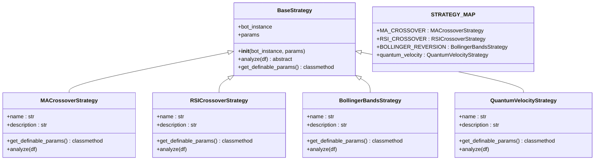
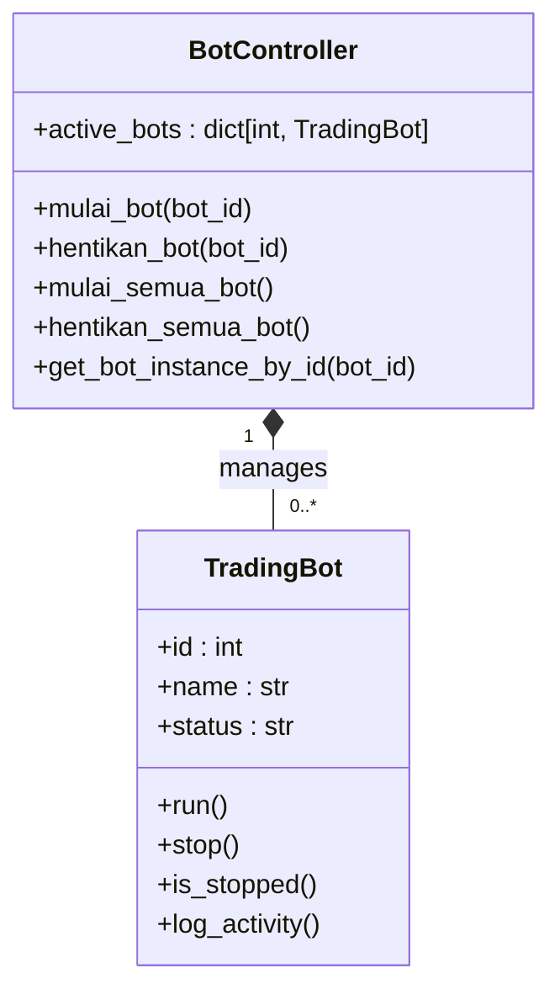
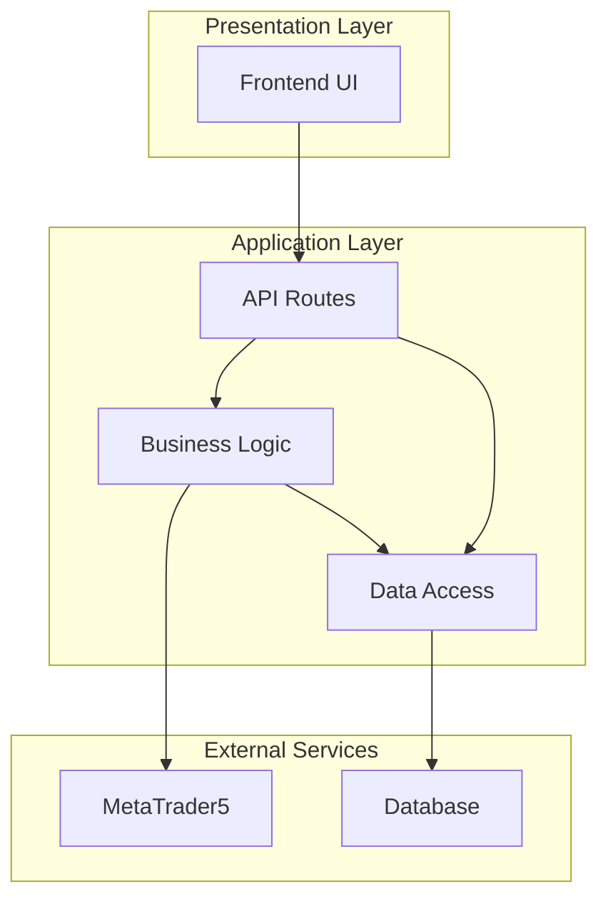

# Architectural Patterns and Design Decisions

<cite>
**Referenced Files in This Document**   
- [controller.py](file://core/bots/controller.py#L1-L176)
- [strategy_map.py](file://core/strategies/strategy_map.py#L1-L27)
- [base_strategy.py](file://core/strategies/base_strategy.py#L1-L28)
- [trading_bot.py](file://core/bots/trading_bot.py#L1-L169)
- [api_bots.py](file://core/routes/api_bots.py#L1-L167)
</cite>

## Table of Contents
1. [Introduction](#introduction)
2. [Strategy Pattern for Pluggable Trading Strategies](#strategy-pattern-for-pluggable-trading-strategies)
3. [Singleton-like Bot Management via active_bots Dictionary](#singleton-like-bot-management-via-active_bots-dictionary)
4. [MVC-inspired Separation of Concerns](#mvc-inspired-separation-of-concerns)
5. [Rationale and Trade-offs](#rationale-and-trade-offs)
6. [Conclusion](#conclusion)

## Introduction
This document provides a comprehensive analysis of the key architectural patterns implemented in the quantumbotx trading system. The system leverages three primary design patterns: the Strategy pattern for dynamic trading logic, a Singleton-like pattern using a runtime registry for bot lifecycle management, and an MVC-inspired separation of concerns between routes, business logic, and data. These patterns work in concert to create a flexible, maintainable, and scalable trading platform that supports dynamic strategy selection, concurrent bot execution, and clean separation between user interface, business logic, and data persistence.

## Strategy Pattern for Pluggable Trading Strategies

The quantumbotx system implements the Strategy pattern to enable dynamic selection and extension of trading logic. This pattern allows the system to support multiple trading algorithms that can be selected at runtime without modifying the core bot execution logic.

The implementation centers around three key components: an abstract base class, concrete strategy implementations, and a strategy registry.



**Diagram sources**
- [base_strategy.py](file://core/strategies/base_strategy.py#L1-L28)
- [strategy_map.py](file://core/strategies/strategy_map.py#L1-L27)

The `BaseStrategy` abstract base class defines the contract that all trading strategies must implement. It provides a constructor that accepts a bot instance and strategy parameters, and declares the abstract `analyze` method that must be implemented by all concrete strategies.

```python
# core/strategies/base_strategy.py
class BaseStrategy(ABC):
    def __init__(self, bot_instance, params: dict = {}):
        self.bot = bot_instance
        self.params = params

    @abstractmethod
    def analyze(self, df):
        raise NotImplementedError("Setiap strategi harus mengimplementasikan metode `analyze(df)`.")
```

The `STRATEGY_MAP` registry in `strategy_map.py` serves as a central catalog of available strategies, mapping strategy identifiers to their corresponding class implementations:

```python
# core/strategies/strategy_map.py
STRATEGY_MAP = {
    'MA_CROSSOVER': MACrossoverStrategy,
    'QUANTUMBOTX_HYBRID': QuantumBotXHybridStrategy,
    'RSI_CROSSOVER': RSICrossoverStrategy,
    'BOLLINGER_REVERSION': BollingerBandsStrategy,
    'quantum_velocity': QuantumVelocityStrategy,
    # ... additional strategies
}
```

When a `TradingBot` instance is created, it uses the strategy name from its configuration to look up the corresponding strategy class in the `STRATEGY_MAP` and instantiate it:

```python
# core/bots/trading_bot.py
def run(self):
    # ...
    strategy_class = STRATEGY_MAP.get(self.strategy_name)
    if not strategy_class:
        raise ValueError(f"Strategi '{self.strategy_name}' tidak ditemukan.")
    
    self.strategy_instance = strategy_class(bot_instance=self, params=self.strategy_params)
    # ...
```

This implementation enables several key benefits:
- **Extensibility**: New trading strategies can be added by creating a new class that inherits from `BaseStrategy` and adding it to the `STRATEGY_MAP`.
- **Dynamic Selection**: The trading strategy is determined at runtime based on the bot's configuration, allowing users to switch strategies without code changes.
- **Consistent Interface**: All strategies implement the same `analyze` method signature, ensuring that the bot execution logic can work with any strategy without modification.
- **Parameterization**: Strategies can define their own configurable parameters through the `get_definable_params` class method, which is used to generate UI forms for strategy configuration.

**Section sources**
- [base_strategy.py](file://core/strategies/base_strategy.py#L1-L28)
- [strategy_map.py](file://core/strategies/strategy_map.py#L1-L27)
- [trading_bot.py](file://core/bots/trading_bot.py#L1-L169)

## Singleton-like Bot Management via active_bots Dictionary

The quantumbotx system implements a Singleton-like pattern for managing active bot instances through the `active_bots` dictionary in `controller.py`. This pattern serves as a runtime registry that tracks all currently executing bot threads, enabling centralized lifecycle management.

The `active_bots` dictionary acts as a global registry with the following characteristics:
- **Key**: Bot ID (integer)
- **Value**: Active `TradingBot` thread instance



**Diagram sources**
- [controller.py](file://core/bots/controller.py#L1-L176)
- [trading_bot.py](file://core/bots/trading_bot.py#L1-L169)

The `active_bots` dictionary is declared at the module level in `controller.py`, making it accessible to all functions within the module:

```python
# core/bots/controller.py
active_bots = {}
```

When a bot is started via the `mulai_bot` function, a new `TradingBot` thread is created, started, and registered in the `active_bots` dictionary:

```python
# core/bots/controller.py
def mulai_bot(bot_id: int):
    # ...
    bot_thread = TradingBot(
        id=bot_data['id'], 
        name=bot_data['name'], 
        # ... other parameters
    )
    bot_thread.start()
    active_bots[bot_id] = bot_thread
    queries.update_bot_status(bot_id, 'Aktif')
    # ...
```

This pattern enables several critical capabilities:
- **Lifecycle Management**: The controller can start, stop, and query the status of any bot by looking it up in the registry.
- **Prevention of Duplicate Instances**: Before starting a bot, the system checks if it's already running in the `active_bots` dictionary.
- **Centralized Control**: Functions like `mulai_semua_bot` and `hentikan_semua_bot` can iterate through all active bots to perform batch operations.
- **State Synchronization**: The in-memory state of active bots is kept in sync with the database status.

The pattern also includes careful handling of race conditions. When stopping a bot, the `pop` method is used to atomically retrieve and remove the bot from the dictionary:

```python
# core/bots/controller.py
def hentikan_bot(bot_id: int):
    bot_thread = active_bots.pop(bot_id, None)
    # ...
```

This atomic operation prevents race conditions that could occur if two processes attempted to stop the same bot simultaneously.

The `get_bot_instance_by_id` function provides a clean interface for other components to access active bot instances:

```python
# core/bots/controller.py
def get_bot_instance_by_id(bot_id: int):
    return active_bots.get(bot_id)
```

This function is used by the API layer to retrieve bot analysis data for display in the user interface.

**Section sources**
- [controller.py](file://core/bots/controller.py#L1-L176)
- [trading_bot.py](file://core/bots/trading_bot.py#L1-L169)

## MVC-inspired Separation of Concerns

The quantumbotx system implements an MVC-inspired architectural pattern that separates concerns between routes (controllers), business logic, and data. This separation creates a clean architecture where each component has a well-defined responsibility.



**Diagram sources**
- [api_bots.py](file://core/routes/api_bots.py#L1-L167)
- [controller.py](file://core/bots/controller.py#L1-L176)
- [queries.py](file://core/db/queries.py)

The **routes** (controllers) are implemented in the `core/routes` directory, with `api_bots.py` serving as a prime example. These route handlers are responsible for:
- Handling HTTP requests and responses
- Parsing request data
- Validating input
- Coordinating calls to business logic and data access components
- Returning appropriate HTTP responses

```python
# core/routes/api_bots.py
@api_bots.route('/api/bots/<int:bot_id>/start', methods=['POST'])
def start_bot_route(bot_id):
    success, message = controller.mulai_bot(bot_id)
    return jsonify({'message': message}) if success else (jsonify({'error': message}), 500)
```

The **business logic** is encapsulated in the `core/bots/controller.py` module, which contains the core functionality for managing bot lifecycles. This separation ensures that the routing logic remains lightweight and focused on request/response handling, while complex business rules are implemented in dedicated modules.

The **data** layer is managed through the `core/db/queries.py` module, which provides a centralized interface for database operations. Route handlers import and use these query functions to interact with the database:

```python
# core/routes/api_bots.py
from core.db import queries

@api_bots.route('/api/bots', methods=['GET'])
def get_bots_route():
    bots = queries.get_all_bots()
    # ...
    return jsonify(bots)
```

This separation of concerns provides several benefits:
- **Maintainability**: Changes to the user interface do not affect business logic, and vice versa.
- **Testability**: Each layer can be tested independently. Route handlers can be tested with mock business logic, and business logic can be tested with mock data access.
- **Reusability**: Business logic functions can be called from multiple routes or even from non-web contexts (e.g., CLI tools).
- **Scalability**: Different layers can be scaled independently if needed.

The pattern is evident in the flow of a typical operation, such as starting a bot:
1. The frontend sends an HTTP POST request to `/api/bots/{id}/start`
2. The `start_bot_route` handler in `api_bots.py` receives the request
3. The handler calls `controller.mulai_bot(bot_id)` to execute the business logic
4. The controller function may call `queries.get_bot_by_id(bot_id)` to retrieve data
5. The controller function updates the bot's status in the database via `queries.update_bot_status`
6. The route handler returns a JSON response to the frontend

This clear separation ensures that each component remains focused on its specific responsibility, making the system easier to understand, maintain, and extend.

**Section sources**
- [api_bots.py](file://core/routes/api_bots.py#L1-L167)
- [controller.py](file://core/bots/controller.py#L1-L176)

## Rationale and Trade-offs

The selection of these architectural patterns was driven by specific requirements for flexibility, maintainability, and scalability in the quantumbotx trading system.

### Strategy Pattern Rationale
The Strategy pattern was chosen to address the need for pluggable trading algorithms. In algorithmic trading, different market conditions require different strategies, and users need the ability to experiment with and deploy multiple approaches. The pattern enables:
- **Rapid Experimentation**: Traders can quickly test new strategies by implementing a new class and adding it to the registry.
- **Risk Management**: Different strategies can be used for different market segments or risk profiles.
- **Community Contributions**: The modular design makes it easy for external developers to contribute new strategies.

Trade-offs considered:
- **Complexity**: The pattern adds abstraction that may be unnecessary for simple systems with only one or two strategies.
- **Performance**: Dynamic strategy selection has minimal overhead, but the abstraction layer could theoretically impact performance in high-frequency trading scenarios (not a concern for this application).

### Singleton-like Pattern Rationale
The `active_bots` dictionary pattern was chosen as a lightweight alternative to a full Singleton implementation. This approach provides:
- **Global Accessibility**: The registry is accessible from any part of the application that needs to interact with active bots.
- **Memory Efficiency**: Only active bots consume memory, unlike a true Singleton that maintains state for the entire application lifecycle.
- **Thread Safety**: The atomic `pop` operation prevents race conditions during bot shutdown.

Trade-offs considered:
- **Global State**: The pattern introduces global state, which can make testing more complex and create hidden dependencies.
- **Process Bound**: The registry only exists within a single process, limiting horizontal scaling options.
- **Memory Leak Risk**: If bots are not properly removed from the registry, memory leaks could occur.

### MVC-inspired Architecture Rationale
The MVC-inspired separation was chosen to create a maintainable and scalable codebase. This approach enables:
- **Team Collaboration**: Different developers can work on routes, business logic, and data access simultaneously with minimal conflicts.
- **Technology Flexibility**: Components can be replaced independently (e.g., switching database technologies without affecting routes).
- **API Evolution**: The API surface can be modified without impacting core business logic.

Trade-offs considered:
- **Boilerplate Code**: The separation can lead to additional code for data transfer between layers.
- **Performance Overhead**: Additional function calls between layers have minimal performance impact but add complexity.
- **Learning Curve**: New developers must understand the architectural conventions before contributing effectively.

These patterns collectively support the system's scalability and testability:
- **Scalability**: The Strategy pattern allows the system to support an arbitrary number of trading algorithms. The bot registry enables management of multiple concurrent trading bots. The MVC separation allows different components to scale independently.
- **Testability**: Each pattern enables focused testing. Strategies can be tested in isolation with mock data. Bot lifecycle management can be tested with mock threads. Route handlers can be tested with mock controllers and queries.

## Conclusion
The quantumbotx system effectively leverages the Strategy pattern, a Singleton-like registry, and MVC-inspired separation to create a flexible, maintainable, and scalable trading platform. The Strategy pattern enables dynamic selection and extension of trading logic through the `STRATEGY_MAP` registry. The `active_bots` dictionary acts as a runtime registry for active bot instances, enabling centralized lifecycle management. The MVC-inspired separation creates clear boundaries between routes, business logic, and data access, improving maintainability and testability.

These architectural choices reflect a thoughtful balance between flexibility and complexity, enabling the system to support a wide range of trading strategies while maintaining a clean, understandable codebase. The patterns work together to create a system that is both powerful enough for sophisticated trading operations and accessible enough for ongoing development and maintenance.