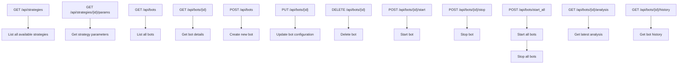
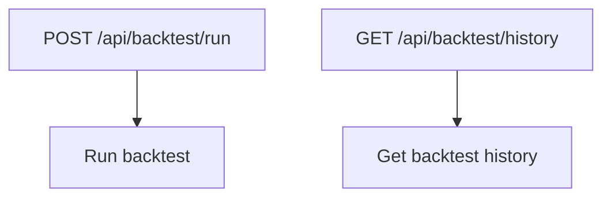
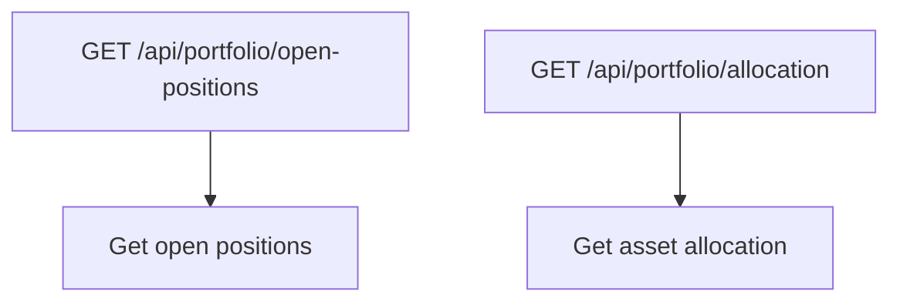
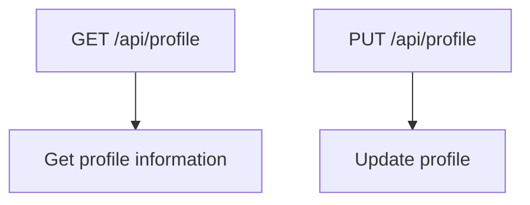
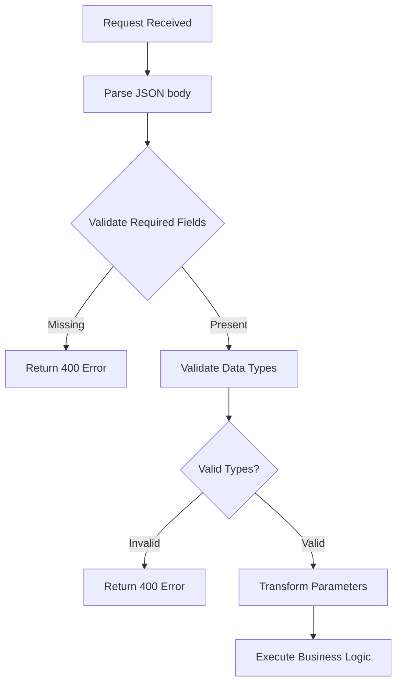
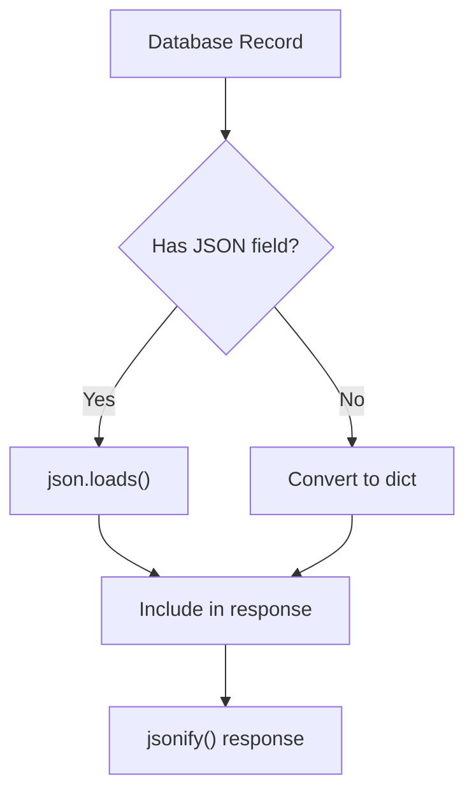

# API Routes and Controllers

<cite>
**Referenced Files in This Document**   
- [api_bots.py](file://core/routes/api_bots.py)
- [controller.py](file://core/bots/controller.py)
- [queries.py](file://core/db/queries.py)
- [trading_bot.py](file://core/bots/trading_bot.py)
- [api_backtest.py](file://core/routes/api_backtest.py)
- [engine.py](file://core/backtesting/engine.py)
- [api_portfolio.py](file://core/routes/api_portfolio.py)
- [api_profile.py](file://core/routes/api_profile.py)
- [validation.py](file://core/utils/validation.py)
</cite>

## Table of Contents
1. [Introduction](#introduction)
2. [Bots API Endpoints](#bots-api-endpoints)
3. [Backtesting API Endpoints](#backtesting-api-endpoints)
4. [Portfolio API Endpoints](#portfolio-api-endpoints)
5. [Profile API Endpoints](#profile-api-endpoints)
6. [Architecture and Design Patterns](#architecture-and-design-patterns)
7. [Input Validation and Parameter Parsing](#input-validation-and-parameter-parsing)
8. [JSON Serialization Patterns](#json-serialization-patterns)
9. [Rate Limiting Considerations](#rate-limiting-considerations)
10. [API Stability Guarantees](#api-stability-guarantees)
11. [Curl Examples](#curl-examples)

## Introduction
This document provides comprehensive documentation for the RESTful API endpoints in the QuantumBotX trading system. The API is built using Flask and organized into modular blueprints that handle different functional areas including bots, backtesting, portfolio management, and user profile operations. The system follows a clean separation of concerns between route handlers, business logic controllers, and data access layers. All endpoints return JSON responses and follow REST conventions for HTTP methods and status codes.

## Bots API Endpoints
The bots API provides comprehensive management of automated trading bots, including creation, configuration, lifecycle control, and monitoring.

### HTTP Methods and Endpoints


**Diagram sources**
- [api_bots.py](file://core/routes/api_bots.py#L15-L167)

**Section sources**
- [api_bots.py](file://core/routes/api_bots.py#L15-L167)

### Request/Response Schemas
#### Bot Creation Request
```json
{
  "name": "string",
  "market": "string",
  "risk_percent": "number",
  "sl_atr_multiplier": "integer",
  "tp_atr_multiplier": "integer",
  "timeframe": "string",
  "check_interval_seconds": "integer",
  "strategy": "string",
  "params": {
    "custom": "object"
  }
}
```

#### Bot Response
```json
{
  "id": "integer",
  "name": "string",
  "market": "string",
  "lot_size": "number",
  "sl_pips": "integer",
  "tp_pips": "integer",
  "timeframe": "string",
  "check_interval_seconds": "integer",
  "strategy": "string",
  "strategy_params": "object",
  "status": "string",
  "strategy_name": "string"
}
```

### Authentication Requirements
All bot endpoints require authentication via session cookies. Users must be logged in to access these endpoints.

### Error Codes
- **200 OK**: Successful GET request
- **201 Created**: Successful bot creation
- **400 Bad Request**: Invalid input parameters
- **404 Not Found**: Bot or strategy not found
- **500 Internal Server Error**: Server-side error

## Backtesting API Endpoints
The backtesting API enables users to run historical simulations of trading strategies with various parameter configurations.

### HTTP Methods and Endpoints


**Diagram sources**
- [api_backtest.py](file://core/routes/api_backtest.py#L30-L130)

**Section sources**
- [api_backtest.py](file://core/routes/api_backtest.py#L30-L130)

### Request/Response Schemas
#### Backtest Request (multipart/form-data)
- **file**: CSV file with historical price data
- **strategy**: Strategy ID (string)
- **params**: JSON string with strategy parameters

#### Backtest Response
```json
{
  "strategy_name": "string",
  "total_trades": "integer",
  "final_capital": "number",
  "total_profit_usd": "number",
  "win_rate_percent": "number",
  "wins": "integer",
  "losses": "integer",
  "max_drawdown_percent": "number",
  "equity_curve": "array",
  "trades": "array"
}
```

### Authentication Requirements
Backtesting endpoints require authentication via session cookies.

### Error Codes
- **200 OK**: Successful backtest execution
- **400 Bad Request**: Missing file or invalid parameters
- **500 Internal Server Error**: Backtest execution error

## Portfolio API Endpoints
The portfolio API provides real-time information about open positions and asset allocation.

### HTTP Methods and Endpoints


**Diagram sources**
- [api_portfolio.py](file://core/routes/api_portfolio.py#L10-L57)

**Section sources**
- [api_portfolio.py](file://core/routes/api_portfolio.py#L10-L57)

### Request/Response Schemas
#### Open Positions Response
```json
[
  {
    "ticket": "integer",
    "symbol": "string",
    "volume": "number",
    "price_open": "number",
    "current_price": "number",
    "profit": "number",
    "type": "integer"
  }
]
```

#### Asset Allocation Response
```json
{
  "labels": "array",
  "values": "array"
}
```

### Authentication Requirements
Portfolio endpoints require authentication via session cookies.

### Error Codes
- **200 OK**: Successful request
- **500 Internal Server Error**: Backend error retrieving data

## Profile API Endpoints
The profile API handles user profile information and password updates.

### HTTP Methods and Endpoints


**Diagram sources**
- [api_profile.py](file://core/routes/api_profile.py#L15-L39)

**Section sources**
- [api_profile.py](file://core/routes/api_profile.py#L15-L39)

### Request/Response Schemas
#### Profile Response
```json
{
  "id": "integer",
  "name": "string",
  "email": "string",
  "join_date": "string"
}
```

#### Profile Update Request
```json
{
  "name": "string",
  "password": "string (optional)"
}
```

### Authentication Requirements
Profile endpoints require authentication via session cookies.

### Error Codes
- **200 OK**: Successful request
- **400 Bad Request**: Invalid input
- **404 Not Found**: User not found

## Architecture and Design Patterns
The API follows a clean separation of concerns between route handlers, business logic, and data access layers.

```mermaid
classDiagram
class ApiBots {
+get_strategies_route()
+get_strategy_params_route()
+get_bots_route()
+add_bot_route()
+update_bot_route()
+delete_bot_route()
+start_bot_route()
+stop_bot_route()
}
class BotController {
+mulai_bot()
+hentikan_bot()
+perbarui_bot()
+hapus_bot()
+get_bot_instance_by_id()
}
class Queries {
+get_all_bots()
+get_bot_by_id()
+add_bot()
+update_bot()
+delete_bot()
+update_bot_status()
}
class TradingBot {
-_stop_event
-status
-last_analysis
+run()
+stop()
+log_activity()
}
ApiBots --> BotController : "delegates"
BotController --> Queries : "uses"
BotController --> TradingBot : "manages"
TradingBot --> "Strategy Classes" : "uses"
```

**Diagram sources**
- [api_bots.py](file://core/routes/api_bots.py#L15-L167)
- [controller.py](file://core/bots/controller.py#L15-L176)
- [queries.py](file://core/db/queries.py#L15-L174)
- [trading_bot.py](file://core/bots/trading_bot.py#L15-L169)

**Section sources**
- [api_bots.py](file://core/routes/api_bots.py#L15-L167)
- [controller.py](file://core/bots/controller.py#L15-L176)
- [queries.py](file://core/db/queries.py#L15-L174)
- [trading_bot.py](file://core/bots/trading_bot.py#L15-L169)

### Separation of Route Handlers and Business Logic
The system implements a clear separation between Flask route handlers and business logic:
- **Route handlers** (api_bots.py): Handle HTTP requests, parse input, and return responses
- **Controller** (controller.py): Contains business logic for bot lifecycle management
- **Data Access** (queries.py): Handles database operations
- **Core Logic** (trading_bot.py): Implements the trading bot functionality

This separation allows for easier testing, maintenance, and extension of the system.

## Input Validation and Parameter Parsing
The system implements input validation at multiple levels to ensure data integrity.

### Validation Patterns


**Diagram sources**
- [validation.py](file://core/utils/validation.py#L1-L20)
- [api_bots.py](file://core/routes/api_bots.py#L58-L90)

**Section sources**
- [validation.py](file://core/utils/validation.py#L1-L20)

### Validation Implementation
The system uses a dedicated validation module that checks:
- Required fields are present
- Data types are correct (numbers, integers, strings)
- Values are within acceptable ranges (positive numbers for risk parameters)

Example validation function:
```python
def validate_bot_params(data):
    required_fields = ['name', 'market', 'lot_size', 'sl_pips', 'tp_pips', 'timeframe', 'check_interval_seconds', 'strategy']
    errors = []

    for field in required_fields:
        if field not in data:
            errors.append(f"Field '{field}' is required.")

    if not isinstance(data.get('lot_size'), (int, float)) or data['lot_size'] <= 0:
        errors.append("Lot size must be a positive number.")

    if not isinstance(data.get('sl_pips'), int) or data['sl_pips'] <= 0:
        errors.append("SL (Stop Loss) must be a positive integer.")

    if not isinstance(data.get('tp_pips'), int) or data['tp_pips'] <= 0:
        errors.append("TP (Take Profit) must be a positive integer.")

    return errors
```

## JSON Serialization Patterns
The system uses consistent JSON serialization patterns for data exchange between client and server.

### Database to JSON Transformation


**Diagram sources**
- [api_bots.py](file://core/routes/api_bots.py#L70-L75)
- [api_backtest.py](file://core/routes/api_backtest.py#L114-L130)

**Section sources**
- [api_bots.py](file://core/routes/api_bots.py#L70-L75)
- [api_backtest.py](file://core/routes/api_backtest.py#L114-L130)

### Key Patterns
1. **Strategy Parameters**: Stored as JSON strings in the database, converted to objects for API responses
2. **History Data**: Trade logs and equity curves stored as JSON, parsed before sending to client
3. **Error Handling**: All responses wrapped in jsonify() for proper JSON encoding
4. **Date Handling**: Timestamps converted to string format for JSON serialization

## Rate Limiting Considerations
The current implementation does not include explicit rate limiting mechanisms.

### Analysis
- No Flask-Limiter or similar rate limiting libraries are imported or configured
- No rate limiting decorators are applied to API endpoints
- No rate limiting configuration files are present in the project

### Recommendations
For production deployment, consider implementing rate limiting to:
- Prevent abuse of API endpoints
- Protect backend resources
- Ensure fair usage among users

Possible solutions include:
- Flask-Limiter with in-memory or Redis backend
- NGINX rate limiting at the proxy level
- Custom rate limiting middleware

## API Stability Guarantees
The API provides stability through consistent design patterns and backward compatibility considerations.

### Stability Features
- **Consistent Endpoint Structure**: All endpoints follow REST conventions
- **Backward Compatible Responses**: Response schemas include stable field names
- **Error Handling**: Standardized error responses with descriptive messages
- **Versioning**: While not explicitly versioned, the modular structure allows for future versioning

### Recommendations for Stability
1. Implement API versioning (e.g., /api/v1/bots) for future changes
2. Maintain backward compatibility when extending endpoints
3. Document breaking changes clearly
4. Use semantic versioning for API releases

## Curl Examples
Practical examples of API usage with curl commands.

### Bot Creation
```bash
curl -X POST https://localhost:5000/api/bots \
  -H "Content-Type: application/json" \
  -H "Cookie: session=your_session_cookie" \
  -d '{
    "name": "My Trading Bot",
    "market": "EURUSD",
    "risk_percent": 1.0,
    "sl_atr_multiplier": 2,
    "tp_atr_multiplier": 4,
    "timeframe": "H1",
    "check_interval_seconds": 60,
    "strategy": "bollinger_reversion",
    "params": {
      "bb_length": 20,
      "bb_std": 2.0
    }
  }'
```

### Start Bot
```bash
curl -X POST https://localhost:5000/api/bots/1/start \
  -H "Cookie: session=your_session_cookie"
```

### Stop Bot
```bash
curl -X POST https://localhost:5000/api/bots/1/stop \
  -H "Cookie: session=your_session_cookie"
```

### Run Backtest
```bash
curl -X POST https://localhost:5000/api/backtest/run \
  -H "Cookie: session=your_session_cookie" \
  -F "file=@historical_data.csv" \
  -F "strategy=bollinger_reversion" \
  -F 'params={"bb_length": 20, "bb_std": 2.0}'
```