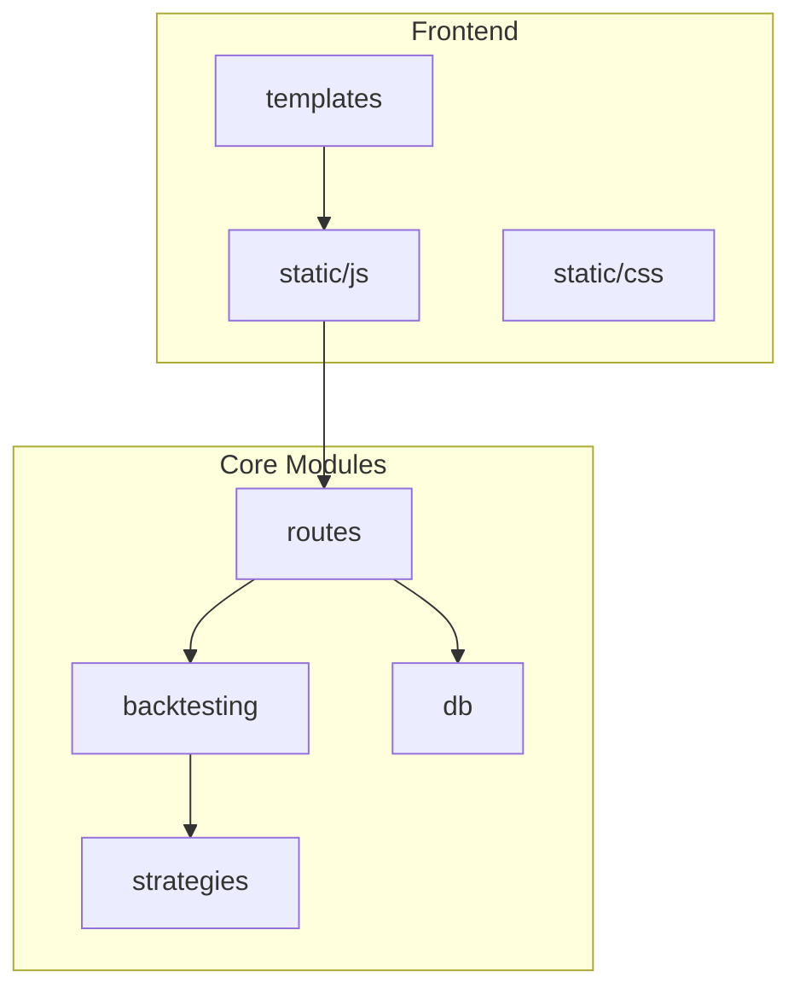
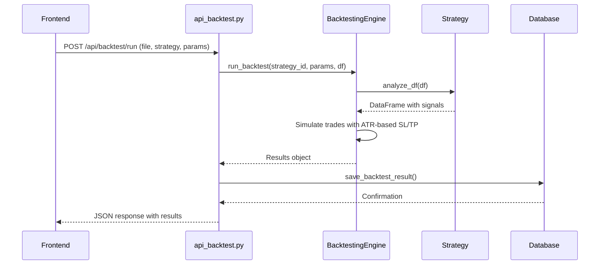
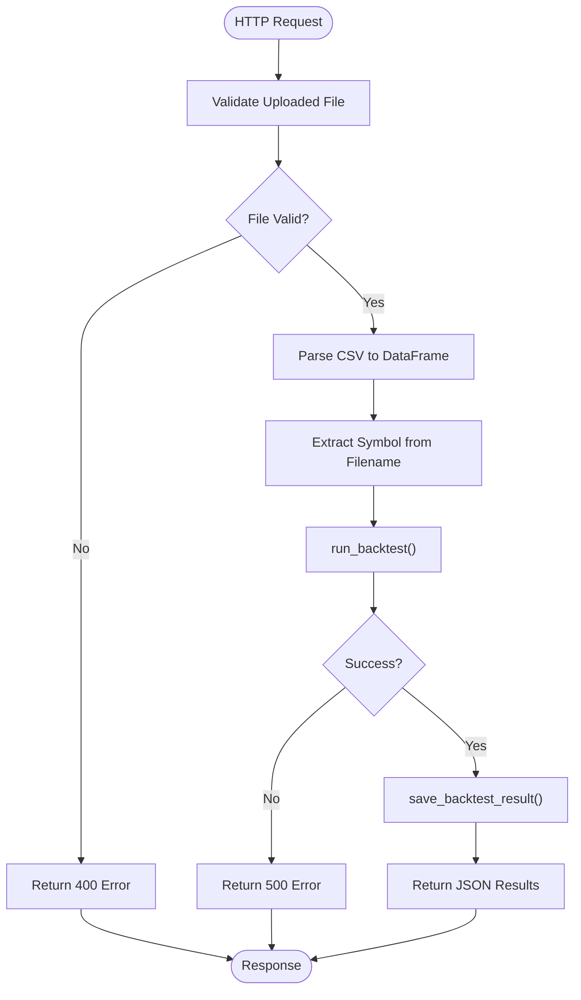
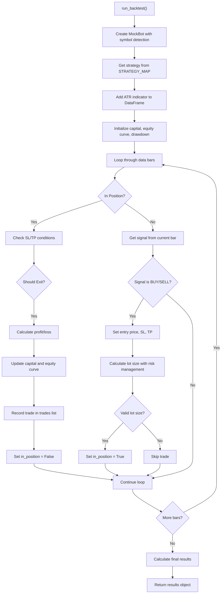
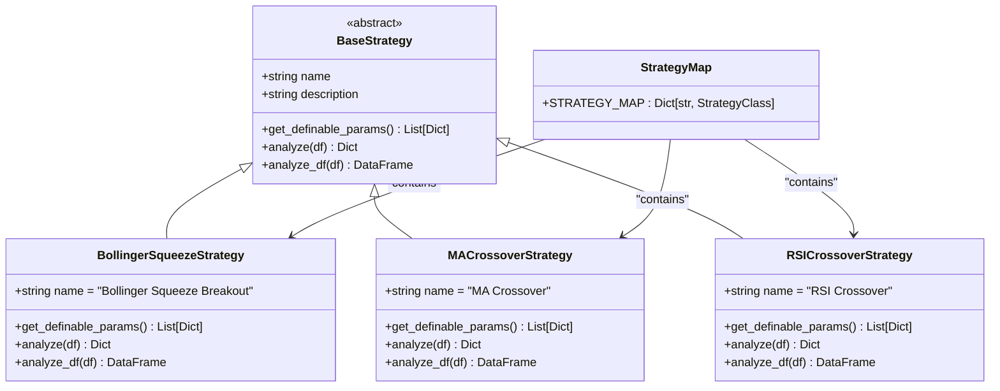
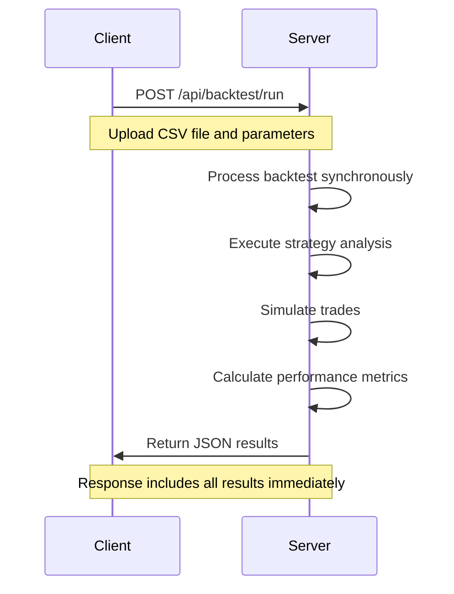
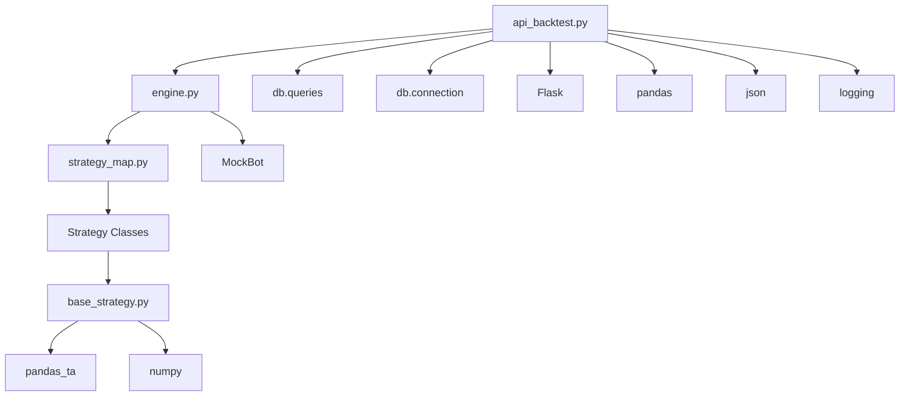

# Backtesting API

<cite>
**Referenced Files in This Document**   
- [api_backtest.py](file://core/routes/api_backtest.py#L0-L130)
- [engine.py](file://core/backtesting/engine.py#L0-L317)
- [strategy_map.py](file://core/strategies/strategy_map.py#L0-L29)
- [bollinger_squeeze.py](file://core/strategies/bollinger_squeeze.py#L0-L88)
- [init_db.py](file://init_db.py#L80-L114)
- [backtesting.html](file://templates/backtesting.html#L0-L67)
- [backtesting.js](file://static/js/backtesting.js)
- [backtest_history.js](file://static/js/backtest_history.js#L0-L301)
</cite>

## Table of Contents
1. [Introduction](#introduction)
2. [Project Structure](#project-structure)
3. [Core Components](#core-components)
4. [Architecture Overview](#architecture-overview)
5. [Detailed Component Analysis](#detailed-component-analysis)
6. [Dependency Analysis](#dependency-analysis)
7. [Performance Considerations](#performance-considerations)
8. [Troubleshooting Guide](#troubleshooting-guide)
9. [Conclusion](#conclusion)

## Introduction
The Backtesting API enables users to simulate trading strategies against historical market data to evaluate performance before live deployment. This document details the API's functionality, request/response patterns, core engine logic, and integration with frontend components. The system supports multiple strategies, dynamic position sizing, and comprehensive result analysis including equity curves, trade logs, and risk metrics.

## Project Structure
The project follows a modular structure with clear separation of concerns. Core functionality is organized into distinct packages for backtesting, strategies, database operations, and API routes.



**Diagram sources**
- [api_backtest.py](file://core/routes/api_backtest.py#L0-L130)
- [engine.py](file://core/backtesting/engine.py#L0-L317)

**Section sources**
- [api_backtest.py](file://core/routes/api_backtest.py#L0-L130)
- [engine.py](file://core/backtesting/engine.py#L0-L317)

## Core Components
The Backtesting API consists of several key components:
- **API Route Handler**: Manages HTTP requests and responses
- **Backtesting Engine**: Executes simulation logic on historical data
- **Strategy Registry**: Maps strategy IDs to their implementations
- **Database Interface**: Stores and retrieves backtest results
- **Frontend Integration**: Provides user interface for configuration and results visualization

The system processes CSV-formatted historical data, applies strategy-specific logic to generate trading signals, and simulates trades with configurable risk parameters.

**Section sources**
- [api_backtest.py](file://core/routes/api_backtest.py#L0-L130)
- [engine.py](file://core/backtesting/engine.py#L0-L317)
- [strategy_map.py](file://core/strategies/strategy_map.py#L0-L29)

## Architecture Overview
The Backtesting API follows a layered architecture with clear data flow from frontend to database.



**Diagram sources**
- [api_backtest.py](file://core/routes/api_backtest.py#L0-L130)
- [engine.py](file://core/backtesting/engine.py#L0-L317)

## Detailed Component Analysis

### Backtesting API Endpoint
The `/api/backtest/run` POST endpoint initiates backtesting simulations with user-provided parameters.



**Diagram sources**
- [api_backtest.py](file://core/routes/api_backtest.py#L59-L130)

**Section sources**
- [api_backtest.py](file://core/routes/api_backtest.py#L59-L130)

### Backtesting Engine Logic
The core backtesting engine processes historical data through strategy analysis and trade simulation.



**Diagram sources**
- [engine.py](file://core/backtesting/engine.py#L0-L317)

**Section sources**
- [engine.py](file://core/backtesting/engine.py#L0-L317)

### Strategy Configuration and Parameters
The system supports multiple trading strategies through a registry pattern with dynamic parameter handling.



**Diagram sources**
- [strategy_map.py](file://core/strategies/strategy_map.py#L0-L29)
- [bollinger_squeeze.py](file://core/strategies/bollinger_squeeze.py#L0-L88)

**Section sources**
- [strategy_map.py](file://core/strategies/strategy_map.py#L0-L29)
- [bollinger_squeeze.py](file://core/strategies/bollinger_squeeze.py#L0-L88)

### Request Schema and Parameter Structure
The API accepts a multipart form request with specific parameter requirements.

**Request Structure:**
- **file**: CSV file with historical market data (required)
- **strategy**: Strategy ID from STRATEGY_MAP (required)
- **params**: JSON string with strategy-specific parameters (optional)
- **sl_atr_multiplier**: ATR multiplier for stop loss distance (optional, default: 2.0)
- **tp_atr_multiplier**: ATR multiplier for take profit distance (optional, default: 4.0)

**Strategy-Specific Parameters (Bollinger Squeeze):**
- **bb_length**: Length of Bollinger Bands (number, default: 20)
- **bb_std**: Standard deviation for Bollinger Bands (number, default: 2.0)
- **squeeze_window**: Window for average bandwidth calculation (number, default: 10)
- **squeeze_factor**: Factor for squeeze level calculation (number, default: 0.7)
- **rsi_period**: Period for RSI calculation (number, default: 14)

**Section sources**
- [api_backtest.py](file://core/routes/api_backtest.py#L59-L130)
- [bollinger_squeeze.py](file://core/strategies/bollinger_squeeze.py#L0-L88)

### Asynchronous Response Pattern
The API follows a synchronous request-response pattern with immediate results return.



**Diagram sources**
- [api_backtest.py](file://core/routes/api_backtest.py#L59-L130)

**Section sources**
- [api_backtest.py](file://core/routes/api_backtest.py#L59-L130)

### Data Persistence and Schema
Backtest results are stored in a SQLite database with a comprehensive schema.

```mermaid
erDiagram
BACKTEST_RESULTS {
int id PK
datetime timestamp
string strategy_name
string data_filename
float total_profit_usd
int total_trades
float win_rate_percent
float max_drawdown_percent
int wins
int losses
string equity_curve JSON
string trade_log JSON
string parameters JSON
}
```

**Database Schema:**
- **id**: Primary key, auto-incrementing integer
- **timestamp**: DATETIME with default CURRENT_TIMESTAMP
- **strategy_name**: TEXT, not null
- **data_filename**: TEXT, not null
- **total_profit_usd**: REAL, not null
- **total_trades**: INTEGER, not null
- **win_rate_percent**: REAL, not null
- **max_drawdown_percent**: REAL, not null
- **wins**: INTEGER, not null
- **losses**: INTEGER, not null
- **equity_curve**: TEXT (JSON format)
- **trade_log**: TEXT (JSON format)
- **parameters**: TEXT (JSON format)

**Section sources**
- [init_db.py](file://init_db.py#L80-L114)
- [api_backtest.py](file://core/routes/api_backtest.py#L25-L57)

## Dependency Analysis
The Backtesting API has a clear dependency hierarchy with minimal circular dependencies.



**Diagram sources**
- [api_backtest.py](file://core/routes/api_backtest.py#L0-L130)
- [engine.py](file://core/backtesting/engine.py#L0-L317)
- [strategy_map.py](file://core/strategies/strategy_map.py#L0-L29)

**Section sources**
- [api_backtest.py](file://core/routes/api_backtest.py#L0-L130)
- [engine.py](file://core/backtesting/engine.py#L0-L317)
- [strategy_map.py](file://core/strategies/strategy_map.py#L0-L29)

## Performance Considerations
The backtesting system has several performance characteristics to consider:

- **Memory Usage**: Historical data is loaded entirely into memory as a pandas DataFrame
- **Computation Complexity**: O(n) where n is the number of data points, with additional overhead for indicator calculations
- **I/O Operations**: CSV file parsing and database writes contribute to overall execution time
- **Strategy Impact**: Complex strategies with multiple indicators will increase processing time
- **Gold Market Special Handling**: XAUUSD trades have additional volatility checks that add computational overhead

The system processes data sequentially without parallelization, making it suitable for moderate-sized datasets but potentially slow for very large historical datasets.

## Troubleshooting Guide
Common issues and their solutions:

**Invalid Date Ranges:**
- Ensure CSV file contains a 'time' column with parseable date/time values
- Verify date format is compatible with pandas.to_datetime()
- Check for missing or malformed timestamp entries

**Unsupported Strategies:**
- Verify strategy ID matches exactly with keys in STRATEGY_MAP
- Check case sensitivity (all strategy IDs are uppercase)
- Ensure the strategy file is properly imported in strategy_map.py

**NaN/Inf Values in Results:**
- The system automatically converts NaN/Inf values to None before database storage
- Check for division by zero in custom strategy logic
- Validate that all mathematical operations produce finite results

**File Upload Issues:**
- Ensure file is in CSV format with proper headers
- Verify file contains required columns: 'time', 'open', 'high', 'low', 'close', 'volume'
- Check file size limitations imposed by the server

**Database Connection Errors:**
- Verify bots.db file is writable
- Check that SQLite database is not locked by another process
- Ensure the backtest_results table exists (run init_db.py if necessary)

**Section sources**
- [api_backtest.py](file://core/routes/api_backtest.py#L0-L130)
- [engine.py](file://core/backtesting/engine.py#L0-L317)
- [init_db.py](file://init_db.py#L80-L114)

## Conclusion
The Backtesting API provides a comprehensive framework for evaluating trading strategies against historical data. It features a modular design with clear separation between API interface, core engine, and strategy implementations. The system supports multiple strategies through a registry pattern, handles risk management with ATR-based position sizing, and provides detailed performance metrics. Results are persisted to a database for historical analysis and can be visualized through the frontend interface. The API follows RESTful principles with clear request/response patterns and robust error handling.