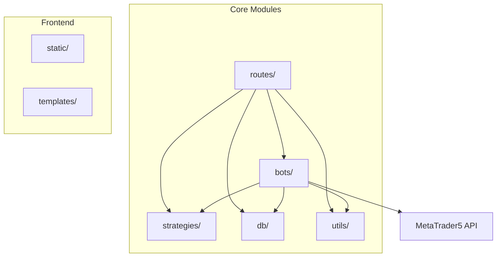
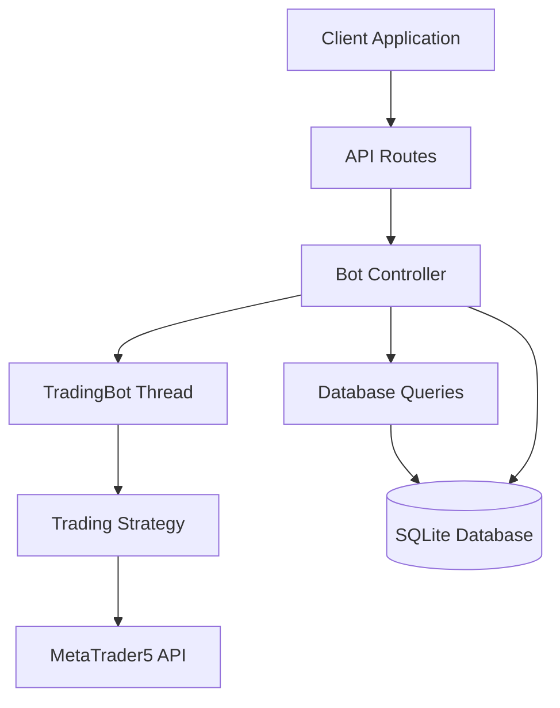
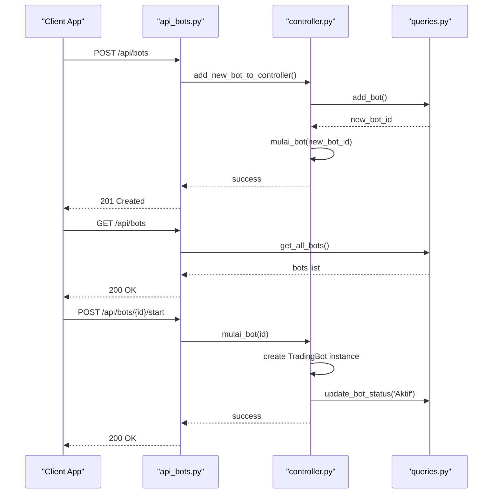
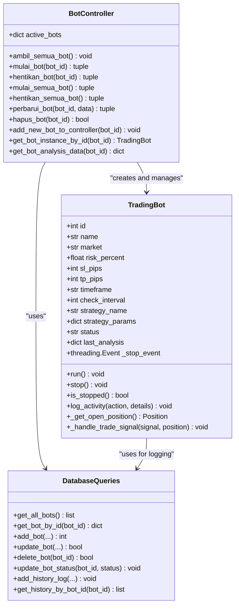
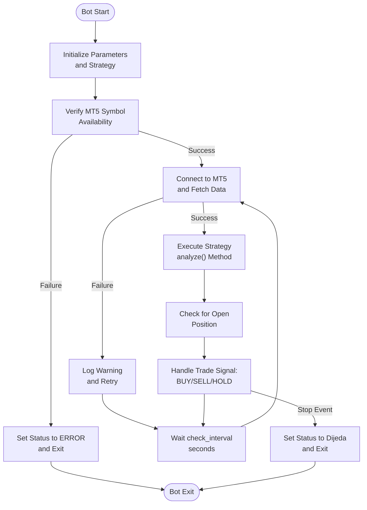
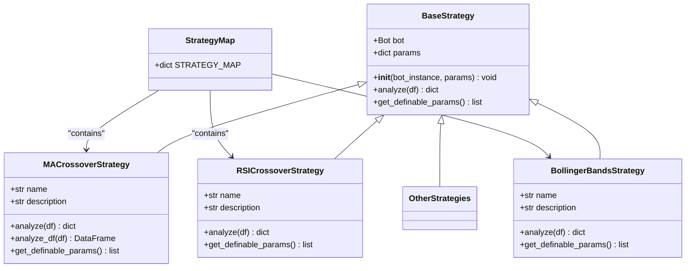
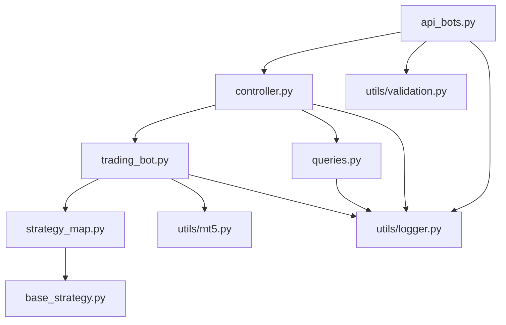

# Bots API

<cite>
**Referenced Files in This Document**   
- [api_bots.py](file://core/routes/api_bots.py#L1-L167)
- [controller.py](file://core/bots/controller.py#L1-L176)
- [trading_bot.py](file://core/bots/trading_bot.py#L1-L169)
- [validation.py](file://core/utils/validation.py#L1-L20)
- [strategy_map.py](file://core/strategies/strategy_map.py#L1-L29)
- [ma_crossover.py](file://core/strategies/ma_crossover.py#L1-L60)
- [base_strategy.py](file://core/strategies/base_strategy.py#L1-L28)
- [queries.py](file://core/db/queries.py#L1-L174)
</cite>

## Table of Contents
1. [Introduction](#introduction)
2. [Project Structure](#project-structure)
3. [Core Components](#core-components)
4. [Architecture Overview](#architecture-overview)
5. [Detailed Component Analysis](#detailed-component-analysis)
6. [Dependency Analysis](#dependency-analysis)
7. [Performance Considerations](#performance-considerations)
8. [Troubleshooting Guide](#troubleshooting-guide)
9. [Conclusion](#conclusion)

## Introduction
This document provides comprehensive RESTful API documentation for the Bots API endpoints in the QuantumBotX trading system. It details all available HTTP methods for bot management operations, including creation, deletion, starting, stopping, and listing bots. The documentation covers request and response schemas, authentication mechanisms, error handling, and practical usage examples. The system is built on a Flask backend with threading for concurrent bot execution, SQLite for persistent storage, and MetaTrader5 for market data and trade execution. This guide is designed to be accessible to both technical developers and non-technical users who need to understand the API's capabilities and integration points.

## Project Structure
The QuantumBotX project follows a modular structure with clear separation of concerns. The core functionality is organized into distinct packages for bots, database operations, strategies, and API routes. The bots module contains the business logic for bot management, while the strategies module houses various trading algorithms. Database interactions are abstracted through the db package, and API endpoints are defined in the routes package. Utility functions for validation, logging, and MT5 integration are centralized in the utils package. Static assets and templates support the frontend interface, which interacts with the backend through the documented RESTful endpoints.

**Diagram sources**
- [api_bots.py](file://core/routes/api_bots.py#L1-L167)
- [controller.py](file://core/bots/controller.py#L1-L176)

**Section sources**
- [api_bots.py](file://core/routes/api_bots.py#L1-L167)
- [controller.py](file://core/bots/controller.py#L1-L176)

## Core Components
The Bots API system consists of several core components that work together to manage automated trading bots. The API routes in `api_bots.py` serve as the entry point for all bot-related operations, delegating business logic to controller functions in `controller.py`. The `TradingBot` class implements the threading model for concurrent bot execution, while the strategy system allows for pluggable trading algorithms. Input validation is performed using utility functions, and all bot state is persisted in a SQLite database through query functions. The system integrates with MetaTrader5 for market data and trade execution, providing a complete automated trading solution.

**Section sources**
- [api_bots.py](file://core/routes/api_bots.py#L1-L167)
- [controller.py](file://core/bots/controller.py#L1-L176)
- [trading_bot.py](file://core/bots/trading_bot.py#L1-L169)

## Architecture Overview
The Bots API follows a layered architecture with clear separation between presentation, business logic, and data access layers. API routes handle HTTP requests and responses, the controller manages bot lifecycle operations, and database queries handle persistence. Trading bots execute in separate threads, allowing concurrent operation of multiple strategies. The strategy pattern enables extensibility through pluggable trading algorithms. All components communicate through well-defined interfaces, promoting maintainability and testability. The system uses a shared database for state persistence, ensuring consistency across application restarts.

**Diagram sources**
- [api_bots.py](file://core/routes/api_bots.py#L1-L167)
- [controller.py](file://core/bots/controller.py#L1-L176)
- [trading_bot.py](file://core/bots/trading_bot.py#L1-L169)
- [queries.py](file://core/db/queries.py#L1-L174)

## Detailed Component Analysis

### API Endpoint Analysis
The Bots API provides a comprehensive set of RESTful endpoints for managing trading bots. These endpoints follow standard HTTP methods and return JSON responses. The API supports bot creation, retrieval, updating, deletion, and control operations like starting and stopping. Each endpoint includes proper error handling and status codes to facilitate client integration.

#### API Routes Sequence Diagram

**Diagram sources**
- [api_bots.py](file://core/routes/api_bots.py#L1-L167)
- [controller.py](file://core/bots/controller.py#L1-L176)
- [queries.py](file://core/db/queries.py#L1-L174)

**Section sources**
- [api_bots.py](file://core/routes/api_bots.py#L1-L167)

### Bot Controller Analysis
The bot controller manages the lifecycle of trading bots, handling operations like starting, stopping, updating, and deleting bots. It maintains a dictionary of active bot instances to prevent duplicate execution and ensure thread safety. The controller coordinates between the API layer and the underlying bot implementation, translating HTTP requests into bot operations. It also handles error conditions and ensures database consistency during state transitions.

#### Controller Class Diagram

**Diagram sources**
- [controller.py](file://core/bots/controller.py#L1-L176)
- [trading_bot.py](file://core/bots/trading_bot.py#L1-L169)
- [queries.py](file://core/db/queries.py#L1-L174)

**Section sources**
- [controller.py](file://core/bots/controller.py#L1-L176)

### Trading Bot Implementation
The `TradingBot` class extends Python's `threading.Thread` to enable concurrent execution of multiple trading bots. Each bot runs in its own thread, periodically analyzing market data and executing trades based on its configured strategy. The bot implementation includes a stop event for graceful shutdown, error handling for robust operation, and activity logging for monitoring and debugging. The bot maintains its state and analysis results, making them available through the API.

#### Trading Bot Execution Flowchart

**Diagram sources**
- [trading_bot.py](file://core/bots/trading_bot.py#L1-L169)

**Section sources**
- [trading_bot.py](file://core/bots/trading_bot.py#L1-L169)

### Strategy System Analysis
The strategy system implements a pluggable architecture for trading algorithms using a strategy map pattern. Each strategy inherits from a common `BaseStrategy` class and implements the `analyze` method to generate trading signals. The system supports strategy-specific parameters that can be configured through the API. Strategies are registered in a central map, making them discoverable and instantiable by the bot controller.

#### Strategy Class Hierarchy

**Diagram sources**
- [base_strategy.py](file://core/strategies/base_strategy.py#L1-L28)
- [ma_crossover.py](file://core/strategies/ma_crossover.py#L1-L60)
- [strategy_map.py](file://core/strategies/strategy_map.py#L1-L29)

**Section sources**
- [base_strategy.py](file://core/strategies/base_strategy.py#L1-L28)
- [ma_crossover.py](file://core/strategies/ma_crossover.py#L1-L60)
- [strategy_map.py](file://core/strategies/strategy_map.py#L1-L29)

## Dependency Analysis
The Bots API system has a well-defined dependency structure with minimal circular dependencies. The API routes depend on the controller, which in turn depends on the trading bot implementation and database queries. The trading bot depends on specific strategy classes and MT5 integration utilities. All components depend on the core utilities for logging and validation. The database queries module has no external dependencies beyond the standard library and SQLite.

**Diagram sources**
- [api_bots.py](file://core/routes/api_bots.py#L1-L167)
- [controller.py](file://core/bots/controller.py#L1-L176)
- [trading_bot.py](file://core/bots/trading_bot.py#L1-L169)
- [queries.py](file://core/db/queries.py#L1-L174)
- [strategy_map.py](file://core/strategies/strategy_map.py#L1-L29)
- [base_strategy.py](file://core/strategies/base_strategy.py#L1-L28)
- [validation.py](file://core/utils/validation.py#L1-L20)

**Section sources**
- [api_bots.py](file://core/routes/api_bots.py#L1-L167)
- [controller.py](file://core/bots/controller.py#L1-L176)

## Performance Considerations
The Bots API is designed with performance and scalability in mind. The use of threading allows multiple bots to operate concurrently without blocking the main application thread. However, each bot runs in a loop with a sleep interval, which should be configured appropriately to avoid excessive API calls to MT5. Database operations are wrapped in transactions to ensure consistency and performance. The system caches active bot instances in memory to avoid repeated database queries for state information. For high-frequency trading strategies, the check interval should be carefully tuned to balance responsiveness with system load.

## Troubleshooting Guide
Common issues with the Bots API typically involve configuration errors, connectivity problems, or strategy implementation bugs. When a bot fails to start, check the symbol availability in MT5's Market Watch and verify the bot's configuration parameters. If trades are not being executed as expected, review the strategy's analysis logic and ensure the bot has the necessary permissions in MT5. For database-related errors, verify the SQLite file permissions and check the application logs for specific error messages. Race conditions during bot state changes are mitigated by using atomic operations like `pop()` on the active bots dictionary.

**Section sources**
- [controller.py](file://core/bots/controller.py#L1-L176)
- [trading_bot.py](file://core/bots/trading_bot.py#L1-L169)
- [queries.py](file://core/db/queries.py#L1-L174)

## Conclusion
The Bots API provides a robust and extensible framework for managing automated trading bots. Its RESTful design makes it easy to integrate with various frontend applications, while its modular architecture ensures maintainability and scalability. The system effectively handles the complexities of concurrent bot execution, strategy management, and state persistence. By following the documented endpoints and best practices, developers can create, manage, and monitor trading bots with confidence. The comprehensive error handling and logging capabilities facilitate debugging and ensure reliable operation in production environments.