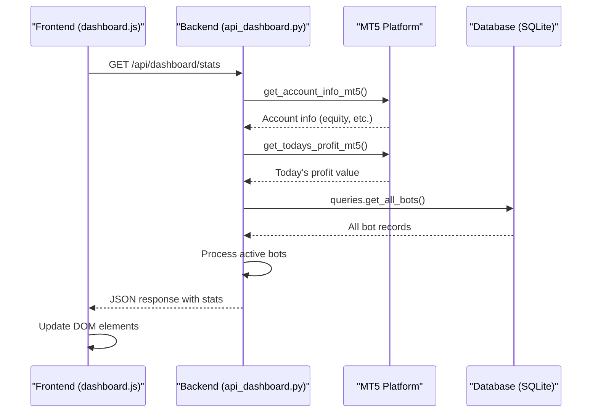

# Dashboard API

<cite>
**Referenced Files in This Document**   
- [api_dashboard.py](file://core/routes/api_dashboard.py#L9-L27)
- [mt5.py](file://core/utils/mt5.py#L24-L35)
- [mt5.py](file://core/utils/mt5.py#L124-L144)
- [queries.py](file://core/db/queries.py#L4-L19)
- [dashboard.js](file://static/js/dashboard.js#L10-L37)
- [index.html](file://templates/index.html#L1-L62)
- [__init__.py](file://core/__init__.py#L51-L63)
</cite>

## Table of Contents
1. [Introduction](#introduction)
2. [API Endpoint Overview](#api-endpoint-overview)
3. [Data Sources Integration](#data-sources-integration)
4. [Response Structure](#response-structure)
5. [Error Resilience Patterns](#error-resilience-patterns)
6. [Frontend Integration](#frontend-integration)
7. [Example Response](#example-response)
8. [Sequence Diagram](#sequence-diagram)

## Introduction
The Dashboard API provides a centralized endpoint for aggregating key trading metrics used in the application's home view. This API combines real-time trading data, bot status information, and performance metrics into a single response to power the main dashboard interface. The endpoint is designed to deliver a comprehensive overview of the user's trading activities, including portfolio value, active trading bots, daily performance, and system health.

**Section sources**
- [api_dashboard.py](file://core/routes/api_dashboard.py#L9-L27)
- [index.html](file://templates/index.html#L1-L62)

## API Endpoint Overview
The Dashboard API exposes a single GET endpoint that returns aggregated statistics for the home view. This endpoint is registered as a Flask Blueprint and handles requests to `/api/dashboard/stats`.

```python
@api_dashboard.route('/api/dashboard/stats')
def api_dashboard_stats():
    try:
        account_info = get_account_info_mt5()
        todays_profit = get_todays_profit_mt5()

        all_bots = queries.get_all_bots()
        active_bots = [bot for bot in all_bots if bot['status'] == 'Aktif']

        stats = {
            "equity": account_info.get('equity', 0) if account_info else 0,
            "todays_profit": todays_profit,
            "active_bots_count": len(active_bots),
            "total_bots": len(all_bots),
            "active_bots": [{'name': bot['name'], 'market': bot['market']} for bot in active_bots]
        }
        return jsonify(stats)
    except Exception as e:
        return jsonify({"error": f"Failed to retrieve dashboard statistics: {e}"}), 500
```

The endpoint is registered with the main Flask application in the application factory pattern, ensuring proper integration with the overall system architecture.

**Section sources**
- [api_dashboard.py](file://core/routes/api_dashboard.py#L9-L27)
- [__init__.py](file://core/__init__.py#L51-L63)

## Data Sources Integration
The Dashboard API combines data from three primary sources to create a comprehensive view of the trading system:

### Live MT5 Positions
The API retrieves real-time account information from the MetaTrader 5 platform using the `get_account_info_mt5()` function. This function calls the MT5 API to fetch current account metrics including equity, balance, and other financial data.

```python
def get_account_info_mt5():
    """Retrieve account information (balance, equity, profit) from MT5."""
    try:
        info = mt5.account_info()
        if info:
            return info._asdict()
        else:
            logger.warning(f"Failed to retrieve account info. Error: {mt5.last_error()}")
            return None
    except Exception as e:
        logger.error(f"Error in get_account_info_mt5: {e}", exc_info=True)
        return None
```

### Database-Stored Bot Statistics
Bot information is retrieved from a SQLite database using the `get_all_bots()` function from the queries module. This function executes a SQL query to fetch all bot records and returns them as a list of dictionaries.

```python
def get_all_bots():
    """Retrieve all bot data from the database."""
    try:
        with get_db_connection() as conn:
            bots = conn.execute('SELECT * FROM bots ORDER BY id DESC').fetchall()
            return [dict(row) for row in bots]
    except sqlite3.Error as e:
        logger.error(f"Database error when retrieving all bots: {e}")
        return []
```

### Cached Market Conditions
Daily profit calculations are derived from the MT5 trading history, specifically from closed positions within the current day. The `get_todays_profit_mt5()` function queries the MT5 history for deals closed today and sums their profit values.

```python
def get_todays_profit_mt5():
    """Calculate total profit from trading history for today."""
    try:
        from_date = datetime.now().replace(hour=0, minute=0, second=0, microsecond=0)
        to_date = datetime.now()
        
        deals = mt5.history_deals_get(from_date, to_date)
        
        if deals is None:
            logger.warning("Failed to retrieve deal history for today's profit.")
            return 0.0
            
        return sum(d.profit for d in deals if d.entry == 1)
    except Exception as e:
        logger.error(f"Error in get_todays_profit_mt5: {e}", exc_info=True)
        return 0.0
```

**Section sources**
- [mt5.py](file://core/utils/mt5.py#L24-L35)
- [mt5.py](file://core/utils/mt5.py#L124-L144)
- [queries.py](file://core/db/queries.py#L4-L19)

## Response Structure
The Dashboard API returns a JSON response with the following structure:

**Response Schema**
- **equity**: Current account equity value from MT5
- **todays_profit**: Total profit from closed trades today
- **active_bots_count**: Number of bots with status "Aktif" (Active)
- **total_bots**: Total number of bots in the system
- **active_bots**: Array of active bot objects with name and market

The response is organized into logical sections that correspond to different aspects of the trading system:

### Performance Overview
Contains financial metrics such as equity and daily profit, providing a quick assessment of current trading performance.

### Bot Health
Includes counts of active and total bots, giving insight into the operational status of automated trading systems.

### Market Sentiment
While not explicitly included in the current response, the active bots list provides indirect information about which markets are currently being traded.

**Section sources**
- [api_dashboard.py](file://core/routes/api_dashboard.py#L9-L27)

## Error Resilience Patterns
The Dashboard API implements several error resilience patterns to ensure reliability when external services are unavailable:

### Try-Except Blocks
The main endpoint is wrapped in a try-except block that catches any exceptions and returns a 500 error response with a descriptive message, preventing application crashes.

### Graceful Degradation
When MT5 data cannot be retrieved, the API returns default values (0) rather than failing completely, ensuring that partial data is still available to the frontend.

### Comprehensive Logging
All errors are logged with detailed information, including stack traces when appropriate, to facilitate debugging and monitoring.

### Frontend Error Handling
The frontend JavaScript includes try-catch blocks around all API calls, ensuring that failures in one data retrieval do not prevent other components from updating.

```javascript
async function updateDashboardStats() {
    try {
        const response = await fetch('/api/dashboard/stats');
        if (!response.ok) throw new Error('Failed to retrieve dashboard statistics');
        const stats = await response.json();
        
        // Update DOM elements with retrieved data
        document.getElementById('total-equity').textContent = formatter.format(stats.equity);
        document.getElementById('todays-profit').textContent = formatter.format(stats.todays_profit);
        document.getElementById('active-bots-count').textContent = stats.active_bots_count;
        document.getElementById('total-bots-count').textContent = stats.total_bots;
        
        // Update profit text color based on value
        const profitEl = document.getElementById('todays-profit');
        if (profitEl) {
            profitEl.classList.remove('text-green-500', 'text-red-500');
            profitEl.classList.add(stats.todays_profit < 0 ? 'text-red-500' : 'text-green-500');
        }
    } catch (error) {
        console.error('[DashboardStats] Error:', error);
    }
}
```

**Section sources**
- [api_dashboard.py](file://core/routes/api_dashboard.py#L9-L27)
- [dashboard.js](file://static/js/dashboard.js#L10-L37)

## Frontend Integration
The Dashboard API is integrated with the frontend through the `dashboard.js` file, which handles real-time updates and DOM manipulation.

### Initialization
When the page loads, the `DOMContentLoaded` event triggers immediate updates of all dashboard components:

```javascript
document.addEventListener('DOMContentLoaded', () => {
    updateDashboardStats();
    fetchAllBots();
    updatePriceChart();
    updateRsiChart();

    // Set up periodic refresh intervals
    setInterval(updateDashboardStats, 10000);
    setInterval(fetchAllBots, 5000);
});
```

### Real-Time Updates
The dashboard uses `setInterval` to periodically refresh data:
- Dashboard statistics: every 10 seconds
- Bot list: every 5 seconds
- Price and RSI charts: on initial load only (currently)

The HTML template (`index.html`) defines the structure for displaying dashboard data, with specific IDs for each metric that the JavaScript updates:

```html
<div class="grid grid-cols-1 gap-6 sm:grid-cols-2 lg:grid-cols-4 mb-6">
  <div class="bg-white rounded-lg shadow p-6">
    <h3 class="text-sm font-medium text-gray-500">Total Equity</h3>
    <p id="total-equity" class="mt-1 text-3xl font-semibold text-gray-800">
      <i class="fas fa-spinner fa-spin text-gray-400"></i>
    </p>
  </div>
  <div class="bg-white rounded-lg shadow p-6">
    <h3 class="text-sm font-medium text-gray-500">Today's Profit</h3>
    <p id="todays-profit" class="mt-1 text-3xl font-semibold text-gray-800">
      <i class="fas fa-spinner fa-spin text-gray-400"></i>
    </p>
  </div>
</div>
```

**Section sources**
- [dashboard.js](file://static/js/dashboard.js#L10-L37)
- [index.html](file://templates/index.html#L1-L62)

## Example Response
The following example shows a healthy system state with 3 active bots and positive 7-day return:

```json
{
  "equity": 25436.78,
  "todays_profit": 423.50,
  "active_bots_count": 3,
  "total_bots": 5,
  "active_bots": [
    {
      "name": "EURUSD Momentum Trader",
      "market": "EURUSD"
    },
    {
      "name": "Gold Breakout Bot",
      "market": "XAUUSD"
    },
    {
      "name": "AI-Powered Scalper",
      "market": "GBPUSD"
    }
  ]
}
```

This response indicates a system with 5 total bots, 3 of which are currently active and trading on major currency pairs. The account shows a healthy equity position with positive performance for the current day.

**Section sources**
- [api_dashboard.py](file://core/routes/api_dashboard.py#L9-L27)

## Sequence Diagram
The following sequence diagram illustrates the flow of data from the frontend request through the backend processing to the various data sources:



**Diagram sources**
- [api_dashboard.py](file://core/routes/api_dashboard.py#L9-L27)
- [mt5.py](file://core/utils/mt5.py#L24-L35)
- [mt5.py](file://core/utils/mt5.py#L124-L144)
- [queries.py](file://core/db/queries.py#L4-L19)
- [dashboard.js](file://static/js/dashboard.js#L10-L37)