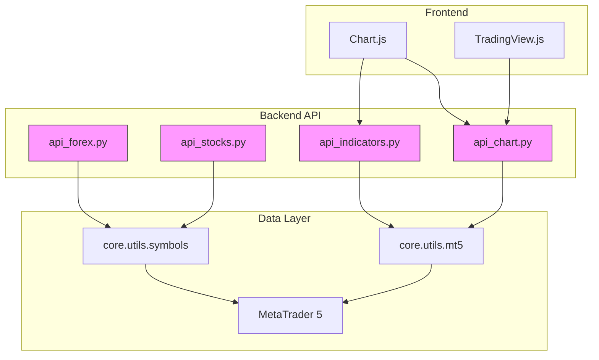
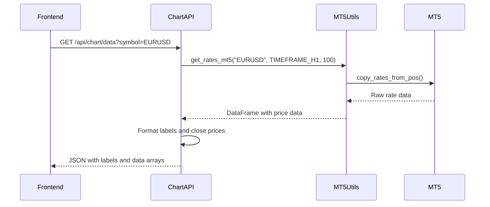
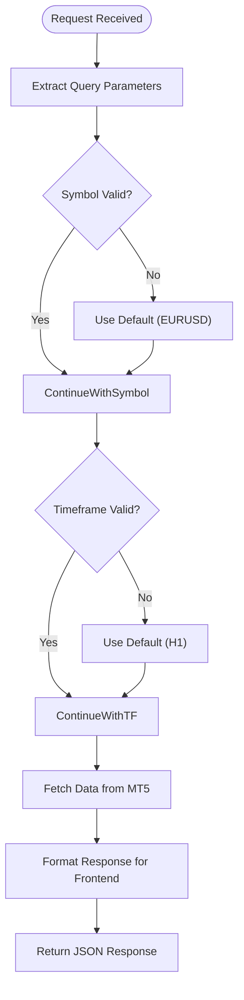
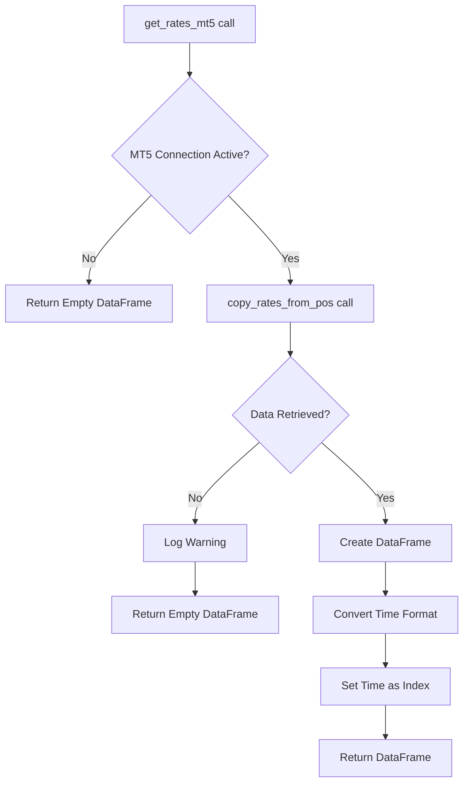

# Market Data APIs

<cite>
**Referenced Files in This Document**   
- [api_forex.py](file://core/routes/api_forex.py)
- [api_stocks.py](file://core/routes/api_stocks.py)
- [api_chart.py](file://core/routes/api_chart.py)
- [api_indicators.py](file://core/routes/api_indicators.py)
- [mt5.py](file://core/utils/mt5.py)
- [symbols.py](file://core/utils/symbols.py)
- [base.html](file://templates/base.html)
</cite>

## Table of Contents
1. [Introduction](#introduction)
2. [Market Data Endpoints Overview](#market-data-endpoints-overview)
3. [Symbol Lists and Price Snapshots](#symbol-lists-and-price-snapshots)
4. [Chart Data API](#chart-data-api)
5. [Technical Indicators API](#technical-indicators-api)
6. [Data Retrieval Parameters](#data-retrieval-parameters)
7. [Core Data Fetching Mechanism](#core-data-fetching-mechanism)
8. [Response Formats and Frontend Integration](#response-formats-and-frontend-integration)
9. [Usage Examples](#usage-examples)
10. [Data Handling Considerations](#data-handling-considerations)

## Introduction
The Market Data APIs provide essential price information and technical analysis capabilities for the QuantumBotX trading platform. These APIs serve charting components, portfolio displays, and analytical tools by retrieving real-time and historical market data from MetaTrader 5 (MT5). The system supports multiple asset classes including forex and stocks, delivering both raw price data and computed technical indicators. This documentation details the available endpoints, their parameters, response formats, and integration with frontend visualization libraries.

## Market Data Endpoints Overview
The market data functionality is distributed across several API endpoints, each serving a specific purpose in the data pipeline. These endpoints follow a consistent pattern of retrieving data from MT5 through utility functions and returning JSON responses formatted for frontend consumption.



**Diagram sources**
- [api_forex.py](file://core/routes/api_forex.py)
- [api_stocks.py](file://core/routes/api_stocks.py)
- [api_chart.py](file://core/routes/api_chart.py)
- [api_indicators.py](file://core/routes/api_indicators.py)
- [mt5.py](file://core/utils/mt5.py)
- [symbols.py](file://core/utils/symbols.py)

**Section sources**
- [api_forex.py](file://core/routes/api_forex.py)
- [api_stocks.py](file://core/routes/api_stocks.py)
- [api_chart.py](file://core/routes/api_chart.py)
- [api_indicators.py](file://core/routes/api_indicators.py)

## Symbol Lists and Price Snapshots
The platform provides endpoints for retrieving lists of available trading symbols and their current price snapshots for both forex and stocks.

### Forex Symbol Data
The `/api/forex-data` endpoint returns a list of available forex symbols with their current bid/ask prices and spread information. Symbols are filtered based on their path in MT5 starting with "forex\\".

**Endpoint**: `GET /api/forex-data`

**Response Structure**:
```json
[
  {
    "name": "EURUSD",
    "description": "Euro vs US Dollar",
    "ask": 1.08545,
    "bid": 1.08532,
    "spread": 1.3,
    "digits": 5
  }
]
```

### Stock Symbol Data
The `/api/stocks` endpoint returns the 20 most popular stocks based on daily trading volume. Price changes are calculated from the daily open price to the current ask price.

**Endpoint**: `GET /api/stocks`

**Response Structure**:
```json
[
  {
    "symbol": "AAPL",
    "last_price": 175.43,
    "change": 2.34,
    "time": "14:32:15"
  }
]
```

**Section sources**
- [api_forex.py](file://core/routes/api_forex.py#L6-L23)
- [api_stocks.py](file://core/routes/api_stocks.py#L15-L98)
- [symbols.py](file://core/utils/symbols.py#L34-L84)

## Chart Data API
The chart data API provides OHLCV (Open, High, Low, Close, Volume) time series data for candlestick chart visualization.

### Endpoint Details
**Endpoint**: `GET /api/chart/data`

**Query Parameters**:
- `symbol` (string): Trading symbol (default: "EURUSD")
- `timeframe` (string): Chart timeframe (not directly supported in current implementation)

**Response Structure**:
```json
{
  "labels": ["09:00", "10:00", "11:00"],
  "data": [1.0850, 1.0852, 1.0848]
}
```

The API currently returns only closing prices for simplicity, with timestamps formatted as "HH:MM". The data is specifically formatted for Chart.js consumption, where labels represent the x-axis and data represents the y-axis values.



**Diagram sources**
- [api_chart.py](file://core/routes/api_chart.py#L8-L21)
- [mt5.py](file://core/utils/mt5.py#L37-L53)

**Section sources**
- [api_chart.py](file://core/routes/api_chart.py#L8-L21)

## Technical Indicators API
The technical indicators API computes and returns values for common technical analysis indicators.

### RSI Implementation
The current implementation provides Relative Strength Index (RSI) values with a 14-period configuration.

**Endpoint**: `GET /api/rsi_data`

**Query Parameters**:
- `symbol` (string): Trading symbol (default: "EURUSD")
- `timeframe` (string): Timeframe code (M1, M5, M15, H1, H4, D1; default: "H1")

**Response Structure**:
```json
{
  "timestamps": ["09:00", "10:00", "11:00"],
  "rsi_values": [65.42, 72.15, 68.93]
}
```

The API uses the pandas-ta library to calculate RSI values from closing prices retrieved from MT5. It returns the most recent 20 values to keep the response size manageable for charting purposes.

**Section sources**
- [api_indicators.py](file://core/routes/api_indicators.py#L8-L35)

## Data Retrieval Parameters
The market data APIs support various query parameters to customize data retrieval.

### Common Parameters
- **symbol**: Specifies the trading instrument (e.g., "EURUSD", "AAPL")
- **timeframe**: Defines the chart period (M1, M5, M15, H1, H4, D1)
- **limit**: Controls the number of records returned (where applicable)

### Parameter Validation
Parameters are validated and mapped within each endpoint:
- Invalid timeframes default to H1 (1-hour)
- Missing symbols default to EURUSD
- The system uses a timeframe mapping dictionary to convert string codes to MT5 constants



**Diagram sources**
- [api_indicators.py](file://core/routes/api_indicators.py#L14-L20)
- [api_chart.py](file://core/routes/api_chart.py#L9-L10)

## Core Data Fetching Mechanism
The data retrieval process is centralized through utility functions in the `core.utils.mt5` module.

### get_rates_mt5 Function
This core utility function retrieves historical price data from MetaTrader 5.

**Function Signature**:
```python
def get_rates_mt5(symbol: str, timeframe: int, count: int = 100):
```

**Parameters**:
- `symbol` (str): Trading symbol name
- `timeframe` (int): MT5 timeframe constant
- `count` (int): Number of candles to retrieve (default: 100)

**Process Flow**:
1. Calls MT5's `copy_rates_from_pos()` function
2. Converts raw data to a pandas DataFrame
3. Converts timestamp from Unix seconds to datetime
4. Sets time as the DataFrame index
5. Returns DataFrame or empty DataFrame on error

The function includes comprehensive error handling with logging for debugging purposes.



**Diagram sources**
- [mt5.py](file://core/utils/mt5.py#L37-L53)

**Section sources**
- [mt5.py](file://core/utils/mt5.py#L37-L53)

## Response Formats and Frontend Integration
The API responses are specifically formatted to integrate seamlessly with frontend charting libraries.

### Frontend Libraries
The platform uses two primary charting libraries:
- **Chart.js**: Used for most charts in the application
- **TradingView.js**: Used for advanced charting widgets

The base template includes Chart.js as a global dependency:
```html
<script src="https://cdn.jsdelivr.net/npm/chart.js"></script>
```

### Response Structure Design
API responses are structured to match the expectations of Chart.js:
- **Chart data**: Uses "labels" and "data" keys for x-axis and y-axis
- **Indicators**: Uses "timestamps" and indicator-specific keys (e.g., "rsi_values")
- **Symbol lists**: Returns arrays of objects with consistent field names

### CSS and Layout
The frontend includes dedicated styling for chart containers:
```css
.chart-container {
    position: relative;
    height: 300px;
    width: 100%;
}
```

This ensures consistent sizing and positioning of all charts across the application.

**Section sources**
- [base.html](file://templates/base.html#L8)
- [dashboard.css](file://static/css/dashboard.css#L4-L7)

## Usage Examples
Practical examples demonstrating how to use the market data APIs.

### Fetching 1-Hour EURUSD Candles
**Request**:
```
GET /api/chart/data?symbol=EURUSD
```

**Response**:
```json
{
  "labels": ["08:00", "09:00", "10:00", "11:00", "12:00"],
  "data": [1.0845, 1.0850, 1.0855, 1.0848, 1.0852]
}
```

This data can be directly used to create a candlestick chart in Chart.js, though only closing prices are currently provided.

### Retrieving RSI(14) Values
**Request**:
```
GET /api/rsi_data?symbol=EURUSD&timeframe=H1
```

**Response**:
```json
{
  "timestamps": ["08:00", "09:00", "10:00", "11:00", "12:00"],
  "rsi_values": [62.34, 68.75, 75.21, 70.15, 66.89]
}
```

The RSI values can be plotted as a separate indicator chart, typically displayed below the main price chart.

**Section sources**
- [api_chart.py](file://core/routes/api_chart.py#L8-L21)
- [api_indicators.py](file://core/routes/api_indicators.py#L8-L35)

## Data Handling Considerations
Important considerations for working with the market data APIs.

### Pagination
The APIs do not currently implement pagination. Instead, they limit the number of returned records:
- Chart data: 100 most recent candles
- RSI data: 20 most recent values
- Symbol lists: Top 20 by volume

This approach simplifies the frontend implementation but may require enhancement for historical analysis use cases.

### Data Smoothing
The system does not apply data smoothing algorithms. Raw price data from MT5 is passed through with minimal processing:
- Time formatting
- Data type conversion
- Error handling
- Structure formatting for frontend consumption

### Incomplete Candlesticks
The APIs handle the current (incomplete) candlestick by including it in the data set. Since the data is retrieved using `copy_rates_from_pos()` with position 0, the most recent candle is always the current incomplete one. This is appropriate for real-time charting where users expect to see the current price action, even if the candle is not yet closed.

### Error Handling
Comprehensive error handling is implemented:
- Empty or None responses from MT5 return appropriate error codes
- Invalid symbols default to known values
- Exception handling with detailed logging
- Graceful degradation when data is unavailable

**Section sources**
- [mt5.py](file://core/utils/mt5.py#L37-L53)
- [api_chart.py](file://core/routes/api_chart.py#L12-L13)
- [api_indicators.py](file://core/routes/api_indicators.py#L24-L25)