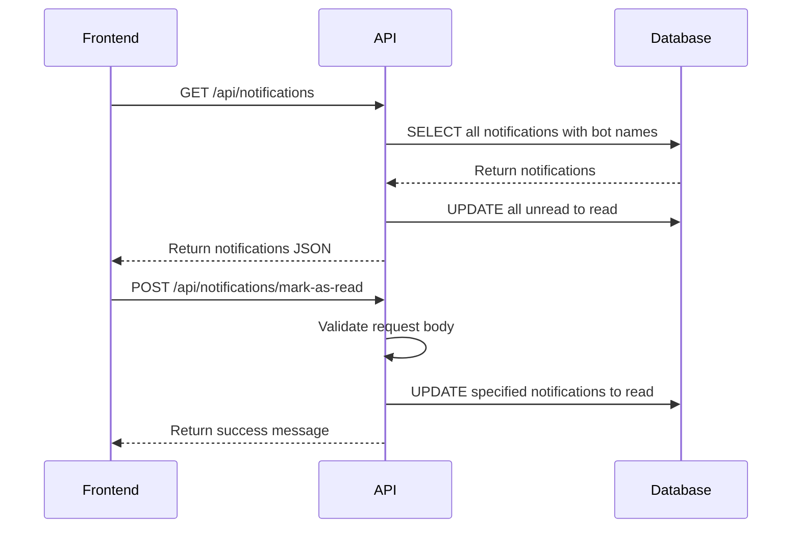
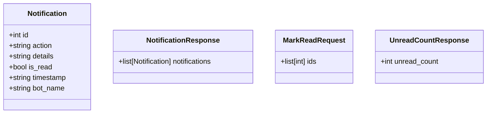
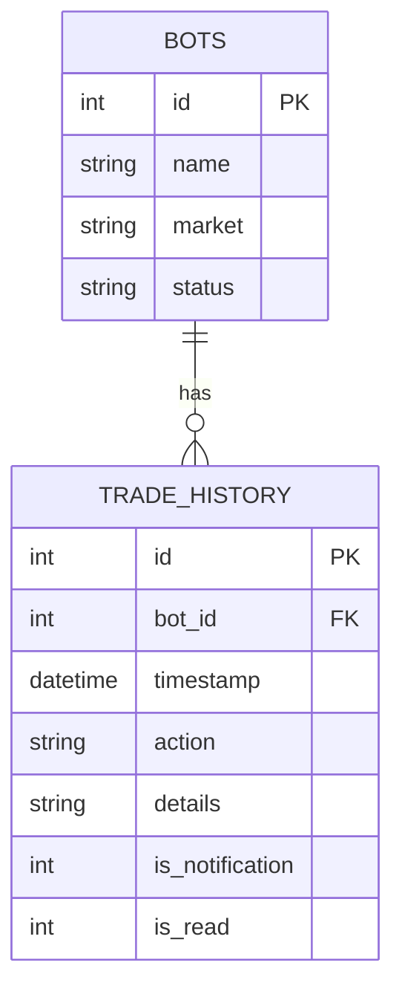
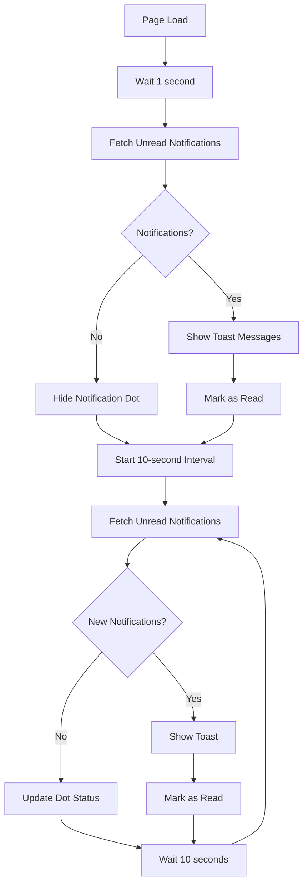

# Notifications API

<cite>
**Referenced Files in This Document**   
- [api_notifications.py](file://core/routes/api_notifications.py)
- [queries.py](file://core/db/queries.py)
- [notifications.js](file://static/js/notifications.js)
- [models.py](file://core/db/models.py)
- [init_db.py](file://init_db.py)
- [main.js](file://static/js/main.js)
</cite>

## Table of Contents
1. [Introduction](#introduction)
2. [API Endpoints](#api-endpoints)
3. [Notification Data Structure](#notification-data-structure)
4. [Database Storage and Retrieval](#database-storage-and-retrieval)
5. [Frontend Polling Mechanism](#frontend-polling-mechanism)
6. [Notification Generation by Trading Bots](#notification-generation-by-trading-bots)
7. [Data Retention and Cleanup Policies](#data-retention-and-cleanup-policies)
8. [Error Handling](#error-handling)
9. [Example Response](#example-response)

## Introduction
The Notifications API provides a mechanism for users to receive alerts generated by trading bots within the QuantumBotX platform. These notifications include important events such as trade executions, errors, bot status changes, and system warnings. The system uses a combination of backend database operations and frontend JavaScript polling to deliver real-time alerts to users. Notifications are stored in an SQLite database and can be retrieved, marked as read, and displayed in both list and toast formats.

**Section sources**
- [api_notifications.py](file://core/routes/api_notifications.py#L0-L52)
- [queries.py](file://core/db/queries.py#L104-L174)

## API Endpoints

### GET /api/notifications
Retrieves all notifications for the user, sorted by timestamp in descending order. When this endpoint is accessed, all notifications are automatically marked as read.

**Response**
- Status: 200 OK
- Body: Array of notification objects

### GET /api/notifications/unread-count
Returns the count of unread notifications.

**Response**
- Status: 200 OK
- Body: `{ "unread_count": number }`

### GET /api/notifications/unread
Fetches only unread notifications, typically used for displaying toast alerts.

**Response**
- Status: 200 OK
- Body: Array of unread notification objects

### POST /api/notifications/mark-as-read
Marks specific notifications as read by their IDs.

**Request Body**
```json
{
  "ids": [1, 2, 3]
}
```

**Validation Rules**
- `ids` field is required
- `ids` must be an array of integers

**Response**
- Status: 200 OK
- Body: `{ "message": "{count} notifications marked as read." }`
- Status: 400 Bad Request if validation fails
- Status: 500 Internal Server Error for database issues



**Diagram sources**
- [api_notifications.py](file://core/routes/api_notifications.py#L0-L52)
- [queries.py](file://core/db/queries.py#L145-L174)

**Section sources**
- [api_notifications.py](file://core/routes/api_notifications.py#L0-L52)

## Notification Data Structure
Each notification contains the following fields:

**Response Fields**
- `id`: Unique identifier for the notification
- `action`: Type of action that triggered the notification (e.g., "BUY", "SELL", "ERROR")
- `details`: Human-readable description of the event
- `is_read`: Boolean indicating read status
- `timestamp`: ISO 8601 timestamp of when the notification was created
- `bot_name`: Name of the trading bot that generated the notification

**Message Types**
- **Info**: General information about bot activities
- **Warning**: Potential issues that don't stop operations
- **Error**: Critical failures that require attention

The frontend determines visual appearance based on the action type:
- "buy" → Green upward arrow
- "sell" → Red downward arrow  
- "start" → Blue play button
- "stop" → Yellow pause button
- "error" → Red warning triangle
- Others → Gray information circle



**Diagram sources**
- [api_notifications.py](file://core/routes/api_notifications.py#L0-L52)
- [queries.py](file://core/db/queries.py#L104-L128)

**Section sources**
- [api_notifications.py](file://core/routes/api_notifications.py#L0-L52)
- [queries.py](file://core/db/queries.py#L104-L128)

## Database Storage and Retrieval
Notifications are stored in the `trade_history` table in SQLite, which serves dual purposes for both trade logging and notification storage.

**Database Schema**
```sql
CREATE TABLE trade_history (
    id INTEGER PRIMARY KEY AUTOINCREMENT,
    bot_id INTEGER NOT NULL,
    timestamp DATETIME DEFAULT CURRENT_TIMESTAMP,
    action TEXT NOT NULL,
    details TEXT,
    is_notification INTEGER NOT NULL DEFAULT 0,
    is_read INTEGER NOT NULL DEFAULT 0,
    FOREIGN KEY (bot_id) REFERENCES bots (id) ON DELETE CASCADE
);
```

Key fields:
- `is_notification`: Flag (0 or 1) indicating if the record should be treated as a notification
- `is_read`: Read status flag (0 = unread, 1 = read)
- Foreign key relationship with `bots` table for bot name lookup

**Query Operations**
- `get_notifications()`: Joins `trade_history` with `bots` to get bot names
- `get_unread_notifications_count()`: Counts unread notifications
- `mark_notifications_as_read()`: Updates read status with optional ID filtering

When no IDs are provided to `mark_notifications_as_read()`, all unread notifications are marked as read.



**Diagram sources**
- [init_db.py](file://init_db.py#L49-L78)
- [queries.py](file://core/db/queries.py#L104-L174)

**Section sources**
- [init_db.py](file://init_db.py#L49-L78)
- [queries.py](file://core/db/queries.py#L104-L174)

## Frontend Polling Mechanism
The frontend implements a polling mechanism to provide real-time notification updates without requiring page refreshes.

**Polling Strategy**
- **Interval**: 10 seconds (10,000 milliseconds)
- **Endpoints Used**: 
  - `/api/notifications/unread` for toast notifications
  - `/api/notifications/unread-count` for notification dot indicator

**Implementation Flow**
1. On page load, wait 1 second before first poll
2. Fetch unread notifications and display as toast messages
3. Update notification count indicator
4. Repeat both operations every 10 seconds

**JavaScript Components**
- `main.js`: Handles toast notifications and polling
- `notifications.js`: Manages full notification list display



**Diagram sources**
- [main.js](file://static/js/main.js#L37-L94)
- [notifications.js](file://static/js/notifications.js#L0-L62)

**Section sources**
- [main.js](file://static/js/main.js#L37-L94)
- [notifications.js](file://static/js/notifications.js#L0-L62)

## Notification Generation by Trading Bots
Notifications are generated by trading bots through the `add_history_log` function, which creates entries in the `trade_history` table.

**Trigger Conditions**
Notifications are created when specific actions occur in trading bots:
- Position openings/closures
- Trade execution failures
- Automated trading events
- System errors

**Implementation Details**
The `add_history_log` function in `queries.py` is called by trading bots to record events. When `is_notification=True` is passed to this function, the event is flagged for notification delivery.

Although the `models.py` file contains a `log_trade_action` function that appears to insert directly into a notifications table, the current implementation uses the `trade_history` table with the `is_notification` flag instead.

**Bot Integration**
Trading bots generate notifications by:
1. Calling `add_history_log()` with relevant parameters
2. Setting `is_notification=True` for important events
3. Providing descriptive action and details fields

**Section sources**
- [queries.py](file://core/db/queries.py#L85-L103)
- [models.py](file://core/db/models.py#L0-L20)

## Data Retention and Cleanup Policies
The current implementation does not include automatic cleanup or data retention policies for notifications.

**Current Behavior**
- All notification records are retained indefinitely
- Read notifications remain in the database
- No expiration or archiving mechanism exists
- No scheduled deletion of old records

**Potential Risks**
- Database size growth over time
- Performance degradation with large notification volumes
- No automatic archival process

The system relies on the SQLite database without any background jobs or scheduled tasks for cleanup. The foreign key constraint `ON DELETE CASCADE` ensures that when a bot is deleted, all its associated notifications are also removed.

**Section sources**
- [init_db.py](file://init_db.py#L49-L78)
- [queries.py](file://core/db/queries.py#L104-L174)

## Error Handling
The Notifications API implements comprehensive error handling at both the frontend and backend levels.

**Backend Error Responses**
- **400 Bad Request**: Invalid request body (missing `ids`, non-array `ids`)
- **500 Internal Server Error**: Database connection failures, query errors
- Error format: `{ "error": "error message" }`

**Frontend Error Handling**
- Network failures: Display error message in notification container
- Invalid responses: Log error to console
- Toast notification failures: Fail silently with console logging

**Common Error Scenarios**
- Invalid JSON in request body
- Non-numeric notification IDs
- Empty ID array
- Database connection timeouts
- Missing required fields

The system includes logging for all database errors using Python's logging module, with error messages captured for debugging purposes.

**Section sources**
- [api_notifications.py](file://core/routes/api_notifications.py#L0-L52)
- [queries.py](file://core/db/queries.py#L104-L174)
- [notifications.js](file://static/js/notifications.js#L0-L62)

## Example Response
**GET /api/notifications Response**
```json
[
  {
    "id": 15,
    "action": "ERROR",
    "details": "Failed to execute trade due to insufficient margin",
    "is_read": false,
    "timestamp": "2025-01-15T08:30:45",
    "bot_name": "ETH Momentum Bot"
  },
  {
    "id": 14,
    "action": "BUY",
    "details": "Executed BUY order for 0.5 ETH at $2,150",
    "is_read": true,
    "timestamp": "2025-01-15T08:25:30",
    "bot_name": "BTC Trend Follower"
  },
  {
    "id": 13,
    "action": "AUTO",
    "details": "Automatically adjusted stop-loss to $2,100",
    "is_read": true,
    "timestamp": "2025-01-15T08:20:15",
    "bot_name": "ETH Momentum Bot"
  }
]
```

**POST /api/notifications/mark-as-read Request**
```json
{
  "ids": [15, 13]
}
```

**POST /api/notifications/mark-as-read Response**
```json
{
  "message": "2 notifications marked as read."
}
```

**Invalid Request Example**
```json
{
  "error": "Request body must include 'ids'"
}
```
Status: 400 Bad Request

**Section sources**
- [api_notifications.py](file://core/routes/api_notifications.py#L0-L52)
- [queries.py](file://core/db/queries.py#L104-L174)
- [notifications.js](file://static/js/notifications.js#L0-L62)