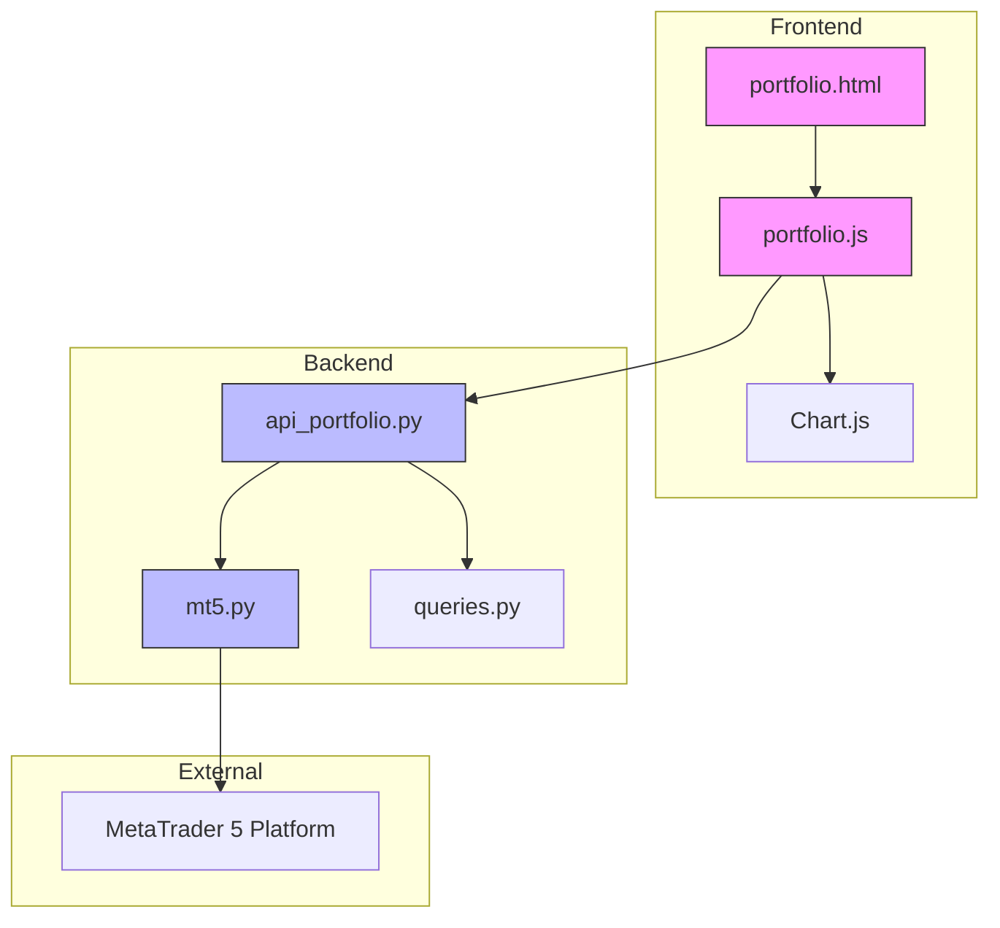
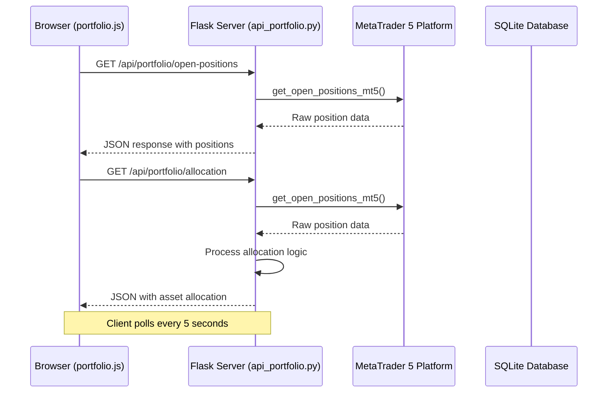
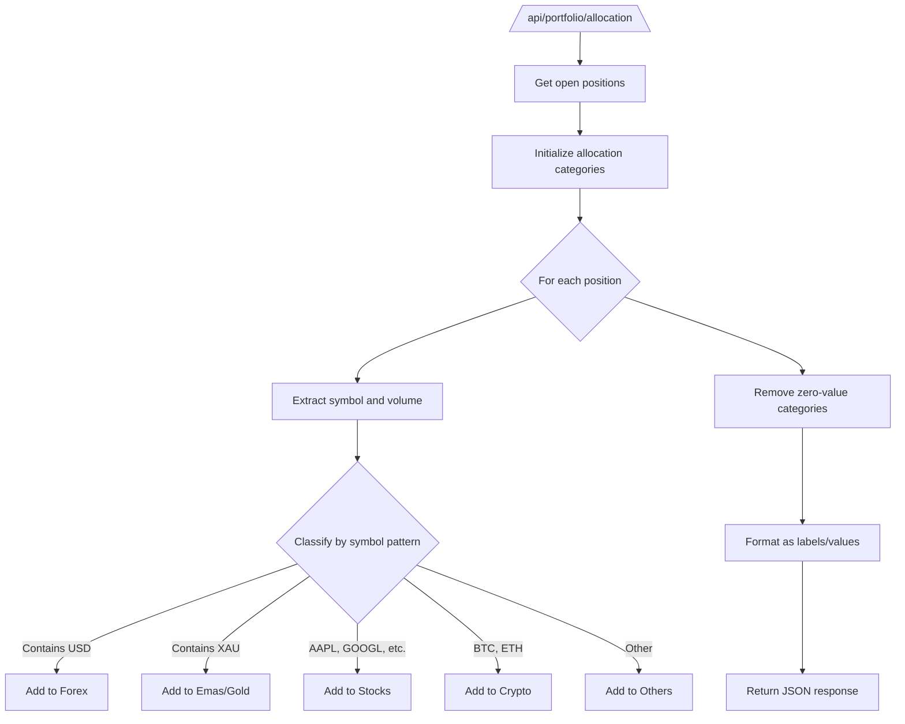
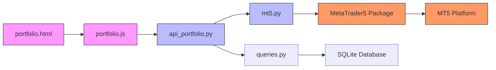

# Portfolio API

<cite>
**Referenced Files in This Document**   
- [api_portfolio.py](file://core/routes/api_portfolio.py)
- [mt5.py](file://core/utils/mt5.py)
- [portfolio.js](file://static/js/portfolio.js)
- [portfolio.html](file://templates/portfolio.html)
</cite>

## Table of Contents
1. [Introduction](#introduction)
2. [Project Structure](#project-structure)
3. [Core Components](#core-components)
4. [Architecture Overview](#architecture-overview)
5. [Detailed Component Analysis](#detailed-component-analysis)
6. [Dependency Analysis](#dependency-analysis)
7. [Performance Considerations](#performance-considerations)
8. [Troubleshooting Guide](#troubleshooting-guide)
9. [Conclusion](#conclusion)

## Introduction
The Portfolio API provides real-time access to trading portfolio data from MetaTrader 5 (MT5), enabling users to monitor open positions, asset allocation, and performance metrics. This document details the implementation of the Portfolio API endpoints, focusing on data retrieval from MT5 via `core.utils.mt5`, aggregation logic, response structure, error handling, and client-side integration. The API supports dynamic asset classification, real-time profit/loss tracking, and visual representation of portfolio distribution. Special attention is given to error resilience, data consistency, and rate limiting considerations due to external platform constraints.

## Project Structure
The Portfolio API is implemented within a modular Flask-based backend architecture, with frontend components built using Chart.js for data visualization. The system follows a layered structure separating routes, utilities, and database interactions.



**Diagram sources**
- [api_portfolio.py](file://core/routes/api_portfolio.py)
- [mt5.py](file://core/utils/mt5.py)
- [portfolio.js](file://static/js/portfolio.js)
- [portfolio.html](file://templates/portfolio.html)

**Section sources**
- [api_portfolio.py](file://core/routes/api_portfolio.py)
- [mt5.py](file://core/utils/mt5.py)
- [portfolio.js](file://static/js/portfolio.js)

## Core Components
The Portfolio API consists of two primary endpoints: `/open-positions` and `/allocation`, both implemented in `api_portfolio.py`. These endpoints retrieve real-time trading data from MT5 using utility functions in `mt5.py`. The frontend, implemented in `portfolio.js`, polls these endpoints at regular intervals to update the user interface with current portfolio status, including position details, profit/loss calculations, and asset distribution charts.

**Section sources**
- [api_portfolio.py](file://core/routes/api_portfolio.py#L1-L57)
- [mt5.py](file://core/utils/mt5.py#L1-L145)
- [portfolio.js](file://static/js/portfolio.js#L1-L151)

## Architecture Overview
The Portfolio API follows a client-server architecture where the frontend JavaScript code periodically polls backend API endpoints to retrieve updated portfolio data. The backend acts as a proxy between the web application and the MT5 trading platform, abstracting the MT5 API complexity and providing structured JSON responses.



**Diagram sources**
- [api_portfolio.py](file://core/routes/api_portfolio.py#L1-L57)
- [mt5.py](file://core/utils/mt5.py#L1-L145)
- [portfolio.js](file://static/js/portfolio.js#L1-L151)

## Detailed Component Analysis

### Portfolio API Endpoints
The Portfolio API provides two endpoints for retrieving portfolio data: one for open positions and another for asset allocation.

#### Open Positions Endpoint
The `/open-positions` endpoint returns a list of all currently open trading positions from the MT5 account. It uses the `get_open_positions_mt5()` utility function to retrieve position data directly from MT5.

```mermaid
flowchart TD
A[/api/portfolio/open-positions\] --> B[Call get_open_positions_mt5()]
B --> C{Success?}
C --> |Yes| D[Return positions as JSON]
C --> |No| E[Return error 500 with message]
D --> F[Frontend displays position table]
E --> G[Frontend shows error message]
```

**Response Structure**
```json
[
  {
    "ticket": 123456,
    "symbol": "EURUSD",
    "type": 0,
    "volume": 0.1,
    "price_open": 1.08567,
    "profit": 12.50,
    "magic": 1001
  }
]
```

**Section sources**
- [api_portfolio.py](file://core/routes/api_portfolio.py#L6-L15)

#### Asset Allocation Endpoint
The `/allocation` endpoint calculates and returns the distribution of trading volume across different asset classes. It classifies positions based on symbol patterns and aggregates volume by category.



**Section sources**
- [api_portfolio.py](file://core/routes/api_portfolio.py#L17-L57)

### MT5 Integration Layer
The `core.utils.mt5` module provides the interface between the application and the MetaTrader 5 platform, handling all data retrieval operations.

#### Position Data Retrieval
The `get_open_positions_mt5()` function retrieves all open positions from the MT5 account and converts them to a list of dictionaries for JSON serialization.

```python
def get_open_positions_mt5():
    """Mengambil semua posisi trading yang sedang terbuka dari akun MT5."""
    try:
        positions = mt5.positions_get()
        if positions is None:
            return []
        return [pos._asdict() for pos in positions]
    except Exception as e:
        logger.error(f"Error saat get_open_positions_mt5: {e}", exc_info=True)
        return []
```

**Section sources**
- [mt5.py](file://core/utils/mt5.py#L55-L66)

#### Account Information Retrieval
The `get_account_info_mt5()` function retrieves comprehensive account information including balance, equity, and profit metrics from MT5.

```python
def get_account_info_mt5():
    """Mengambil informasi akun (saldo, equity, profit) dari MT5."""
    try:
        info = mt5.account_info()
        if info:
            return info._asdict()
        else:
            logger.warning(f"Gagal mengambil info akun. Error: {mt5.last_error()}")
            return None
    except Exception as e:
        logger.error(f"Error saat get_account_info_mt5: {e}", exc_info=True)
        return None
```

**Section sources**
- [mt5.py](file://core/utils/mt5.py#L24-L35)

### Frontend Implementation
The frontend implementation in `portfolio.js` handles data polling, UI updates, and visualization of portfolio data.

#### Data Polling Mechanism
The frontend uses `setInterval()` to poll the Portfolio API endpoints every 5 seconds, ensuring real-time data updates without requiring page refresh.

```javascript
// Set interval for data updates
setInterval(async () => {
    await updatePortfolioData();
    await updateAssetAllocationChart();
}, 5000);
```

This polling frequency balances real-time updates with system resource usage and MT5 API constraints.

**Section sources**
- [portfolio.js](file://static/js/portfolio.js#L142-L150)

#### Error Handling in Frontend
The frontend implements comprehensive error handling for API failures, displaying user-friendly error messages when data retrieval fails.

```javascript
catch (error) {
    console.error("Gagal mengambil data portfolio:", error);
    portfolioTableBody.innerHTML = `<tr><td colspan="6" class="p-4 text-center text-red-500">Gagal memuat data: ${error.message}</td></tr>`;
}
```

**Section sources**
- [portfolio.js](file://static/js/portfolio.js#L132-L137)

## Dependency Analysis
The Portfolio API has a clear dependency chain from the frontend to the external MT5 platform. The frontend depends on the backend API, which in turn depends on the MT5 connectivity module, which finally depends on the external MT5 platform.



**Diagram sources**
- [portfolio.html](file://templates/portfolio.html)
- [portfolio.js](file://static/js/portfolio.js)
- [api_portfolio.py](file://core/routes/api_portfolio.py)
- [mt5.py](file://core/utils/mt5.py)
- [queries.py](file://core/db/queries.py)

## Performance Considerations
The Portfolio API implementation includes several performance and reliability considerations to handle the constraints of external trading platforms.

### Caching Strategy
The current implementation does not include server-side caching. Each API request results in a direct call to the MT5 platform. This approach ensures data freshness but increases load on the MT5 API. Potential improvements could include implementing a short-term cache (e.g., 1-2 seconds) to reduce redundant calls when multiple clients request data simultaneously.

### Rate Limiting and Polling Frequency
The frontend polls the API endpoints every 5 seconds, which represents a balance between real-time updates and system load. This frequency is appropriate given typical MT5 platform constraints and prevents excessive API usage that could lead to connection throttling or termination.

```javascript
// Polling every 5000ms (5 seconds)
setInterval(async () => {
    await updatePortfolioData();
    await updateAssetAllocationChart();
}, 5000);
```

More frequent polling could overwhelm the MT5 connection, while less frequent polling would reduce the real-time nature of the data.

### Error Handling and Fallback
The API implements robust error handling to maintain functionality during MT5 connectivity issues. When MT5 connection fails, the endpoints return appropriate HTTP error codes, and the frontend displays user-friendly error messages rather than failing silently.

```python
except Exception as e:
    return jsonify({"error": str(e)}), 500
```

The system does not currently implement a fallback to last-known state, meaning that during extended MT5 outages, the portfolio view will display error messages until connectivity is restored.

## Troubleshooting Guide
This section addresses common issues and their solutions for the Portfolio API implementation.

### MT5 Connection Failures
**Symptom**: The API returns 500 errors with messages about MT5 initialization or data retrieval failures.
**Cause**: The MT5 terminal is not running, credentials are incorrect, or the server is unreachable.
**Solution**: 
1. Ensure the MetaTrader 5 terminal is running on the server
2. Verify account credentials and server settings in the configuration
3. Check network connectivity to the MT5 server
4. Review server logs for specific error codes from MT5

### Empty Position Data
**Symptom**: The portfolio table displays "No open positions" even when trades are active in MT5.
**Cause**: The MT5 API may not have permission to access trading data or the account has no open positions.
**Solution**:
1. Verify that the MT5 account has open positions
2. Check that the MT5 API has appropriate permissions enabled
3. Ensure the "Market Watch" window in MT5 includes the symbols being traded
4. Restart the MT5 terminal and reconnect

### Chart Rendering Issues
**Symptom**: Charts fail to render or display incorrect data.
**Cause**: Data format issues or JavaScript errors in the frontend.
**Solution**:
1. Check browser developer console for JavaScript errors
2. Verify the API endpoints return properly formatted JSON
3. Ensure Chart.js library is correctly loaded
4. Validate that date/time formatting is correct for the P/L chart

### High Resource Usage
**Symptom**: Server CPU or memory usage is high when multiple users access the portfolio.
**Cause**: Lack of caching causes repeated MT5 API calls for each request.
**Solution**:
1. Implement server-side caching with a short TTL (1-2 seconds)
2. Consider consolidating API calls to reduce MT5 connection overhead
3. Monitor and optimize database queries if they become a bottleneck

**Section sources**
- [api_portfolio.py](file://core/routes/api_portfolio.py)
- [mt5.py](file://core/utils/mt5.py)
- [portfolio.js](file://static/js/portfolio.js)

## Conclusion
The Portfolio API successfully provides real-time access to trading portfolio data from MetaTrader 5, with well-structured endpoints for open positions and asset allocation. The implementation effectively bridges the gap between the MT5 platform and the web interface, providing users with up-to-date information on their trading activities. Key strengths include clean separation of concerns, comprehensive error handling, and responsive frontend updates. Areas for potential improvement include implementing server-side caching to reduce MT5 API load and adding fallback mechanisms to display last-known state during connectivity outages. The current 5-second polling interval strikes an appropriate balance between real-time updates and system resource usage, making the Portfolio API a reliable tool for monitoring trading performance.