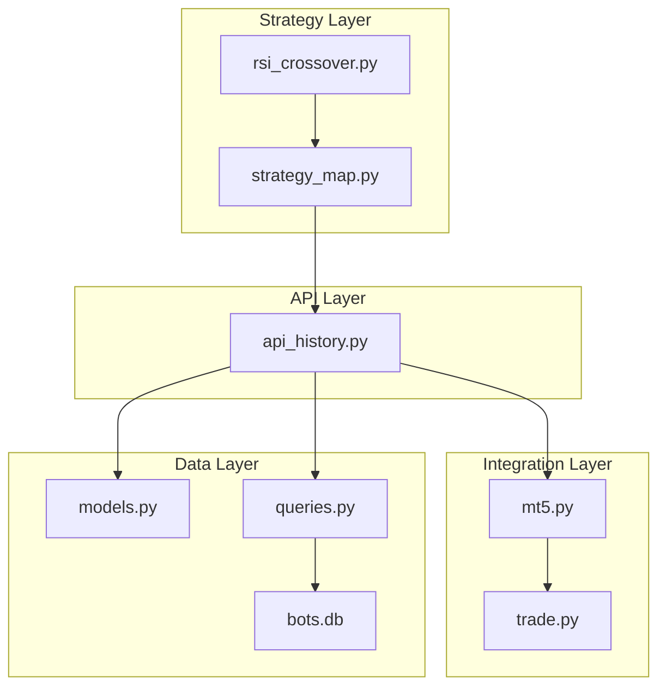
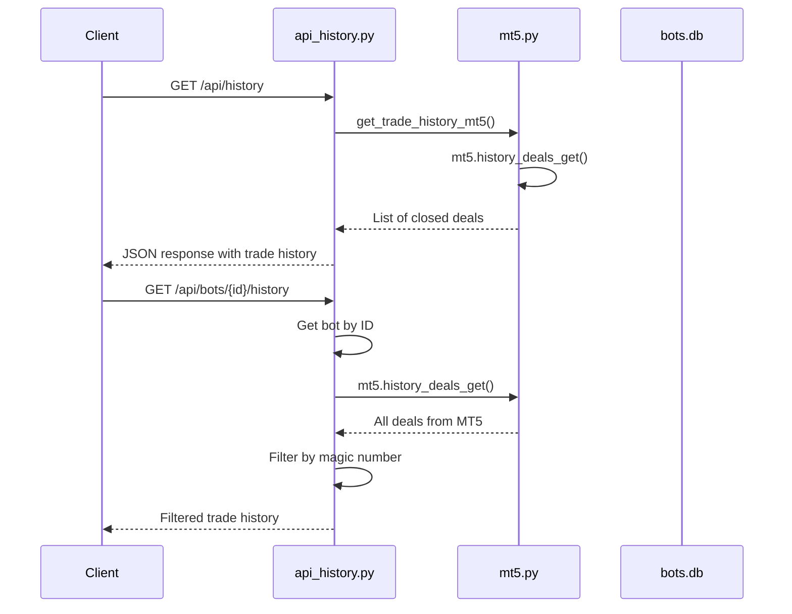
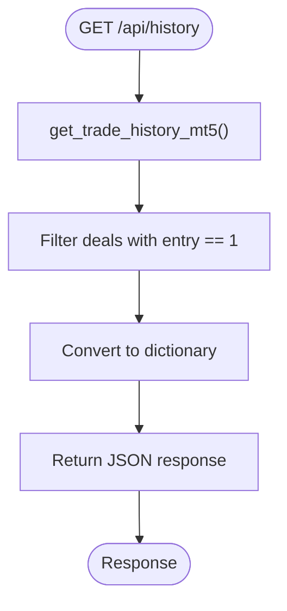
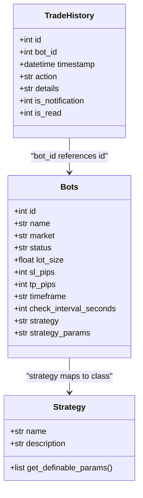
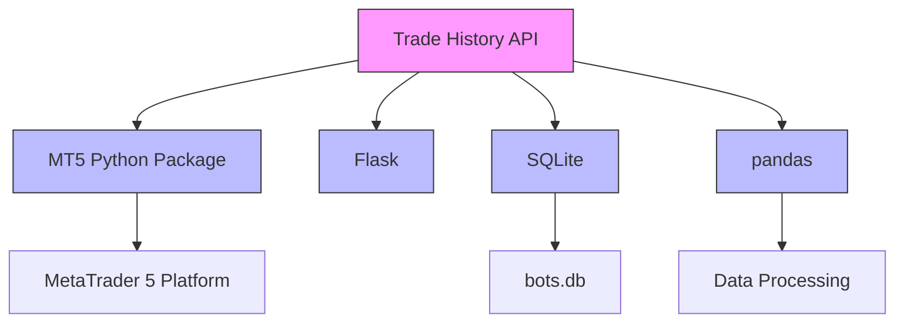

# Trade History API

<cite>
**Referenced Files in This Document**   
- [api_history.py](file://core/routes/api_history.py)
- [mt5.py](file://core/utils/mt5.py)
- [models.py](file://core/db/models.py)
- [init_db.py](file://init_db.py)
- [queries.py](file://core/db/queries.py)
- [rsi_crossover.py](file://core/strategies/rsi_crossover.py)
- [strategy_map.py](file://core/strategies/strategy_map.py)
</cite>

## Table of Contents
1. [Introduction](#introduction)
2. [Project Structure](#project-structure)
3. [Core Components](#core-components)
4. [Architecture Overview](#architecture-overview)
5. [Detailed Component Analysis](#detailed-component-analysis)
6. [Dependency Analysis](#dependency-analysis)
7. [Performance Considerations](#performance-considerations)
8. [Troubleshooting Guide](#troubleshooting-guide)
9. [Conclusion](#conclusion)

## Introduction
The Trade History API provides access to historical trade records from the QuantumBotX trading system. It retrieves closed trades from the MetaTrader 5 (MT5) platform and combines them with strategy metadata stored in a local SQLite database. The API supports filtering by date range, symbol, strategy type, and profit/loss result. This document details the implementation, functionality, and integration points of the Trade History API, including response format, data flow, and consistency challenges between platform history and local records.

## Project Structure
The QuantumBotX project follows a modular structure with clear separation of concerns. The Trade History API is located in the `core/routes` directory, while trade data retrieval logic resides in `core/utils/mt5.py`. Strategy metadata is defined in the `core/strategies` package and stored in an SQLite database managed by modules in `core/db`. The API serves as an integration point between the MT5 trading platform and the application's local data storage.



**Diagram sources**
- [api_history.py](file://core/routes/api_history.py)
- [mt5.py](file://core/utils/mt5.py)
- [models.py](file://core/db/models.py)
- [queries.py](file://core/db/queries.py)
- [rsi_crossover.py](file://core/strategies/rsi_crossover.py)
- [strategy_map.py](file://core/strategies/strategy_map.py)

**Section sources**
- [api_history.py](file://core/routes/api_history.py)
- [init_db.py](file://init_db.py)

## Core Components
The Trade History API consists of several core components that work together to retrieve and serve historical trade data. The main endpoint is defined in `api_history.py`, which calls utility functions in `mt5.py` to retrieve closed trades from the MT5 platform. Strategy metadata is stored in the SQLite database and can be associated with trades through the bot system. The API combines data from both sources to provide a comprehensive view of trading history.

**Section sources**
- [api_history.py](file://core/routes/api_history.py#L0-L51)
- [mt5.py](file://core/utils/mt5.py#L67-L80)
- [models.py](file://core/db/models.py#L0-L19)

## Architecture Overview
The Trade History API follows a layered architecture that separates concerns between API routing, data retrieval, and data storage. When a client requests trade history, the API endpoint retrieves closed trades from MT5 and returns them in JSON format. For bot-specific history, the API filters trades by the bot's magic number. Strategy metadata is stored separately in the database and can be retrieved independently.



**Diagram sources**
- [api_history.py](file://core/routes/api_history.py#L0-L51)
- [mt5.py](file://core/utils/mt5.py#L67-L80)

## Detailed Component Analysis

### Trade History Endpoint Analysis
The Trade History API provides two endpoints for retrieving historical trade data. The global history endpoint returns all closed trades from the MT5 platform, while the bot-specific endpoint returns trades associated with a particular trading bot.

#### Global Trade History Endpoint
The `/api/history` endpoint retrieves all closed trades from the MT5 platform for the past 30 days. It uses the `get_trade_history_mt5()` function to fetch deals and returns them in JSON format.



**Diagram sources**
- [api_history.py](file://core/routes/api_history.py#L10-L15)
- [mt5.py](file://core/utils/mt5.py#L67-L80)

**Section sources**
- [api_history.py](file://core/routes/api_history.py#L10-L15)

#### Bot-Specific Trade History Endpoint
The `/api/bots/<int:bot_id>/history` endpoint retrieves trades for a specific bot by filtering MT5 deals using the bot's magic number. This allows users to view the trading history of individual bots.

```mermaid
flowchart TD
Start([GET /api/bots/{id}/history]) --> GetBot["Get bot from active_bots"]
GetBot --> CheckExists{"Bot exists?"}
CheckExists --> |No| ReturnError["Return 404"]
CheckExists --> |Yes| GetDeals["mt5.history_deals_get()"]
GetDeals --> Filter["Filter by magic number"]
Filter --> Format["Format as JSON"]
Format --> Return["Return response"]
ReturnError --> End([Response])
Return --> End
```

**Diagram sources**
- [api_history.py](file://core/routes/api_history.py#L17-L51)

**Section sources**
- [api_history.py](file://core/routes/api_history.py#L17-L51)

### Strategy Metadata Integration
The system stores strategy metadata in the SQLite database, which can be associated with trade history. Although the current Trade History API does not directly combine strategy metadata with trade records, the data model supports this integration through the bots table.



**Diagram sources**
- [models.py](file://core/db/models.py#L0-L19)
- [init_db.py](file://init_db.py#L49-L78)
- [queries.py](file://core/db/queries.py#L0-L50)
- [rsi_crossover.py](file://core/strategies/rsi_crossover.py#L0-L84)
- [strategy_map.py](file://core/strategies/strategy_map.py#L0-L29)

**Section sources**
- [models.py](file://core/db/models.py#L0-L19)
- [init_db.py](file://init_db.py#L49-L78)
- [rsi_crossover.py](file://core/strategies/rsi_crossover.py#L0-L84)

## Dependency Analysis
The Trade History API depends on several components within the QuantumBotX system. It relies on the MT5 Python package to retrieve trade history from the MetaTrader 5 platform. The API also depends on the Flask framework for routing and response handling. For database operations, it uses SQLite through Python's built-in sqlite3 module.



**Diagram sources**
- [api_history.py](file://core/routes/api_history.py)
- [mt5.py](file://core/utils/mt5.py)
- [models.py](file://core/db/models.py)

**Section sources**
- [api_history.py](file://core/routes/api_history.py)
- [mt5.py](file://core/utils/mt5.py)
- [models.py](file://core/db/models.py)

## Performance Considerations
The Trade History API performance is primarily affected by the MT5 platform's API response time and the volume of historical data. The current implementation retrieves all deals from the past 30 days and filters them in memory, which could become a bottleneck with large trade volumes. Pagination is not currently implemented, which could lead to performance issues when retrieving extensive trade histories.

The API could be optimized by:
1. Implementing server-side filtering in the MT5 request
2. Adding pagination support with limit and offset parameters
3. Caching frequently accessed trade history data
4. Using database indexing for faster queries

Currently, the API retrieves all relevant deals from MT5 and performs filtering in Python, which is simple but not optimal for large datasets.

## Troubleshooting Guide
Common issues with the Trade History API and their solutions:

**Issue: Empty response from /api/history**
- **Cause**: No closed trades in the past 30 days, or MT5 connection issue
- **Solution**: Verify MT5 connection and check for closed trades in the MT5 terminal

**Issue: "Bot not found" error from /api/bots/{id}/history**
- **Cause**: Invalid bot ID or bot not loaded in active_bots
- **Solution**: Verify the bot ID and ensure the bot is properly initialized

**Issue: MT5 API errors in logs**
- **Cause**: MT5 platform not running or connection credentials incorrect
- **Solution**: Ensure MT5 is running and connection parameters are correct

**Issue: Database connection errors**
- **Cause**: bots.db file missing or corrupted
- **Solution**: Run init_db.py to recreate the database

**Issue: Incomplete trade data**
- **Cause**: Network issues during MT5 data retrieval
- **Solution**: Check network connectivity and retry the request

**Section sources**
- [api_history.py](file://core/routes/api_history.py#L17-L51)
- [mt5.py](file://core/utils/mt5.py#L67-L80)
- [models.py](file://core/db/models.py#L0-L19)

## Conclusion
The Trade History API provides essential functionality for retrieving historical trade data from the QuantumBotX system. It successfully integrates with the MT5 platform to retrieve closed trades and provides endpoints for both global and bot-specific history. While the current implementation is functional, it lacks advanced features like pagination and direct integration of strategy metadata with trade records.

Key limitations include:
- No pagination support for large datasets
- No direct combination of strategy metadata with trade history
- Limited filtering options beyond magic number
- Potential performance issues with large trade volumes

Future improvements could include implementing pagination, enhancing filtering capabilities, and creating a unified view that combines MT5 trade data with strategy metadata from the database. The current architecture provides a solid foundation for these enhancements.