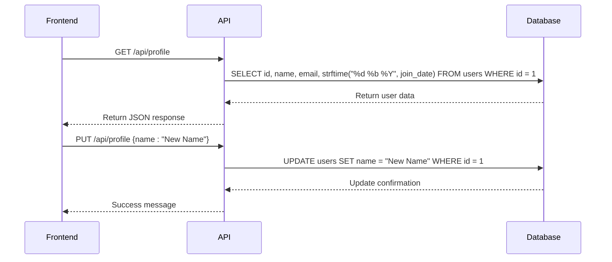
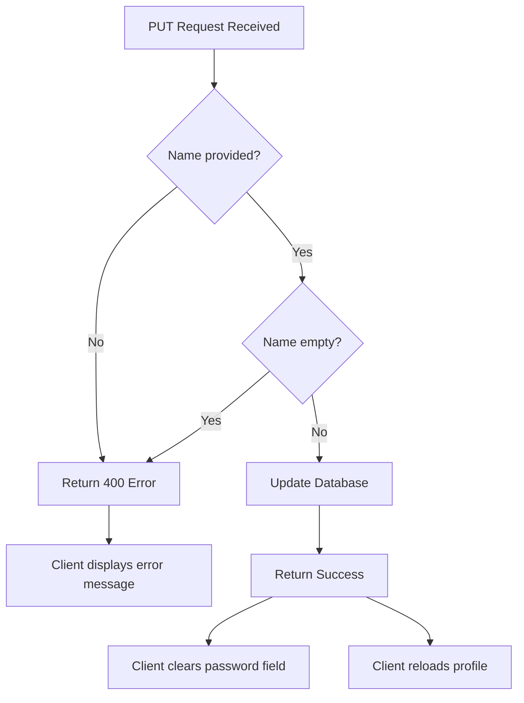
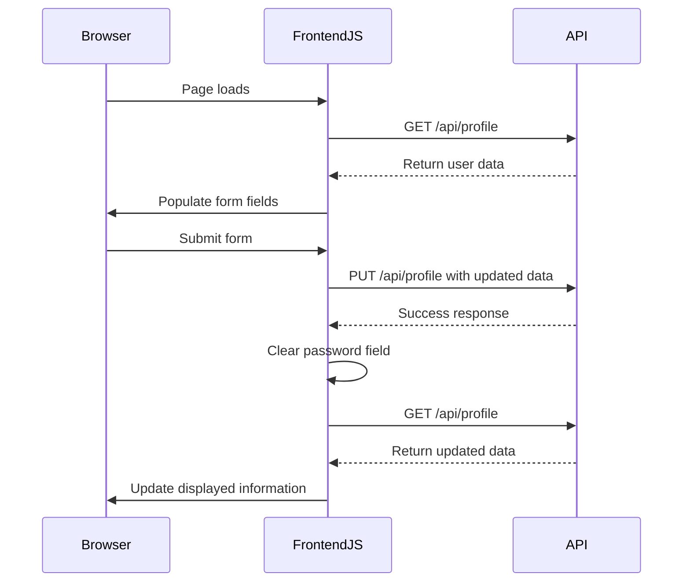

# User Profile API

<cite>
**Referenced Files in This Document**   
- [api_profile.py](file://core/routes/api_profile.py)
- [init_db.py](file://init_db.py)
- [profile.js](file://static/js/profile.js)
- [profile.html](file://templates/profile.html)
</cite>

## Table of Contents
1. [User Profile API](#user-profile-api)
2. [API Endpoints](#api-endpoints)
3. [Request/Response Schema](#requestresponse-schema)
4. [Database Interactions](#database-interactions)
5. [Authentication and Access Control](#authentication-and-access-control)
6. [Data Validation and Error Handling](#data-validation-and-error-handling)
7. [Frontend Integration](#frontend-integration)

## API Endpoints

The User Profile API provides two primary endpoints for managing user profile information: retrieving profile data via GET and updating profile data via PUT.

### GET /api/profile
Retrieves the current user's profile information. This endpoint returns basic user details including name, email, and join date.

### PUT /api/profile
Updates the user's profile information. Currently supports updating the user's name and password. The email field is read-only and cannot be modified through this endpoint.

**Section sources**
- [api_profile.py](file://core/routes/api_profile.py#L15-L38)

## Request/Response Schema

### GET Response Schema
The GET endpoint returns a JSON object containing the following fields:

```json
{
  "id": 1,
  "name": "Admin User",
  "email": "admin@quantumbotx.com",
  "join_date": "01 Jan 2025"
}
```

**Field Descriptions:**
- **id**: Unique identifier for the user (integer)
- **name**: Full name of the user (string)
- **email**: Email address of the user (string)
- **join_date**: Formatted date when the user account was created (string, format: "DD Mon YYYY")

### PUT Request Schema
The PUT endpoint accepts a JSON object with the following optional fields:

```json
{
  "name": "Updated Name",
  "password": "new_password"
}
```

**Field Constraints:**
- **name**: Required field, must not be empty
- **password**: Optional field, if provided must be a non-empty string

### PUT Success Response
Upon successful update, the API returns:

```json
{
  "message": "Profile successfully updated."
}
```

### Error Responses
The API returns appropriate error responses for invalid requests:

**400 Bad Request - Missing name:**
```json
{
  "error": "Name cannot be empty"
}
```

**404 Not Found - User not found:**
```json
{
  "error": "User not found"
}
```

**Section sources**
- [api_profile.py](file://core/routes/api_profile.py#L15-L38)
- [profile.html](file://templates/profile.html#L0-L48)

## Database Interactions

The User Profile API interacts directly with the SQLite database through raw SQL queries. All database operations are performed on the `users` table.

### Database Schema
The `users` table is defined with the following schema:

```sql
CREATE TABLE IF NOT EXISTS users (
    id INTEGER PRIMARY KEY AUTOINCREMENT,
    name TEXT NOT NULL,
    email TEXT NOT NULL UNIQUE,
    password_hash TEXT NOT NULL,
    join_date DATETIME DEFAULT CURRENT_TIMESTAMP
);
```

### Data Persistence
The API uses direct database connections for persistence:

- **GET operation**: Executes a SELECT query to retrieve user data, formatting the join_date using SQLite's strftime function
- **PUT operation**: Executes an UPDATE query to modify user data, with conditional logic to handle password updates

The database connection is managed through a simple connection function that returns a sqlite3 connection with Row factory enabled for dictionary-style access.



**Diagram sources**
- [api_profile.py](file://core/routes/api_profile.py#L15-L38)
- [init_db.py](file://init_db.py#L47-L49)

**Section sources**
- [api_profile.py](file://core/routes/api_profile.py#L15-L38)
- [init_db.py](file://init_db.py#L47-L49)

## Authentication and Access Control

The User Profile API currently implements a simplified access control model:

- **Hardcoded User ID**: All profile operations target user ID 1, indicating a single-user application model
- **No Authentication**: The endpoints do not require authentication tokens or session validation
- **Direct Access**: Any client that can reach the API endpoint can read and update the user profile

This implementation suggests the application is designed for single-user scenarios where authentication is handled at the application level rather than the API level. The password update functionality includes proper password hashing using Werkzeug's generate_password_hash function to ensure credentials are stored securely.

**Section sources**
- [api_profile.py](file://core/routes/api_profile.py#L15-L38)

## Data Validation and Error Handling

The API implements basic data validation and error handling:

### Validation Rules
- **Name field**: Required and must not be empty
- **Password field**: Optional; if provided, must be a non-empty string
- **Email field**: Read-only, cannot be modified via API

### Error Handling
The API handles the following error conditions:

- **400 Bad Request**: Returned when the name field is missing or empty in PUT requests
- **404 Not Found**: Returned when the user record cannot be found in the database
- **Database errors**: Handled internally with connection cleanup

The validation is performed on the server side before any database operations are executed. Client-side validation is also implemented in the frontend to provide immediate feedback to users.



**Diagram sources**
- [api_profile.py](file://core/routes/api_profile.py#L28-L38)
- [profile.js](file://static/js/profile.js#L30-L60)

**Section sources**
- [api_profile.py](file://core/routes/api_profile.py#L28-L38)
- [profile.js](file://static/js/profile.js#L30-L60)

## Frontend Integration

The User Profile API is integrated with the frontend through the profile.js module and profile.html template.

### Example PUT Request
```javascript
const saveProfile = async (e) => {
    e.preventDefault();
    
    const name = profileNameInput.value;
    const password = profilePasswordInput.value;
    
    const dataToUpdate = { name };
    if (password) {
        dataToUpdate.password = password;
    }
    
    try {
        const response = await fetch('/api/profile', {
            method: 'PUT',
            headers: { 'Content-Type': 'application/json' },
            body: JSON.stringify(dataToUpdate),
        });
        const result = await response.json();
        if (!response.ok) throw new Error(result.error || 'Failed to update profile');
        alert(result.message);
        profilePasswordInput.value = '';
        loadProfile();
    } catch (error) {
        alert('Failed to update profile: ' + error.message);
    }
};
```

### UI Synchronization
The frontend implements the following synchronization patterns:
- **Initial Load**: Calls GET /api/profile on page load to populate form fields
- **Real-time Updates**: After successful PUT requests, reloads the profile data to reflect changes
- **Password Field Management**: Clears the password field after successful updates for security
- **Error Display**: Shows user-friendly error messages for failed operations

The integration ensures that the UI remains synchronized with the backend state, providing a seamless user experience.



**Diagram sources**
- [profile.js](file://static/js/profile.js#L23-L60)
- [api_profile.py](file://core/routes/api_profile.py#L15-L38)

**Section sources**
- [profile.js](file://static/js/profile.js#L23-L60)
- [profile.html](file://templates/profile.html#L0-L48)