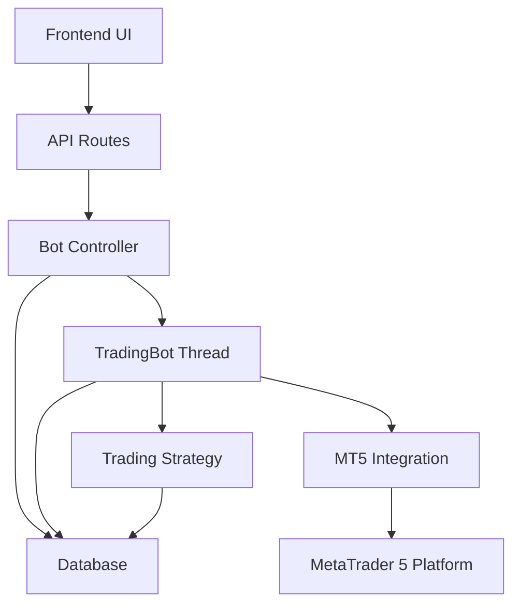
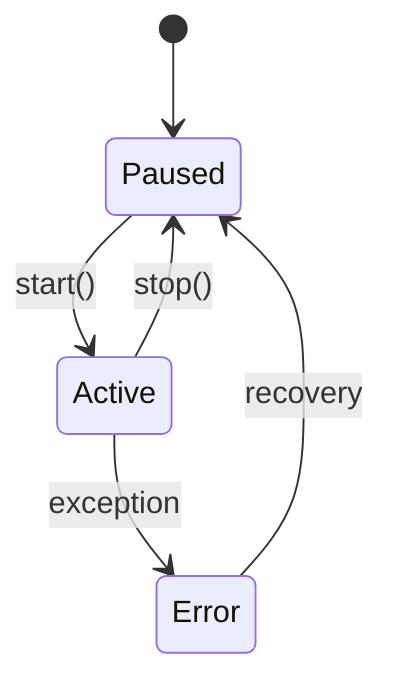
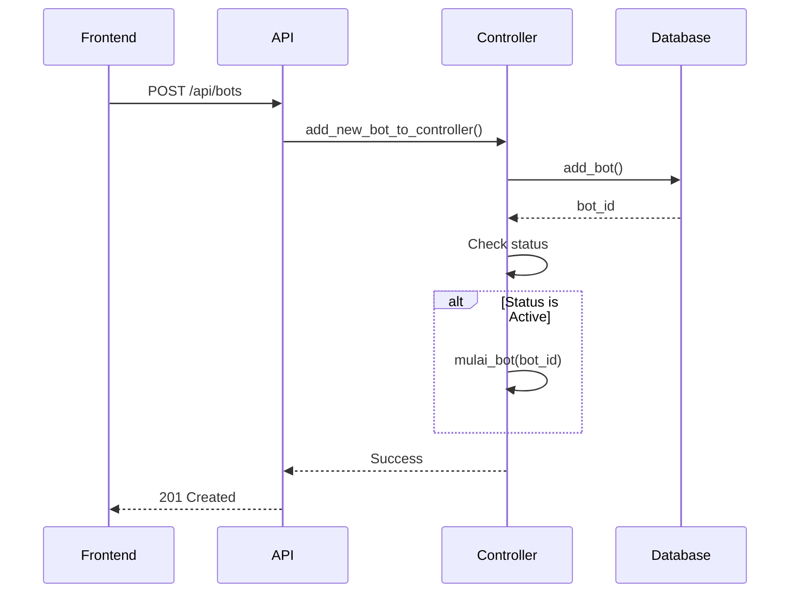
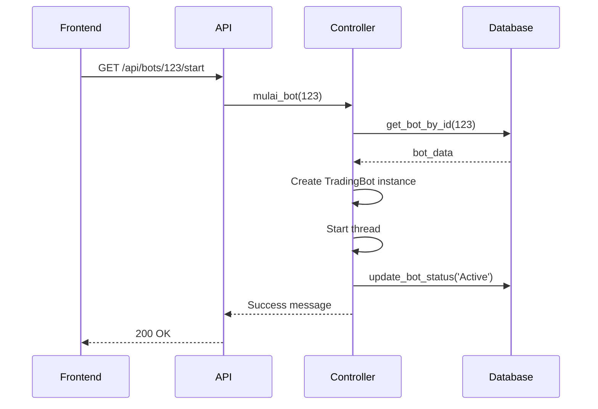
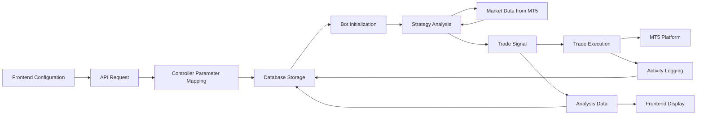

# Bot Management System

<cite>
**Referenced Files in This Document**   
- [core/bots/trading_bot.py](file://core/bots/trading_bot.py#L1-L169)
- [core/bots/controller.py](file://core/bots/controller.py#L1-L176)
- [core/routes/api_bots.py](file://core/routes/api_bots.py#L1-L167)
- [core/strategies/strategy_map.py](file://core/strategies/strategy_map.py#L1-L29)
- [core/mt5/trade.py](file://core/mt5/trade.py#L1-L152)
- [core/utils/mt5.py](file://core/utils/mt5.py#L1-L144)
- [core/db/queries.py](file://core/db/queries.py#L1-L174)
</cite>

## Table of Contents
1. [Introduction](#introduction)
2. [Core Components Overview](#core-components-overview)
3. [TradingBot Class Implementation](#tradingbot-class-implementation)
4. [Bot Controller and State Management](#bot-controller-and-state-management)
5. [API Routes and Request Handling](#api-routes-and-request-handling)
6. [Strategy Integration and Execution](#strategy-integration-and-execution)
7. [Trade Execution and MT5 Integration](#trade-execution-and-mt5-integration)
8. [Data Flow and Configuration Mapping](#data-flow-and-configuration-mapping)
9. [Error Handling and Logging](#error-handling-and-logging)
10. [Concurrency and Thread Safety](#concurrency-and-thread-safety)
11. [Common Issues and Recovery Strategies](#common-issues-and-recovery-strategies)
12. [Extensibility and Customization Points](#extensibility-and-customization-points)

## Introduction
The Bot Management System is a comprehensive trading automation framework designed to manage multiple algorithmic trading bots simultaneously. Built on a thread-based architecture, the system enables concurrent execution of trading strategies while maintaining robust state management, persistence, and user interface integration. This document provides a detailed analysis of the system's core components, focusing on the `TradingBot` class, its lifecycle management, interaction with trading strategies and MetaTrader 5 (MT5), and the supporting infrastructure that enables reliable bot operation. The system is designed to be both user-friendly for traders and extensible for developers, offering a balance between operational reliability and customization capabilities.

## Core Components Overview
The Bot Management System consists of several interconnected components that work together to provide a complete trading automation solution. At its core, the system features a thread-based bot execution model, a centralized controller for state management, RESTful API endpoints for user interaction, and deep integration with the MetaTrader 5 platform for market data and trade execution. The architecture follows a layered approach with clear separation of concerns between the user interface, business logic, and external system integration. Key components include the `TradingBot` class responsible for individual bot execution, the `controller.py` module that manages bot lifecycle and persistence, API routes that expose functionality to the frontend, strategy implementations that define trading logic, and utility modules that handle MT5 integration and database operations.



**Diagram sources**
- [core/bots/trading_bot.py](file://core/bots/trading_bot.py#L1-L169)
- [core/bots/controller.py](file://core/bots/controller.py#L1-L176)
- [core/routes/api_bots.py](file://core/routes/api_bots.py#L1-L167)

**Section sources**
- [core/bots/trading_bot.py](file://core/bots/trading_bot.py#L1-L169)
- [core/bots/controller.py](file://core/bots/controller.py#L1-L176)

## TradingBot Class Implementation
The `TradingBot` class, implemented in `core/bots/trading_bot.py`, serves as the fundamental execution unit for algorithmic trading strategies. Inheriting from Python's `threading.Thread` class, each bot instance runs in its own thread, enabling concurrent execution of multiple trading strategies without blocking the main application. The class encapsulates all aspects of bot operation, including initialization, execution loop, lifecycle management, and interaction with external systems.

### Thread-Based Execution Model
The `TradingBot` class leverages Python's threading capabilities to run trading strategies in the background. When a bot is started, the `start()` method inherited from `threading.Thread` creates a new thread and invokes the `run()` method. This design allows multiple bots to operate simultaneously, each monitoring markets and executing trades independently.

```python
class TradingBot(threading.Thread):
    def __init__(self, id, name, market, risk_percent, sl_pips, tp_pips, 
                 timeframe, check_interval, strategy, strategy_params={}, 
                 status='Paused'):
        super().__init__()
        # Initialize bot properties
        self.id = id
        self.name = name
        self.market = market
        self.risk_percent = risk_percent
        # ... other parameters
        self._stop_event = threading.Event()
```

The execution model follows a continuous loop pattern in the `run()` method, which periodically checks market conditions, analyzes data using the configured strategy, and executes trades when signals are generated. The loop continues until a stop event is set, allowing for graceful shutdown of the bot.

### Lifecycle Management
The `TradingBot` class implements a comprehensive lifecycle management system with three primary states: Active, Paused, and Error. The lifecycle is controlled through several key methods:

- **Start**: The `run()` method begins execution when the thread is started, changing the bot's status to 'Active' and initiating the main processing loop.
- **Stop**: The `stop()` method sets an internal event flag (`_stop_event`) that signals the execution loop to terminate. The bot then performs cleanup operations and changes its status to 'Paused'.
- **Pause**: While not a separate method, pausing is achieved by stopping the bot, which halts execution while preserving the bot's configuration.



**Diagram sources**
- [core/bots/trading_bot.py](file://core/bots/trading_bot.py#L1-L169)

**Section sources**
- [core/bots/trading_bot.py](file://core/bots/trading_bot.py#L1-L169)

### Interaction with Strategy and MT5 Modules
The `TradingBot` class serves as an integration point between trading strategies and the MT5 platform. During initialization, it loads the appropriate strategy class from the `STRATEGY_MAP` and creates an instance with the bot's configuration parameters. The bot then periodically fetches market data from MT5 using the `get_rates_mt5()` utility function and passes this data to the strategy for analysis.

The bot also handles trade execution by interfacing with MT5 through the `place_trade()` and `close_trade()` functions from `core/mt5/trade.py`. When a trading signal is generated, the bot manages position management, ensuring that conflicting positions are closed before opening new ones.

**Section sources**
- [core/bots/trading_bot.py](file://core/bots/trading_bot.py#L1-L169)

## Bot Controller and State Management
The bot controller, implemented in `core/bots/controller.py`, provides centralized management of all trading bots in the system. It handles bot creation, persistence, state management, and lifecycle operations, serving as the intermediary between the API layer and individual bot instances.

### Bot Creation and Persistence
The controller manages bot persistence through integration with the database via the `queries.py` module. When a new bot is created, the controller stores its configuration in the database with a default 'Paused' status. The `add_new_bot_to_controller()` function then checks if the bot should be started immediately based on its status.



**Diagram sources**
- [core/bots/controller.py](file://core/bots/controller.py#L1-L176)
- [core/db/queries.py](file://core/db/queries.py#L1-L174)

**Section sources**
- [core/bots/controller.py](file://core/bots/controller.py#L1-L176)

### State Management
The controller maintains an in-memory dictionary called `active_bots` that maps bot IDs to their running `TradingBot` instances. This allows for efficient lookup and management of active bots. The controller synchronizes the in-memory state with the database, ensuring that bot status is persisted across application restarts.

The `ambil_semua_bot()` function is called at application startup to load all bots from the database and restart any that were active when the application was last running. This provides resilience against application crashes or restarts.

```python
# Dictionary to store active bot instances
active_bots = {}

def mulai_bot(bot_id: int):
    """Start the thread for the selected bot."""
    if bot_id in active_bots and active_bots[bot_id].is_alive():
        return True, f"Bot {bot_id} is already running."
    
    # Load bot configuration from database
    bot_data = queries.get_bot_by_id(bot_id)
    
    # Create and start new TradingBot instance
    bot_thread = TradingBot(
        id=bot_data['id'], name=bot_data['name'], market=bot_data['market'],
        risk_percent=bot_data['lot_size'], sl_pips=bot_data['sl_pips'],
        tp_pips=bot_data['tp_pips'], timeframe=bot_data['timeframe'],
        check_interval=bot_data['check_interval_seconds'], strategy=bot_data['strategy'],
        strategy_params=json.loads(bot_data.get('strategy_params', '{}'))
    )
    bot_thread.start()
    active_bots[bot_id] = bot_thread
    queries.update_bot_status(bot_id, 'Active')
```

The controller also implements thread-safe operations for stopping bots. The `hentikan_bot()` function uses the dictionary's `pop()` method to atomically retrieve and remove the bot instance, preventing race conditions when multiple processes attempt to stop the same bot.

**Section sources**
- [core/bots/controller.py](file://core/bots/controller.py#L1-L176)

## API Routes and Request Handling
The API routes defined in `core/routes/api_bots.py` provide a RESTful interface for the frontend to interact with the bot management system. These routes delegate requests to the appropriate controller methods, forming the bridge between the user interface and the backend bot management functionality.

### Route Delegation to Controller Methods
Each API endpoint corresponds to a specific bot management operation and directly calls the equivalent function in the controller module. This direct delegation pattern keeps the API layer lightweight and focused on request/response handling, while business logic remains encapsulated in the controller.

```python
@api_bots.route('/api/bots/<int:bot_id>/start', methods=['POST'])
def start_bot_route(bot_id):
    """Start bot."""
    success, message = controller.mulai_bot(bot_id)
    return jsonify({'message': message}) if success else (jsonify({'error': message}), 500)
```

The following table summarizes the key API routes and their corresponding controller methods:

| **API Endpoint** | **HTTP Method** | **Controller Method** | **Functionality** |
|------------------|----------------|----------------------|-------------------|
| /api/bots | GET | get_all_bots() | Retrieve all bots |
| /api/bots | POST | add_new_bot_to_controller() | Create new bot |
| /api/bots/<id> | GET | get_bot_by_id() | Get specific bot |
| /api/bots/<id> | PUT | perbarui_bot() | Update bot configuration |
| /api/bots/<id> | DELETE | hapus_bot() | Delete bot |
| /api/bots/<id>/start | POST | mulai_bot() | Start bot |
| /api/bots/<id>/stop | POST | hentikan_bot() | Stop bot |
| /api/bots/start_all | POST | mulai_semua_bot() | Start all paused bots |
| /api/bots/stop_all | POST | hentikan_semua_bot() | Stop all active bots |
| /api/bots/<id>/analysis | GET | get_bot_analysis_data() | Get latest analysis |

The API also provides additional functionality such as retrieving available trading strategies, getting strategy parameters, and accessing bot history and notifications, all of which are implemented through direct calls to controller functions or database queries.



**Diagram sources**
- [core/routes/api_bots.py](file://core/routes/api_bots.py#L1-L167)
- [core/bots/controller.py](file://core/bots/controller.py#L1-L176)

**Section sources**
- [core/routes/api_bots.py](file://core/routes/api_bots.py#L1-L167)

## Strategy Integration and Execution
The system supports multiple trading strategies through a flexible strategy registration and execution framework. Strategies are implemented as separate classes and integrated into the system through the `STRATEGY_MAP`, which provides a centralized registry of available strategies.

### Strategy Registration
The `STRATEGY_MAP` in `core/strategies/strategy_map.py` defines a dictionary that maps strategy identifiers to their corresponding class implementations. This design pattern allows for easy addition of new strategies without modifying core bot logic.

```python
STRATEGY_MAP = {
    'MA_CROSSOVER': MACrossoverStrategy,
    'QUANTUMBOTX_HYBRID': QuantumBotXHybridStrategy,
    'RSI_CROSSOVER': RSICrossoverStrategy,
    'BOLLINGER_REVERSION': BollingerBandsStrategy,
    'BOLLINGER_SQUEEZE': BollingerSqueezeStrategy,
    # ... other strategies
}
```

When a `TradingBot` instance is created, it uses the `strategy_name` parameter to look up the appropriate strategy class in the `STRATEGY_MAP`. It then instantiates this class, passing itself and any strategy-specific parameters.

```python
strategy_class = STRATEGY_MAP.get(self.strategy_name)
if not strategy_class:
    raise ValueError(f"Strategy '{self.strategy_name}' not found.")
self.strategy_instance = strategy_class(bot_instance=self, params=self.strategy_params)
```

### Strategy Execution
During each iteration of the bot's execution loop, it fetches market data and passes it to the strategy's `analyze()` method. The strategy processes the data according to its specific logic and returns a trading signal (BUY, SELL, or HOLD) along with an explanation.

```python
# In TradingBot.run()
df = get_rates_mt5(self.market_for_mt5, tf_const, 250)
self.last_analysis = self.strategy_instance.analyze(df)
signal = self.last_analysis.get("signal", "HOLD")
```

The API provides endpoints to retrieve information about available strategies and their configurable parameters, enabling the frontend to present appropriate configuration options to users.

```python
@api_bots.route('/api/strategies', methods=['GET'])
def get_strategies_route():
    strategies = []
    for key, strategy_class in STRATEGY_MAP.items():
        strategies.append({
            'id': key,
            'name': getattr(strategy_class, 'name', key.replace('_', ' ').title()),
            'description': getattr(strategy_class, 'description', 'No description available.')
        })
    return jsonify(strategies)
```

**Section sources**
- [core/strategies/strategy_map.py](file://core/strategies/strategy_map.py#L1-L29)
- [core/bots/trading_bot.py](file://core/bots/trading_bot.py#L1-L169)

## Trade Execution and MT5 Integration
The system integrates with MetaTrader 5 (MT5) for both market data retrieval and trade execution. This integration is handled through utility modules that abstract the MT5 API and provide reliable, error-handled access to trading functionality.

### Market Data Retrieval
The `get_rates_mt5()` function in `core/utils/mt5.py` is responsible for fetching historical price data from MT5. It converts MT5's native data format into a pandas DataFrame, which is then used by trading strategies for analysis.

```python
def get_rates_mt5(symbol: str, timeframe: int, count: int = 100):
    """Fetch historical price data from MT5 as a DataFrame."""
    try:
        rates = mt5.copy_rates_from_pos(symbol, timeframe, 0, count)
        if rates is None or len(rates) == 0:
            logger.warning(f"Failed to fetch price data for {symbol}")
            return pd.DataFrame()
        
        df = pd.DataFrame(rates)
        df['time'] = pd.to_datetime(df['time'], unit='s')
        df.set_index('time', inplace=True)
        return df
    except Exception as e:
        logger.error(f"Error fetching MT5 data for {symbol}: {e}", exc_info=True)
        return pd.DataFrame()
```

The `TIMEFRAME_MAP` dictionary provides a mapping between human-readable timeframe strings (e.g., "H1", "M15") and MT5's constant values, ensuring consistent interpretation of timeframe configurations.

```python
TIMEFRAME_MAP = {
    "M1": mt5.TIMEFRAME_M1, "M5": mt5.TIMEFRAME_M5, "M15": mt5.TIMEFRAME_M15, 
    "H1": mt5.TIMEFRAME_H1, "H4": mt5.TIMEFRAME_H4, "D1": mt5.TIMEFRAME_D1,
    "W1": mt5.TIMEFRAME_W1, "MN1": mt5.TIMEFRAME_MN1
}
```

### Trade Execution
Trade execution is handled by the `place_trade()` and `close_trade()` functions in `core/mt5/trade.py`. These functions encapsulate the complexity of MT5's order placement API, providing a simplified interface for opening and closing positions.

The `place_trade()` function implements dynamic position sizing based on risk percentage and uses Average True Range (ATR) to calculate stop-loss and take-profit levels in price points rather than pips.

```python
def place_trade(symbol, order_type, risk_percent, sl_atr_multiplier, 
                tp_atr_multiplier, magic_id, timeframe_str):
    """
    Place a trade with dynamic lot size and ATR-based SL/TP levels.
    """
    # Calculate ATR for dynamic SL/TP
    df = get_rates_mt5(symbol, timeframe_const, 30)
    atr = ta.atr(df['high'], df['low'], df['close'], length=14).iloc[-1]
    
    # Calculate SL/TP levels based on ATR
    sl_distance = atr * sl_atr_multiplier
    tp_distance = atr * tp_atr_multiplier
    
    # Calculate dynamic lot size based on risk percentage
    lot_size = calculate_lot_size(account_currency, symbol, risk_percent, 
                                 sl_level, price)
    
    # Create and send order request
    request = {
        "action": mt5.TRADE_ACTION_DEAL,
        "symbol": symbol,
        "volume": lot_size,
        "type": order_type,
        "price": price,
        "sl": sl_level,
        "tp": tp_level,
        "magic": magic_id,
        "comment": "QuantumBotX Trade",
        "type_time": mt5.ORDER_TIME_GTC,
        "type_filling": mt5.ORDER_FILLING_FOK,
    }
    
    result = mt5.order_send(request)
    return result, "Order placed successfully"
```

The `close_trade()` function handles position closure, automatically determining the appropriate order type based on the current position type (BUY positions are closed with SELL orders and vice versa).

**Section sources**
- [core/mt5/trade.py](file://core/mt5/trade.py#L1-L152)
- [core/utils/mt5.py](file://core/utils/mt5.py#L1-L144)

## Data Flow and Configuration Mapping
The system implements a comprehensive data flow architecture that connects user configuration through the API to bot execution and back to the user interface. This section details the mapping between configuration parameters, database storage, and runtime execution.

### Configuration Parameter Mapping
The system uses a consistent parameter naming convention across different layers, with appropriate transformations when necessary. The following table outlines the key parameter mappings:

| **Frontend Parameter** | **Database Column** | **Runtime Parameter** | **Description** |
|------------------------|---------------------|----------------------|----------------|
| risk_percent | lot_size | risk_percent | Risk percentage used for position sizing |
| sl_atr_multiplier | sl_pips | sl_atr_multiplier | ATR multiplier for stop-loss distance |
| tp_atr_multiplier | tp_pips | tp_atr_multiplier | ATR multiplier for take-profit distance |
| check_interval_seconds | check_interval_seconds | check_interval | Frequency of market analysis |
| strategy_params | strategy_params | strategy_params | JSON-encoded strategy-specific parameters |

The controller handles the transformation between these representations, particularly in the `perbarui_bot()` function, which maps frontend parameters to database columns.

```python
def perbarui_bot(bot_id: int, data: dict):
    """Update bot configuration in database."""
    # Transform parameter names
    if 'check_interval_seconds' in data:
        data['interval'] = data.pop('check_interval_seconds')
    if 'sl_atr_multiplier' in data:
        data['sl_pips'] = data.pop('sl_atr_multiplier')
    if 'tp_atr_multiplier' in data:
        data['tp_pips'] = data.pop('tp_atr_multiplier')
    if 'risk_percent' in data:
        data['lot_size'] = data.pop('risk_percent')
    
    # Convert custom parameters to JSON string
    custom_params = data.pop('params', {})
    data['strategy_params'] = json.dumps(custom_params)
    
    # Filter data to expected arguments
    expected_args = ['name', 'market', 'lot_size', 'sl_pips', 'tp_pips',
                     'timeframe', 'interval', 'strategy', 'strategy_params']
    update_data = {key: data[key] for key in expected_args if key in data}
    
    # Update database
    success = queries.update_bot(bot_id=bot_id, **update_data)
```

### Data Flow Diagram


**Diagram sources**
- [core/bots/controller.py](file://core/bots/controller.py#L1-L176)
- [core/db/queries.py](file://core/db/queries.py#L1-L174)
- [core/bots/trading_bot.py](file://core/bots/trading_bot.py#L1-L169)

**Section sources**
- [core/bots/controller.py](file://core/bots/controller.py#L1-L176)

## Error Handling and Logging
The system implements comprehensive error handling and logging mechanisms to ensure reliability and provide visibility into bot operations. Errors are handled at multiple levels, from individual function calls to the overall bot execution loop.

### Error Handling in Bot Execution
The `TradingBot` class wraps its main execution loop in a try-except block to catch and handle exceptions without terminating the entire application. When an error occurs, it is logged, and the bot continues its operation after a brief delay.

```python
while not self._stop_event.is_set():
    try:
        # Main bot logic
        symbol_info = mt5.symbol_info(self.market_for_mt5)
        if not symbol_info:
            msg = f"Cannot retrieve info for symbol {self.market_for_mt5}."
            self.log_activity('WARNING', msg)
            self.last_analysis = {"signal": "ERROR", "explanation": msg}
            time.sleep(self.check_interval)
            continue
        
        # ... other logic
        
    except Exception as e:
        error_message = f"Error in main loop: {e}"
        self.log_activity('ERROR', error_message, exc_info=True, is_notification=True)
        self.last_analysis = {"signal": "ERROR", "explanation": str(e)}
        time.sleep(self.check_interval * 2)  # Extended delay after error
```

### Logging and Activity Tracking
The system uses Python's logging module for internal logging and maintains a separate activity history in the database. The `log_activity()` method in the `TradingBot` class records important events to both the log file and the database.

```python
def log_activity(self, action, details, exc_info=False, is_notification=False):
    """Record bot activity to database and log file."""
    try:
        from core.db.queries import add_history_log
        add_history_log(self.id, action, details, is_notification)
        log_message = f"Bot {self.id} [{action}]: {details}"
        if exc_info:
            logger.error(log_message, exc_info=True)
        else:
            logger.info(log_message)
    except Exception as e:
        logger.error(f"Failed to record history for bot {self.id}: {e}")
```

The database stores activity logs in the `trade_history` table, with a flag to identify notifications that should be displayed to the user. The controller provides methods to retrieve these logs and manage notification status.

**Section sources**
- [core/bots/trading_bot.py](file://core/bots/trading_bot.py#L1-L169)
- [core/db/queries.py](file://core/db/queries.py#L1-L174)

## Concurrency and Thread Safety
The system's thread-based architecture requires careful consideration of concurrency and thread safety to prevent race conditions and ensure reliable operation.

### Thread Management
Each `TradingBot` instance runs in its own thread, isolated from other bots. The controller manages these threads through the `active_bots` dictionary, which maps bot IDs to their thread instances. This design allows for independent operation of multiple bots while providing centralized management.

The use of `threading.Event()` for the stop signal ensures that bot shutdown is handled gracefully. When `stop()` is called, it sets the event flag, which is checked at the beginning of each iteration of the main loop. This allows the bot to complete its current operation before terminating.

```python
def stop(self):
    """Send stop signal to the thread."""
    self._stop_event.set()

def is_stopped(self):
    """Check if thread has been signaled to stop."""
    return self._stop_event.is_set()
```

### Thread-Safe Operations
The controller implements thread-safe operations for stopping bots by using the dictionary's `pop()` method, which is atomic. This prevents race conditions when multiple processes attempt to stop the same bot.

```python
def hentikan_bot(bot_id: int):
    """Stop the running bot thread."""
    bot_thread = active_bots.pop(bot_id, None)  # Atomic remove
    
    if bot_thread and bot_thread.is_alive():
        bot_thread.stop()
        bot_thread.join(timeout=10)
        queries.update_bot_status(bot_id, 'Paused')
        return True, f"Bot {bot_thread.name} stopped successfully."
    
    # Ensure database status is consistent
    queries.update_bot_status(bot_id, 'Paused')
    return True, f"Bot {bot_id} already stopped or not running."
```

The controller also handles the case where a bot is being updated while it is running. When `perbarui_bot()` is called, it first stops the running bot (if active), updates the configuration, and then restarts it.

**Section sources**
- [core/bots/trading_bot.py](file://core/bots/trading_bot.py#L1-L169)
- [core/bots/controller.py](file://core/bots/controller.py#L1-L176)

## Common Issues and Recovery Strategies
The system is designed to handle various common issues that may arise during bot operation, with built-in recovery strategies to maintain reliability.

### Bot Freezing and Unresponsive States
Bot freezing can occur due to several factors, including network connectivity issues with MT5, blocked API calls, or infinite loops in strategy code. The system addresses these issues through several mechanisms:

1. **Timeouts**: The `join(timeout=10)` call when stopping a bot ensures that the application doesn't hang indefinitely if a bot fails to respond to the stop signal.

2. **Error Resilience**: The main execution loop catches exceptions and continues operation after logging the error, preventing a single error from terminating the bot.

3. **Heartbeat Monitoring**: The periodic `check_interval` ensures that the bot regularly checks its stop condition, allowing it to respond to stop signals even if individual operations are delayed.

### Symbol Resolution Issues
The system includes robust symbol resolution logic to handle cases where the exact symbol name may vary between brokers or MT5 configurations.

```python
def find_mt5_symbol(base_symbol: str) -> str | None:
    """
    Find the correct symbol name in MT5 based on a base name.
    Handles common variations and ensures the symbol is visible in Market Watch.
    """
    base_symbol_cleaned = re.sub(r'[^A-Z0-9]', '', base_symbol.upper())
    
    # Direct match
    if base_symbol_cleaned in visible_symbols:
        return base_symbol_cleaned
    
    # Regex pattern for variations
    pattern = re.compile(f"^[a-zA-Z]*{base_symbol_cleaned}[a-zA-Z0-9._-]*$", re.IGNORECASE)
    
    for symbol_name in visible_symbols:
        if pattern.match(symbol_name):
            if mt5.symbol_select(symbol_name, True):
                return symbol_name
```

### Recovery Strategies
The system implements several recovery strategies to handle failures:

1. **Automatic Restart on Startup**: The `ambil_semua_bot()` function restarts any bots that were active when the application was last running, providing resilience against application crashes.

2. **Graceful Degradation**: When market data cannot be retrieved, the bot logs a warning and continues operation after a delay, rather than terminating.

3. **State Synchronization**: The controller ensures that the in-memory state of active bots is synchronized with the database state, preventing inconsistencies after restarts.

4. **Error Propagation**: Errors are logged and propagated to the user interface through notifications, allowing users to take corrective action.

**Section sources**
- [core/bots/trading_bot.py](file://core/bots/trading_bot.py#L1-L169)
- [core/bots/controller.py](file://core/bots/controller.py#L1-L176)
- [core/utils/mt5.py](file://core/utils/mt5.py#L1-L144)

## Extensibility and Customization Points
The system is designed with extensibility in mind, providing several points where custom behavior can be added or existing functionality can be modified.

### Adding New Strategies
New trading strategies can be added by creating a new strategy class and registering it in the `STRATEGY_MAP`. The strategy class should implement an `analyze()` method that takes a pandas DataFrame of market data and returns a trading signal.

```python
# Example of adding a new strategy
from core.strategies.base_strategy import BaseStrategy

class CustomStrategy(BaseStrategy):
    name = "Custom Strategy"
    description = "A custom trading strategy"
    
    @classmethod
    def get_definable_params(cls):
        return [
            {"name": "period", "type": "int", "default": 14, "min": 2, "max": 100},
            {"name": "threshold", "type": "float", "default": 0.5, "min": 0.1, "max": 1.0}
        ]
    
    def analyze(self, df):
        # Custom analysis logic
        signal = "BUY"  # or "SELL" or "HOLD"
        explanation = "Custom strategy generated a buy signal"
        return {"signal": signal, "explanation": explanation}

# Register in strategy_map.py
STRATEGY_MAP['CUSTOM_STRATEGY'] = CustomStrategy
```

### Customizing Trade Execution
The trade execution logic in `core/mt5/trade.py` can be customized to implement different position sizing methods, risk management rules, or order types. The `calculate_lot_size()` function can be modified to incorporate additional risk factors, and the `place_trade()` function can be extended to support different order types or execution algorithms.

### Extending the API
New API endpoints can be added to `core/routes/api_bots.py` to expose additional functionality. These endpoints should follow the existing pattern of delegating to controller methods or database queries.

```python
@api_bots.route('/api/bots/<int:bot_id>/custom_action', methods=['POST'])
def custom_action_route(bot_id):
    """Perform a custom action on a bot."""
    # Custom logic here
    result = controller.perform_custom_action(bot_id)
    return jsonify({"result": result})
```

### Enhancing the Controller
The controller can be extended with additional methods for batch operations, advanced state management, or integration with external systems. The existing structure makes it easy to add new functionality while maintaining the separation of concerns.

**Section sources**
- [core/strategies/strategy_map.py](file://core/strategies/strategy_map.py#L1-L29)
- [core/mt5/trade.py](file://core/mt5/trade.py#L1-L152)
- [core/routes/api_bots.py](file://core/routes/api_bots.py#L1-L167)
- [core/bots/controller.py](file://core/bots/controller.py#L1-L176)