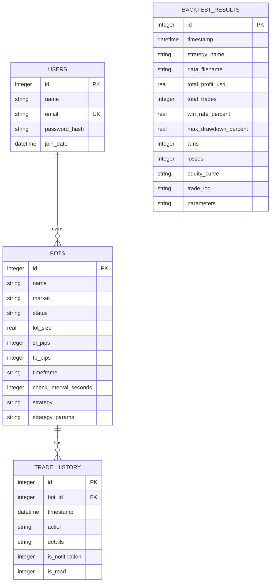

# Database Layer

<cite>
**Referenced Files in This Document**   
- [core/db/models.py](file://core/db/models.py)
- [core/db/connection.py](file://core/db/connection.py)
- [core/db/queries.py](file://core/db/queries.py)
- [init_db.py](file://init_db.py)
</cite>

## Table of Contents
1. [Introduction](#introduction)
2. [Database Schema Design](#database-schema-design)
3. [Connection Management](#connection-management)
4. [Query Abstraction Layer](#query-abstraction-layer)
5. [Database Initialization and Migration](#database-initialization-and-migration)
6. [Entity Relationships and Constraints](#entity-relationships-and-constraints)
7. [Indexing and Performance Considerations](#indexing-and-performance-considerations)
8. [Transaction Safety and Data Integrity](#transaction-safety-and-data-integrity)
9. [Sample Queries for Common Operations](#sample-queries-for-common-operations)
10. [Schema Diagram](#schema-diagram)

## Introduction
The Database Layer in the QuantumBotX system is responsible for persistent storage of trading bots, strategies, trade history, backtesting results, and user settings. Built on SQLite, it provides a lightweight, file-based database solution suitable for single-user applications and development environments. This document details the schema design, connection handling, query abstraction, initialization process, and best practices for data integrity and performance.

The core components include:
- **Schema Definition**: Defined in `init_db.py`, creating tables for bots, trade history, backtesting, and users
- **Connection Management**: Centralized in `connection.py` with consistent path resolution
- **Query Abstraction**: Implemented in `queries.py` to encapsulate SQL operations
- **Data Access**: Direct SQL usage in `models.py` for specific logging operations

This layer supports essential trading operations such as bot lifecycle management, trade logging, notification tracking, and performance analysis.

## Database Schema Design
The database schema consists of four primary tables designed to support the trading bot ecosystem:

**bots**: Stores configuration and state for each trading bot
- `id`: Primary key, auto-incrementing integer
- `name`: Bot name (required)
- `market`: Trading market (e.g., forex, crypto) (required)
- `status`: Current status ('Aktif' or 'Dijeda') with default 'Dijeda'
- `lot_size`: Trade lot size (default 0.01)
- `sl_pips`: Stop loss in pips (default 100)
- `tp_pips`: Take profit in pips (default 200)
- `timeframe`: Chart timeframe (default 'H1')
- `check_interval_seconds`: Frequency of market checks (default 60)
- `strategy`: Strategy type identifier
- `strategy_params`: JSON-formatted strategy parameters

**trade_history**: Records all bot activities and notifications
- `id`: Primary key, auto-incrementing integer
- `bot_id`: Foreign key referencing bots.id with CASCADE delete
- `timestamp`: Automatic timestamp (default CURRENT_TIMESTAMP)
- `action`: Type of action performed
- `details`: Descriptive details of the action
- `is_notification`: Flag (0/1) indicating if entry is a notification
- `is_read`: Flag (0/1) for notification read status

**backtest_results**: Stores outcomes of strategy backtesting
- `id`: Primary key, auto-incrementing integer
- `timestamp`: Automatic timestamp
- `strategy_name`: Name of tested strategy
- `data_filename`: Source data file used
- `total_profit_usd`: Net profit in USD
- `total_trades`: Number of trades executed
- `win_rate_percent`: Percentage of winning trades
- `max_drawdown_percent`: Maximum account drawdown
- `wins`: Count of winning trades
- `losses`: Count of losing trades
- `equity_curve`: JSON array of equity values over time
- `trade_log`: JSON array of individual trade records
- `parameters`: JSON object of backtest parameters

**users**: Manages application user accounts
- `id`: Primary key, auto-incrementing integer
- `name`: Full name of user
- `email`: Email address (unique constraint)
- `password_hash`: Hashed password using Werkzeug security
- `join_date`: Account creation timestamp (default CURRENT_TIMESTAMP)

**Section sources**
- [init_db.py](file://init_db.py#L40-L114)

## Connection Management
The connection management system provides a centralized way to establish and configure database connections. The `get_db_connection()` function in `connection.py` ensures consistent access to the SQLite database file.

Key features:
- **Centralized Configuration**: Database filename (`bots.db`) is defined once
- **Path Resolution**: Uses `os.path` to resolve the absolute path from the module location
- **Dictionary-style Access**: Configures `row_factory = sqlite3.Row` to enable column access by name
- **Context Management**: Connections are properly managed using context managers in calling code

The connection path is constructed as:
```
BASE_DIR = directory of connection.py
DATABASE_PATH = BASE_DIR + '../../bots.db'
```

This places the database file in the project root directory, accessible to all components.

**Section sources**
- [core/db/connection.py](file://core/db/connection.py#L0-L14)

## Query Abstraction Layer
The query abstraction layer in `queries.py` provides a clean API for database operations, encapsulating SQL details and handling errors gracefully. All functions use proper exception handling and logging.

Key operations include:

**Bot Management**
- `get_all_bots()`: Retrieve all bots ordered by creation
- `get_bot_by_id(bot_id)`: Fetch single bot by ID
- `add_bot(...)`: Insert new bot with default 'Dijeda' status
- `update_bot(...)`: Modify existing bot configuration
- `delete_bot(bot_id)`: Remove bot (and related history via CASCADE)
- `update_bot_status(bot_id, status)`: Change bot activation state

**History and Notifications**
- `add_history_log(bot_id, action, details, is_notification=False)`: Record bot activity
- `get_history_by_bot_id(bot_id)`: Retrieve all history for a specific bot
- `get_notifications()`: Join trade_history with bots to get notification details
- `get_unread_notifications_count()`: Count unread notifications for UI badges
- `get_unread_notifications()`: Fetch unread notifications for toast display
- `mark_notifications_as_read(notification_ids=None)`: Bulk update read status

**Backtesting**
- `get_all_backtest_history()`: Retrieve all backtest results ordered by timestamp

All query functions:
- Use context managers (`with get_db_connection() as conn`)
- Handle `sqlite3.Error` exceptions
- Return structured data (dict/list of dicts)
- Log errors with appropriate severity

**Section sources**
- [core/db/queries.py](file://core/db/queries.py#L0-L174)

## Database Initialization and Migration
The `init_db.py` script handles database creation and initialization. It follows an idempotent design using `CREATE TABLE IF NOT EXISTS` statements, allowing safe execution on existing databases.

Initialization process:
1. **Optional Cleanup**: Remove existing database if `--force` flag is provided
2. **Connection Establishment**: Create connection to `bots.db` file
3. **Table Creation**: Sequentially create users, bots, trade_history, and backtest_results tables
4. **Default User**: Insert admin user with email 'admin@quantumbotx.com' and password 'admin'
5. **Completion Message**: Confirm successful database setup

The script is designed to be run manually or as part of deployment. It does not support incremental migrations - schema changes require manual intervention or enhanced migration logic.

Security considerations:
- Passwords are hashed using `werkzeug.security.generate_password_hash`
- Email field has UNIQUE constraint to prevent duplicates
- Foreign key constraint ensures referential integrity between bots and trade_history

**Section sources**
- [init_db.py](file://init_db.py#L0-L136)

## Entity Relationships and Constraints
The database enforces several relationships and constraints to maintain data integrity:

**Primary Keys**
- All tables have `id INTEGER PRIMARY KEY AUTOINCREMENT`
- Ensures unique identifier for each record

**Foreign Key Relationship**
- `trade_history.bot_id` references `bots.id`
- Defined with `FOREIGN KEY (bot_id) REFERENCES bots (id) ON DELETE CASCADE`
- When a bot is deleted, all related trade history is automatically removed

**Constraints**
- `bots.name`: NOT NULL
- `bots.market`: NOT NULL
- `bots.status`: NOT NULL with DEFAULT 'Dijeda'
- `users.email`: NOT NULL and UNIQUE
- `users.password_hash`: NOT NULL
- `trade_history.action`: NOT NULL
- `backtest_results` fields: All core metrics are NOT NULL

**Default Values**
- Numerous DEFAULT values ensure consistent data even when applications omit optional fields
- Timestamps automatically populated via DEFAULT CURRENT_TIMESTAMP
- Status fields have sensible defaults ('Dijeda' for bots)

The schema prioritizes data completeness with NOT NULL constraints on essential fields while allowing flexibility for optional parameters stored as JSON.

**Section sources**
- [init_db.py](file://init_db.py#L40-L114)

## Indexing and Performance Considerations
The current implementation does not explicitly define any database indexes beyond the primary key indexes automatically created by SQLite.

Potential performance implications:
- **Query Performance**: Without additional indexes, queries filtering on non-primary key columns will perform full table scans
- **High-Frequency Access**: The `trade_history` table may experience performance degradation as it grows, especially for queries filtering by `bot_id` or `is_notification`

Recommended optimizations:
- Add index on `trade_history.bot_id` for faster bot-specific history retrieval
- Add composite index on `trade_history(is_notification, is_read)` for notification queries
- Add index on `trade_history.timestamp` for time-range queries
- Consider index on `bots.status` for filtering active bots

Current performance characteristics:
- **Read Operations**: Generally fast due to small result sets and in-memory operations
- **Write Operations**: Single INSERT/UPDATE statements wrapped in transactions
- **Connection Overhead**: Minimal, as SQLite connections are lightweight
- **Scalability**: Limited by SQLite's single-writer architecture

For high-frequency trading scenarios, consider:
- Batch inserts for trade history
- Read/write separation patterns
- Database vacuuming and optimization routines
- Monitoring database file size and query performance

**Section sources**
- [init_db.py](file://init_db.py#L40-L114)
- [core/db/queries.py](file://core/db/queries.py#L0-L174)

## Transaction Safety and Data Integrity
The database layer implements several mechanisms to ensure transaction safety and data integrity:

**Transaction Management**
- Uses context managers (`with` statements) that automatically commit on successful completion or rollback on exceptions
- Explicit `conn.commit()` calls after write operations
- Individual operations are atomic (e.g., bot update with single UPDATE statement)

**Error Handling**
- Comprehensive try-except blocks around all database operations
- Specific handling of `sqlite3.Error` exceptions
- Detailed error logging with context
- Graceful degradation (returning empty results or None rather than propagating exceptions)

**Data Integrity Features**
- Foreign key constraints with CASCADE DELETE
- NOT NULL constraints on critical fields
- DEFAULT values for important columns
- UNIQUE constraint on user email
- Parameterized queries preventing SQL injection

**Potential Limitations**
- SQLite's default WAL mode not explicitly configured
- No explicit transaction isolation level setting
- Concurrent write access may cause locking issues
- No automated backup or recovery procedures

Best practices observed:
- Connection cleanup via context managers
- Input validation at application layer
- Proper escaping through parameterized queries
- Comprehensive logging for debugging

**Section sources**
- [core/db/queries.py](file://core/db/queries.py#L0-L174)
- [init_db.py](file://init_db.py#L0-L136)

## Sample Queries for Common Operations
The following examples demonstrate common database operations using the provided abstraction layer:

**Retrieve All Active Bots**
```python
def get_active_bots():
    """Get all bots with status 'Aktif'"""
    try:
        with get_db_connection() as conn:
            bots = conn.execute(
                'SELECT * FROM bots WHERE status = ?', ('Aktif',)
            ).fetchall()
            return [dict(row) for row in bots]
    except sqlite3.Error as e:
        logger.error(f"Database error saat mengambil bot aktif: {e}")
        return []
```

**Get Trade History for Specific Bot**
```python
# Using existing abstraction
history = get_history_by_bot_id(123)
```

**Get Recent Notifications**
```python
# Get all notifications with bot names
notifications = get_notifications()

# Get unread count for UI badge
unread_count = get_unread_notifications_count()['unread_count']

# Mark all as read
mark_notifications_as_read()
```

**Add Trade Log Entry**
```python
# Log a trade action
add_history_log(
    bot_id=123,
    action="BUY_ORDER_PLACED",
    details="Placed buy order for EUR/USD at 1.0850",
    is_notification=True
)
```

**Retrieve Backtest Results with Filters**
```python
def get_profitable_backtests(min_profit=1000):
    """Get backtests with profit above threshold"""
    try:
        with get_db_connection() as conn:
            results = conn.execute(
                'SELECT * FROM backtest_results WHERE total_profit_usd > ? ORDER BY total_profit_usd DESC',
                (min_profit,)
            ).fetchall()
            return [dict(row) for row in results]
    except sqlite3.Error as e:
        logger.error(f"Database error saat mengambil hasil backtest: {e}")
        return []
```

**Update Multiple Bot Statuses**
```python
def bulk_update_bot_status(bot_ids, status):
    """Update status for multiple bots"""
    try:
        with get_db_connection() as conn:
            placeholders = ','.join(['?' for _ in bot_ids])
            query = f"UPDATE bots SET status = ? WHERE id IN ({placeholders})"
            conn.execute(query, [status] + bot_ids)
            conn.commit()
            return True
    except sqlite3.Error as e:
        logger.error(f"Gagal update status massal: {e}")
        return False
```

**Section sources**
- [core/db/queries.py](file://core/db/queries.py#L0-L174)

## Schema Diagram
The following Entity Relationship Diagram visualizes the database schema and relationships:



**Diagram sources**
- [init_db.py](file://init_db.py#L40-L114)
- [core/db/queries.py](file://core/db/queries.py#L0-L174)