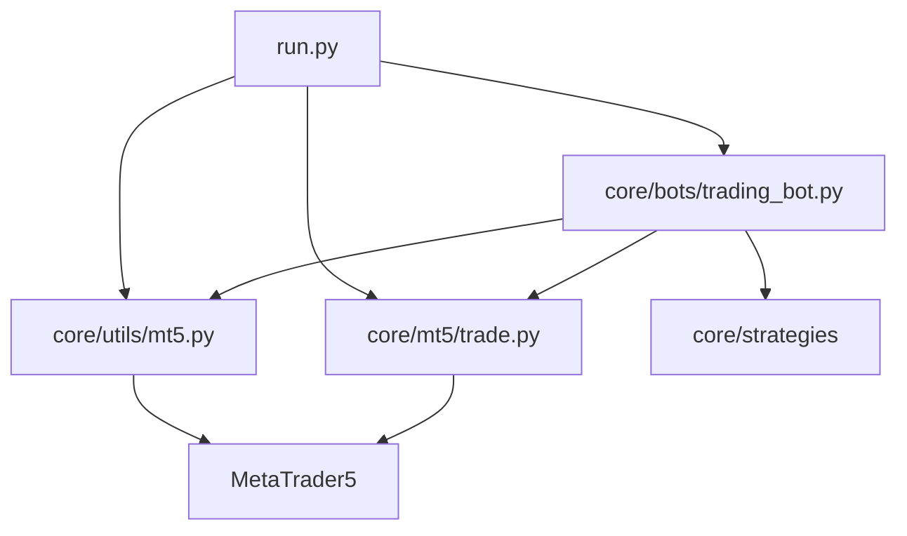
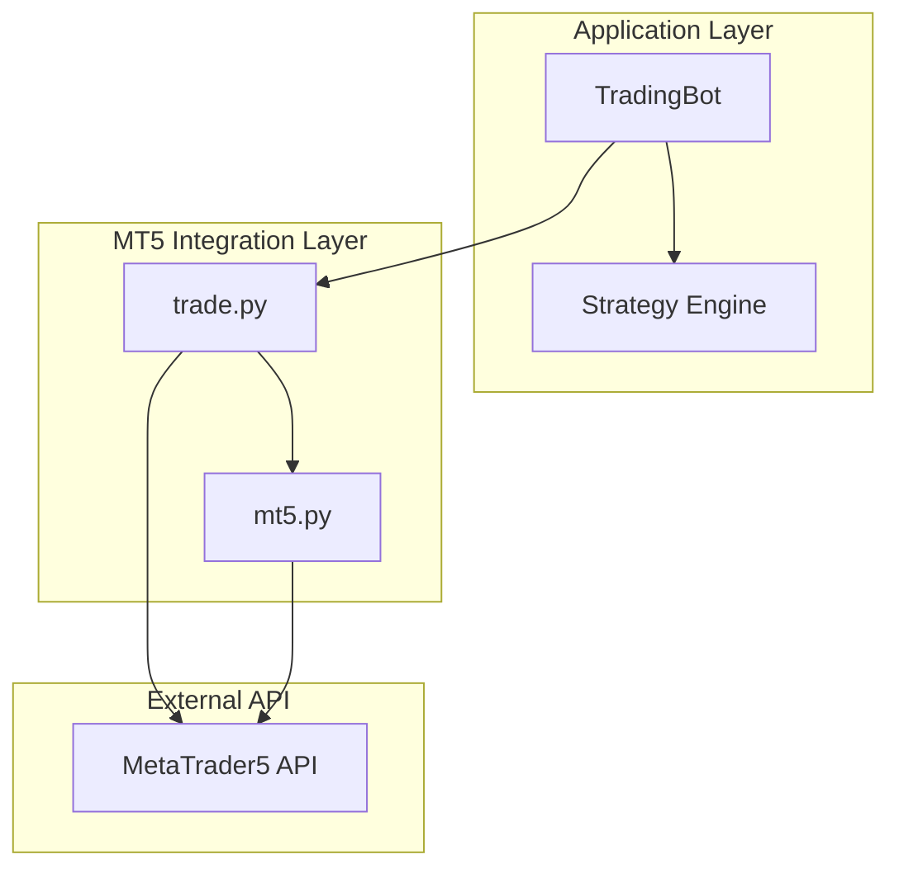
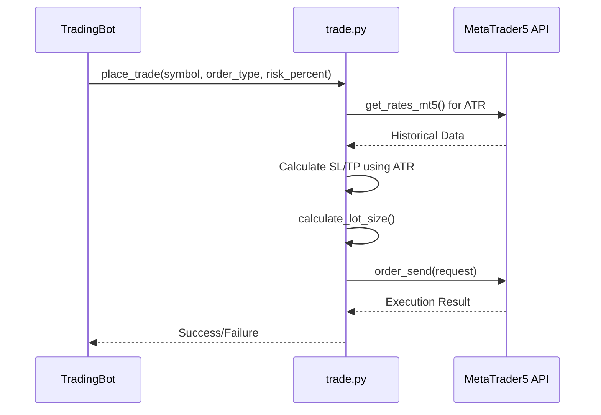
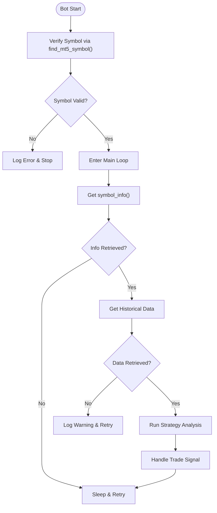
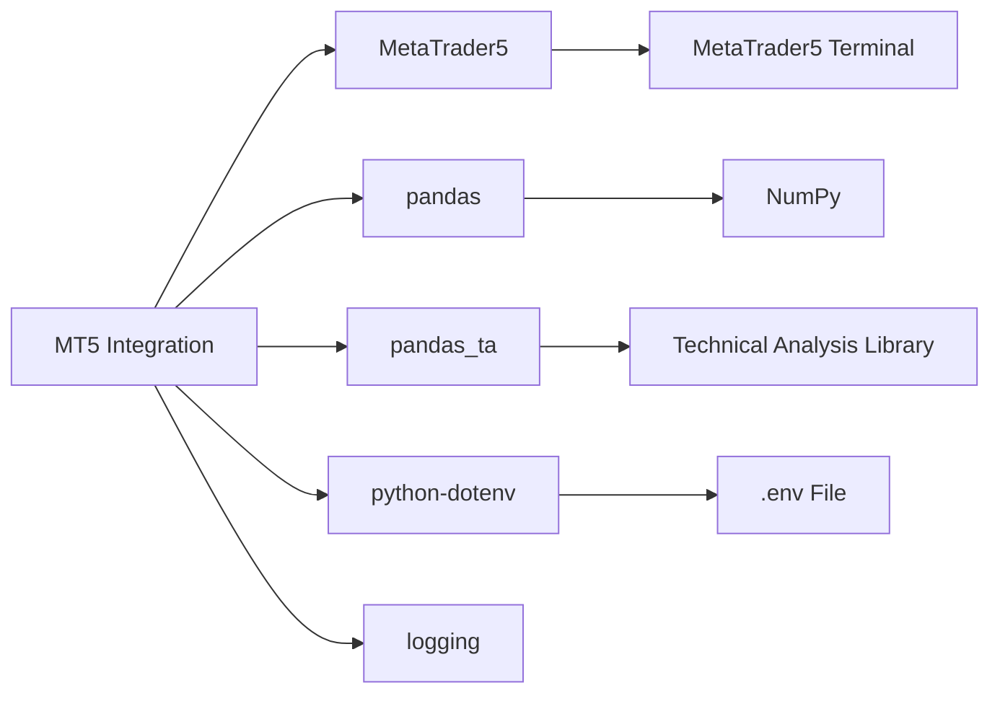

# MT5 Integration Module

<cite>
**Referenced Files in This Document**   
- [core/mt5/trade.py](file://core/mt5/trade.py)
- [core/utils/mt5.py](file://core/utils/mt5.py)
- [run.py](file://run.py)
- [core/bots/trading_bot.py](file://core/bots/trading_bot.py)
- [core/utils/symbols.py](file://core/utils/symbols.py)
- [requirements.txt](file://requirements.txt)
- [core/brokers/broker_factory.py](file://core/brokers/broker_factory.py)
</cite>

## Table of Contents
1. [Introduction](#introduction)
2. [Project Structure](#project-structure)
3. [Core Components](#core-components)
4. [Architecture Overview](#architecture-overview)
5. [Detailed Component Analysis](#detailed-component-analysis)
6. [Dependency Analysis](#dependency-analysis)
7. [Performance Considerations](#performance-considerations)
8. [Troubleshooting Guide](#troubleshooting-guide)
9. [Conclusion](#conclusion)

## Introduction
The MT5 Integration Module enables automated trading and market data retrieval via the MetaTrader 5 (MT5) API within the QuantumBotX platform. This document details the implementation of trade execution, position management, symbol validation, connection resilience, and secure credential handling. The module supports dynamic risk-based lot sizing, ATR-based stop-loss and take-profit levels, and robust error handling for production-grade reliability. Designed with modularity and maintainability in mind, it integrates seamlessly with the broader trading bot ecosystem.

## Project Structure
The MT5 integration is organized across multiple directories to separate concerns and promote reusability. Core trading logic resides in `core/mt5`, utility functions in `core/utils`, and bot execution in `core/bots`. The application entry point in `run.py` initializes the MT5 connection, ensuring a single, centralized connection per instance.



**Diagram sources**
- [run.py](file://run.py#L1-L52)
- [core/mt5/trade.py](file://core/mt5/trade.py#L1-L153)
- [core/utils/mt5.py](file://core/utils/mt5.py#L1-L145)
- [core/bots/trading_bot.py](file://core/bots/trading_bot.py#L1-L170)

**Section sources**
- [run.py](file://run.py#L1-L52)
- [core/mt5/trade.py](file://core/mt5/trade.py#L1-L153)
- [core/utils/mt5.py](file://core/utils/mt5.py#L1-L145)

## Core Components
The MT5 Integration Module consists of three primary components: trade execution (`trade.py`), utility functions (`mt5.py`), and bot-level integration (`trading_bot.py`). These components work together to enable secure, reliable, and intelligent trading operations.

**Section sources**
- [core/mt5/trade.py](file://core/mt5/trade.py#L1-L153)
- [core/utils/mt5.py](file://core/utils/mt5.py#L1-L145)
- [core/bots/trading_bot.py](file://core/bots/trading_bot.py#L1-L170)

## Architecture Overview
The architecture follows a layered design with clear separation between connection management, trade logic, and bot execution. The `run.py` entry point initializes the MT5 connection using environment variables. The `mt5.py` utility module provides reusable functions for market data, account info, and symbol resolution. The `trade.py` module handles order placement and position management. Finally, `trading_bot.py` orchestrates strategy execution and trade lifecycle.



**Diagram sources**
- [run.py](file://run.py#L30-L52)
- [core/utils/mt5.py](file://core/utils/mt5.py#L1-L145)
- [core/mt5/trade.py](file://core/mt5/trade.py#L1-L153)
- [core/bots/trading_bot.py](file://core/bots/trading_bot.py#L1-L170)

## Detailed Component Analysis

### Trade Execution and Order Management
The `core/mt5/trade.py` module implements order placement, position closing, and dynamic lot sizing. It uses the MT5 API to send market orders with stop-loss and take-profit levels.

#### Key Functions:
- **calculate_lot_size**: Computes position size based on account balance, risk percentage, and stop-loss distance
- **place_trade**: Submits a market order with ATR-based SL/TP levels
- **close_trade**: Closes an open position by ticket ID



**Diagram sources**
- [core/mt5/trade.py](file://core/mt5/trade.py#L1-L153)

**Section sources**
- [core/mt5/trade.py](file://core/mt5/trade.py#L1-L153)

### Utility Functions for MT5 Integration
The `core/utils/mt5.py` file provides essential utilities for connection management, data retrieval, and symbol validation.

#### Key Functions:
- **initialize_mt5**: Establishes connection using credentials from environment variables
- **get_rates_mt5**: Retrieves historical price data as a pandas DataFrame
- **find_mt5_symbol**: Resolves symbol variations (e.g., XAUUSD vs XAUUSD.pro)
- **get_account_info_mt5**: Fetches current account balance, equity, and profit

```mermaid
classDiagram
class MT5Utils {
+initialize_mt5(account, password, server) bool
+get_account_info_mt5() dict
+get_rates_mt5(symbol, timeframe, count) DataFrame
+get_open_positions_mt5() list
+get_trade_history_mt5(days) list
+find_mt5_symbol(base_symbol) str
}
MT5Utils --> "MetaTrader5" : uses
```

**Diagram sources**
- [core/utils/mt5.py](file://core/utils/mt5.py#L1-L145)

**Section sources**
- [core/utils/mt5.py](file://core/utils/mt5.py#L1-L145)

### Bot-Level Integration and Resilience
The `TradingBot` class in `core/bots/trading_bot.py` manages the lifecycle of automated trading strategies, including connection resilience and error recovery.

#### Connection Resilience Features:
- Symbol validation using `find_mt5_symbol`
- Automatic retry on data retrieval failure
- Graceful error handling in main loop
- Position state management via magic numbers



**Diagram sources**
- [core/bots/trading_bot.py](file://core/bots/trading_bot.py#L1-L170)

**Section sources**
- [core/bots/trading_bot.py](file://core/bots/trading_bot.py#L1-L170)

## Dependency Analysis
The MT5 module depends on several external and internal packages to function correctly.



**Diagram sources**
- [requirements.txt](file://requirements.txt#L1-L23)
- [core/mt5/trade.py](file://core/mt5/trade.py#L1-L153)
- [core/utils/mt5.py](file://core/utils/mt5.py#L1-L145)

**Section sources**
- [requirements.txt](file://requirements.txt#L1-L23)

## Performance Considerations
The MT5 integration is designed for low-latency execution and efficient resource usage.

### Key Performance Characteristics:
- **Latency**: Market orders use `ORDER_FILLING_FOK` (Fill or Kill) for immediate execution
- **Rate Limits**: No explicit throttling; relies on MT5 API limits
- **Data Efficiency**: Retrieves only necessary historical data (e.g., 30 bars for ATR)
- **Memory Usage**: Uses pandas DataFrames for efficient data processing

### Best Practices for Minimizing Latency:
1. Use direct market execution (`TRADE_ACTION_DEAL`)
2. Limit historical data requests to essential periods
3. Cache symbol information when possible
4. Run on low-latency infrastructure near MT5 server

## Troubleshooting Guide
This section addresses common issues encountered when using the MT5 Integration Module.

### Common Issues and Solutions:

**Connection Failures**
- **Symptom**: `initialize_mt5` returns `False`
- **Cause**: Incorrect credentials or server name
- **Solution**: Verify `MT5_LOGIN`, `MT5_PASSWORD`, and `MT5_SERVER` in `.env`

**Symbol Not Found**
- **Symptom**: `find_mt5_symbol` returns `None`
- **Cause**: Symbol not in Market Watch or incorrect naming
- **Solution**: Add symbol to MT5 Market Watch or use correct variation

**Order Rejection**
- **Symptom**: `order_send` returns error code
- **Cause**: Insufficient margin, invalid SL/TP, or symbol not traded
- **Solution**: Check margin requirements and symbol trading permissions

**Slippage Issues**
- **Mitigation**: The system uses market orders with `ORDER_FILLING_FOK`, which may reject orders if price moves. For high-volatility assets, consider adjusting SL/TP multipliers.

**Disconnection Handling**
- The system does not automatically reconnect if MT5 disconnects during operation. Ensure stable network connection and consider implementing heartbeat monitoring.

**Section sources**
- [core/utils/mt5.py](file://core/utils/mt5.py#L1-L145)
- [core/mt5/trade.py](file://core/mt5/trade.py#L1-L153)
- [run.py](file://run.py#L1-L52)

## Conclusion
The MT5 Integration Module provides a robust foundation for algorithmic trading with comprehensive features for trade execution, market data retrieval, and error handling. Its modular design separates concerns between connection management, trade logic, and bot execution, enabling maintainable and scalable automated trading strategies. By leveraging environment variables for credential storage, dynamic risk management, and symbol resolution, the module ensures secure and reliable operation. Future enhancements could include automatic reconnection logic and more sophisticated slippage modeling.