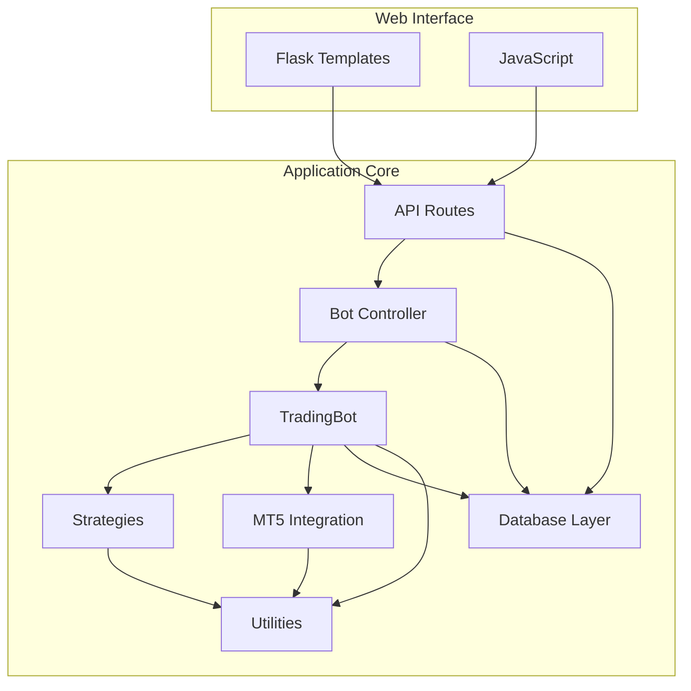
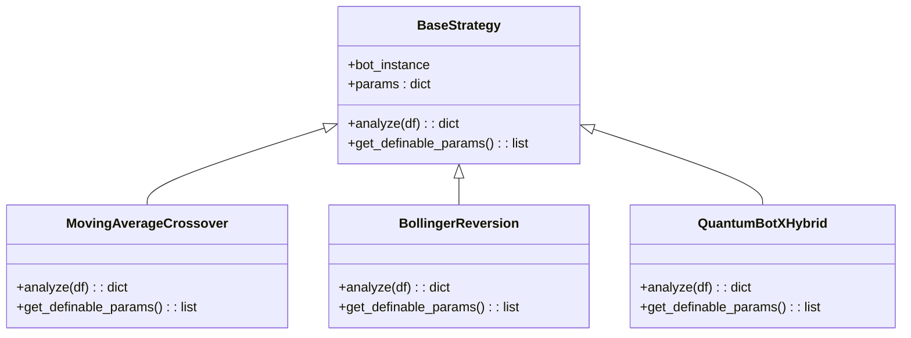
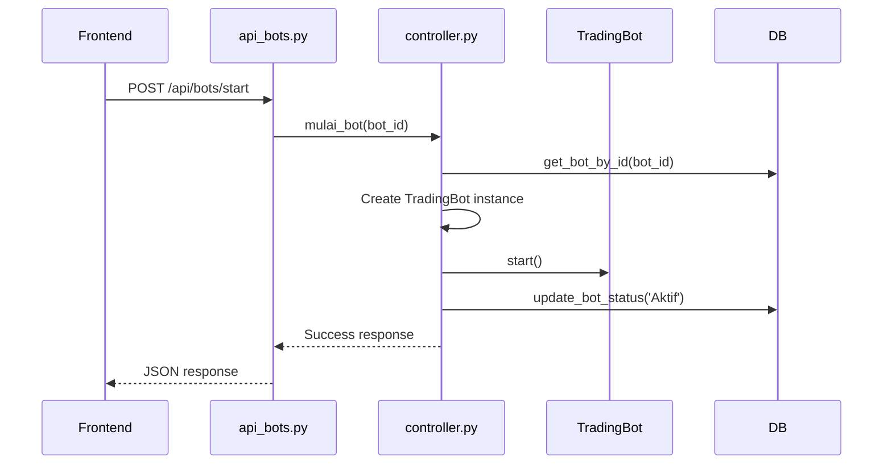
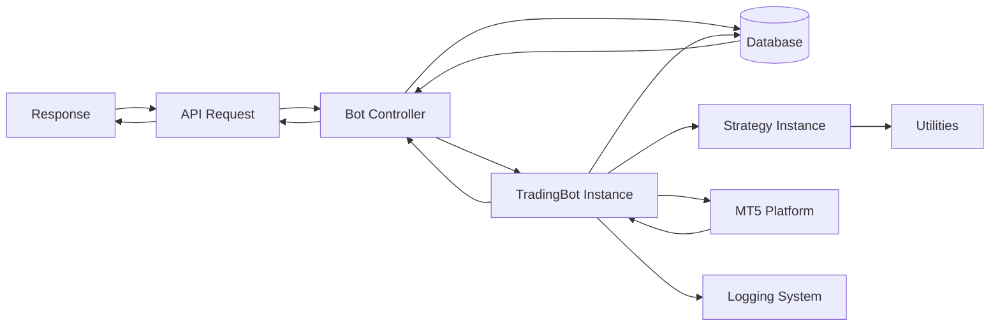

# Modular Component Architecture

<cite>
**Referenced Files in This Document**   
- [trading_bot.py](file://core/bots/trading_bot.py#L1-L170)
- [base_strategy.py](file://core/strategies/base_strategy.py#L1-L29)
- [trade.py](file://core/mt5/trade.py#L1-L153)
- [queries.py](file://core/db/queries.py#L1-L175)
- [controller.py](file://core/bots/controller.py#L1-L177)
- [api_bots.py](file://core/routes/api_bots.py#L1-L168)
- [symbols.py](file://core/utils/symbols.py)
</cite>

## Table of Contents
1. [Introduction](#introduction)
2. [Core Module Overview](#core-module-overview)
3. [TradingBot Class Architecture](#tradingbot-class-architecture)
4. [Strategy System and Inheritance](#strategy-system-and-inheritance)
5. [MT5 Trade Execution Mechanism](#mt5-trade-execution-mechanism)
6. [Database Persistence Layer](#database-persistence-layer)
7. [API Routes and Controller Logic](#api-routes-and-controller-logic)
8. [Utility Functions and Cross-Cutting Concerns](#utility-functions-and-cross-cutting-concerns)
9. [Component Interaction Flow](#component-interaction-flow)
10. [Benefits of Modular Design](#benefits-of-modular-design)

## Introduction
QuantumBotX is a modular trading bot system designed for MetaTrader5 (MT5) integration, built with Python and Flask. The architecture emphasizes separation of concerns through well-defined modules that encapsulate specific responsibilities. This document analyzes the modular component architecture, focusing on how core components such as bots, strategies, database, MT5 integration, routes, and utilities interact through clean interfaces. The design enables maintainability, testability, and extensibility by isolating functionality into distinct layers.

**Section sources**
- [README.md](file://README.md#L1-L137)

## Core Module Overview
The QuantumBotX project follows a layered architectural pattern with clearly separated modules under the `core/` directory:
- **bots**: Manages bot lifecycle and execution via threading
- **strategies**: Contains trading logic implementations
- **db**: Handles data persistence using SQLite
- **mt5**: Interfaces with the MetaTrader5 platform
- **routes**: Exposes RESTful endpoints for web interface interaction
- **utils**: Provides shared functionality across modules

Each module operates independently while communicating through defined interfaces, minimizing coupling and enabling independent development and testing.



**Diagram sources**
- [project_structure](file://#L1-L50)

## TradingBot Class Architecture
The `TradingBot` class serves as the central execution engine, inheriting from Python's `threading.Thread` to enable concurrent operation of multiple bots. It encapsulates the main trading loop that periodically analyzes market data and executes trades based on strategy signals.

Key responsibilities include:
- Initializing with bot configuration parameters
- Managing thread lifecycle (start/stop)
- Coordinating strategy analysis
- Handling trade execution via MT5
- Maintaining state and logging activities

```python
class TradingBot(threading.Thread):
    def __init__(self, id, name, market, risk_percent, sl_pips, tp_pips, 
                 timeframe, check_interval, strategy, strategy_params={}):
        super().__init__()
        self.id = id
        self.name = name
        self.market = market
        self.risk_percent = risk_percent
        # ... other parameters
        self.strategy_instance = None
        self._stop_event = threading.Event()
```

The bot uses a strategy pattern to delegate analysis logic to strategy instances while maintaining control over trade execution and position management.

**Section sources**
- [trading_bot.py](file://core/bots/trading_bot.py#L1-L170)

## Strategy System and Inheritance
The strategy system is built around a base class `BaseStrategy` that defines a common interface for all trading strategies. This abstract base class enforces implementation of the `analyze()` method, ensuring consistency across different strategy types.



**Diagram sources**
- [base_strategy.py](file://core/strategies/base_strategy.py#L1-L29)

Strategies receive market data as a pandas DataFrame and return a dictionary containing:
- **signal**: BUY, SELL, or HOLD
- **explanation**: Human-readable rationale
- **price**: Current market price
- **timestamp**: Analysis time

This standardized output allows the `TradingBot` to interpret results uniformly regardless of the underlying strategy logic.

## MT5 Trade Execution Mechanism
The MT5 integration module handles all interactions with the MetaTrader5 platform, including trade execution, position management, and market data retrieval. The `place_trade()` function demonstrates a comprehensive approach to order placement:

```python
def place_trade(symbol, order_type, risk_percent, sl_atr_multiplier, 
                tp_atr_multiplier, magic_id, timeframe_str):
    # 1. Calculate ATR for dynamic SL/TP
    atr = ta.atr(df['high'], df['low'], df['close'], length=14).iloc[-1]
    
    # 2. Determine price levels
    sl_distance = atr * sl_atr_multiplier
    tp_distance = atr * tp_atr_multiplier
    
    # 3. Calculate dynamic lot size
    lot_size = calculate_lot_size(account_currency, symbol, risk_percent, 
                                  sl_level, entry_price)
    
    # 4. Send order request
    request = {
        "action": mt5.TRADE_ACTION_DEAL,
        "symbol": symbol,
        "volume": lot_size,
        "type": order_type,
        "price": price,
        "sl": sl_level,
        "tp": tp_level,
        "magic": magic_id,
        # ... other parameters
    }
```

The system uses magic numbers (bot IDs) to uniquely identify bot positions, enabling precise position tracking and management.

**Section sources**
- [trade.py](file://core/mt5/trade.py#L1-L153)

## Database Persistence Layer
The database module provides persistence for bot configurations, trade history, and notifications using SQLite. The `queries.py` file contains a collection of functions that abstract database operations:

```mermaid
flowchart TD
A["Application Request"] --> B{Operation Type}
B --> |CRUD Bot| C[add_bot(), update_bot(), delete_bot()]
B --> |Retrieve Data| D[get_all_bots(), get_bot_by_id()]
B --> |History Management| E[add_history_log(), get_history_by_bot_id()]
B --> |Notifications| F[get_notifications(), mark_notifications_as_read()]
C --> G[(SQLite Database)]
D --> G
E --> G
F --> G
```

**Diagram sources**
- [queries.py](file://core/db/queries.py#L1-L175)

Key features include:
- Thread-safe database connections using context managers
- Comprehensive error handling with logging
- Notification system with read/unread state tracking
- History logging with filtering capabilities

The persistence layer follows the Repository pattern, providing a clean API for data access without exposing database implementation details.

## API Routes and Controller Logic
The API routes in `api_bots.py` handle HTTP requests from the web interface, delegating business logic to the controller layer rather than containing it directly. This separation ensures that route handlers remain lightweight and focused on request/response handling.



**Diagram sources**
- [api_bots.py](file://core/routes/api_bots.py#L1-L168)
- [controller.py](file://core/bots/controller.py#L1-L177)

The controller acts as a mediator between the API layer and bot instances, managing:
- Bot lifecycle (start/stop)
- Configuration updates
- State synchronization between memory and database
- Thread safety during operations

This architecture prevents race conditions and ensures consistent state management across the application.

**Section sources**
- [controller.py](file://core/bots/controller.py#L1-L177)

## Utility Functions and Cross-Cutting Concerns
The `utils` module contains shared functionality that addresses cross-cutting concerns across the application. Key utility components include:

- **logger.py**: Centralized logging configuration
- **validation.py**: Input validation and sanitization
- **mt5.py**: MT5-specific helper functions (symbol resolution, rate fetching)
- **symbols.py**: Symbol management and market watch integration

These utilities promote code reuse and ensure consistent behavior across different modules. For example, the `find_mt5_symbol()` function handles symbol variations across brokers, while `get_rates_mt5()` standardizes data retrieval from MT5.

**Section sources**
- [symbols.py](file://core/utils/symbols.py#L1-L50)

## Component Interaction Flow
The complete interaction flow from user action to trade execution demonstrates the effectiveness of the modular design:



**Diagram sources**
- [trading_bot.py](file://core/bots/trading_bot.py#L1-L170)
- [controller.py](file://core/bots/controller.py#L1-L177)

This flow illustrates how each component plays a specific role:
1. User initiates action through web interface
2. API route receives and validates request
3. Controller orchestrates the operation
4. Bot instance executes trading logic
5. Strategy provides analysis
6. MT5 module handles platform interaction
7. Database persists state changes
8. Utilities support cross-cutting functions

## Benefits of Modular Design
The modular architecture of QuantumBotX provides several key benefits:

**Maintainability**: Each module can be updated independently. For example, adding a new strategy only requires creating a new class that inherits from `BaseStrategy` without modifying core bot logic.

**Testability**: Components can be tested in isolation using mocks and stubs. The separation of concerns allows unit testing of strategies without requiring MT5 connectivity.

**Extensibility**: New features can be added with minimal impact on existing code. The strategy map system allows dynamic registration of strategies.

**Scalability**: The threading model enables multiple bots to run concurrently, while the controller manages resource allocation and lifecycle.

**Reliability**: Error handling is localized within modules, preventing cascading failures. The use of try-except blocks and logging ensures issues are captured and reported appropriately.

This architectural approach aligns with SOLID principles, particularly the Single Responsibility Principle and Dependency Inversion Principle, resulting in a robust and adaptable trading system.