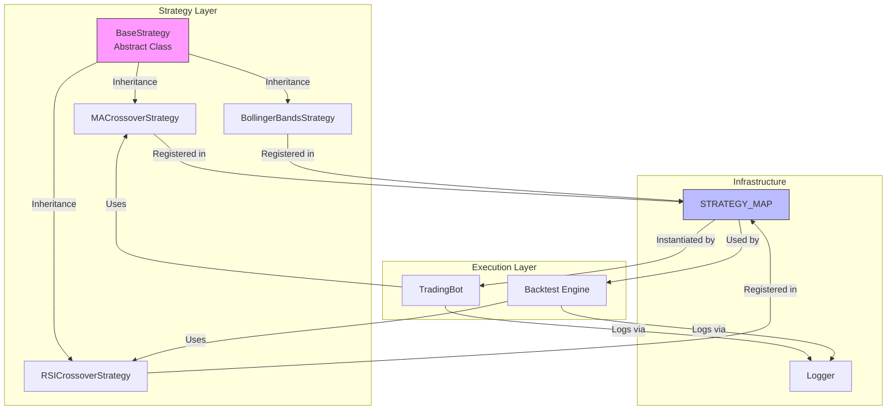
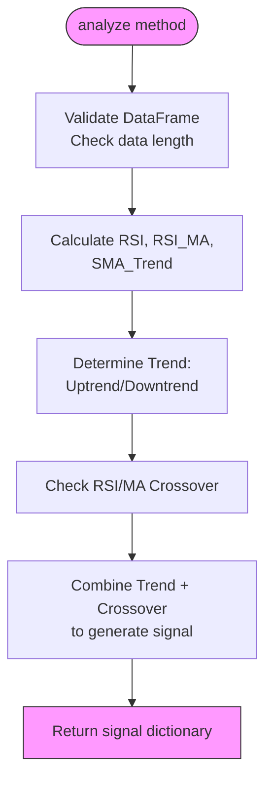
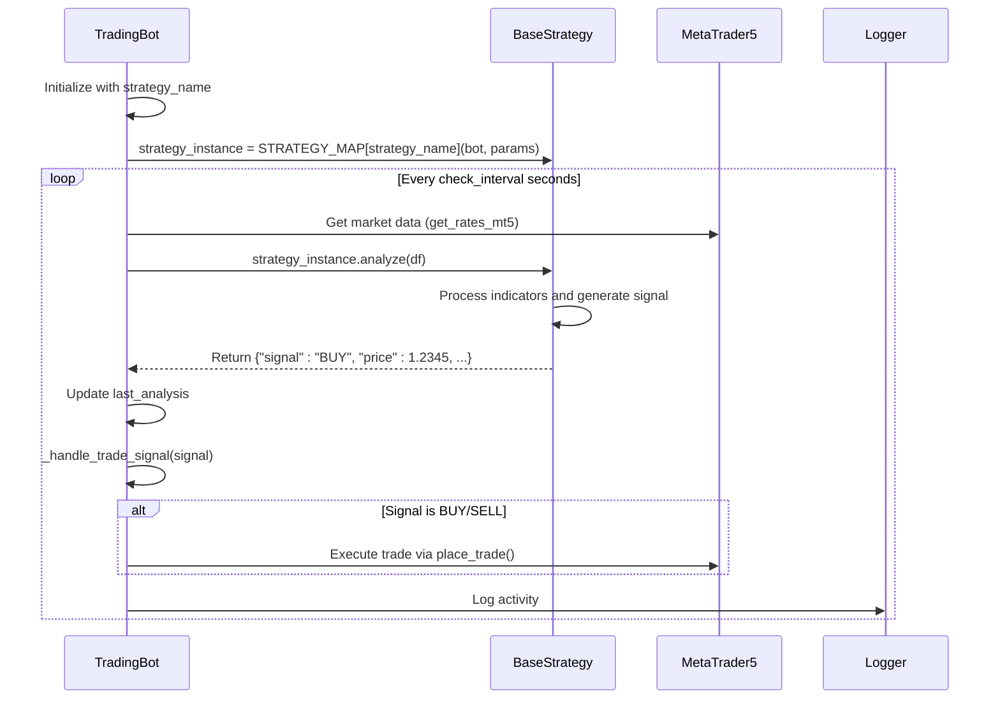
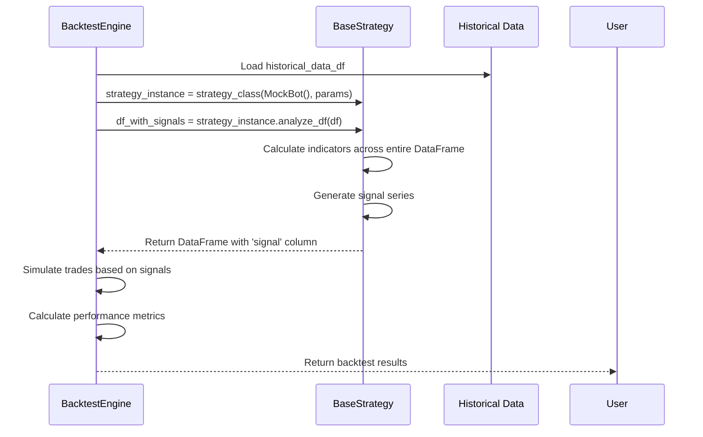

# Base Strategy Interface

<cite>
**Referenced Files in This Document**   
- [base_strategy.py](file://core/strategies/base_strategy.py#L4-L28)
- [ma_crossover.py](file://core/strategies/ma_crossover.py#L5-L60)
- [rsi_crossover.py](file://core/strategies/rsi_crossover.py#L5-L84)
- [strategy_map.py](file://core/strategies/strategy_map.py#L1-L30)
- [trading_bot.py](file://core/bots/trading_bot.py#L1-L170)
- [engine.py](file://core/backtesting/engine.py#L36-L60)
- [logger.py](file://core/utils/logger.py#L1-L26)
</cite>

## Table of Contents
1. [Introduction](#introduction)
2. [Core Components](#core-components)
3. [Architecture Overview](#architecture-overview)
4. [Detailed Component Analysis](#detailed-component-analysis)
5. [Strategy Lifecycle and Execution Flow](#strategy-lifecycle-and-execution-flow)
6. [Error Handling and Debugging](#error-handling-and-debugging)
7. [Common Implementation Mistakes](#common-implementation-mistakes)
8. [Conclusion](#conclusion)

## Introduction
The `BaseStrategy` abstract class serves as the foundational interface for all trading strategies within the QuantumBotX system. It defines a consistent contract that all concrete strategy implementations must follow, enabling modularity, reusability, and seamless integration with the broader trading and backtesting infrastructure. This document provides a comprehensive analysis of the `BaseStrategy` class, its role in the system architecture, and best practices for extending it.

**Section sources**
- [base_strategy.py](file://core/strategies/base_strategy.py#L4-L28)

## Core Components

The `BaseStrategy` class is implemented as an abstract base class (ABC) in Python, enforcing a strict interface for all derived strategy classes. It resides in `core/strategies/base_strategy.py` and is inherited by all concrete strategy implementations such as `MACrossoverStrategy`, `RSICrossoverStrategy`, and others.

Key components of the `BaseStrategy` interface include:

- **Initialization (`__init__`)**: Accepts a `bot_instance` and optional parameters dictionary (`params`)
- **Abstract Method (`analyze`)**: Must be implemented by all subclasses to generate real-time trading signals
- **Class Method (`get_definable_params`)**: Provides metadata about configurable parameters for UI integration

The class ensures that every strategy has access to the parent bot instance, enabling interaction with risk management, market data, and execution systems.

```python
class BaseStrategy(ABC):
    def __init__(self, bot_instance, params: dict = {}):
        self.bot = bot_instance
        self.params = params

    @abstractmethod
    def analyze(self, df):
        raise NotImplementedError("Each strategy must implement the `analyze(df)` method.")

    @classmethod
    def get_definable_params(cls):
        return []
```

**Section sources**
- [base_strategy.py](file://core/strategies/base_strategy.py#L4-L28)

## Architecture Overview

The `BaseStrategy` class is central to the strategy pattern implementation in QuantumBotX, acting as the contract between the trading engine and individual strategy logic. It integrates with multiple system components including the `TradingBot`, backtesting engine, and configuration system.



**Diagram sources**
- [base_strategy.py](file://core/strategies/base_strategy.py#L4-L28)
- [strategy_map.py](file://core/strategies/strategy_map.py#L1-L30)
- [trading_bot.py](file://core/bots/trading_bot.py#L1-L170)
- [engine.py](file://core/backtesting/engine.py#L36-L60)

## Detailed Component Analysis

### BaseStrategy Class Analysis

The `BaseStrategy` class defines the essential interface that all trading strategies must implement. It provides a standardized way to initialize strategy parameters, access the parent bot context, and define the core analysis logic.

#### Initialization and Dependency Injection
The `__init__` method accepts two parameters:
- `bot_instance`: Reference to the parent `TradingBot` instance, enabling access to configuration, risk parameters, and logging
- `params`: Dictionary of strategy-specific parameters (e.g., moving average periods, RSI thresholds)

This design enables strategies to access system-wide resources while maintaining encapsulation.

#### Abstract Method: analyze
The `analyze` method is the core of the strategy interface. It must be implemented by all concrete strategies and follows these requirements:
- **Input**: Pandas DataFrame containing market data (OHLCV format)
- **Output**: Dictionary with keys: `signal` (BUY/SELL/HOLD), `price`, and `explanation`
- **Execution Context**: Used in live trading mode

```python
def analyze(self, df):
    # Must return {"signal": "BUY", "price": 1.2345, "explanation": "Moving averages crossed"}
    pass
```

#### Class Method: get_definable_params
This method returns a list of configurable parameters that can be exposed in the user interface. Each parameter is defined as a dictionary with:
- `name`: Internal parameter name
- `label`: User-friendly display name
- `type`: Data type (number, string, etc.)
- `default`: Default value

```python
@classmethod
def get_definable_params(cls):
    return [
        {"name": "fast_period", "label": "Fast MA Period", "type": "number", "default": 20}
    ]
```

**Section sources**
- [base_strategy.py](file://core/strategies/base_strategy.py#L4-L28)

### Concrete Strategy Implementation Examples

#### MA Crossover Strategy
The `MACrossoverStrategy` demonstrates a typical implementation pattern:

```mermaid
classDiagram
class BaseStrategy {
+bot : TradingBot
+params : dict
+__init__(bot_instance, params)
+analyze(df) abstract
+get_definable_params() classmethod
}
class MACrossoverStrategy {
+name : str
+description : str
+get_definable_params()
+analyze(df)
+analyze_df(df)
}
BaseStrategy <|-- MACrossoverStrategy
note right of MACrossoverStrategy
Implements analyze() for live trading<br/>
Implements analyze_df() for backtesting<br/>
Overrides get_definable_params() with MA periods
end note
```

**Diagram sources**
- [ma_crossover.py](file://core/strategies/ma_crossover.py#L5-L60)
- [base_strategy.py](file://core/strategies/base_strategy.py#L4-L28)

#### RSI Crossover Strategy
The `RSICrossoverStrategy` shows a more complex implementation with multiple indicators and trend filtering:



**Diagram sources**
- [rsi_crossover.py](file://core/strategies/rsi_crossover.py#L5-L84)

## Strategy Lifecycle and Execution Flow

### Live Trading Execution Flow
The sequence of operations when a strategy is executed in live trading mode:



**Diagram sources**
- [trading_bot.py](file://core/bots/trading_bot.py#L1-L170)
- [base_strategy.py](file://core/strategies/base_strategy.py#L4-L28)

### Backtesting Execution Flow
During backtesting, strategies use the `analyze_df` method which processes the entire dataset:



**Diagram sources**
- [engine.py](file://core/backtesting/engine.py#L36-L60)
- [ma_crossover.py](file://core/strategies/ma_crossover.py#L5-L60)

## Error Handling and Debugging

### Error Handling Patterns
The `BaseStrategy` implementation includes several error handling mechanisms:

1. **Data Validation**: Strategies check for sufficient data before analysis
2. **Exception Handling**: The `TradingBot` wraps strategy execution in try-catch blocks
3. **Graceful Degradation**: Returns "HOLD" signal when conditions cannot be evaluated

```python
def analyze(self, df):
    if df is None or df.empty or len(df) < self.params.get('slow_period', 50) + 1:
        return {"signal": "HOLD", "price": None, "explanation": "Insufficient data."}
```

### Logging Integration
Strategies inherit access to the system logger through the `bot` instance:

```python
# Accessible in any strategy via self.bot.log_activity()
self.bot.log_activity('INFO', 'Strategy initialized with parameters', is_notification=False)
```

The logger writes to both file and console with timestamped entries, enabling comprehensive debugging.

**Section sources**
- [trading_bot.py](file://core/bots/trading_bot.py#L1-L170)
- [logger.py](file://core/utils/logger.py#L1-L26)

## Common Implementation Mistakes

### 1. Forgetting to Override analyze()
The most common error is failing to implement the abstract `analyze` method:

```python
# WRONG - Will raise NotImplementedError
class MyStrategy(BaseStrategy):
    pass

# CORRECT
class MyStrategy(BaseStrategy):
    def analyze(self, df):
        return {"signal": "HOLD", "price": None, "explanation": "Not implemented"}
```

### 2. Incorrect Parameter Handling
Not properly handling missing parameters:

```python
# WRONG
fast_period = self.params['fast_period']  # KeyError if missing

# CORRECT
fast_period = self.params.get('fast_period', 20)  # Safe with default
```

### 3. Ignoring Data Validation
Failing to check data integrity:

```python
# WRONG - May cause runtime errors
df["ma_fast"] = ta.sma(df["close"], length=fast_period)

# CORRECT
if len(df) < slow_period + 1:
    return {"signal": "HOLD", "explanation": "Insufficient data"}
```

### 4. Inconsistent Signal Format
Returning improperly formatted signals:

```python
# WRONG
return "BUY"  # Not a dictionary

# CORRECT
return {"signal": "BUY", "price": current_price, "explanation": "Crossover detected"}
```

**Section sources**
- [ma_crossover.py](file://core/strategies/ma_crossover.py#L5-L60)
- [rsi_crossover.py](file://core/strategies/rsi_crossover.py#L5-L84)

## Conclusion
The `BaseStrategy` abstract class provides a robust foundation for implementing trading strategies in the QuantumBotX system. By enforcing a consistent interface through abstract methods and class patterns, it enables a modular architecture where strategies can be easily created, tested, and deployed. The integration with the `TradingBot`, backtesting engine, and configuration system creates a cohesive ecosystem for algorithmic trading development. Proper implementation requires attention to the interface contract, parameter handling, error management, and signal formatting to ensure reliable operation in both live and backtesting environments.