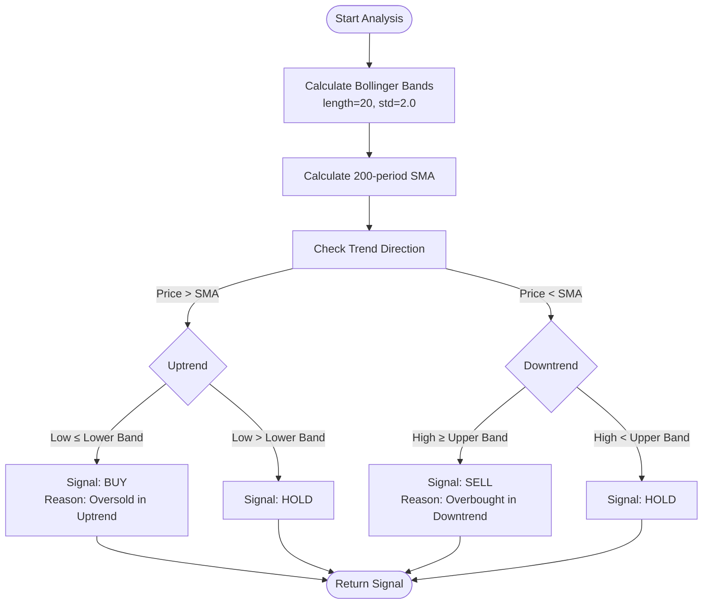
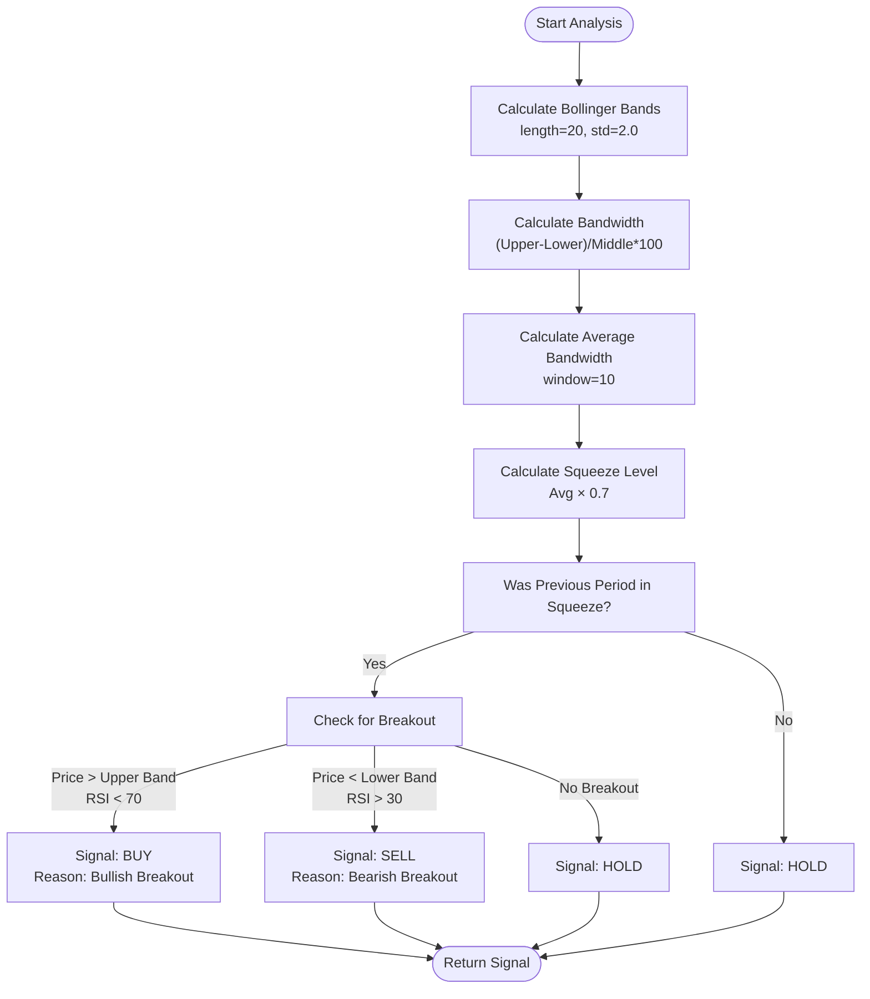
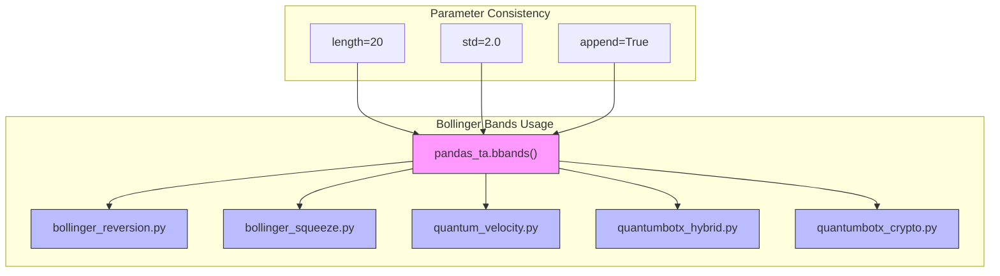
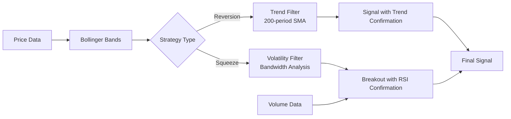
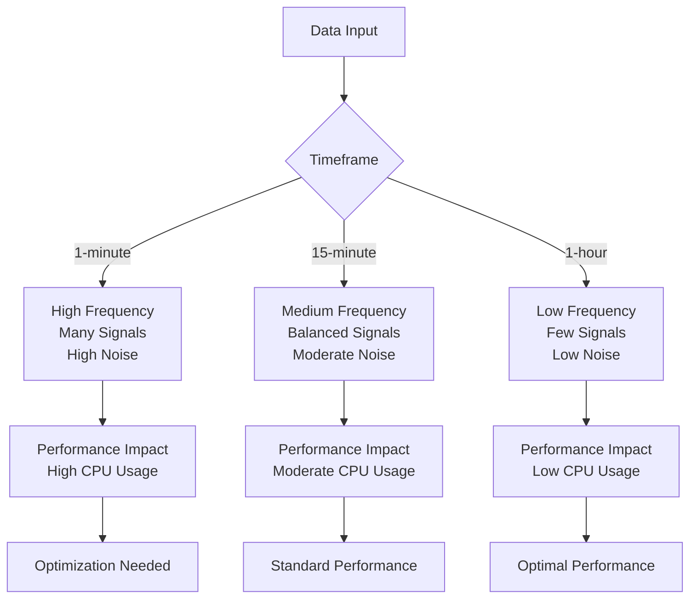

# Bollinger Bands Strategies

<cite>
**Referenced Files in This Document**   
- [bollinger_reversion.py](file://core/strategies/bollinger_reversion.py)
- [bollinger_squeeze.py](file://core/strategies/bollinger_squeeze.py)
- [bollinger_squeeze_test.py](file://core/strategies/bollinger_squeeze_test.py)
- [base_strategy.py](file://core/strategies/base_strategy.py)
</cite>

## Table of Contents
1. [Introduction](#introduction)
2. [Core Components](#core-components)
3. [Bollinger Reversion Strategy](#bollinger-reversion-strategy)
4. [Bollinger Squeeze Strategy](#bollinger-squeeze-strategy)
5. [Shared Bollinger Bands Implementation](#shared-bollinger-bands-implementation)
6. [Parameter Tuning and Optimization](#parameter-tuning-and-optimization)
7. [Performance Implications](#performance-implications)

## Introduction
This document provides a comprehensive analysis of two Bollinger Bands-based trading strategies implemented in the QuantumBotX system: Bollinger Reversion and Bollinger Squeeze. Both strategies leverage the `pandas_ta.bbands()` function to calculate Bollinger Bands but apply them with fundamentally different trading logics. The Bollinger Reversion strategy follows a mean-reversion approach, generating signals when price touches or exceeds the upper or lower bands, while the Bollinger Squeeze strategy identifies periods of low volatility (squeeze) to predict potential breakouts. This documentation details their implementation, signal generation logic, parameter configurations, and performance considerations.

## Core Components

The Bollinger Bands strategies are built upon a common architecture defined in the `BaseStrategy` class, which establishes the interface for all trading strategies in the system. Both strategies inherit from this base class and implement the required `analyze` method for live trading and `analyze_df` for backtesting. The strategies utilize the `pandas_ta` library to compute technical indicators and follow a consistent pattern of parameter definition through the `get_definable_params` class method.

```mermaid
classDiagram
class BaseStrategy {
+bot : object
+params : dict
+__init__(bot_instance, params)
+analyze(df) abstract
+get_definable_params() classmethod
}
class BollingerBandsStrategy {
+name : str
+description : str
+analyze(df)
+analyze_df(df)
+get_definable_params() classmethod
}
class BollingerSqueezeStrategy {
+name : str
+description : str
+analyze(df)
+analyze_df(df)
+get_definable_params() classmethod
}
BaseStrategy <|-- BollingerBandsStrategy
BaseStrategy <|-- BollingerSqueezeStrategy
note right of BollingerBandsStrategy
Implements mean-reversion logic
Uses trend filter (SMA) to confirm direction
Triggers on price touching bands
end note
note right of BollingerSqueezeStrategy
Implements volatility contraction logic
Calculates bandwidth for squeeze detection
Uses RSI for momentum confirmation
end note
```

**Diagram sources**
- [base_strategy.py](file://core/strategies/base_strategy.py#L1-L28)
- [bollinger_reversion.py](file://core/strategies/bollinger_reversion.py#L5-L75)
- [bollinger_squeeze.py](file://core/strategies/bollinger_squeeze.py#L5-L87)

**Section sources**
- [base_strategy.py](file://core/strategies/base_strategy.py#L1-L28)
- [bollinger_reversion.py](file://core/strategies/bollinger_reversion.py#L1-L75)
- [bollinger_squeeze.py](file://core/strategies/bollinger_squeeze.py#L1-L87)

## Bollinger Reversion Strategy

The Bollinger Reversion strategy implements a mean-reversion trading approach based on the principle that prices tend to return to the middle band (SMA) after touching or exceeding the upper or lower bands. The strategy incorporates a long-term trend filter using a 200-period SMA to ensure trades are taken in the direction of the prevailing trend, reducing false signals in strongly trending markets.

### Signal Logic
The strategy generates BUY signals when:
- The current price is above the 200-period SMA (uptrend confirmation)
- The low price touches or falls below the lower Bollinger Band

SELL signals are generated when:
- The current price is below the 200-period SMA (downtrend confirmation)
- The high price touches or exceeds the upper Bollinger Band

```python
# Example of Bollinger Reversion signal logic
def analyze(self, df):
    bb_length = self.params.get('bb_length', 20)
    bb_std = self.params.get('bb_std', 2.0)
    trend_filter_period = self.params.get('trend_filter_period', 200)
    
    # Calculate Bollinger Bands
    df.ta.bbands(length=bb_length, std=bb_std, append=True)
    
    # Calculate trend filter
    trend_filter_col = f'SMA_{trend_filter_period}'
    df[trend_filter_col] = ta.sma(df['close'], length=trend_filter_period)
    
    last = df.iloc[-1]
    price = last["close"]
    is_uptrend = price > last[trend_filter_col]
    is_downtrend = price < last[trend_filter_col]
    
    # Generate signals
    if is_uptrend and last['low'] <= last[bbl_col]:
        signal = "BUY"
        explanation = "Uptrend & Oversold: Harga menyentuh Band Bawah."
    elif is_downtrend and last['high'] >= last[bbu_col]:
        signal = "SELL"
        explanation = "Downtrend & Overbought: Harga menyentuh Band Atas."
    else:
        signal = "HOLD"
```



**Diagram sources**
- [bollinger_reversion.py](file://core/strategies/bollinger_reversion.py#L17-L75)

**Section sources**
- [bollinger_reversion.py](file://core/strategies/bollinger_reversion.py#L1-L75)

## Bollinger Squeeze Strategy

The Bollinger Squeeze strategy identifies periods of low volatility (squeeze) when the Bollinger Bands contract significantly, indicating potential for a strong breakout. The strategy is designed to capture momentum moves that often follow periods of consolidation, making it particularly effective in range-bound markets that transition to trending conditions.

### Squeeze Detection
The squeeze is detected by comparing the current bandwidth to a historical average:
- **Bandwidth**: (Upper Band - Lower Band) / Middle Band × 100
- **Average Bandwidth**: Rolling mean of bandwidth over a specified window
- **Squeeze Level**: Average bandwidth multiplied by a squeeze factor
- **Squeeze Condition**: Current bandwidth < Squeeze Level

### Breakout Logic
The strategy generates signals when:
- Previous period was in squeeze state
- Current price breaks above the upper band (BUY) with RSI < 70
- Current price breaks below the lower band (SELL) with RSI > 30

```python
# Example of Bollinger Squeeze signal logic
def analyze(self, df):
    bb_length = self.params.get('bb_length', 20)
    bb_std = self.params.get('bb_std', 2.0)
    squeeze_window = self.params.get('squeeze_window', 10)
    squeeze_factor = self.params.get('squeeze_factor', 0.7)
    rsi_period = self.params.get('rsi_period', 14)
    
    # Calculate Bollinger Bands
    df.ta.bbands(length=bb_length, std=bb_std, append=True)
    
    # Calculate bandwidth
    df['BB_BANDWIDTH'] = (df[bbu_col] - df[bbl_col]) / df[bbm_col] * 100
    df['AVG_BANDWIDTH'] = df['BB_BANDWIDTH'].rolling(window=squeeze_window).mean()
    df['SQUEEZE_LEVEL'] = df['AVG_BANDWIDTH'] * squeeze_factor
    df['SQUEEZE'] = df['BB_BANDWIDTH'] < df['SQUEEZE_LEVEL']
    
    # Generate signals
    if prev['SQUEEZE']:
        if last['close'] > prev[bbu_col] and last['RSI'] < 70:
            signal = "BUY"
        elif last['close'] < prev[bbl_col] and last['RSI'] > 30:
            signal = "SELL"
```



**Diagram sources**
- [bollinger_squeeze.py](file://core/strategies/bollinger_squeeze.py#L19-L87)

**Section sources**
- [bollinger_squeeze.py](file://core/strategies/bollinger_squeeze.py#L1-L87)

## Shared Bollinger Bands Implementation

Both strategies utilize the `pandas_ta.bbands()` function to calculate Bollinger Bands, following a consistent pattern across the codebase. The implementation creates three primary components:
- **Upper Band (BBU)**: Middle band + (standard deviation × multiplier)
- **Middle Band (BBM)**: Simple Moving Average (SMA) of price
- **Lower Band (BBL)**: Middle band - (standard deviation × multiplier)

### Indicator Processing
The strategies process the band output differently based on their specific logic:

**Bollinger Reversion Processing:**
```python
# Column naming convention
bbu_col = f'BBU_{bb_length}_{bb_std:.1f}'  # e.g., BBU_20_2.0
bbl_col = f'BBL_{bb_length}_{bb_std:.1f}'  # e.g., BBL_20_2.0
trend_filter_col = f'SMA_{trend_filter_period}'  # e.g., SMA_200

# Direct band usage for mean-reversion signals
buy_signal = is_uptrend & (df['low'] <= df[bbl_col])
sell_signal = is_downtrend & (df['high'] >= df[bbu_col])
```

**Bollinger Squeeze Processing:**
```python
# Bandwidth calculation for volatility measurement
df['BB_BANDWIDTH'] = np.where(df[bbm_col] != 0, 
                             (df[bbu_col] - df[bbl_col]) / df[bbm_col] * 100, 0)

# Squeeze detection using rolling average
df['AVG_BANDWIDTH'] = df['BB_BANDWIDTH'].rolling(window=squeeze_window).mean()
df['SQUEEZE_LEVEL'] = df['AVG_BANDWIDTH'] * squeeze_factor
df['SQUEEZE'] = df['BB_BANDWIDTH'] < df['SQUEEZE_LEVEL']
```

### Usage Patterns Across Codebase
The `ta.bbands()` function is consistently used across multiple strategy files with the same parameter structure:
- **bollinger_reversion.py**: Used with `append=True` to add columns directly to DataFrame
- **bollinger_squeeze.py**: Same pattern with additional bandwidth calculations
- **quantum_velocity.py**: Reuses identical Bollinger Squeeze logic
- **quantumbotx_hybrid.py**: Integrates Bollinger Bands with other indicators



**Diagram sources**
- [bollinger_reversion.py](file://core/strategies/bollinger_reversion.py#L30-L64)
- [bollinger_squeeze.py](file://core/strategies/bollinger_squeeze.py#L34-L74)
- [bollinger_squeeze_test.py](file://core/strategies/bollinger_squeeze_test.py#L21-L104)

**Section sources**
- [bollinger_reversion.py](file://core/strategies/bollinger_reversion.py#L1-L75)
- [bollinger_squeeze.py](file://core/strategies/bollinger_squeeze.py#L1-L87)
- [bollinger_squeeze_test.py](file://core/strategies/bollinger_squeeze_test.py#L1-L168)

## Parameter Tuning and Optimization

Both strategies expose configurable parameters that can be tuned to adapt to different market conditions and trading styles.

### Bollinger Reversion Parameters
| **Parameter** | **Label** | **Default** | **Description** |
|-------------|---------|----------|----------------|
| bb_length | Panjang BB | 20 | Period for Bollinger Bands calculation |
| bb_std | Standar Deviasi BB | 2.0 | Standard deviation multiplier for bands |
| trend_filter_period | Periode Filter Tren (SMA) | 200 | Period for trend confirmation SMA |

### Bollinger Squeeze Parameters
| **Parameter** | **Label** | **Default** | **Description** |
|-------------|---------|----------|----------------|
| bb_length | Panjang BB | 20 | Period for Bollinger Bands calculation |
| bb_std | Std Dev BB | 2.0 | Standard deviation multiplier for bands |
| squeeze_window | Window Squeeze | 10 | Rolling window for average bandwidth |
| squeeze_factor | Faktor Squeeze | 0.7 | Multiplier for squeeze threshold |
| rsi_period | Periode RSI | 14 | Period for RSI momentum confirmation |

### False Signal Mitigation
Both strategies incorporate mechanisms to reduce false signals:
- **Bollinger Reversion**: Uses a 200-period SMA as a trend filter, only taking trades in the direction of the long-term trend
- **Bollinger Squeeze**: Requires RSI confirmation (RSI < 70 for buys, RSI > 30 for sells) to avoid overbought/oversold traps

### Complementary Indicators
The strategies can be enhanced with additional indicators:
- **Volume Analysis**: Confirm breakouts with volume surges (as seen in bollinger_squeeze_test.py)
- **Multiple Timeframe Analysis**: Align signals across different timeframes
- **Candlestick Patterns**: Combine with price action patterns for higher probability setups



**Section sources**
- [bollinger_reversion.py](file://core/strategies/bollinger_reversion.py#L7-L25)
- [bollinger_squeeze.py](file://core/strategies/bollinger_squeeze.py#L7-L30)

## Performance Implications

The implementation of Bollinger Bands strategies has several performance considerations that impact both live trading and backtesting scenarios.

### Recalculation Frequency
The strategies recalculate Bollinger Bands on every analysis call, which has implications:
- **Computational Cost**: Each `ta.bbands()` call involves multiple calculations (SMA, standard deviation, band construction)
- **Memory Usage**: Appending indicator columns to DataFrames increases memory footprint
- **Latency**: Real-time processing delay in live trading environments

### Time Complexity
The primary performance factors are:
- **O(n)** for Bollinger Bands calculation where n = window length
- **O(m)** for rolling operations where m = squeeze window
- **Overall complexity**: O(max(n,m)) per analysis call

### Recommendations
To optimize performance:
1. **Cache Indicator Results**: Store calculated bands when possible to avoid redundant calculations
2. **Align Timeframes**: Use consistent timeframes across strategies to minimize data processing
3. **Batch Processing**: Process multiple data points simultaneously in backtesting
4. **Efficient Data Structures**: Use optimized pandas operations and consider alternative libraries for high-frequency trading

### Timeframe Alignment
Proper timeframe alignment is critical for strategy effectiveness:
- **Shorter Timeframes**: More frequent signals but higher noise
- **Longer Timeframes**: Fewer signals but higher reliability
- **Multi-timeframe Confirmation**: Use higher timeframe trend direction to filter lower timeframe signals



**Section sources**
- [bollinger_reversion.py](file://core/strategies/bollinger_reversion.py#L30-L34)
- [bollinger_squeeze.py](file://core/strategies/bollinger_squeeze.py#L34-L38)
- [bollinger_squeeze_test.py](file://core/strategies/bollinger_squeeze_test.py#L21-L25)