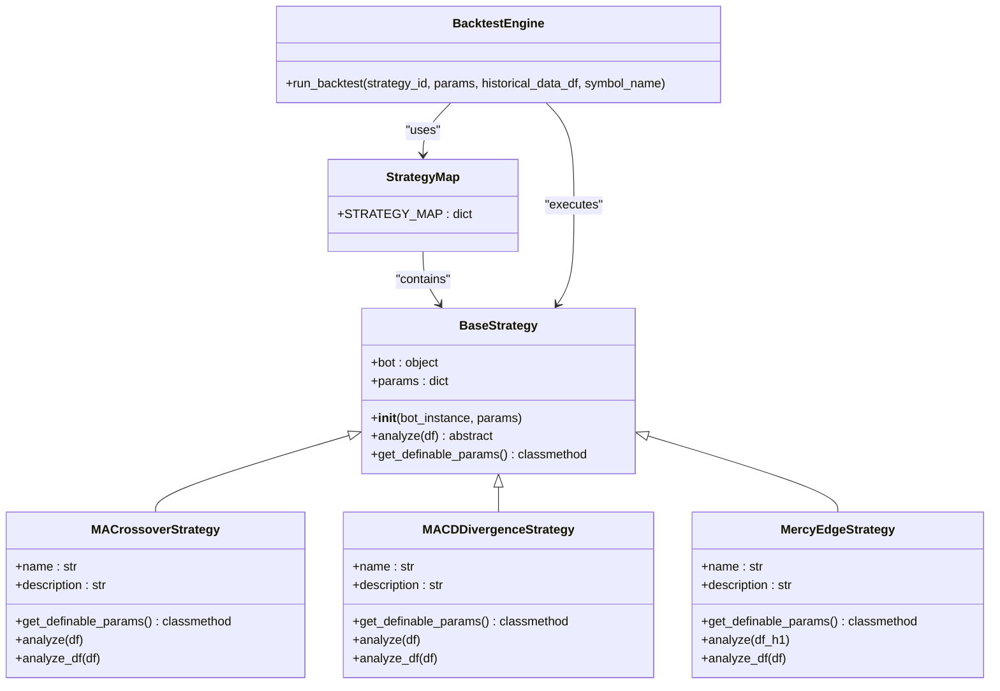
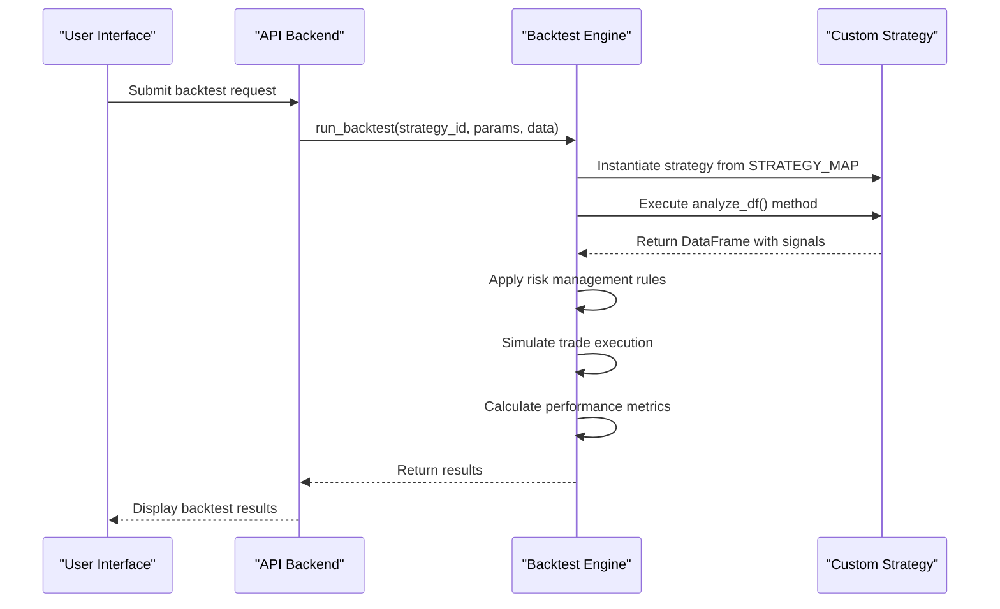

# Creating Custom Strategies

<cite>
**Referenced Files in This Document**   
- [base_strategy.py](file://core/strategies/base_strategy.py#L1-L28)
- [strategy_map.py](file://core/strategies/strategy_map.py#L1-L30)
- [ma_crossover.py](file://core/strategies/ma_crossover.py#L1-L60)
- [mercy_edge.py](file://core/strategies/mercy_edge.py#L1-L122)
- [engine.py](file://core/backtesting/engine.py#L1-L318)
</cite>

## Table of Contents
1. [Introduction](#introduction)
2. [Strategy Architecture Overview](#strategy-architecture-overview)
3. [Base Strategy Class Structure](#base-strategy-class-structure)
4. [Strategy Registration System](#strategy-registration-system)
5. [Creating a Custom MACD Divergence Strategy](#creating-a-custom-macd-divergence-strategy)
6. [Parameter Configuration and API Exposure](#parameter-configuration-and-api-exposure)
7. [Backtesting Integration](#backtesting-integration)
8. [Common Integration Issues and Troubleshooting](#common-integration-issues-and-troubleshooting)
9. [Best Practices for Strategy Development](#best-practices-for-strategy-development)
10. [Deployment and Monitoring](#deployment-and-monitoring)

## Introduction
This document provides comprehensive guidance for developers creating custom trading strategies within the QuantumBotX framework. The system is designed to be extensible, allowing developers to implement new trading logic by extending the base strategy class and registering their strategies in the global strategy map. This guide covers the complete lifecycle from development to deployment, with a focus on creating a MACD Divergence strategy as a practical example. The documentation includes detailed explanations of the architecture, implementation patterns, testing procedures, and best practices to ensure robust and reliable strategy development.

## Strategy Architecture Overview



**Diagram sources**
- [base_strategy.py](file://core/strategies/base_strategy.py#L1-L28)
- [strategy_map.py](file://core/strategies/strategy_map.py#L1-L30)
- [ma_crossover.py](file://core/strategies/ma_crossover.py#L1-L60)
- [mercy_edge.py](file://core/strategies/mercy_edge.py#L1-L122)

**Section sources**
- [base_strategy.py](file://core/strategies/base_strategy.py#L1-L28)
- [strategy_map.py](file://core/strategies/strategy_map.py#L1-L30)

## Base Strategy Class Structure

The foundation of all trading strategies in the QuantumBotX system is the `BaseStrategy` abstract base class. This class defines the contract that all concrete strategy implementations must follow, ensuring consistency across different trading approaches.

```python
from abc import ABC, abstractmethod

class BaseStrategy(ABC):
    """
    Abstract base class for all trading strategies.
    Each strategy must inherit from this class and implement the `analyze` method.
    """
    def __init__(self, bot_instance, params: dict = {}):
        self.bot = bot_instance
        self.params = params

    @abstractmethod
    def analyze(self, df):
        """
        Core method that must be overridden by each derived strategy.
        This method must return a dictionary containing the analysis results.
        Accepts a DataFrame as input.
        """
        raise NotImplementedError("Each strategy must implement the `analyze(df)` method.")

    @classmethod
    def get_definable_params(cls):
        """
        Class method that returns a list of parameters that can be set by the user.
        Each derived strategy should override this if it has parameters.
        """
        return []
```

The `BaseStrategy` class provides several key components:
- **Constructor**: Accepts a bot instance and optional parameters dictionary
- **Abstract analyze method**: Must be implemented by all derived classes
- **Class method get_definable_params**: Returns configurable parameters for UI/API exposure

The `analyze` method is the core of any strategy implementation and must return a dictionary with at least the following keys:
- `signal`: One of "BUY", "SELL", or "HOLD"
- `price`: The price at which the signal is generated
- `explanation`: A human-readable explanation of the signal rationale

**Section sources**
- [base_strategy.py](file://core/strategies/base_strategy.py#L1-L28)

## Strategy Registration System

Strategies are registered and accessed through the `STRATEGY_MAP` dictionary in `strategy_map.py`. This central registry enables dynamic strategy selection and execution throughout the application.

```python
from .ma_crossover import MACrossoverStrategy
from .quantumbotx_hybrid import QuantumBotXHybridStrategy
from .quantumbotx_crypto import QuantumBotXCryptoStrategy
from .rsi_crossover import RSICrossoverStrategy
from .bollinger_reversion import BollingerBandsStrategy
from .bollinger_squeeze import BollingerSqueezeStrategy
from .mercy_edge import MercyEdgeStrategy
from .quantum_velocity import QuantumVelocityStrategy
from .pulse_sync import PulseSyncStrategy
from .turtle_breakout import TurtleBreakoutStrategy
from .ichimoku_cloud import IchimokuCloudStrategy
from .dynamic_breakout import DynamicBreakoutStrategy

STRATEGY_MAP = {
    'MA_CROSSOVER': MACrossoverStrategy,
    'QUANTUMBOTX_HYBRID': QuantumBotXHybridStrategy,
    'QUANTUMBOTX_CRYPTO': QuantumBotXCryptoStrategy,
    'RSI_CROSSOVER': RSICrossoverStrategy,
    'BOLLINGER_REVERSION': BollingerBandsStrategy,
    'BOLLINGER_SQUEEZE': BollingerSqueezeStrategy,
    'MERCY_EDGE': MercyEdgeStrategy,
    'quantum_velocity': QuantumVelocityStrategy,
    'PULSE_SYNC': PulseSyncStrategy,
    'TURTLE_BREAKOUT': TurtleBreakoutStrategy,
    'ICHIMOKU_CLOUD': IchimokuCloudStrategy,
    'DYNAMIC_BREAKOUT': DynamicBreakoutStrategy,
}
```

The registration process follows these key principles:
1. **Import Statements**: Each strategy class is imported from its respective module
2. **Dictionary Mapping**: Strategy IDs (keys) map to strategy classes (values)
3. **Case Sensitivity**: Strategy IDs are typically uppercase constants
4. **Consistent Naming**: Strategy classes follow PascalCase naming convention

The `STRATEGY_MAP` is used throughout the system:
- In the backtesting engine to instantiate strategy classes
- In API routes to expose available strategies to the frontend
- In the bot controller to execute live trading strategies

**Section sources**
- [strategy_map.py](file://core/strategies/strategy_map.py#L1-L30)

## Creating a Custom MACD Divergence Strategy

This section provides a step-by-step guide to creating a custom MACD Divergence strategy by extending the existing framework.

### Step 1: Strategy Class Definition
Create a new file `macd_divergence.py` in the `core/strategies/` directory with the following structure:

```python
import pandas_ta as ta
import numpy as np
from .base_strategy import BaseStrategy

class MACDDivergenceStrategy(BaseStrategy):
    name = 'MACD Divergence'
    description = 'Identifies bullish and bearish divergences between price and MACD histogram for high-probability reversal signals.'

    @classmethod
    def get_definable_params(cls):
        return [
            {"name": "macd_fast", "label": "MACD Fast Period", "type": "number", "default": 12},
            {"name": "macd_slow", "label": "MACD Slow Period", "type": "number", "default": 26},
            {"name": "macd_signal", "label": "MACD Signal Period", "type": "number", "default": 9},
            {"name": "lookback_period", "label": "Lookback Period", "type": "number", "default": 20},
            {"name": "divergence_threshold", "label": "Divergence Threshold", "type": "number", "default": 0.1}
        ]
```

### Step 2: Implement the analyze Method
The `analyze` method handles live trading execution by processing the most recent data:

```python
def analyze(self, df):
    """Method for LIVE TRADING. Analyzes the most recent bars of data."""
    if df is None or len(df) < 50:
        return {"signal": "HOLD", "price": None, "explanation": "Insufficient data for analysis."}

    # Get parameters
    macd_fast = self.params.get('macd_fast', 12)
    macd_slow = self.params.get('macd_slow', 26)
    macd_signal = self.params.get('macd_signal', 9)
    lookback = self.params.get('lookback_period', 20)
    threshold = self.params.get('divergence_threshold', 0.1)

    # Calculate MACD
    df.ta.macd(fast=macd_fast, slow=macd_slow, signal=macd_signal, append=True)
    
    # Get MACD histogram column name
    macd_hist_col = f'MACDh_{macd_fast}_{macd_slow}_{macd_signal}'
    
    if macd_hist_col not in df.columns:
        return {"signal": "HOLD", "price": None, "explanation": "MACD calculation failed."}

    df.dropna(inplace=True)
    if len(df) < 2:
        return {"signal": "HOLD", "price": None, "explanation": "Indicators not mature."}

    # Get recent data
    recent_df = df.tail(lookback + 5)
    price = recent_df.iloc[-1]['close']
    
    # Find recent price highs and lows
    recent_high = recent_df['high'].max()
    recent_low = recent_df['low'].min()
    high_idx = recent_df['high'].idxmax()
    low_idx = recent_df['low'].idxmin()
    
    # Get corresponding MACD values
    macd_at_high = recent_df.loc[high_idx][macd_hist_col]
    macd_at_low = recent_df.loc[low_idx][macd_hist_col]
    
    # Detect divergences
    signal = "HOLD"
    explanation = "No divergence detected."
    
    # Bullish divergence: price makes lower low, MACD makes higher low
    if (low_idx < recent_df.index[-1] and 
        recent_df['low'].iloc[-1] < recent_low and 
        recent_df[macd_hist_col].iloc[-1] > macd_at_low and
        abs(recent_df['low'].iloc[-1] - recent_low) / recent_low > threshold):
        
        signal = "BUY"
        explanation = f"Bullish Divergence: Price made lower low while MACD histogram showed higher low, indicating potential reversal."
    
    # Bearish divergence: price makes higher high, MACD makes lower high
    elif (high_idx < recent_df.index[-1] and 
          recent_df['high'].iloc[-1] > recent_high and 
          recent_df[macd_hist_col].iloc[-1] < macd_at_high and
          abs(recent_df['high'].iloc[-1] - recent_high) / recent_high > threshold):
        
        signal = "SELL"
        explanation = f"Bearish Divergence: Price made higher high while MACD histogram showed lower high, indicating potential reversal."

    return {"signal": signal, "price": price, "explanation": explanation}
```

### Step 3: Implement the analyze_df Method
The `analyze_df` method enables backtesting by processing the entire DataFrame:

```python
def analyze_df(self, df):
    """Method for BACKTESTING. Analyzes the entire DataFrame."""
    if df is None or len(df) < 50:
        df['signal'] = 'HOLD'
        return df

    # Get parameters
    macd_fast = self.params.get('macd_fast', 12)
    macd_slow = self.params.get('macd_slow', 26)
    macd_signal = self.params.get('macd_signal', 9)
    lookback = self.params.get('lookback_period', 20)
    threshold = self.params.get('divergence_threshold', 0.1)

    # Calculate MACD
    df.ta.macd(fast=macd_fast, slow=macd_slow, signal=macd_signal, append=True)
    
    # Get MACD histogram column name
    macd_hist_col = f'MACDh_{macd_fast}_{macd_slow}_{macd_signal}'
    
    if macd_hist_col not in df.columns:
        df['signal'] = 'HOLD'
        return df

    df.dropna(inplace=True)
    if len(df) < 2:
        df['signal'] = 'HOLD'
        return df

    # Initialize signal column
    df['signal'] = 'HOLD'
    
    # Apply divergence detection to each point in the series
    for i in range(lookback + 10, len(df)):
        window_df = df.iloc[i-lookback:i+1]
        
        # Find recent price highs and lows
        recent_high = window_df['high'].max()
        recent_low = window_df['low'].min()
        high_idx = window_df['high'].idxmax()
        low_idx = window_df['low'].idxmin()
        
        # Get corresponding MACD values
        macd_at_high = window_df.loc[high_idx][macd_hist_col]
        macd_at_low = window_df.loc[low_idx][macd_hist_col]
        
        current_price = df.iloc[i]['close']
        current_macd = df.iloc[i][macd_hist_col]
        
        # Bullish divergence
        if (low_idx < window_df.index[-1] and 
            current_price < recent_low and 
            current_macd > macd_at_low and
            abs(current_price - recent_low) / recent_low > threshold):
            
            df.iloc[i, df.columns.get_loc('signal')] = 'BUY'
        
        # Bearish divergence
        elif (high_idx < window_df.index[-1] and 
              current_price > recent_high and 
              current_macd < macd_at_high and
              abs(current_price - recent_high) / recent_high > threshold):
            
            df.iloc[i, df.columns.get_loc('signal')] = 'SELL'

    return df
```

### Step 4: Register the Strategy
Add the new strategy to `strategy_map.py`:

```python
from .macd_divergence import MACDDivergenceStrategy

STRATEGY_MAP = {
    # ... existing strategies
    'MACD_DIVERGENCE': MACDDivergenceStrategy,
}
```

**Section sources**
- [base_strategy.py](file://core/strategies/base_strategy.py#L1-L28)
- [ma_crossover.py](file://core/strategies/ma_crossover.py#L1-L60)
- [mercy_edge.py](file://core/strategies/mercy_edge.py#L1-L122)

## Parameter Configuration and API Exposure

Custom parameters defined in `get_definable_params` are automatically exposed through the API and UI, allowing users to configure strategy behavior without code changes.

### Parameter Definition Structure
Each parameter in the `get_definable_params` method should be a dictionary with the following keys:
- `name`: Internal parameter name (used in code)
- `label`: User-friendly display name
- `type`: Data type ("number", "string", "boolean")
- `default`: Default value

### API Integration
The parameters are exposed through the following API endpoints:
- `GET /api/strategies` - Returns all available strategies with their names and descriptions
- `GET /api/strategies/{strategy_id}/params` - Returns configurable parameters for a specific strategy

```javascript
// Example frontend code to load strategy parameters
async function loadStrategyParams(strategyId) {
    const response = await fetch(`/api/strategies/${strategyId}/params`);
    const params = await response.json();
    
    params.forEach(param => {
        // Dynamically create form inputs based on parameter type
        createParameterInput(param);
    });
}
```

### Configuration Best Practices
1. **Use Descriptive Names**: Choose clear, meaningful parameter names
2. **Provide Reasonable Defaults**: Set defaults that work well for most market conditions
3. **Include Validation**: Consider adding input validation in the analyze methods
4. **Document Parameters**: Use clear labels that explain what each parameter does
5. **Limit Parameters**: Only expose parameters that significantly impact strategy behavior

**Section sources**
- [ma_crossover.py](file://core/strategies/ma_crossover.py#L1-L60)
- [mercy_edge.py](file://core/strategies/mercy_edge.py#L1-L122)

## Backtesting Integration

The backtesting engine integrates custom strategies through a well-defined process that ensures consistent evaluation across all strategy types.

### Backtesting Workflow


**Diagram sources**
- [engine.py](file://core/backtesting/engine.py#L1-L318)
- [strategy_map.py](file://core/strategies/strategy_map.py#L1-L30)

### Backtesting Process Details
The `run_backtest` function in `engine.py` follows these steps:

1. **Strategy Instantiation**: Creates a strategy instance using the `MockBot` class
2. **Signal Generation**: Calls the strategy's `analyze_df` method to generate signals
3. **Risk Management**: Applies stop-loss and take-profit levels based on ATR
4. **Trade Simulation**: Executes trades based on generated signals
5. **Performance Calculation**: Computes key metrics like profit, win rate, and drawdown

### Unit Testing with Sample Data
Create unit tests to validate strategy logic:

```python
import unittest
import pandas as pd
import numpy as np
from core.strategies.macd_divergence import MACDDivergenceStrategy

class TestMACDDivergenceStrategy(unittest.TestCase):
    
    def setUp(self):
        # Create sample data
        dates = pd.date_range('2023-01-01', periods=100, freq='H')
        np.random.seed(42)
        prices = 100 + np.random.randn(100).cumsum()
        
        self.df = pd.DataFrame({
            'time': dates,
            'open': prices,
            'high': prices + np.random.rand(100) * 0.5,
            'low': prices - np.random.rand(100) * 0.5,
            'close': prices,
            'volume': np.random.randint(100, 1000, 100)
        })
        
        self.strategy = MACDDivergenceStrategy(bot_instance=None, params={})
    
    def test_bullish_divergence_detection(self):
        # Test case for bullish divergence
        result = self.strategy.analyze(self.df)
        self.assertIsInstance(result, dict)
        self.assertIn('signal', result)
        self.assertIn(result['signal'], ['BUY', 'SELL', 'HOLD'])
    
    def test_analyze_df_completeness(self):
        # Test that analyze_df processes entire DataFrame
        result_df = self.strategy.analyze_df(self.df.copy())
        self.assertEqual(len(result_df), len(self.df))
        self.assertIn('signal', result_df.columns)
        self.assertTrue(all(s in ['BUY', 'SELL', 'HOLD'] for s in result_df['signal']))

if __name__ == '__main__':
    unittest.main()
```

**Section sources**
- [engine.py](file://core/backtesting/engine.py#L1-L318)
- [ma_crossover.py](file://core/strategies/ma_crossover.py#L1-L60)

## Common Integration Issues and Troubleshooting

### Incorrect Signal Formatting
**Issue**: Strategy returns signals in incorrect format
**Symptoms**: Backtest fails with "missing signal" errors
**Solution**: Ensure the `analyze` method returns a dictionary with required keys:

```python
# CORRECT
return {"signal": "BUY", "price": 1.2345, "explanation": "Bullish pattern detected"}

# INCORRECT
return "BUY"  # Missing price and explanation
```

### Missing Imports
**Issue**: Strategy file not imported in `strategy_map.py`
**Symptoms**: Strategy not available in UI dropdown
**Solution**: Verify the import statement and registration in `strategy_map.py`:

```python
# In strategy_map.py
from .macd_divergence import MACDDivergenceStrategy  # Import statement

STRATEGY_MAP = {
    'MACD_DIVERGENCE': MACDDivergenceStrategy,  # Registration
}
```

### Registration Errors
**Issue**: Strategy ID mismatch between registration and usage
**Symptoms**: "Strategy not found" errors
**Solution**: Ensure consistent naming in `STRATEGY_MAP` and API calls:

```python
# In strategy_map.py
'MACD_DIVERGENCE': MACDDivergenceStrategy  # Key must match API usage

# In API calls
fetch('/api/backtest/run', {
    method: 'POST',
    body: JSON.stringify({ strategy_id: 'MACD_DIVERGENCE' })  # Must match
})
```

### Indicator Calculation Issues
**Issue**: pandas_ta indicators not properly appended
**Symptoms**: Missing indicator columns in DataFrame
**Solution**: Use the `append=True` parameter and verify column names:

```python
# Correct usage
df.ta.macd(fast=12, slow=26, signal=9, append=True)

# Verify column creation
macd_hist_col = f'MACDh_12_26_9'
if macd_hist_col not in df.columns:
    return {"signal": "HOLD", "price": None, "explanation": "MACD calculation failed."}
```

### Data Sufficiency Checks
**Issue**: Strategy attempts to analyze insufficient data
**Symptoms**: NaN values or index errors
**Solution**: Implement robust data validation:

```python
def analyze(self, df):
    min_required = max(
        self.params.get('macd_slow', 26),
        self.params.get('lookback_period', 20)
    ) + 10
    
    if df is None or len(df) < min_required:
        return {"signal": "HOLD", "price": None, "explanation": "Insufficient data."}
    
    # Continue with analysis
```

**Section sources**
- [base_strategy.py](file://core/strategies/base_strategy.py#L1-L28)
- [strategy_map.py](file://core/strategies/strategy_map.py#L1-L30)
- [engine.py](file://core/backtesting/engine.py#L1-L318)

## Best Practices for Strategy Development

### Code Organization
- **File Structure**: Place each strategy in its own file within `core/strategies/`
- **Naming Convention**: Use descriptive names like `strategy_name.py` and `StrategyNameClass`
- **Imports**: Import only necessary modules and avoid circular dependencies
- **Documentation**: Include docstrings for classes and methods

### Logging and Debugging
Implement comprehensive logging to track strategy behavior:

```python
import logging
logger = logging.getLogger(__name__)

def analyze(self, df):
    logger.info(f"Analyzing {len(df)} bars of data")
    
    # Log parameter values
    logger.debug(f"Parameters: {self.params}")
    
    # Log key calculations
    logger.debug(f"Price: {price}, MACD Histogram: {current_macd}")
    
    # Log signal decisions
    logger.info(f"Generated {signal} signal: {explanation}")
    
    return {"signal": signal, "price": price, "explanation": explanation}
```

### Performance Optimization
- **Vectorized Operations**: Use pandas operations instead of loops when possible
- **Data Caching**: Cache expensive calculations when appropriate
- **Memory Management**: Avoid creating unnecessary DataFrame copies
- **Efficient Lookups**: Use appropriate data structures for frequent operations

### Error Handling
Implement robust error handling to ensure strategy resilience:

```python
def analyze(self, df):
    try:
        # Validate input
        if df is None or df.empty:
            return {"signal": "HOLD", "price": None, "explanation": "Empty data frame."}
        
        # Check for required columns
        required_cols = ['open', 'high', 'low', 'close', 'volume']
        if not all(col in df.columns for col in required_cols):
            return {"signal": "HOLD", "price": None, "explanation": "Missing required columns."}
        
        # Main analysis logic
        # ...
        
    except Exception as e:
        logger.error(f"Error in MACD Divergence strategy: {str(e)}")
        return {"signal": "HOLD", "price": None, "explanation": f"Analysis error: {str(e)}"}
    
    return {"signal": signal, "price": price, "explanation": explanation}
```

**Section sources**
- [ma_crossover.py](file://core/strategies/ma_crossover.py#L1-L60)
- [mercy_edge.py](file://core/strategies/mercy_edge.py#L1-L122)
- [engine.py](file://core/backtesting/engine.py#L1-L318)

## Deployment and Monitoring

### Deployment Process
1. **Development**: Implement and test the strategy in a development environment
2. **Testing**: Validate with historical data using the backtesting engine
3. **Staging**: Deploy to a staging environment for live paper trading
4. **Production**: Deploy to production with proper monitoring

### Monitoring in Live Environments
Implement comprehensive monitoring to track strategy performance:

```python
# In live trading loop
def execute_strategy():
    try:
        # Fetch latest data
        df = fetch_latest_data()
        
        # Analyze data
        result = strategy.analyze(df)
        
        # Log execution details
        logger.info(f"Strategy: {strategy.name}")
        logger.info(f"Signal: {result['signal']} at {result['price']}")
        logger.info(f"Explanation: {result['explanation']}")
        
        # Execute trade if signal is generated
        if result['signal'] in ['BUY', 'SELL']:
            execute_trade(result)
            
    except Exception as e:
        logger.error(f"Strategy execution failed: {str(e)}", exc_info=True)
        # Implement fallback behavior
        send_alert(f"Strategy error: {str(e)}")
```

### Performance Metrics to Monitor
- **Signal Frequency**: Number of signals generated per time period
- **Win Rate**: Percentage of profitable trades
- **Profit Factor**: Ratio of gross profits to gross losses
- **Maximum Drawdown**: Largest peak-to-trough decline
- **Sharpe Ratio**: Risk-adjusted return metric

### Alerting and Notifications
Set up alerts for critical events:
- Strategy errors or exceptions
- Unexpected signal patterns
- Performance degradation
- Market condition changes

**Section sources**
- [engine.py](file://core/backtesting/engine.py#L1-L318)
- [ma_crossover.py](file://core/strategies/ma_crossover.py#L1-L60)