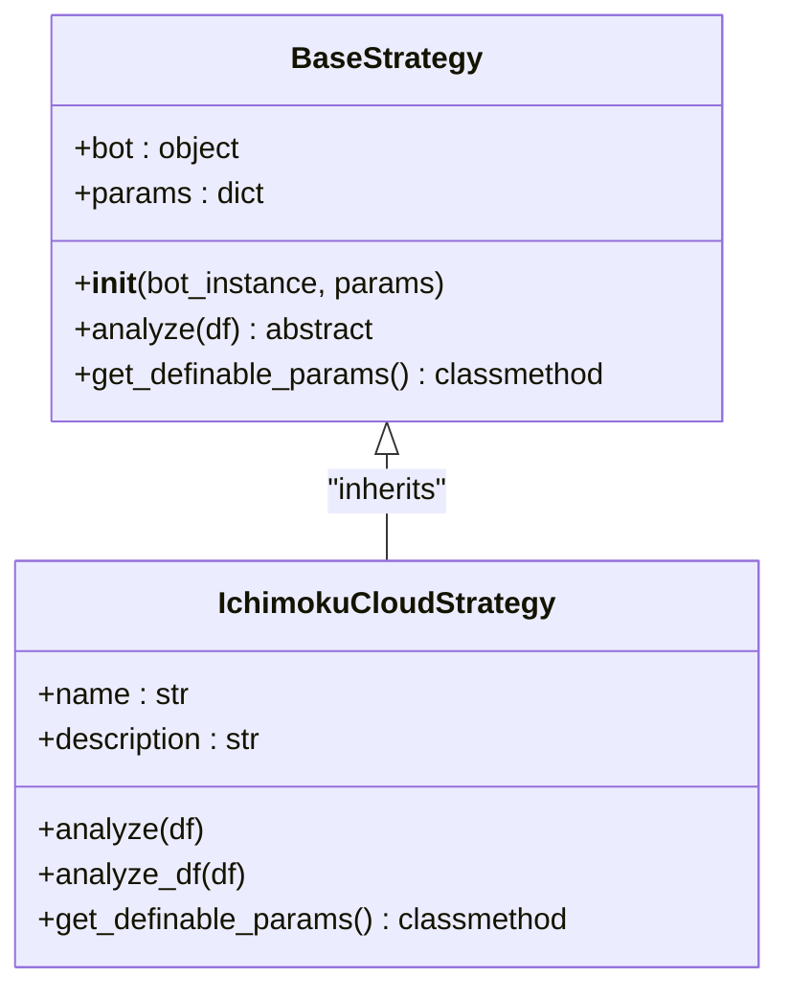
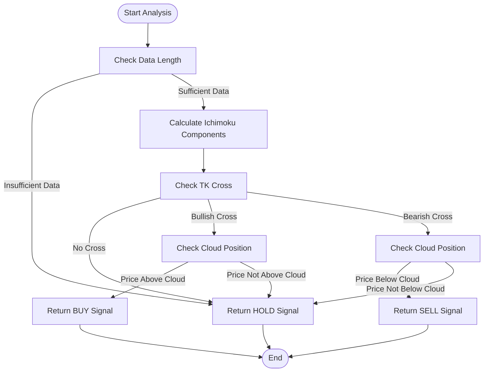
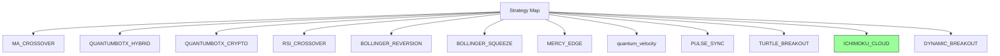

# Ichimoku Cloud Strategy

<cite>
**Referenced Files in This Document**   
- [ichimoku_cloud.py](file://core/strategies/ichimoku_cloud.py)
- [base_strategy.py](file://core/strategies/base_strategy.py)
- [strategy_map.py](file://core/strategies/strategy_map.py)
</cite>

## Table of Contents
1. [Introduction](#introduction)
2. [Core Components](#core-components)
3. [Ichimoku Cloud Components and Calculation](#ichimoku-cloud-components-and-calculation)
4. [Signal Generation Logic](#signal-generation-logic)
5. [Configuration Parameters](#configuration-parameters)
6. [Implementation Details](#implementation-details)
7. [Performance and Data Requirements](#performance-and-data-requirements)
8. [Strategy Integration](#strategy-integration)

## Introduction

The Ichimoku Cloud Strategy is a comprehensive trading system implemented in the QuantumBotX platform that leverages the Ichimoku Kinko Hyo technical indicator to identify market trends and momentum signals. This strategy analyzes five key components—Tenkan-sen, Kijun-sen, Senkou Span A, Senkou Span B, and Chikou Span—to form the "cloud" (Kumo) for trend identification. The strategy evaluates multiple conditions including price position relative to the cloud, cloud color (bullish/bearish), and TK cross signals to generate trading decisions. This document provides a detailed analysis of the implementation, logic, and configuration of this strategy.

**Section sources**
- [ichimoku_cloud.py](file://core/strategies/ichimoku_cloud.py#L1-L124)

## Core Components

The Ichimoku Cloud Strategy is implemented as a class that inherits from the `BaseStrategy` abstract base class. It provides two primary methods for analysis: `analyze` for live trading and `analyze_df` for backtesting. The strategy uses the `pandas_ta` library to compute all Ichimoku components in a single call, then parses the results to make trading decisions based on confluence of multiple signals.



**Diagram sources**
- [base_strategy.py](file://core/strategies/base_strategy.py#L1-L29)
- [ichimoku_cloud.py](file://core/strategies/ichimoku_cloud.py#L5-L124)

**Section sources**
- [ichimoku_cloud.py](file://core/strategies/ichimoku_cloud.py#L5-L124)
- [base_strategy.py](file://core/strategies/base_strategy.py#L1-L29)

## Ichimoku Cloud Components and Calculation

The Ichimoku Cloud indicator consists of five components that work together to provide a comprehensive view of market dynamics. The strategy uses the `pandas_ta.ichimoku()` function to compute all components in a single call, which is more efficient than calculating them individually.

### Component Definitions

1. **Tenkan-sen (Conversion Line)**: Calculated as the average of the highest high and lowest low over a specified period (default 9). It represents short-term momentum.
2. **Kijun-sen (Base Line)**: Calculated as the average of the highest high and lowest low over a longer period (default 26). It represents medium-term momentum.
3. **Senkou Span A (Leading Span A)**: The average of Tenkan-sen and Kijun-sen, plotted 26 periods ahead. It forms one boundary of the cloud.
4. **Senkou Span B (Leading Span B)**: The average of the highest high and lowest low over an even longer period (default 52), plotted 26 periods ahead. It forms the other boundary of the cloud.
5. **Chikou Span (Lagging Span)**: The current closing price plotted 26 periods behind. It helps confirm trend direction.

The area between Senkou Span A and Senkou Span B is called the "cloud" (Kumo). When Senkou Span A is above Senkou Span B, the cloud is bullish (typically colored green). When Senkou Span B is above Senkou Span A, the cloud is bearish (typically colored red).

### Implementation in Code

The strategy uses dynamic column naming based on the input periods to access the calculated components:

```python
tenkan_col = f'ITS_{tenkan_period}'  # e.g., 'ITS_9'
kijun_col = f'IKS_{kijun_period}'    # e.g., 'IKS_26'
span_a_col = f'ISA_{tenkan_period}'  # e.g., 'ISA_9'
span_b_col = f'ISB_{kijun_period}'   # e.g., 'ISB_26'
```

These naming conventions follow the `pandas_ta` library's output format, where:
- `ITS` = Ichimoku Tenkan-sen
- `IKS` = Ichimoku Kijun-sen
- `ISA` = Ichimoku Span A
- `ISB` = Ichimoku Span B

**Section sources**
- [ichimoku_cloud.py](file://core/strategies/ichimoku_cloud.py#L43-L46)

## Signal Generation Logic

The strategy generates trading signals based on a confluence of two primary conditions: the TK cross and the cloud filter. This dual-condition approach helps reduce false signals and improves the reliability of trading decisions.

### Long Entry Logic

A buy (long) signal is generated when both of the following conditions are met:

1. **TK Cross Up (Golden Cross)**: The Tenkan-sen line crosses above the Kijun-sen line, indicating short-term momentum is turning bullish.
   ```python
   tk_cross_up = prev[tenkan_col] <= prev[kijun_col] and last[tenkan_col] > last[kijun_col]
   ```

2. **Price Above Cloud**: The current price is above both Senkou Span A and Senkou Span B, indicating the price is in a bullish zone.
   ```python
   is_above_cloud = price > last[span_a_col] and price > last[span_b_col]
   ```

When both conditions are satisfied, the strategy generates a "BUY" signal with the explanation: "Harga di atas Awan & Tenkan/Kijun Golden Cross."

### Short Entry Logic

A sell (short) signal is generated when both of the following conditions are met:

1. **TK Cross Down (Death Cross)**: The Tenkan-sen line crosses below the Kijun-sen line, indicating short-term momentum is turning bearish.
   ```python
   tk_cross_down = prev[tenkan_col] >= prev[kijun_col] and last[tenkan_col] < last[kijun_col]
   ```

2. **Price Below Cloud**: The current price is below both Senkou Span A and Senkou Span B, indicating the price is in a bearish zone.
   ```python
   is_below_cloud = price < last[span_a_col] and price < last[span_b_col]
   ```

When both conditions are satisfied, the strategy generates a "SELL" signal with the explanation: "Harga di bawah Awan & Tenkan/Kijun Death Cross."

### Signal Flowchart



**Diagram sources**
- [ichimoku_cloud.py](file://core/strategies/ichimoku_cloud.py#L57-L75)

**Section sources**
- [ichimoku_cloud.py](file://core/strategies/ichimoku_cloud.py#L57-L75)

## Configuration Parameters

The Ichimoku Cloud Strategy exposes several configurable parameters that allow users to customize its behavior. These parameters can be adjusted based on different market conditions or trading preferences.

### Parameter Definitions

| Parameter | Label | Type | Default | Description |
|---------|-------|------|---------|-------------|
| tenkan_period | Periode Tenkan-sen | number | 9 | The period used to calculate the Tenkan-sen (Conversion Line) |
| kijun_period | Periode Kijun-sen | number | 26 | The period used to calculate the Kijun-sen (Base Line) |
| senkou_period | Periode Senkou Span B | number | 52 | The period used to calculate the Senkou Span B (Leading Span B) |
| use_cloud_filter | Gunakan Filter Awan | boolean | True | Whether to require price to be above/below the cloud for signal confirmation |

### Parameter Usage

The parameters are accessed through the `self.params` dictionary with default fallback values:

```python
tenkan_period = self.params.get('tenkan_period', 9)
kijun_period = self.params.get('kijun_period', 26)
senkou_period = self.params.get('senkou_period', 52)
use_cloud_filter = str(self.params.get('use_cloud_filter', True)).lower() != 'false'
```

The `use_cloud_filter` parameter acts as a toggle for the cloud filter. When disabled, the strategy will generate signals based solely on the TK cross, without requiring the price to be in the appropriate cloud zone.

**Section sources**
- [ichimoku_cloud.py](file://core/strategies/ichimoku_cloud.py#L12-L18)

## Implementation Details

The strategy implements two separate analysis methods to accommodate different use cases: live trading and backtesting.

### Live Trading Method (`analyze`)

The `analyze` method is designed for real-time trading decisions. It processes a DataFrame containing historical price data and returns a dictionary with the current trading signal.

```python
def analyze(self, df):
    """Metode untuk LIVE TRADING."""
    # ... parameter extraction and data validation
    
    # Calculate Ichimoku components
    df.ta.ichimoku(tenkan=tenkan_period, kijun=kijun_period, senkou=senkou_period, append=True)
    df.dropna(inplace=True)
    
    # ... signal generation logic
    
    return {"signal": signal, "price": price, "explanation": explanation}
```

This method operates on the most recent data point, comparing the current and previous values to detect crossovers.

### Backtesting Method (`analyze_df`)

The `analyze_df` method is optimized for vectorized operations, making it suitable for backtesting over historical data.

```python
def analyze_df(self, df):
    """Metode untuk BACKTESTING (vectorized)."""
    # ... parameter extraction and data validation
    
    # Calculate Ichimoku components
    df.ta.ichimoku(tenkan=tenkan_period, kijun=kijun_period, senkou=senkou_period, append=True)
    df.dropna(inplace=True)
    df = df.reset_index(drop=True)
    
    # Vectorized condition checking
    tk_cross_up = (df[tenkan_col].shift(1) <= df[kijun_col].shift(1)) & (df[tenkan_col] > df[kijun_col])
    tk_cross_down = (df[tenkan_col].shift(1) >= df[kijun_col].shift(1)) & (df[tenkan_col] < df[kijun_col])
    
    # ... signal generation logic
    
    df['signal'] = np.where(buy_signal, 'BUY', np.where(sell_signal, 'SELL', 'HOLD'))
    return df
```

The key difference is the use of pandas' shift() function to compare consecutive rows in a vectorized manner, which is much faster for processing large datasets.

### Data Validation

Both methods include robust data validation to ensure reliable signal generation:

```python
min_len = max(tenkan_period, kijun_period, senkou_period) + kijun_period
if df is None or df.empty or len(df) < min_len:
    return {"signal": "HOLD", "price": None, "explanation": "Data tidak cukup."}
```

This ensures that there is sufficient historical data to calculate all Ichimoku components and detect crossovers.

**Section sources**
- [ichimoku_cloud.py](file://core/strategies/ichimoku_cloud.py#L29-L124)

## Performance and Data Requirements

The Ichimoku Cloud Strategy has specific performance characteristics and data requirements that traders should understand.

### Warm-up Period

The strategy requires a minimum amount of historical data to generate valid signals. The minimum length is calculated as:

```python
min_len = max(tenkan_period, kijun_period, senkou_period) + kijun_period
```

With default parameters (9, 26, 52), this results in a minimum requirement of 78 periods (52 + 26). This is because the Senkou Span components are projected 26 periods into the future, requiring additional historical data to calculate accurately.

### Computational Complexity

The strategy's computational complexity is primarily determined by the `pandas_ta.ichimoku()` function, which calculates multiple rolling window operations. The time complexity is approximately O(n*m) where n is the number of data points and m is the maximum period length.

The vectorized backtesting implementation is significantly more efficient than processing each data point individually, making it suitable for analyzing large historical datasets.

### Interpretation Challenges

For beginners, the Ichimoku Cloud can be challenging to interpret due to:

1. **Multiple Components**: The indicator consists of five lines and a cloud area, which can appear cluttered on a chart.
2. **Forward Projection**: The Senkou Span components are plotted 26 periods ahead, which can be confusing for new users.
3. **Lagging Nature**: Like most technical indicators, the Ichimoku Cloud is based on historical data and may lag behind sudden price movements.

**Section sources**
- [ichimoku_cloud.py](file://core/strategies/ichimoku_cloud.py#L25-L27)

## Strategy Integration

The Ichimoku Cloud Strategy is integrated into the QuantumBotX platform through the strategy registry system.

### Registration

The strategy is imported and registered in the `strategy_map.py` file:

```python
from .ichimoku_cloud import IchimokuCloudStrategy

STRATEGY_MAP = {
    # ... other strategies
    'ICHIMOKU_CLOUD': IchimokuCloudStrategy,
}
```

This allows the platform to instantiate and use the strategy by referencing its key ('ICHIMOKU_CLOUD').

### Strategy Map Structure



**Diagram sources**
- [strategy_map.py](file://core/strategies/strategy_map.py#L1-L30)

**Section sources**
- [strategy_map.py](file://core/strategies/strategy_map.py#L1-L30)