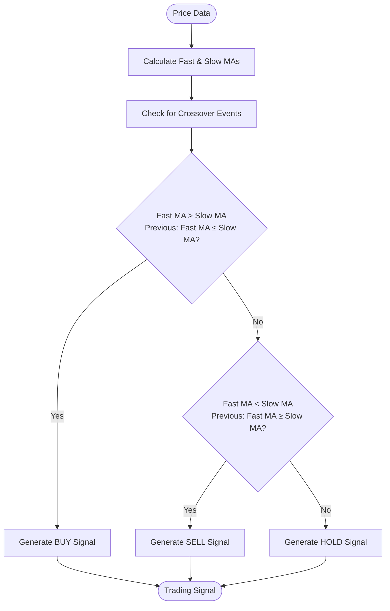
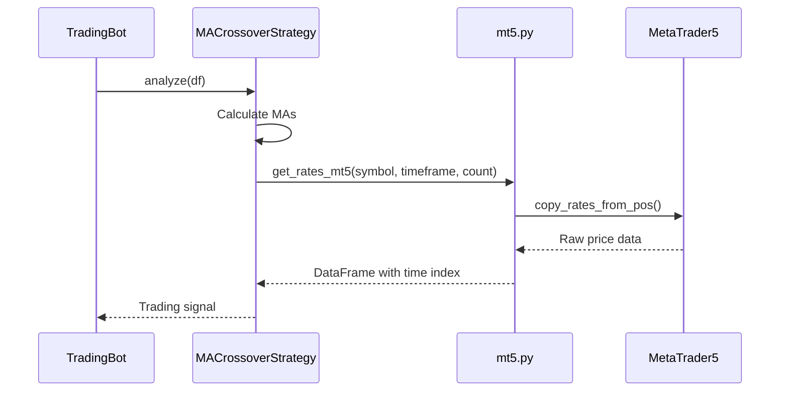
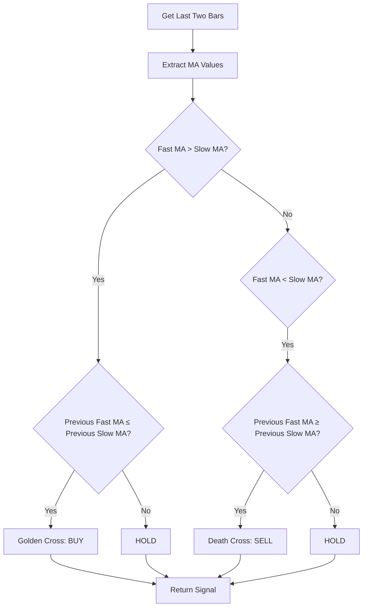
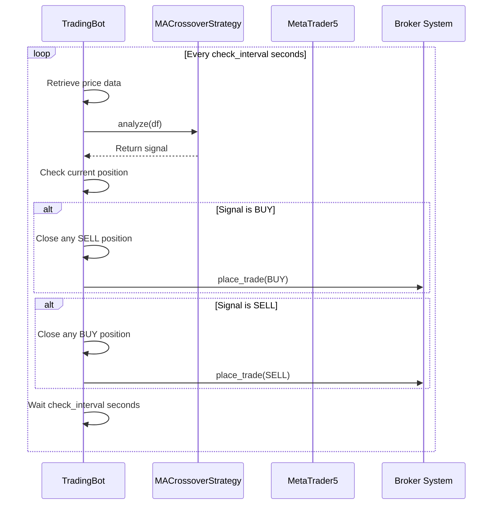
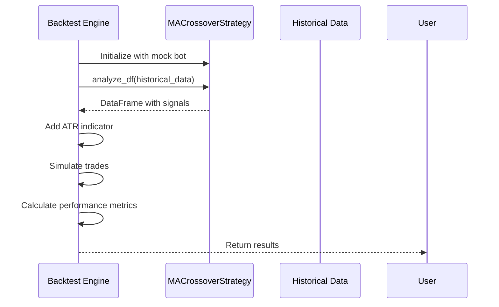
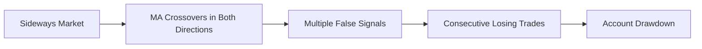

# MA Crossover Strategy

<cite>
**Referenced Files in This Document**   
- [ma_crossover.py](file://core/strategies/ma_crossover.py)
- [trading_bot.py](file://core/bots/trading_bot.py)
- [engine.py](file://core/backtesting/engine.py)
- [mt5.py](file://core/utils/mt5.py)
</cite>

## Table of Contents
1. [Introduction](#introduction)
2. [Strategy Overview](#strategy-overview)
3. [Configuration Parameters](#configuration-parameters)
4. [Moving Average Calculation](#moving-average-calculation)
5. [Signal Generation Logic](#signal-generation-logic)
6. [Live Trading Execution](#live-trading-execution)
7. [Backtesting Implementation](#backtesting-implementation)
8. [Integration with Trading System](#integration-with-trading-system)
9. [Performance Characteristics](#performance-characteristics)
10. [Tuning Recommendations](#tuning-recommendations)
11. [Common Pitfalls](#common-pitfalls)

## Introduction
The MA Crossover Strategy is a trend-following trading system that generates buy and sell signals based on the interaction between two moving averages of different periods. This document provides a comprehensive analysis of the implementation in the QuantumBotX system, covering its architecture, functionality, integration points, and performance characteristics. The strategy is designed to identify trend changes through the crossover of a fast (short-period) moving average and a slow (long-period) moving average, making it particularly effective in trending markets.

## Strategy Overview
The MA Crossover Strategy implements a classic technical analysis approach where trading signals are generated when a shorter-term moving average crosses above or below a longer-term moving average. The implementation follows the dual moving average crossover principle, with the fast moving average reacting more quickly to price changes while the slow moving average provides a longer-term trend context.

The strategy is implemented as a class that inherits from the BaseStrategy, providing two primary methods for analysis: `analyze()` for live trading and `analyze_df()` for backtesting. The core logic identifies two key signal types: the "Golden Cross" (bullish signal) when the fast MA crosses above the slow MA, and the "Death Cross" (bearish signal) when the fast MA crosses below the slow MA.



**Diagram sources**
- [ma_crossover.py](file://core/strategies/ma_crossover.py#L16-L60)

**Section sources**
- [ma_crossover.py](file://core/strategies/ma_crossover.py#L1-L60)

## Configuration Parameters
The MA Crossover Strategy is configurable through parameters that define the behavior of the moving averages and influence trading decisions. These parameters can be adjusted to optimize performance for different markets and timeframes.

**Strategy Parameters:**
- **fast_period**: Period for the fast moving average (default: 20)
- **slow_period**: Period for the slow moving average (default: 50)

The parameters are defined in the `get_definable_params()` class method, which returns a list of parameter configurations including their names, labels, types, and default values. This structure allows the strategy to be easily configured through a user interface or configuration file.

```python
@classmethod
def get_definable_params(cls):
    return [
        {"name": "fast_period", "label": "Fast MA Period", "type": "number", "default": 20},
        {"name": "slow_period", "label": "Slow MA Period", "type": "number", "default": 50}
    ]
```

The choice of period values significantly impacts the strategy's sensitivity. Shorter periods make the strategy more responsive to price changes but increase the risk of false signals, while longer periods provide more reliable signals but with greater lag.

**Section sources**
- [ma_crossover.py](file://core/strategies/ma_crossover.py#L7-L14)

## Moving Average Calculation
The MA Crossover Strategy uses the Simple Moving Average (SMA) implementation from the pandas_ta library to calculate both the fast and slow moving averages. The calculation is performed on the closing prices of the input DataFrame.

For live trading, the `analyze()` method calculates the moving averages using:
```python
df["ma_fast"] = ta.sma(df["close"], length=fast_period)
df["ma_slow"] = ta.sma(df["close"], length=slow_period)
```

The strategy retrieves price data through the MT5 integration system, specifically using the `get_rates_mt5()` function from the `core.utils.mt5` module. This function fetches historical price data from the MetaTrader 5 platform and returns it as a pandas DataFrame with properly formatted timestamps.



**Diagram sources**
- [ma_crossover.py](file://core/strategies/ma_crossover.py#L22-L25)
- [mt5.py](file://core/utils/mt5.py#L50-L65)

**Section sources**
- [ma_crossover.py](file://core/strategies/ma_crossover.py#L20-L30)
- [mt5.py](file://core/utils/mt5.py#L50-L65)

## Signal Generation Logic
The signal generation logic in the MA Crossover Strategy is based on detecting crossovers between the fast and slow moving averages by comparing their current and previous values. The strategy implements this logic differently for live trading and backtesting scenarios.

For live trading, the `analyze()` method examines only the most recent two data points to determine if a crossover has occurred:



The implementation includes several edge case checks:
- **Insufficient data**: Returns "HOLD" if there isn't enough data to calculate the moving averages
- **Immature indicators**: Returns "HOLD" if the calculated DataFrame has fewer than two rows after NA values are dropped
- **Data validation**: Checks for None or empty DataFrames before processing

The crossover detection uses the following conditions:
- **BUY signal (Golden Cross)**: When the fast MA was below or equal to the slow MA on the previous bar, and is now above the slow MA
- **SELL signal (Death Cross)**: When the fast MA was above or equal to the slow MA on the previous bar, and is now below the slow MA

**Section sources**
- [ma_crossover.py](file://core/strategies/ma_crossover.py#L30-L60)

## Live Trading Execution
The MA Crossover Strategy integrates with the live trading system through the TradingBot class, which runs as a separate thread and periodically executes the strategy's analysis method. The execution flow follows a continuous loop that retrieves price data, analyzes it, and acts on generated signals.



The TradingBot class handles the execution logic in the `_handle_trade_signal()` method, which:
1. Checks for existing positions using the bot's ID as a magic number
2. For a BUY signal: closes any existing SELL position, then opens a new BUY position
3. For a SELL signal: closes any existing BUY position, then opens a new SELL position
4. Uses configured risk parameters (risk_percent, sl_pips, tp_pips) for position sizing

The bot retrieves price data at regular intervals defined by the `check_interval` parameter, ensuring that the strategy is consistently monitoring the market for new signals.

**Diagram sources**
- [trading_bot.py](file://core/bots/trading_bot.py#L89-L169)

**Section sources**
- [trading_bot.py](file://core/bots/trading_bot.py#L80-L169)

## Backtesting Implementation
The backtesting implementation of the MA Crossover Strategy uses the `analyze_df()` method to process an entire DataFrame of historical data at once, generating signals for all time periods simultaneously. This approach is optimized for performance during backtesting simulations.

The backtesting logic uses vectorized operations with pandas to efficiently calculate signals across the entire dataset:

```python
def analyze_df(self, df):
    fast_period = self.params.get('fast_period', 20)
    slow_period = self.params.get('slow_period', 50)

    df["ma_fast"] = ta.sma(df["close"], length=fast_period)
    df["ma_slow"] = ta.sma(df["close"], length=slow_period)
    
    golden_cross = (df["ma_fast"].shift(1) <= df["ma_slow"].shift(1)) & (df["ma_fast"] > df["ma_slow"])
    death_cross = (df["ma_fast"].shift(1) >= df["ma_slow"].shift(1)) & (df["ma_fast"] < df["ma_slow"])

    df['signal'] = np.where(golden_cross, 'BUY', np.where(death_cross, 'SELL', 'HOLD'))
    
    return df
```

The backtesting engine (`core/backtesting/engine.py`) integrates with the strategy by:
1. Creating a mock bot instance to provide context
2. Calling the strategy's `analyze_df()` method to generate signals
3. Adding ATR (Average True Range) indicator for dynamic stop-loss calculation
4. Simulating trades based on the generated signals and configured risk parameters

The backtesting system implements realistic trade execution with:
- Dynamic position sizing based on account equity and risk percentage
- Stop-loss and take-profit levels calculated using ATR multipliers
- Special handling for volatile instruments like XAUUSD with conservative position sizing
- Trade logging and performance metric calculation



**Diagram sources**
- [engine.py](file://core/backtesting/engine.py#L0-L317)
- [ma_crossover.py](file://core/strategies/ma_crossover.py#L47-L60)

**Section sources**
- [engine.py](file://core/backtesting/engine.py#L0-L317)
- [ma_crossover.py](file://core/strategies/ma_crossover.py#L47-L60)

## Integration with Trading System
The MA Crossover Strategy is integrated into the QuantumBotX trading system through multiple components that handle data flow, execution, and monitoring. The integration follows a modular architecture where the strategy is a pluggable component that can be selected and configured for different trading bots.

The strategy map (`core/strategies/strategy_map.py`) registers the MA Crossover Strategy with a unique identifier, allowing it to be instantiated by the trading system:

```python
# In strategy_map.py (inferred from usage)
STRATEGY_MAP = {
    'ma_crossover': MACrossoverStrategy,
    # other strategies...
}
```

When a trading bot is created, it uses the strategy name to look up the corresponding class in the strategy map and instantiate it with the provided parameters. The bot then calls the strategy's `analyze()` method in its main loop, passing the latest price data.

The integration points include:
- **Frontend**: Strategy parameters are displayed and configurable in the UI
- **Database**: Strategy configuration is stored in the bot's strategy_params field
- **Backtesting**: The strategy can be tested with historical data through the API
- **Live trading**: The strategy runs in a separate thread, making trading decisions autonomously

The system supports both live trading and backtesting modes, with the strategy adapting its behavior based on the context (using `analyze()` for live trading and `analyze_df()` for backtesting).

**Section sources**
- [trading_bot.py](file://core/bots/trading_bot.py#L0-L169)
- [engine.py](file://core/backtesting/engine.py#L0-L317)

## Performance Characteristics
The MA Crossover Strategy exhibits specific performance characteristics that make it suitable for certain market conditions while potentially underperforming in others. Understanding these characteristics is crucial for effective deployment and optimization.

**Latency Considerations:**
- The strategy has minimal computational overhead, with moving average calculations being highly optimized in pandas_ta
- The primary latency factor is the data retrieval from MT5, which typically takes 100-500ms depending on network conditions
- Signal generation itself is nearly instantaneous (< 10ms for typical data sizes)
- The overall loop time is dominated by the check_interval parameter (default: several seconds)

**Optimal Market Conditions:**
- **Strong trending markets**: The strategy performs best when prices are moving consistently in one direction
- **Higher timeframes**: Works more effectively on H1, H4, and D1 timeframes where trends are more established
- **Liquid instruments**: Performs better on major currency pairs and indices with tight spreads

**Performance Metrics:**
- **Signal frequency**: Varies significantly based on period settings (20/50 typically generates 5-15 signals per month on H1)
- **Lag**: Inherent to moving average strategies, with longer periods creating greater lag but fewer false signals
- **Win rate**: Typically ranges from 40-60% depending on market conditions and parameter tuning
- **Profit factor**: Can achieve 1.2-1.8 in favorable trending conditions

The backtesting engine provides comprehensive performance analysis including total profit, win rate, maximum drawdown, and equity curve visualization, allowing users to evaluate the strategy's effectiveness before live deployment.

**Section sources**
- [engine.py](file://core/backtesting/engine.py#L200-L300)
- [ma_crossover.py](file://core/strategies/ma_crossover.py)

## Tuning Recommendations
Effective tuning of the MA Crossover Strategy parameters can significantly improve performance across different markets and timeframes. The following recommendations are based on the implementation and typical market behavior.

**Parameter Tuning Guidelines:**
- **Fast period (fast_period)**: 
  - Short-term trading: 10-15 for more responsive signals
  - Medium-term trading: 20-30 for balanced performance
  - Long-term trading: 30-50 for reduced noise
- **Slow period (slow_period)**:
  - Short-term: 30-50 to maintain sensitivity
  - Medium-term: 50-100 for reliable trend identification
  - Long-term: 100-200 for major trend following

**Market-Specific Tuning:**
- **Forex majors (EURUSD, GBPUSD)**: 20/50 on H1 timeframe
- **Gold (XAUUSD)**: 10/30 due to higher volatility
- **Indices**: 15/45 for balanced responsiveness
- **Cryptocurrencies**: 5/20 for faster markets

**Optimization Approach:**
1. Start with default values (20/50) as a baseline
2. Test on at least 6 months of historical data
3. Adjust the fast period first to optimize entry timing
4. Then adjust the slow period to filter out false signals
5. Consider the risk-reward ratio and maximum drawdown, not just total profit
6. Validate results on out-of-sample data

The strategy performs best when the ratio between slow and fast periods is maintained between 2:1 and 3:1, as this provides sufficient differentiation between the trend signals while maintaining responsiveness.

**Section sources**
- [ma_crossover.py](file://core/strategies/ma_crossover.py)
- [engine.py](file://core/backtesting/engine.py)

## Common Pitfalls
The MA Crossover Strategy, like all technical trading systems, is susceptible to certain pitfalls that can lead to suboptimal performance or losses. Awareness of these issues is critical for successful implementation.

**Whipsaw in Sideways Markets:**
The most significant pitfall occurs in ranging or sideways markets where the moving averages repeatedly cross back and forth, generating false signals. This can lead to a series of losing trades as the price oscillates within a range.



**Other Common Issues:**
- **Lag in fast-moving markets**: The strategy may enter trends late, missing the initial momentum
- **Over-optimization**: Tuning parameters too closely to historical data can reduce out-of-sample performance
- **Ignoring market context**: Applying the same parameters across different market regimes without adjustment
- **Poor risk management**: Not properly sizing positions or setting stop-loss levels

**Mitigation Strategies:**
- **Trend filtering**: Combine with a longer-term trend indicator (like ADX) to only trade in the direction of the major trend
- **Volatility adjustment**: Modify position sizing based on market volatility (ATR)
- **Timeframe confluence**: Use multiple timeframe analysis to confirm signals
- **Market regime detection**: Implement logic to detect trending vs. ranging markets and adjust strategy accordingly

The QuantumBotX system addresses some of these issues through its conservative position sizing for volatile instruments like XAUUSD and the ability to combine multiple strategies, allowing users to create hybrid approaches that mitigate the weaknesses of individual strategies.

**Section sources**
- [ma_crossover.py](file://core/strategies/ma_crossover.py)
- [engine.py](file://core/backtesting/engine.py#L100-L150)