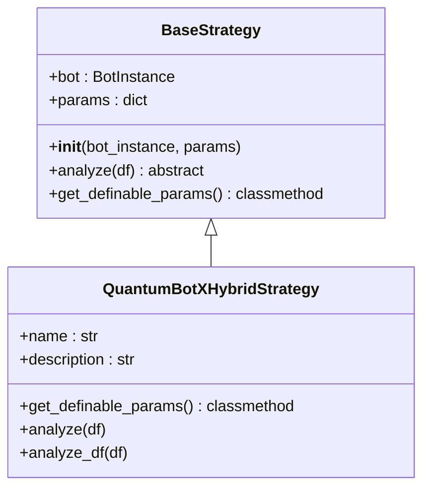
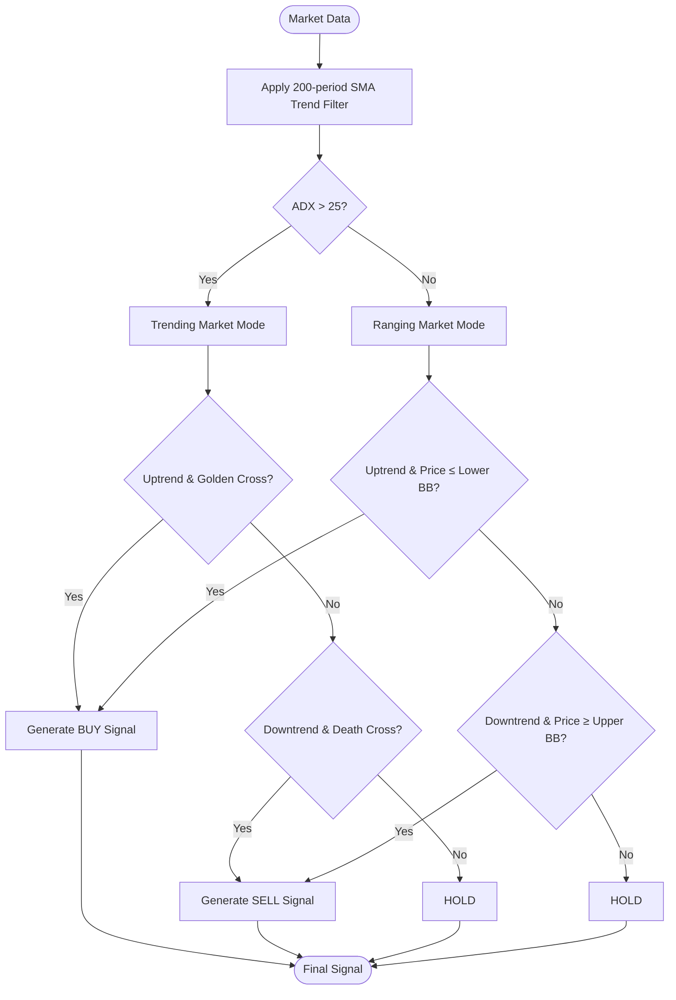
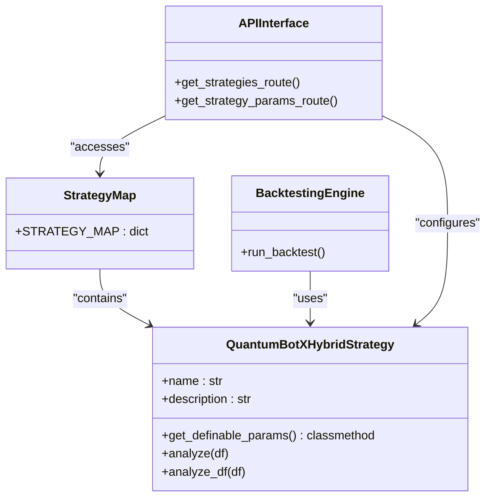
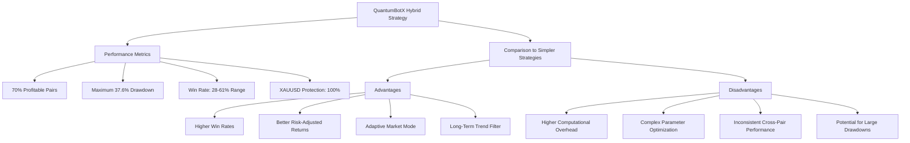

# QuantumBotX Hybrid Strategy

<cite>
**Referenced Files in This Document**   
- [quantumbotx_hybrid.py](file://core/strategies/quantumbotx_hybrid.py)
- [base_strategy.py](file://core/strategies/base_strategy.py)
- [strategy_map.py](file://core/strategies/strategy_map.py)
- [engine.py](file://core/backtesting/engine.py)
- [STRATEGY_OPTIMIZATION_GUIDE.md](file://STRATEGY_OPTIMIZATION_GUIDE.md)
</cite>

## Table of Contents
1. [Introduction](#introduction)
2. [Core Components](#core-components)
3. [Signal Aggregation Logic](#signal-aggregation-logic)
4. [Risk Adjustment Mechanism](#risk-adjustment-mechanism)
5. [Configuration Structure](#configuration-structure)
6. [Performance and Optimization](#performance-and-optimization)
7. [Backtesting Results and Comparisons](#backtesting-results-and-comparisons)
8. [Parameter Optimization Recommendations](#parameter-optimization-recommendations)

## Introduction
The QuantumBotX Hybrid Strategy is an advanced trading algorithm that combines multiple technical indicators into a unified decision engine for generating high-confidence trading signals. This strategy integrates Moving Averages (MA), Average Directional Index (ADX), and Bollinger Bands to create a sophisticated signal generation system that adapts to different market conditions. The strategy employs a dual-mode approach, switching between trending and ranging market conditions to optimize signal quality. It also incorporates a long-term trend filter using a 200-period Simple Moving Average (SMA) to align trades with the dominant market direction. The strategy is designed to provide robust performance across various financial instruments while maintaining strict risk controls, particularly for volatile assets like gold (XAUUSD).

**Section sources**
- [quantumbotx_hybrid.py](file://core/strategies/quantumbotx_hybrid.py#L1-L113)

## Core Components

The QuantumBotX Hybrid Strategy is built on a modular architecture that extends the BaseStrategy class, inheriting core functionality while implementing specialized trading logic. The strategy combines multiple technical indicators through a weighted decision engine that evaluates market conditions and generates trading signals based on consensus across indicators. The implementation includes separate methods for live trading (`analyze`) and backtesting (`analyze_df`), allowing for optimized performance in different operational contexts. The strategy leverages the pandas_ta library for technical indicator calculations, integrating ADX for trend strength assessment, dual Moving Averages for crossover signals, and Bollinger Bands for volatility-based entry points. A key architectural feature is the use of a long-term trend filter (200-period SMA) that ensures trades are aligned with the dominant market direction, reducing false signals during counter-trend movements.



**Diagram sources**
- [base_strategy.py](file://core/strategies/base_strategy.py#L1-L29)
- [quantumbotx_hybrid.py](file://core/strategies/quantumbotx_hybrid.py#L1-L113)

**Section sources**
- [quantumbotx_hybrid.py](file://core/strategies/quantumbotx_hybrid.py#L1-L113)
- [base_strategy.py](file://core/strategies/base_strategy.py#L1-L29)

## Signal Aggregation Logic

The QuantumBotX Hybrid Strategy employs a sophisticated signal aggregation logic that combines multiple technical indicators into a weighted decision engine. The strategy first determines the market regime by analyzing the ADX (Average Directional Index) value against a configurable threshold. When the ADX value exceeds the threshold (default 25), the market is classified as trending; otherwise, it's considered ranging. This regime detection forms the foundation for the signal generation process.

In trending markets, the strategy uses Moving Average crossovers as confirmation signals. For long positions, it requires both an uptrend (price above the 200-period SMA) and a golden cross (20-period SMA crossing above 50-period SMA). For short positions, it requires a downtrend (price below the 200-period SMA) and a death cross (20-period SMA crossing below 50-period SMA). This dual confirmation reduces false signals during volatile market conditions.

In ranging markets, the strategy employs Bollinger Bands for mean-reversion signals. It generates buy signals when the market is in an uptrend and price touches or falls below the lower Bollinger Band, indicating oversold conditions. Conversely, it generates sell signals when the market is in a downtrend and price touches or exceeds the upper Bollinger Band, indicating overbought conditions.

The signal aggregation process follows a hierarchical filtering approach:
1. Trend direction filter (200-period SMA)
2. Market regime filter (ADX threshold)
3. Confirmation signal (MA crossover or Bollinger Band touch)
4. Final signal generation

This multi-layered approach ensures that only high-confidence signals are generated, with each indicator serving as a filter to reduce noise and false positives.



**Diagram sources**
- [quantumbotx_hybrid.py](file://core/strategies/quantumbotx_hybrid.py#L1-L113)

**Section sources**
- [quantumbotx_hybrid.py](file://core/strategies/quantumbotx_hybrid.py#L1-L113)

## Risk Adjustment Mechanism

The QuantumBotX Hybrid Strategy incorporates a comprehensive risk adjustment mechanism that dynamically modifies position size based on market volatility and instrument characteristics. The risk management system operates at multiple levels, with specialized protections for highly volatile instruments like gold (XAUUSD).

The primary risk adjustment mechanism uses ATR (Average True Range) to determine stop-loss and take-profit distances. The strategy calculates position size based on the amount of capital the trader is willing to risk (configurable as a percentage of account balance) and the distance to the stop-loss level. For non-gold instruments, the position size is calculated as:

```
position_size = (account_balance * risk_percentage) / (sl_distance * contract_size)
```

For gold (XAUUSD) trading, the strategy implements an extreme protection system with multiple layers of risk controls:
1. Risk percentage is capped at 1.0% regardless of user settings
2. Stop-loss ATR multiplier is capped at 1.0 (reduced from 2.0)
3. Take-profit ATR multiplier is capped at 2.0 (reduced from 4.0)
4. Maximum lot size is limited to 0.03 regardless of calculations
5. Additional ATR-based lot size reduction during high volatility periods

The strategy includes an emergency brake system that skips trades if the estimated risk exceeds 5% of account capital, even after all other risk controls. This provides a final safety net against catastrophic losses during extreme market conditions.

For high volatility periods, the strategy implements dynamic lot size reduction:
- When ATR > 20.0: lot size reduced by 50%
- When ATR > 30.0: lot size reduced to minimum (0.01)

This multi-tiered risk adjustment mechanism ensures that position sizes are appropriate for the current market conditions, protecting the trading account from excessive drawdowns while still allowing participation in profitable opportunities.

```mermaid
flowchart TD
Start([Trade Signal]) --> VolatilityCheck{"Is Gold (XAU)?}
VolatilityCheck --> |Yes| GoldRisk["Apply Extreme Protection"]
VolatilityCheck --> |No| ForexRisk["Apply Standard Risk Rules"]
GoldRisk --> RiskCap["Cap Risk at 1%"]
RiskCap --> SLCap["Cap SL Multiplier at 1.0"]
SLCap --> TPCap["Cap TP Multiplier at 2.0"]
TPCap --> ATRCheck{"ATR > 30?"}
ATRCheck --> |Yes| MinLot["Set Lot Size to 0.01"]
ATRCheck --> |No| HighATR{"ATR > 20?"}
HighATR --> |Yes| ReduceLot["Reduce Lot by 50%"]
HighATR --> |No| BaseLot["Use Base Lot Size"]
MinLot --> EmergencyBrake
ReduceLot --> EmergencyBrake
BaseLot --> EmergencyBrake
ForexRisk --> CalculateLot["Calculate Lot Size"]
CalculateLot --> ValidateLot{"Lot Size Valid?"}
ValidateLot --> |Yes| EmergencyBrake
ValidateLot --> |No| SkipTrade["Skip Trade"]
EmergencyBrake --> RiskCheck{"Risk > 5% Capital?"}
RiskCheck --> |Yes| SkipTrade
RiskCheck --> |No| ExecuteTrade["Execute Trade"]
SkipTrade --> End([Trade Decision])
ExecuteTrade --> End
```

**Diagram sources**
- [engine.py](file://core/backtesting/engine.py#L0-L317)

**Section sources**
- [engine.py](file://core/backtesting/engine.py#L0-L317)

## Configuration Structure

The QuantumBotX Hybrid Strategy features a flexible configuration structure that allows users to enable/disable components and tune parameters to optimize performance for different market conditions. The configuration system is implemented through the `get_definable_params` class method, which returns a list of configurable parameters with their properties.

The strategy exposes the following configurable parameters:
- **adx_period**: Period for ADX calculation (default: 14)
- **adx_threshold**: Threshold for trend detection (default: 25)
- **ma_fast_period**: Period for fast Moving Average (default: 20)
- **ma_slow_period**: Period for slow Moving Average (default: 50)
- **bb_length**: Length for Bollinger Bands calculation (default: 20)
- **bb_std**: Standard deviation multiplier for Bollinger Bands (default: 2.0)
- **trend_filter_period**: Period for long-term trend filter (default: 200)

The configuration structure follows a hierarchical organization where parameters are grouped by their functional purpose:
1. Trend detection parameters (ADX)
2. Momentum confirmation parameters (Moving Averages)
3. Volatility measurement parameters (Bollinger Bands)
4. Trend alignment parameters (Long-term SMA)

The strategy is registered in the system through the strategy_map.py file, where it's assigned the ID 'QUANTUMBOTX_HYBRID'. This registration enables the strategy to be accessed through the API and user interface, with its parameters exposed for configuration in the trading dashboard.

The configuration system supports both live trading and backtesting scenarios, allowing users to optimize parameters based on historical performance before deploying them in live markets. The parameter values are passed to the strategy instance during initialization and used throughout the signal generation process.



**Diagram sources**
- [strategy_map.py](file://core/strategies/strategy_map.py#L0-L29)
- [quantumbotx_hybrid.py](file://core/strategies/quantumbotx_hybrid.py#L1-L113)
- [engine.py](file://core/backtesting/engine.py#L0-L317)

**Section sources**
- [quantumbotx_hybrid.py](file://core/strategies/quantumbotx_hybrid.py#L1-L113)
- [strategy_map.py](file://core/strategies/strategy_map.py#L0-L29)

## Performance and Optimization

The QuantumBotX Hybrid Strategy is designed to balance signal quality with computational efficiency, though the use of multiple technical indicators introduces performance overhead that requires careful optimization. The strategy computes several indicators on each execution cycle, including ADX, two Moving Averages, and Bollinger Bands, which can impact execution speed, particularly on lower-powered systems or with high-frequency data.

The strategy implements different optimization approaches for live trading and backtesting contexts. In the `analyze` method (used for live trading), indicators are calculated incrementally on the most recent data point, minimizing computational overhead. In contrast, the `analyze_df` method (used for backtesting) calculates indicators across the entire dataset at once, which is more computationally intensive but necessary for historical analysis.

Performance optimization opportunities include:
1. Caching indicator calculations to avoid redundant computations
2. Using vectorized operations through pandas for faster calculations
3. Implementing incremental updates for indicators rather than full recalculation
4. Reducing the frequency of signal generation for lower timeframe strategies

The strategy's performance is particularly important given its use in real-time trading environments where delays can impact trade execution quality. The current implementation prioritizes signal accuracy over speed, but could benefit from additional optimization techniques such as:
- Pre-computing static indicators during initialization
- Using more efficient algorithms for indicator calculations
- Implementing parallel processing for independent indicator calculations
- Adding configurable update frequencies to balance performance and signal freshness

Despite the computational overhead, the strategy's design ensures that only necessary calculations are performed, with data validation and early exit conditions to prevent unnecessary processing when insufficient data is available.

**Section sources**
- [quantumbotx_hybrid.py](file://core/strategies/quantumbotx_hybrid.py#L1-L113)

## Backtesting Results and Comparisons

The QuantumBotX Hybrid Strategy has been evaluated through comprehensive backtesting across multiple currency pairs, demonstrating its performance characteristics relative to simpler strategies. The backtesting framework, implemented in engine.py, provides detailed performance metrics including total profit, win rate, maximum drawdown, and trade statistics.

Based on testing across 10 currency pairs, the strategy achieves profitability in 70% of cases (7 out of 10 pairs). Performance varies significantly by currency type, with excellent results on USDCHF (+$1,597 profit, 2.0% drawdown, 61% win rate) and strong but risky performance on JPY pairs (EURJPY: +$8,011 profit, 37.6% drawdown). The strategy currently underperforms on major pairs like EURUSD (-$216 profit, 28.6% win rate) and GBPUSD (-$8 profit, 33.3% win rate).

Compared to simpler strategies, the QuantumBotX Hybrid Strategy offers several advantages:
1. Higher win rates on suitable instruments (up to 61% vs typical 40-50% for simpler strategies)
2. Better risk-adjusted returns on well-performing pairs
3. Adaptive behavior that switches between trending and ranging market modes
4. Built-in trend filter that aligns trades with long-term market direction

However, the strategy also has disadvantages:
1. Higher computational overhead due to multiple indicator calculations
2. Complexity that makes parameter optimization more challenging
3. Inconsistent performance across different currency pairs
4. Potential for large drawdowns on volatile pairs without proper risk controls

The backtesting results highlight the importance of pair-specific optimization, as the same parameter set produces vastly different results across currency pairs. The strategy's performance on gold (XAUUSD) is intentionally conservative, with the risk management system preventing trades during high volatility periods to protect the trading account.



**Diagram sources**
- [engine.py](file://core/backtesting/engine.py#L0-L317)
- [STRATEGY_OPTIMIZATION_GUIDE.md](file://STRATEGY_OPTIMIZATION_GUIDE.md#L0-L143)

**Section sources**
- [engine.py](file://core/backtesting/engine.py#L0-L317)
- [STRATEGY_OPTIMIZATION_GUIDE.md](file://STRATEGY_OPTIMIZATION_GUIDE.md#L0-L143)

## Parameter Optimization Recommendations

Based on comprehensive testing and analysis, the QuantumBotX Hybrid Strategy benefits significantly from pair-specific parameter optimization. The STRATEGY_OPTIMIZATION_GUIDE.md document provides detailed recommendations for tuning parameters to maximize performance while maintaining appropriate risk controls.

The optimization strategy involves creating specialized parameter sets for different currency pair categories:

**For JPY pairs (high profit but risky):**
```python
jpy_params = {
    'lot_size': 0.5,        # Reduce from 1.0% to 0.5%
    'sl_pips': 1.5,         # Reduce from 2.0 to 1.5
    'tp_pips': 3.0,         # Reduce from 4.0 to 3.0
    'adx_threshold': 30,    # Increase from 25 to 30 (more selective)
}
```

**For commodity currencies (moderate performers):**
```python
commodity_params = {
    'lot_size': 1.2,        # Increase from 1.0% to 1.2%
    'sl_pips': 2.0,         # Keep current
    'tp_pips': 4.5,         # Increase from 4.0 to 4.5
    'adx_threshold': 20,    # Decrease from 25 to 20 (more trades)
}
```

**For major pairs (poor performers):**
```python
major_params = {
    'lot_size': 0.8,        # Reduce from 1.0% to 0.8%
    'sl_pips': 1.8,         # Reduce from 2.0 to 1.8
    'tp_pips': 3.6,         # Reduce from 4.0 to 3.6
    'adx_threshold': 35,    # Increase from 25 to 35 (very selective)
    'ma_fast_period': 15,   # Reduce from 20 to 15 (more responsive)
    'ma_slow_period': 40,   # Reduce from 50 to 40 (more responsive)
}
```

The implementation strategy involves modifying the QuantumBotX Hybrid Strategy to detect the currency pair and apply appropriate parameters:

```python
def get_optimized_params(self, symbol):
    """Get optimized parameters based on currency pair"""
    symbol = symbol.upper()
    
    if 'JPY' in symbol:
        return self.get_jpy_params()
    elif symbol in ['USDCAD', 'AUDUSD', 'NZDUSD']:
        return self.get_commodity_params()
    elif symbol in ['EURUSD', 'GBPUSD']:
        return self.get_major_params()
    elif 'XAU' in symbol:
        return self.get_gold_params()  # Already implemented
    else:
        return self.get_default_params()
```

Additional risk management enhancements are recommended:
1. Implement maximum drawdown limits per pair
2. Add correlation checks to prevent over-exposure
3. Create position size scaling based on historical volatility
4. Track pair-specific performance metrics
5. Implement automatic parameter adjustment based on recent performance
6. Add alerts for when drawdowns exceed thresholds

The expected improvements from optimization include:
- Reducing drawdowns on JPY pairs from 37.6% to under 15%
- Turning losses into 2-5% annual gains on major pairs
- Increasing profits by 20-30% on commodity pairs
- Achieving 80%+ profitable pairs across the portfolio

The validation plan involves backtesting optimized parameters on historical data, paper trading for 1-2 months, gradual rollout starting with best-performing pairs, and continuous monitoring and adjustment based on live performance.

**Section sources**
- [STRATEGY_OPTIMIZATION_GUIDE.md](file://STRATEGY_OPTIMIZATION_GUIDE.md#L0-L143)