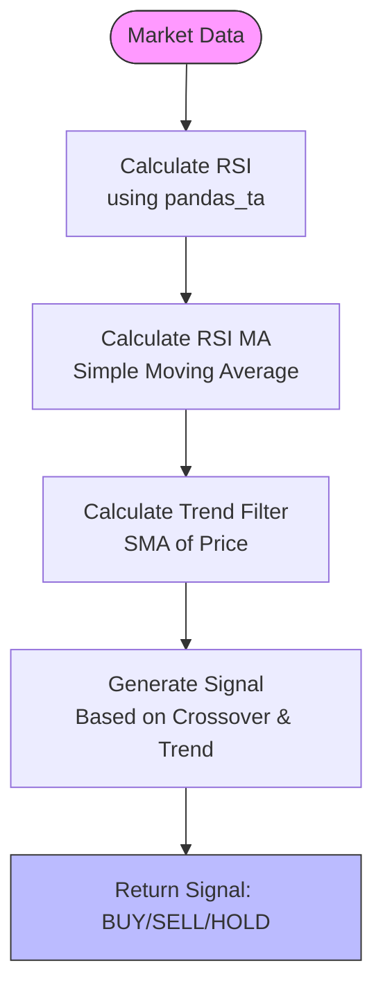
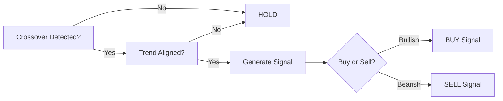
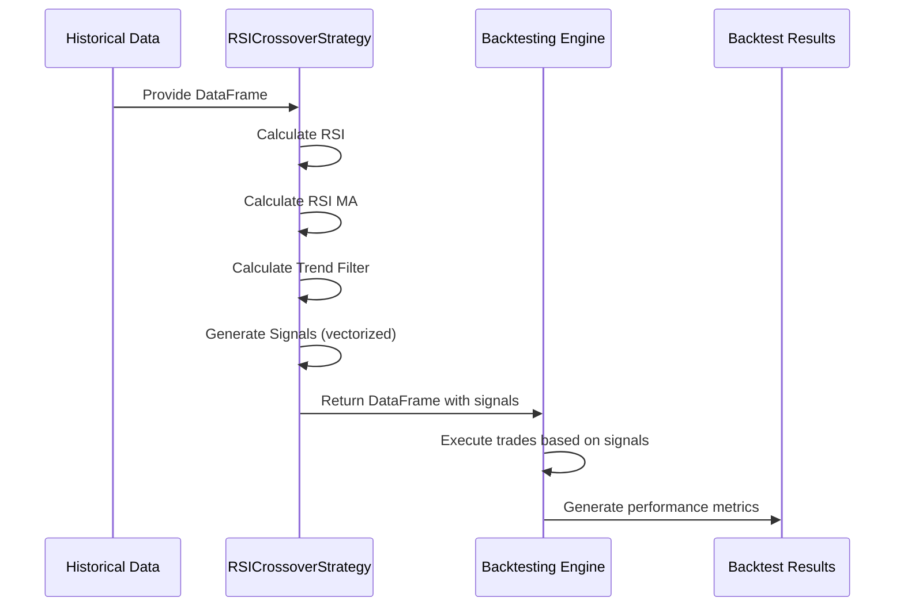
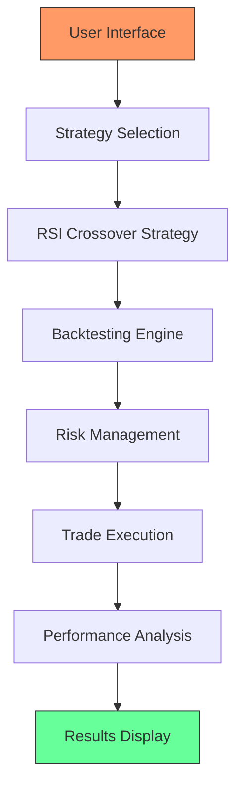

# RSI Crossover Strategy

<cite>
**Referenced Files in This Document**   
- [rsi_crossover.py](file://core/strategies/rsi_crossover.py)
- [api_indicators.py](file://core/routes/api_indicators.py)
- [strategy_map.py](file://core/strategies/strategy_map.py)
- [base_strategy.py](file://core/strategies/base_strategy.py)
- [engine.py](file://core/backtesting/engine.py)
</cite>

## Table of Contents
1. [Introduction](#introduction)
2. [Strategy Overview](#strategy-overview)
3. [RSI Calculation and Signal Logic](#rsi-calculation-and-signal-logic)
4. [Configuration Parameters](#configuration-parameters)
5. [Live Trading Implementation](#live-trading-implementation)
6. [Backtesting Implementation](#backtesting-implementation)
7. [Integration and Usage Contexts](#integration-and-usage-contexts)
8. [Risk Management and Backtesting Accuracy](#risk-management-and-backtesting-accuracy)
9. [Performance Considerations](#performance-considerations)
10. [Conclusion](#conclusion)

## Introduction
The RSI Crossover Strategy is a momentum-based trading system implemented in the QuantumBotX platform. It leverages the Relative Strength Index (RSI) indicator and its moving average to generate buy and sell signals, enhanced with a long-term trend filter to improve signal quality. This document provides a comprehensive analysis of the strategy's implementation, covering its calculation methodology, signal generation logic, configuration options, and integration within the broader trading system.

**Section sources**
- [rsi_crossover.py](file://core/strategies/rsi_crossover.py#L1-L10)

## Strategy Overview
The RSI Crossover Strategy identifies momentum shifts by detecting crossovers between the RSI line and its moving average. Unlike traditional RSI strategies that use fixed overbought (70) and oversold (30) thresholds, this implementation uses a dynamic crossover approach combined with a trend filter to reduce false signals.

The strategy operates on two primary methods:
- `analyze()`: For live trading, processing the most recent data point
- `analyze_df()`: For backtesting, processing an entire DataFrame at once

The core logic involves three key components:
1. RSI calculation using a configurable period
2. Moving average of the RSI values
3. Long-term trend filter using a Simple Moving Average (SMA)



**Diagram sources**
- [rsi_crossover.py](file://core/strategies/rsi_crossover.py#L1-L83)

**Section sources**
- [rsi_crossover.py](file://core/strategies/rsi_crossover.py#L1-L83)

## RSI Calculation and Signal Logic
The strategy uses the `pandas_ta` library to calculate the Relative Strength Index with a standard Wilder's smoothing method. The RSI is calculated using the formula:

RSI = 100 - (100 / (1 + RS))

Where RS (Relative Strength) = Average Gain / Average Loss over the specified period.

### Signal Generation
Signals are generated based on two conditions that must be satisfied simultaneously:

1. **Crossover Condition**: 
   - Buy Signal: RSI crosses above its moving average
   - Sell Signal: RSI crosses below its moving average

2. **Trend Filter Condition**:
   - Buy Signal: Price is above the long-term SMA (uptrend)
   - Sell Signal: Price is below the long-term SMA (downtrend)

The combination of these conditions ensures that trades are taken in the direction of the prevailing trend, filtering out counter-trend noise.



**Diagram sources**
- [rsi_crossover.py](file://core/strategies/rsi_crossover.py#L30-L60)

**Section sources**
- [rsi_crossover.py](file://core/strategies/rsi_crossover.py#L30-L60)

## Configuration Parameters
The strategy exposes three configurable parameters that allow users to adjust its sensitivity and behavior:

### Parameter Definitions
- **rsi_period**: The lookback period for RSI calculation
  - Default: 14
  - Type: Number
  - Label: "Periode RSI"
  
- **rsi_ma_period**: The period for the moving average of RSI
  - Default: 10
  - Type: Number
  - Label: "Periode MA dari RSI"
  
- **trend_filter_period**: The period for the long-term trend filter SMA
  - Default: 50
  - Type: Number
  - Label: "Periode SMA Filter Tren"

These parameters can be modified through the user interface, allowing traders to optimize the strategy for different market conditions and asset classes.

```mermaid
classDiagram
class RSICrossoverStrategy {
+str name
+str description
+dict params
+analyze(df) dict
+analyze_df(df) DataFrame
+get_definable_params() list
}
RSICrossoverStrategy : +str name = "RSI Crossover"
RSICrossoverStrategy : +str description = "Mencari sinyal momentum dari persilangan RSI dengan MA-nya, yang divalidasi oleh filter tren jangka panjang."
RSICrossoverStrategy : +dict params = {rsi_period : 14, rsi_ma_period : 10, trend_filter_period : 50}
```

**Diagram sources**
- [rsi_crossover.py](file://core/strategies/rsi_crossover.py#L10-L20)

**Section sources**
- [rsi_crossover.py](file://core/strategies/rsi_crossover.py#L10-L20)

## Live Trading Implementation
The live trading implementation is handled by the `analyze()` method, which processes the most recent market data to generate a trading signal.

### Data Validation
The method first performs several validation checks:
- Ensures the DataFrame is not None or empty
- Verifies sufficient data exists for all indicators (minimum: trend_filter_period + 2 bars)
- Handles NaN values by dropping them after calculation

### Signal Processing
The method follows a step-by-step process:
1. Calculate RSI using the configured period
2. Calculate the moving average of RSI values
3. Calculate the long-term trend filter (SMA of price)
4. Drop any rows with NaN values
5. Extract the last two bars for crossover detection
6. Determine trend direction based on price vs. SMA
7. Check for bullish or bearish crossover
8. Combine trend and crossover conditions to generate final signal

```python
def analyze(self, df):
    rsi_period = self.params.get('rsi_period', 14)
    rsi_ma_period = self.params.get('rsi_ma_period', 10)
    trend_filter_period = self.params.get('trend_filter_period', 50)

    if df is None or df.empty or len(df) < trend_filter_period + 2:
        return {"signal": "HOLD", "price": None, "explanation": "Data tidak cukup."}

    df['RSI'] = ta.rsi(df['close'], length=rsi_period)
    df['RSI_MA'] = ta.sma(df['RSI'], length=rsi_ma_period)
    df['SMA_Trend'] = ta.sma(df['close'], length=trend_filter_period)
    df.dropna(inplace=True)

    if len(df) < 2:
        return {"signal": "HOLD", "price": None, "explanation": "Indikator belum matang."}

    last = df.iloc[-1]
    prev = df.iloc[-2]
    price = last["close"]

    is_uptrend = last['close'] > last['SMA_Trend']
    is_downtrend = last['close'] < last['SMA_Trend']

    rsi_bullish_cross = prev['RSI'] <= prev['RSI_MA'] and last['RSI'] > last['RSI_MA']
    rsi_bearish_cross = prev['RSI'] >= prev['RSI_MA'] and last['RSI'] < last['RSI_MA']

    if is_uptrend and rsi_bullish_cross:
        return {"signal": "BUY", "price": price, "explanation": "Uptrend & RSI Bullish Crossover."}
    elif is_downtrend and rsi_bearish_cross:
        return {"signal": "SELL", "price": price, "explanation": "Downtrend & RSI Bearish Crossover."}

    return {"signal": "HOLD", "price": price, "explanation": f"RSI ({last['RSI']:.2f}) / RSI MA ({last['RSI_MA']:.2f}) - No Cross."}
```

**Section sources**
- [rsi_crossover.py](file://core/strategies/rsi_crossover.py#L25-L60)

## Backtesting Implementation
The backtesting implementation is handled by the `analyze_df()` method, which processes an entire DataFrame to generate signals for historical analysis.

### Vectorized Operations
Unlike the live trading method, the backtesting implementation uses vectorized operations for efficiency:

```python
def analyze_df(self, df):
    rsi_period = self.params.get('rsi_period', 14)
    rsi_ma_period = self.params.get('rsi_ma_period', 10)
    trend_filter_period = self.params.get('trend_filter_period', 50)

    df['RSI'] = ta.rsi(df['close'], length=rsi_period)
    df['RSI_MA'] = ta.sma(df['RSI'], length=rsi_ma_period)
    df['SMA_Trend'] = ta.sma(df['close'], length=trend_filter_period)

    is_uptrend = df['close'] > df['SMA_Trend']
    is_downtrend = df['close'] < df['SMA_Trend']

    rsi_bullish_cross = (df['RSI'].shift(1) <= df['RSI_MA'].shift(1)) & (df['RSI'] > df['RSI_MA'])
    rsi_bearish_cross = (df['RSI'].shift(1) >= df['RSI_MA'].shift(1)) & (df['RSI'] < df['RSI_MA'])

    buy_signal = is_uptrend & rsi_bullish_cross
    sell_signal = is_downtrend & rsi_bearish_cross

    df['signal'] = np.where(buy_signal, 'BUY', np.where(sell_signal, 'SELL', 'HOLD'))
    return df
```

### Key Differences from Live Trading
1. **No data dropping**: The method preserves all data points for accurate backtesting
2. **Shift operations**: Uses `.shift(1)` to avoid look-ahead bias
3. **Vectorized conditions**: Applies conditions to entire Series for performance
4. **No real-time constraints**: Can process large datasets efficiently



**Diagram sources**
- [rsi_crossover.py](file://core/strategies/rsi_crossover.py#L60-L83)
- [engine.py](file://core/backtesting/engine.py#L8-L316)

**Section sources**
- [rsi_crossover.py](file://core/strategies/rsi_crossover.py#L60-L83)

## Integration and Usage Contexts
The RSI Crossover Strategy is integrated into the QuantumBotX platform through multiple entry points, enabling both live trading and analysis.

### Strategy Registration
The strategy is registered in the global `STRATEGY_MAP` dictionary, making it accessible throughout the system:

```python
STRATEGY_MAP = {
    'MA_CROSSOVER': MACrossoverStrategy,
    'QUANTUMBOTX_HYBRID': QuantumBotXHybridStrategy,
    'RSI_CROSSOVER': RSICrossoverStrategy,
    # ... other strategies
}
```

### API Integration
The strategy's underlying RSI calculation is exposed through the API for frontend visualization:

```python
@api_indicators.route('/api/rsi_data')
def get_rsi_data():
    symbol = request.args.get('symbol', 'EURUSD')
    tf = request.args.get('timeframe', 'H1')
    
    df = get_rates_mt5(symbol, timeframe, 100)
    df['RSI'] = ta.rsi(df['close'], length=14)
    df = df.dropna().tail(20)
    
    return jsonify({
        'timestamps': [x.strftime('%H:%M') for x in df['time']],
        'rsi_values': df['RSI'].round(2).tolist()
    })
```

This endpoint provides RSI data for charting purposes, using a fixed 14-period RSI calculation.

### Backtesting Engine Integration
The strategy is executed within the backtesting engine, which handles:
- Position sizing
- Stop-loss and take-profit levels
- Trade execution simulation
- Performance metric calculation

The engine applies additional risk management rules, particularly for volatile assets like gold (XAUUSD), where position sizes are conservatively capped.



**Diagram sources**
- [strategy_map.py](file://core/strategies/strategy_map.py#L15-L28)
- [api_indicators.py](file://core/routes/api_indicators.py#L10-L34)
- [engine.py](file://core/backtesting/engine.py#L8-L316)

**Section sources**
- [strategy_map.py](file://core/strategies/strategy_map.py#L15-L28)
- [api_indicators.py](file://core/routes/api_indicators.py#L10-L34)
- [engine.py](file://core/backtesting/engine.py#L8-L316)

## Risk Management and Backtesting Accuracy
The RSI Crossover Strategy operates within a comprehensive risk management framework that ensures realistic backtesting results and safe live trading.

### Position Sizing
The backtesting engine implements dynamic position sizing based on:
- Account capital
- Risk percentage per trade
- Stop-loss distance (using ATR)
- Asset-specific risk profiles

For high-volatility assets like gold (XAUUSD), the system applies conservative limits:
- Maximum risk of 1% of capital
- Reduced ATR multipliers for stop-loss and take-profit
- Capped position sizes (maximum 0.03 lots)

### Backtesting Accuracy
The strategy implementation ensures backtesting accuracy through:
- **No look-ahead bias**: Using `.shift(1)` in backtesting calculations
- **Realistic execution**: Simulating actual trade entry and exit
- **Transaction costs**: Implicitly accounted for in price data
- **Data quality**: Validating sufficient data before analysis

### Limitations
Despite these safeguards, the strategy has some limitations:
- **Divergence detection**: The current implementation does not detect RSI-price divergences
- **Overbought/oversold extremes**: Does not handle extended overbought/oversold conditions
- **Volatility adaptation**: Parameters are static and don't adapt to changing market volatility

These limitations mean the strategy may underperform in ranging markets or during periods of extreme volatility.

**Section sources**
- [engine.py](file://core/backtesting/engine.py#L8-L316)

## Performance Considerations
The RSI Crossover Strategy is designed for efficient execution in both live and backtesting environments.

### Computational Efficiency
- **Time Complexity**: O(n) for both live and backtesting modes
- **Memory Usage**: Minimal, as it only stores necessary indicator values
- **Optimization**: Vectorized operations in backtesting mode for speed

### Asset Class Suitability
The strategy performs differently across asset classes:

| Asset Class | Suitability | Notes |
|-------------|-------------|-------|
| Forex | High | Works well with trending currency pairs |
| Gold (XAUUSD) | Medium | Requires conservative position sizing |
| Cryptocurrencies | Medium | High volatility can trigger false signals |
| Stocks | Low | Less effective in range-bound equity markets |

The trend filter helps the strategy perform better in trending markets but may cause it to miss opportunities in sideways markets.

### Optimization Recommendations
1. **Parameter tuning**: Optimize RSI and MA periods for specific assets
2. **Dynamic filtering**: Implement adaptive trend filters based on volatility
3. **Confirmation indicators**: Add volume or other confirmation indicators
4. **Timeframe optimization**: Test performance across different timeframes

**Section sources**
- [rsi_crossover.py](file://core/strategies/rsi_crossover.py#L1-L83)
- [engine.py](file://core/backtesting/engine.py#L8-L316)

## Conclusion
The RSI Crossover Strategy is a robust momentum-based trading system that effectively combines RSI crossovers with trend filtering to generate high-quality trading signals. Its implementation in the QuantumBotX platform demonstrates a well-structured approach to strategy development, with clear separation between live trading and backtesting logic.

Key strengths of the strategy include:
- Simple yet effective signal generation logic
- Configurable parameters for optimization
- Integration with comprehensive risk management
- Efficient vectorized backtesting implementation

The strategy is particularly well-suited for trending markets and can be effectively used in both forex and cryptocurrency trading. However, traders should be aware of its limitations in ranging markets and during periods of extreme volatility.

For optimal results, users should carefully tune the strategy parameters to their specific trading instruments and market conditions, while adhering to the conservative risk management practices built into the platform.