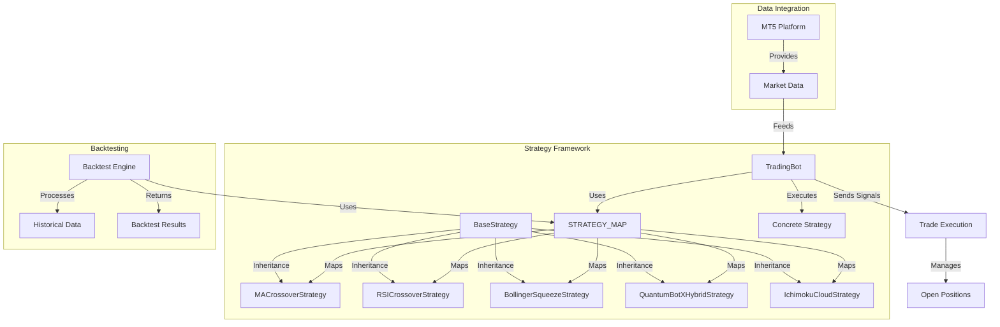
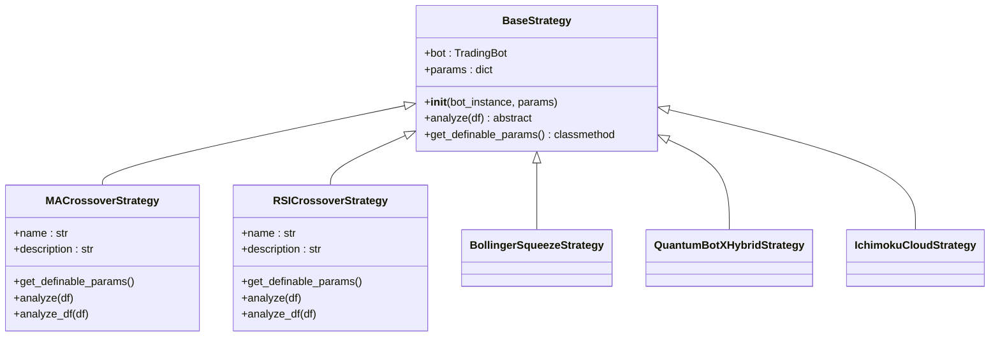
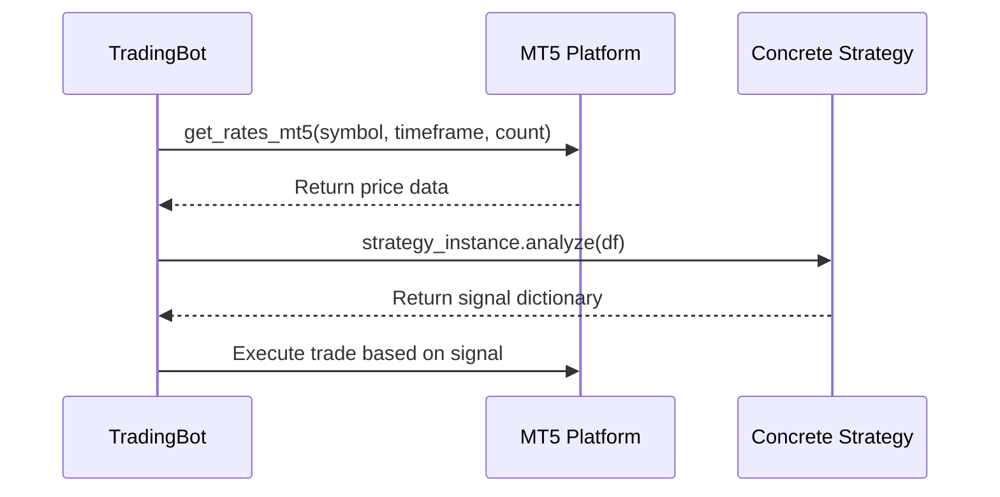

# Strategy Framework

<cite>
**Referenced Files in This Document**   
- [base_strategy.py](file://core/strategies/base_strategy.py)
- [strategy_map.py](file://core/strategies/strategy_map.py)
- [ma_crossover.py](file://core/strategies/ma_crossover.py)
- [rsi_crossover.py](file://core/strategies/rsi_crossover.py)
- [bollinger_squeeze.py](file://core/strategies/bollinger_squeeze.py)
- [quantumbotx_hybrid.py](file://core/strategies/quantumbotx_hybrid.py)
- [ichimoku_cloud.py](file://core/strategies/ichimoku_cloud.py)
- [trading_bot.py](file://core/bots/trading_bot.py)
- [mt5.py](file://core/utils/mt5.py)
- [engine.py](file://core/backtesting/engine.py)
</cite>

## Table of Contents
1. [Introduction](#introduction)
2. [Core Architecture](#core-architecture)
3. [BaseStrategy Interface Contract](#basestrategy-interface-contract)
4. [Strategy Registration and Dynamic Instantiation](#strategy-registration-and-dynamic-instantiation)
5. [Concrete Strategy Implementations](#concrete-strategy-implementations)
6. [Indicator Usage with pandas_ta](#indicator-usage-with-pandas_ta)
7. [Market Data Integration from MT5](#market-data-integration-from-mt5)
8. [Backtesting Compatibility](#backtesting-compatibility)
9. [Risk Management Patterns](#risk-management-patterns)
10. [Performance Implications](#performance-implications)
11. [Common Development Pitfalls and Debugging](#common-development-pitfalls-and-debugging)

## Introduction
The Strategy Framework forms the core decision-making engine of the QuantumBotX trading system. It provides a standardized interface for implementing various algorithmic trading strategies while enabling dynamic configuration, real-time execution, and comprehensive backtesting. This document details the architecture, interface contracts, implementation patterns, and integration points of the framework, focusing on the `BaseStrategy` abstract class and its concrete implementations.

## Core Architecture
The Strategy Framework follows a plugin-based architecture where all trading strategies inherit from a common abstract base class and are registered in a central map for dynamic instantiation. Strategies receive market data, generate trading signals, and interact with the trading bot controller to execute trades on the MetaTrader 5 (MT5) platform. The framework supports both live trading and backtesting workflows through distinct analysis methods.



**Diagram sources**
- [base_strategy.py](file://core/strategies/base_strategy.py)
- [strategy_map.py](file://core/strategies/strategy_map.py)
- [trading_bot.py](file://core/bots/trading_bot.py)

## BaseStrategy Interface Contract
The `BaseStrategy` class defines the abstract interface that all trading strategies must implement. It establishes a consistent contract for strategy initialization, analysis, and parameter management.

### Class Definition and Inheritance
The `BaseStrategy` is an abstract base class that enforces implementation of core methods through Python's `abc` module. All concrete strategies inherit from this class to ensure uniform behavior.

**Section sources**
- [base_strategy.py](file://core/strategies/base_strategy.py#L4-L28)

```python
class BaseStrategy(ABC):
    """
    Abstract base class for all trading strategies.
    Each strategy must inherit from this class and implement the `analyze` method.
    """
    def __init__(self, bot_instance, params: dict = {}):
        self.bot = bot_instance
        self.params = params

    @abstractmethod
    def analyze(self, df):
        """
        Core method that must be overridden by each derived strategy.
        This method must return a dictionary containing the analysis results.
        Accepts DataFrame as input.
        """
        raise NotImplementedError("Each strategy must implement the `analyze(df)` method.")

    @classmethod
    def get_definable_params(cls):
        """
        Class method that returns a list of parameters that can be set by the user.
        Each derived strategy should override this if it has parameters.
        """
        return []
```

### Initialization Method
The `__init__` method initializes the strategy with a reference to the parent bot instance and a dictionary of parameters. This design enables strategies to access bot-level functionality (such as logging and position management) while maintaining configuration flexibility.

- **bot_instance**: Reference to the parent `TradingBot` instance, enabling access to bot state and methods
- **params**: Dictionary containing strategy-specific parameters that can be configured by users

### Abstract Analyze Method
The `analyze` method is the core interface contract that all strategies must implement. It defines the real-time trading logic and returns a standardized signal dictionary.

**Key requirements:**
- Must accept a pandas DataFrame containing market data
- Must return a dictionary with at least "signal", "price", and "explanation" keys
- Signal values must be one of: "BUY", "SELL", or "HOLD"
- Method is called repeatedly by the trading bot in live trading scenarios

### Parameter Management
The `get_definable_params` class method provides a standardized way for the UI and configuration system to discover and present strategy parameters to users. Strategies override this method to expose their configurable parameters.



**Diagram sources**
- [base_strategy.py](file://core/strategies/base_strategy.py#L4-L28)
- [ma_crossover.py](file://core/strategies/ma_crossover.py#L4-L10)
- [rsi_crossover.py](file://core/strategies/rsi_crossover.py#L4-L10)

## Strategy Registration and Dynamic Instantiation
The framework uses a centralized registration mechanism to enable dynamic strategy instantiation based on configuration.

### STRATEGY_MAP Structure
The `STRATEGY_MAP` dictionary in `strategy_map.py` serves as the central registry for all available strategies. It maps string identifiers to strategy classes, enabling dynamic instantiation without hard-coded dependencies.

**Section sources**
- [strategy_map.py](file://core/strategies/strategy_map.py#L15-L28)

```python
STRATEGY_MAP = {
    'MA_CROSSOVER': MACrossoverStrategy,
    'QUANTUMBOTX_HYBRID': QuantumBotXHybridStrategy,
    'QUANTUMBOTX_CRYPTO': QuantumBotXCryptoStrategy,
    'RSI_CROSSOVER': RSICrossoverStrategy,
    'BOLLINGER_REVERSION': BollingerBandsStrategy,
    'BOLLINGER_SQUEEZE': BollingerSqueezeStrategy,
    'MERCY_EDGE': MercyEdgeStrategy,
    'quantum_velocity': QuantumVelocityStrategy,
    'PULSE_SYNC': PulseSyncStrategy,
    'TURTLE_BREAKOUT': TurtleBreakoutStrategy,
    'ICHIMOKU_CLOUD': IchimokuCloudStrategy,
    'DYNAMIC_BREAKOUT': DynamicBreakoutStrategy,
}
```

### Dynamic Instantiation Process
When a trading bot starts, it uses the strategy name from its configuration to look up the corresponding class in `STRATEGY_MAP` and instantiate it with the provided parameters.

**Section sources**
- [trading_bot.py](file://core/bots/trading_bot.py#L64-L87)

```python
# In TradingBot.run()
strategy_class = STRATEGY_MAP.get(self.strategy_name)
if not strategy_class:
    raise ValueError(f"Strategy '{self.strategy_name}' not found.")

self.strategy_instance = strategy_class(bot_instance=self, params=self.strategy_params)
```

This pattern enables:
- Configuration-driven strategy selection
- Easy addition of new strategies without modifying core bot logic
- Runtime flexibility to switch between different trading approaches
- Centralized management of all available strategies

## Concrete Strategy Implementations
The framework includes several concrete strategy implementations that demonstrate different trading approaches and technical analysis techniques.

### MA Crossover Strategy
The Moving Average Crossover strategy generates signals based on the intersection of two moving averages of different periods.

**Section sources**
- [ma_crossover.py](file://core/strategies/ma_crossover.py#L4-L60)

```python
class MACrossoverStrategy(BaseStrategy):
    name = 'Moving Average Crossover'
    description = 'Signals based on crossover between two Moving Averages (e.g., 20 & 50). Suitable for trending markets.'

    @classmethod
    def get_definable_params(cls):
        return [
            {"name": "fast_period", "label": "Fast MA Period", "type": "number", "default": 20},
            {"name": "slow_period", "label": "Slow MA Period", "type": "number", "default": 50}
        ]

    def analyze(self, df):
        if df is None or df.empty or len(df) < self.params.get('slow_period', 50) + 1:
            return {"signal": "HOLD", "price": None, "explanation": "Insufficient data."}

        fast_period = self.params.get('fast_period', 20)
        slow_period = self.params.get('slow_period', 50)

        df["ma_fast"] = ta.sma(df["close"], length=fast_period)
        df["ma_slow"] = ta.sma(df["close"], length=slow_period)
        df.dropna(inplace=True)
        
        if len(df) < 2:
            return {"signal": "HOLD", "price": None, "explanation": "Indicators not mature."}

        last = df.iloc[-1]
        prev = df.iloc[-2]

        price = last["close"]
        signal = "HOLD"
        explanation = f"MA({fast_period}): {last['ma_fast']:.2f}, MA({slow_period}): {last['ma_slow']:.2f}. No signal."

        if prev["ma_fast"] <= prev["ma_slow"] and last["ma_fast"] > last["ma_slow"]:
            signal = "BUY"
            explanation = f"Golden Cross: MA({fast_period}) crosses above MA({slow_period})"
        elif prev["ma_fast"] >= prev["ma_slow"] and last["ma_fast"] < last["ma_slow"]:
            signal = "SELL"
            explanation = f"Death Cross: MA({fast_period}) crosses below MA({slow_period})"

        return {"signal": signal, "price": price, "explanation": explanation}
```

**Key characteristics:**
- Uses simple moving averages (SMA) from pandas_ta
- Implements both "Golden Cross" (bullish) and "Death Cross" (bearish) patterns
- Requires sufficient data to calculate the slow MA period
- Returns clear explanations for each signal type

### RSI Crossover Strategy
This strategy uses the Relative Strength Index (RSI) and its moving average to identify momentum shifts, with additional trend filtering.

**Section sources**
- [rsi_crossover.py](file://core/strategies/rsi_crossover.py#L4-L84)

```python
class RSICrossoverStrategy(BaseStrategy):
    name = 'RSI Crossover'
    description = 'Finds momentum signals from RSI crossing its MA, validated by long-term trend filter.'

    @classmethod
    def get_definable_params(cls):
        return [
            {"name": "rsi_period", "label": "RSI Period", "type": "number", "default": 14},
            {"name": "rsi_ma_period", "label": "RSI MA Period", "type": "number", "default": 10},
            {"name": "trend_filter_period", "label": "Trend Filter SMA Period", "type": "number", "default": 50}
        ]

    def analyze(self, df):
        rsi_period = self.params.get('rsi_period', 14)
        rsi_ma_period = self.params.get('rsi_ma_period', 10)
        trend_filter_period = self.params.get('trend_filter_period', 50)

        if df is None or df.empty or len(df) < trend_filter_period + 2:
            return {"signal": "HOLD", "price": None, "explanation": "Insufficient data."}

        df['RSI'] = ta.rsi(df['close'], length=rsi_period)
        df['RSI_MA'] = ta.sma(df['RSI'], length=rsi_ma_period)
        df['SMA_Trend'] = ta.sma(df['close'], length=trend_filter_period)
        df.dropna(inplace=True)

        if len(df) < 2:
            return {"signal": "HOLD", "price": None, "explanation": "Indicators not mature."}

        last = df.iloc[-1]
        prev = df.iloc[-2]
        price = last["close"]
        signal = "HOLD"
        explanation = f"RSI ({last['RSI']:.2f}) / RSI MA ({last['RSI_MA']:.2f}) - No Cross."

        is_uptrend = last['close'] > last['SMA_Trend']
        is_downtrend = last['close'] < last['SMA_Trend']

        rsi_bullish_cross = prev['RSI'] <= prev['RSI_MA'] and last['RSI'] > last['RSI_MA']
        rsi_bearish_cross = prev['RSI'] >= prev['RSI_MA'] and last['RSI'] < last['RSI_MA']

        if is_uptrend and rsi_bullish_cross:
            signal = "BUY"
            explanation = f"Uptrend & RSI Bullish Crossover."
        elif is_downtrend and rsi_bearish_cross:
            signal = "SELL"
            explanation = f"Downtrend & RSI Bearish Crossover."

        return {"signal": signal, "price": price, "explanation": explanation}
```

**Key characteristics:**
- Combines RSI momentum with trend filtering
- Uses three configurable parameters for fine-tuning
- Implements confluence by requiring both momentum signal and trend alignment
- Provides robust filtering to reduce false signals

### Bollinger Squeeze Strategy
This strategy identifies periods of low volatility (squeeze) as potential precursors to strong price breakouts.

**Section sources**
- [bollinger_squeeze.py](file://core/strategies/bollinger_squeeze.py#L4-L88)

```python
class BollingerSqueezeStrategy(BaseStrategy):
    name = 'Bollinger Squeeze Breakout'
    description = 'Finds low volatility periods (squeeze) as signals for potential strong price breakouts.'

    @classmethod
    def get_definable_params(cls):
        return [
            {"name": "bb_length", "label": "BB Length", "type": "number", "default": 20},
            {"name": "bb_std", "label": "BB Std Dev", "type": "number", "default": 2.0, "step": 0.1},
            {"name": "squeeze_window", "label": "Squeeze Window", "type": "number", "default": 10},
            {"name": "squeeze_factor", "label": "Squeeze Factor", "type": "number", "default": 0.7, "step": 0.1},
            {"name": "rsi_period", "label": "RSI Period", "type": "number", "default": 14},
        ]

    def analyze(self, df):
        if df is None or df.empty or len(df) < self.params.get('bb_length', 20) + self.params.get('squeeze_window', 10):
            return {"signal": "HOLD", "price": None, "explanation": "Insufficient data."}

        bb_length = self.params.get('bb_length', 20)
        bb_std = self.params.get('bb_std', 2.0)
        squeeze_window = self.params.get('squeeze_window', 10)
        squeeze_factor = self.params.get('squeeze_factor', 0.7)
        rsi_period = self.params.get('rsi_period', 14)

        bbu_col = f'BBU_{bb_length}_{bb_std:.1f}'
        bbm_col = f'BBM_{bb_length}_{bb_std:.1f}'
        bbl_col = f'BBL_{bb_length}_{bb_std:.1f}'

        df.ta.bbands(length=bb_length, std=bb_std, append=True)
        df['BB_BANDWIDTH'] = np.where(df[bbm_col] != 0, (df[bbu_col] - df[bbl_col]) / df[bbm_col] * 100, 0)
        df['AVG_BANDWIDTH'] = df['BB_BANDWIDTH'].rolling(window=squeeze_window).mean()
        df['SQUEEZE_LEVEL'] = df['AVG_BANDWIDTH'] * squeeze_factor
        df['SQUEEZE'] = df['BB_BANDWIDTH'] < df['SQUEEZE_LEVEL']
        df['RSI'] = ta.rsi(df['close'], length=rsi_period)

        df.dropna(inplace=True)
        
        if len(df) < 2:
            return {"signal": "HOLD", "price": None, "explanation": "Indicators not mature."}

        last = df.iloc[-1]
        prev = df.iloc[-2]
        price = last["close"]
        signal = "HOLD"
        explanation = "No Squeeze & Breakout."

        if prev['SQUEEZE']:
            if last['close'] > prev[bbu_col] and last['RSI'] < 70:
                signal = "BUY"
                explanation = "Squeeze & Breakout UP!"
            elif last['close'] < prev[bbl_col] and last['RSI'] > 30:
                signal = "SELL"
                explanation = "Squeeze & Breakout DOWN!"

        return {"signal": signal, "price": price, "explanation": explanation}
```

**Key characteristics:**
- Measures Bollinger Band width to identify volatility contraction
- Uses a rolling average of bandwidth to establish baseline volatility
- Triggers on breakout from the squeeze pattern
- Includes RSI filter to avoid overbought/oversold conditions

### QuantumBotX Hybrid Strategy
This sophisticated strategy combines multiple indicators and adapts its logic based on market conditions.

**Section sources**
- [quantumbotx_hybrid.py](file://core/strategies/quantumbotx_hybrid.py#L4-L113)

```python
class QuantumBotXHybridStrategy(BaseStrategy):
    name = 'QuantumBotX Hybrid'
    description = 'Exclusive strategy combining multiple indicators for optimal performance with long-term trend filtering.'

    @classmethod
    def get_definable_params(cls):
        return [
            {"name": "adx_period", "label": "ADX Period", "type": "number", "default": 14},
            {"name": "adx_threshold", "label": "ADX Threshold", "type": "number", "default": 25},
            {"name": "ma_fast_period", "label": "Fast MA Period", "type": "number", "default": 20},
            {"name": "ma_slow_period", "label": "Slow MA Period", "type": "number", "default": 50},
            {"name": "bb_length", "label": "BB Length", "type": "number", "default": 20},
            {"name": "bb_std", "label": "BB Std Dev", "type": "number", "default": 2.0, "step": 0.1},
            {"name": "trend_filter_period", "label": "Trend Filter Period (SMA)", "type": "number", "default": 200}
        ]

    def analyze(self, df):
        trend_filter_period = self.params.get('trend_filter_period', 200)
        if df is None or df.empty or len(df) < trend_filter_period:
            return {"signal": "HOLD", "price": None, "explanation": "Insufficient data for trend filter."}

        adx_period = self.params.get('adx_period', 14)
        adx_threshold = self.params.get('adx_threshold', 25)
        ma_fast_period = self.params.get('ma_fast_period', 20)
        ma_slow_period = self.params.get('ma_slow_period', 50)
        bb_length = self.params.get('bb_length', 20)
        bb_std = self.params.get('bb_std', 2.0)

        bbu_col = f'BBU_{bb_length}_{bb_std:.1f}'
        bbl_col = f'BBL_{bb_length}_{bb_std:.1f}'
        trend_filter_col = f'SMA_{trend_filter_period}'

        df.ta.adx(length=adx_period, append=True)
        df[f'SMA_{ma_fast_period}'] = ta.sma(df['close'], length=ma_fast_period)
        df[f'SMA_{ma_slow_period}'] = ta.sma(df['close'], length=ma_slow_period)
        df.ta.bbands(length=bb_length, std=bb_std, append=True)
        df[trend_filter_col] = ta.sma(df['close'], length=trend_filter_period)
        
        df.dropna(inplace=True)
        
        if len(df) < 2:
            return {"signal": "HOLD", "price": None, "explanation": "Indicators not mature."}

        last = df.iloc[-1]
        prev = df.iloc[-2]
        price = last["close"]
        signal = "HOLD"
        explanation = "Market conditions do not meet criteria."

        is_uptrend = price > last[trend_filter_col]
        is_downtrend = price < last[trend_filter_col]
        adx_value = last[f'ADX_{adx_period}']

        if adx_value > adx_threshold: # Trending Mode
            if is_uptrend and prev[f'SMA_{ma_fast_period}'] <= prev[f'SMA_{ma_slow_period}'] and last[f'SMA_{ma_fast_period}'] > last[f'SMA_{ma_slow_period}']:
                signal = "BUY"
                explanation = "Uptrend & Trending: Golden Cross."
            elif is_downtrend and prev[f'SMA_{ma_fast_period}'] >= prev[f'SMA_{ma_slow_period}'] and last[f'SMA_{ma_fast_period}'] < last[f'SMA_{ma_slow_period}']:
                signal = "SELL"
                explanation = "Downtrend & Trending: Death Cross."
        else: # Ranging Mode
            if is_uptrend and last['low'] <= last[bbl_col]:
                signal = "BUY"
                explanation = "Uptrend & Ranging: Oversold."
            elif is_downtrend and last['high'] >= last[bbu_col]:
                signal = "SELL"
                explanation = "Downtrend & Ranging: Overbought."

        return {"signal": signal, "price": price, "explanation": explanation}
```

**Key characteristics:**
- Uses ADX to determine market regime (trending vs. ranging)
- Applies different logic based on market conditions
- Combines moving average crossovers for trending markets
- Uses Bollinger Bands for mean reversion in ranging markets
- Incorporates long-term trend filtering

### Ichimoku Cloud Strategy
This strategy implements the comprehensive Ichimoku Cloud system for trend identification and momentum signals.

**Section sources**
- [ichimoku_cloud.py](file://core/strategies/ichimoku_cloud.py#L4-L124)

```python
class IchimokuCloudStrategy(BaseStrategy):
    name = 'Ichimoku Cloud'
    description = 'Comprehensive trading system based on Ichimoku Cloud for identifying trends and momentum signals.'

    @classmethod
    def get_definable_params(cls):
        return [
            {"name": "tenkan_period", "label": "Tenkan-sen Period", "type": "number", "default": 9},
            {"name": "kijun_period", "label": "Kijun-sen Period", "type": "number", "default": 26},
            {"name": "senkou_period", "label": "Senkou Span B Period", "type": "number", "default": 52},
            {"name": "use_cloud_filter", "label": "Use Cloud Filter", "type": "boolean", "default": True}
        ]

    def analyze(self, df):
        tenkan_period = self.params.get('tenkan_period', 9)
        kijun_period = self.params.get('kijun_period', 26)
        senkou_period = self.params.get('senkou_period', 52)
        use_cloud_filter = str(self.params.get('use_cloud_filter', True)).lower() != 'false'

        min_len = max(tenkan_period, kijun_period, senkou_period) + kijun_period
        if df is None or df.empty or len(df) < min_len:
            return {"signal": "HOLD", "price": None, "explanation": "Insufficient data."}

        df.ta.ichimoku(tenkan=tenkan_period, kijun=kijun_period, senkou=senkou_period, append=True)
        df.dropna(inplace=True)
        
        if len(df) < 2:
            return {"signal": "HOLD", "price": None, "explanation": "Indicators not mature."}

        last = df.iloc[-1]
        prev = df.iloc[-2]
        price = last["close"]
        signal = "HOLD"
        explanation = "No Ichimoku signals."

        tenkan_col = f'ITS_{tenkan_period}'
        kijun_col = f'IKS_{kijun_period}'
        span_a_col = f'ISA_{tenkan_period}'
        span_b_col = f'ISB_{kijun_period}'

        if not all(col in df.columns for col in [tenkan_col, kijun_col, span_a_col, span_b_col]):
            return {"signal": "HOLD", "price": None, "explanation": "Ichimoku columns not found."}

        is_above_cloud = price > last[span_a_col] and price > last[span_b_col]
        is_below_cloud = price < last[span_a_col] and price < last[span_b_col]
        
        tk_cross_up = prev[tenkan_col] <= prev[kijun_col] and last[tenkan_col] > last[kijun_col]
        tk_cross_down = prev[tenkan_col] >= prev[kijun_col] and last[tenkan_col] < last[kijun_col]

        if tk_cross_up:
            if use_cloud_filter and is_above_cloud:
                signal = "BUY"
                explanation = "Price above Cloud & Tenkan/Kijun Golden Cross."
            elif not use_cloud_filter:
                signal = "BUY"
                explanation = "Tenkan/Kijun Golden Cross (Cloud Filter Disabled)."
        elif tk_cross_down:
            if use_cloud_filter and is_below_cloud:
                signal = "SELL"
                explanation = "Price below Cloud & Tenkan/Kijun Death Cross."
            elif not use_cloud_filter:
                signal = "SELL"
                explanation = "Tenkan/Kijun Death Cross (Cloud Filter Disabled)."

        return {"signal": signal, "price": price, "explanation": explanation}
```

**Key characteristics:**
- Implements the full Ichimoku Cloud system with configurable periods
- Uses Tenkan/Kijun crossover as signal trigger
- Employs cloud position as primary filter
- Configurable cloud filtering for flexibility
- Comprehensive error handling for missing columns

## Indicator Usage with pandas_ta
The framework leverages the pandas_ta library for technical indicator calculations, providing a consistent and efficient approach across all strategies.

### pandas_ta Integration Patterns
Strategies use two primary patterns for indicator calculation:

1. **Direct function calls**: Using `ta.function()` for simple indicators
2. **DataFrame accessor**: Using `df.ta.function()` for complex indicators

**Section sources**
- [ma_crossover.py](file://core/strategies/ma_crossover.py#L31-L33)
- [bollinger_squeeze.py](file://core/strategies/bollinger_squeeze.py#L60-L65)

```python
# Direct function calls (simple indicators)
df["ma_fast"] = ta.sma(df["close"], length=fast_period)
df['RSI'] = ta.rsi(df['close'], length=rsi_period)

# DataFrame accessor (complex indicators)
df.ta.bbands(length=bb_length, std=bb_std, append=True)
df.ta.ichimoku(tenkan=tenkan_period, kijun=kijun_period, senkou=senkou_period, append=True)
```

### Indicator Naming Conventions
pandas_ta follows specific naming conventions for indicator columns:

- **SMA**: `SMA_{period}`
- **RSI**: `RSI_{period}`
- **Bollinger Bands**: `BBU_{length}_{std}`, `BBM_{length}_{std}`, `BBL_{length}_{std}`
- **ADX**: `ADX_{period}`
- **Ichimoku**: `ITS_{tenkan}`, `IKS_{kijun}`, `ISA_{tenkan}`, `ISB_{kijun}`

Strategies must account for these naming conventions when accessing indicator values.

### Performance Considerations
The choice between direct function calls and DataFrame accessor methods has performance implications:

- **Direct calls**: More efficient for single indicators, allows precise column naming
- **DataFrame accessor**: Convenient for complex indicators with multiple components, automatically handles column naming

## Market Data Integration from MT5
The framework integrates with the MetaTrader 5 platform to receive real-time market data for strategy execution.

### Data Retrieval Process
The `get_rates_mt5` function in `mt5.py` retrieves historical price data from the MT5 platform and returns it as a pandas DataFrame.

**Section sources**
- [mt5.py](file://core/utils/mt5.py#L37-L65)
- [trading_bot.py](file://core/bots/trading_bot.py#L78-L87)

```python
def get_rates_mt5(symbol: str, timeframe: int, count: int = 100):
    """Retrieve historical price data (rates) from MT5 as a DataFrame."""
    try:
        rates = mt5.copy_rates_from_pos(symbol, timeframe, 0, count)
        if rates is None or len(rates) == 0:
            logger.warning(f"Failed to retrieve price data for {symbol} (Timeframe: {timeframe}).")
            return pd.DataFrame()
        
        df = pd.DataFrame(rates)
        df['time'] = pd.to_datetime(df['time'], unit='s')
        df.set_index('time', inplace=True)
        return df
    except Exception as e:
        logger.error(f"Error in get_rates_mt5 for {symbol}: {e}", exc_info=True)
        return pd.DataFrame()
```

### Trading Bot Data Flow
The `TradingBot` class orchestrates the data flow from MT5 to strategy execution:

1. Connects to MT5 and verifies the trading symbol
2. Retrieves historical data using `get_rates_mt5`
3. Passes the data to the strategy's `analyze` method
4. Executes trades based on the generated signals



**Diagram sources**
- [trading_bot.py](file://core/bots/trading_bot.py#L78-L87)
- [mt5.py](file://core/utils/mt5.py#L37-L65)

## Backtesting Compatibility
The framework supports both live trading and backtesting through distinct analysis methods.

### analyze vs analyze_df Methods
Strategies implement two separate methods for different use cases:

- **analyze(df)**: For live trading, processes the most recent data
- **analyze_df(df)**: For backtesting, processes the entire dataset vectorized

**Section sources**
- [ma_crossover.py](file://core/strategies/ma_crossover.py#L45-L60)
- [rsi_crossover.py](file://core/strategies/rsi_crossover.py#L65-L84)

```python
def analyze_df(self, df):
    """Method for BACKTESTING. Analyzes entire DataFrame."""
    fast_period = self.params.get('fast_period', 20)
    slow_period = self.params.get('slow_period', 50)

    df["ma_fast"] = ta.sma(df["close"], length=fast_period)
    df["ma_slow"] = ta.sma(df["close"], length=slow_period)
    
    golden_cross = (df["ma_fast"].shift(1) <= df["ma_slow"].shift(1)) & (df["ma_fast"] > df["ma_slow"])
    death_cross = (df["ma_fast"].shift(1) >= df["ma_slow"].shift(1)) & (df["ma_fast"] < df["ma_slow"])

    df['signal'] = np.where(golden_cross, 'BUY', np.where(death_cross, 'SELL', 'HOLD'))
    
    return df
```

### Backtesting Engine
The backtesting engine in `engine.py` orchestrates the backtesting process:

**Section sources**
- [engine.py](file://core/backtesting/engine.py#L0-L199)

```python
def run_backtest(strategy_id, params, historical_data_df, symbol_name=None):
    """
    Run backtesting simulation with dynamic position sizing.
    """
    strategy_class = STRATEGY_MAP.get(strategy_id)
    if not strategy_class:
        return {"error": "Strategy not found"}

    strategy_instance = strategy_class(bot_instance=MockBot(), params=params)
    df_with_signals = strategy_instance.analyze_df(df)
    df_with_signals.ta.atr(length=14, append=True)
    
    # Position sizing and trade simulation logic
    # ...
```

The engine:
- Uses `MockBot` to provide bot-like context for strategies
- Calculates ATR for risk management
- Simulates trades with position sizing
- Tracks equity curve and performance metrics
- Implements special handling for volatile assets like XAUUSD

## Risk Management Patterns
The framework incorporates comprehensive risk management at multiple levels.

### Position Sizing
The backtesting engine implements dynamic position sizing based on account risk percentage and volatility (ATR).

**Section sources**
- [engine.py](file://core/backtesting/engine.py#L62-L260)

```python
risk_percent = float(params.get('lot_size', 1.0))
sl_atr_multiplier = float(params.get('sl_pips', 2.0))
tp_atr_multiplier = float(params.get('tp_pips', 4.0))
```

### Gold Market Protections
Special risk controls are implemented for highly volatile assets like XAUUSD:

- **Risk capping**: Maximum 1% risk per trade (reduced from 2%)
- **Smaller ATR multipliers**: Reduced from 1.5/3.0 to 1.0/2.0
- **Fixed lot sizes**: Micro lots only (0.01-0.03)
- **Volatility scaling**: Further reduction during high volatility periods
- **Emergency brake**: Skips trades if estimated risk exceeds 5% of capital

```python
if is_gold_symbol:
    if risk_percent > 1.0:
        risk_percent = 1.0
    if sl_atr_multiplier > 1.0:
        sl_atr_multiplier = 1.0
    if tp_atr_multiplier > 2.0:
        tp_atr_multiplier = 2.0
```

### Trade Execution Logic
The `TradingBot` implements safe trade execution patterns:

**Section sources**
- [trading_bot.py](file://core/bots/trading_bot.py#L130-L169)

```python
def _handle_trade_signal(self, signal, position):
    """Handle trading signals: open, close, or do nothing."""
    if signal == 'BUY':
        if position and position.type == mt5.ORDER_TYPE_SELL:
            close_trade(position)
            position = None
        if not position:
            place_trade(self.market_for_mt5, mt5.ORDER_TYPE_BUY, self.risk_percent, self.sl_pips, self.tp_pips, self.id)
    elif signal == 'SELL':
        if position and position.type == mt5.ORDER_TYPE_BUY:
            close_trade(position)
            position = None
        if not position:
            place_trade(self.market_for_mt5, mt5.ORDER_TYPE_SELL, self.risk_percent, self.sl_pips, self.tp_pips, self.id)
```

This logic ensures:
- Opposite positions are closed before opening new ones
- No duplicate positions are opened
- Trades are executed with proper risk parameters

## Performance Implications
Different strategy designs have significant performance implications that developers should consider.

### Computational Complexity
Strategy complexity affects execution speed and resource usage:

| Strategy | Complexity | Performance Impact |
|--------|------------|-------------------|
| MA Crossover | O(n) | Low - simple calculations |
| RSI Crossover | O(n) | Low - moderate calculations |
| Bollinger Squeeze | O(n) | Medium - multiple indicators |
| Ichimoku Cloud | O(n) | High - complex indicator system |
| QuantumBotX Hybrid | O(n) | High - multiple indicators and conditions |

### Data Requirements
Strategies have varying data requirements that impact startup time and responsiveness:

- **MA Crossover**: Requires `slow_period + 1` bars
- **RSI Crossover**: Requires `trend_filter_period + 2` bars
- **Bollinger Squeeze**: Requires `bb_length + squeeze_window` bars
- **Ichimoku Cloud**: Requires `max(tenkan, kijun, senkou) + kijun` bars
- **Hybrid Strategy**: Requires `trend_filter_period` bars

### Memory Usage
Indicator calculations create additional columns in the DataFrame, increasing memory usage:

- Simple strategies: 2-3 additional columns
- Complex strategies: 10+ additional columns
- Backtesting with full history: Can significantly increase memory footprint

## Common Development Pitfalls and Debugging
Developers should be aware of common issues when creating or modifying strategies.

### Data Validation
Always validate input data before processing:

```python
if df is None or df.empty or len(df) < minimum_required_bars:
    return {"signal": "HOLD", "price": None, "explanation": "Insufficient data."}
```

### Indicator Column Names
Be aware of pandas_ta's automatic column naming conventions and verify columns exist:

```python
required_cols = [tenkan_col, kijun_col, span_a_col, span_b_col]
if not all(col in df.columns for col in required_cols):
    return {"signal": "HOLD", "price": None, "explanation": "Indicator columns not found."}
```

### Parameter Handling
Always provide default values for parameters:

```python
fast_period = self.params.get('fast_period', 20)
slow_period = self.params.get('slow_period', 50)
```

### Debugging Strategies
Use logging to trace strategy execution:

```python
logger.info(f"Strategy {self.__class__.__name__} - Signal: {signal}, Price: {price}")
```

Monitor the bot's activity log to verify strategy behavior and identify issues.

### Testing Recommendations
1. Test with sufficient historical data to ensure indicators are mature
2. Validate both `analyze` and `analyze_df` methods
3. Check edge cases (insufficient data, missing columns)
4. Verify parameter defaults and type handling
5. Test with different market conditions (trending, ranging)