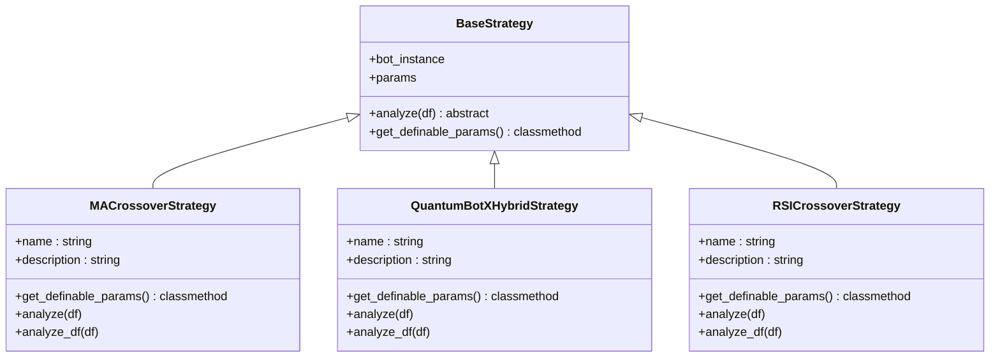
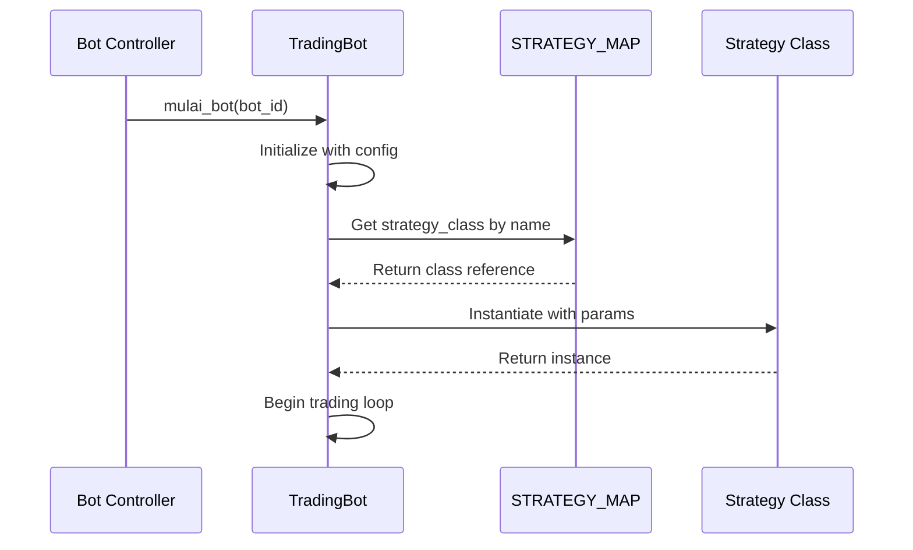
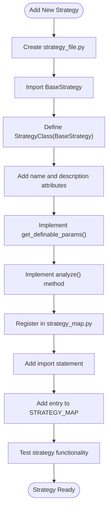

# Strategy Registration and Discovery

<cite>
**Referenced Files in This Document**   
- [strategy_map.py](file://core/strategies/strategy_map.py)
- [trading_bot.py](file://core/bots/trading_bot.py)
- [controller.py](file://core/bots/controller.py)
- [api_bots.py](file://core/routes/api_bots.py)
- [base_strategy.py](file://core/strategies/base_strategy.py)
- [quantumbotx_hybrid.py](file://core/strategies/quantumbotx_hybrid.py)
- [ma_crossover.py](file://core/strategies/ma_crossover.py)
- [rsi_crossover.py](file://core/strategies/rsi_crossover.py)
</cite>

## Table of Contents
1. [Introduction](#introduction)
2. [Strategy Map Structure](#strategy-map-structure)
3. [Dynamic Strategy Instantiation](#dynamic-strategy-instantiation)
4. [Strategy Registration Process](#strategy-registration-process)
5. [Extensibility and Best Practices](#extensibility-and-best-practices)
6. [Potential Issues and Troubleshooting](#potential-issues-and-troubleshooting)
7. [Architecture Overview](#architecture-overview)
8. [Conclusion](#conclusion)

## Introduction
The strategy registration mechanism in QuantumBotX enables dynamic selection and instantiation of trading strategies through a centralized mapping system. This document details the implementation of the STRATEGY_MAP dictionary in core/strategies/strategy_map.py, which serves as the core registry for all available trading strategies. The system allows for configuration-driven bot creation via API or UI inputs, where string identifiers are mapped to concrete strategy class references. This design supports a flexible, extensible architecture that decouples strategy implementation from bot orchestration, enabling easy addition of new strategies without modifying core bot logic.

## Strategy Map Structure

The STRATEGY_MAP dictionary provides a centralized registry that maps string identifiers to strategy class references. This structure enables runtime strategy selection based on configuration inputs.



**Diagram sources**
- [base_strategy.py](file://core/strategies/base_strategy.py#L1-L28)
- [ma_crossover.py](file://core/strategies/ma_crossover.py#L1-L60)
- [quantumbotx_hybrid.py](file://core/strategies/quantumbotx_hybrid.py#L1-L113)
- [rsi_crossover.py](file://core/strategies/rsi_crossover.py#L1-L84)

**Section sources**
- [strategy_map.py](file://core/strategies/strategy_map.py#L1-L29)

The STRATEGY_MAP is defined in core/strategies/strategy_map.py and contains entries that map uppercase string keys to imported strategy classes:

```python
STRATEGY_MAP = {
    'MA_CROSSOVER': MACrossoverStrategy,
    'QUANTUMBOTX_HYBRID': QuantumBotXHybridStrategy,
    'QUANTUMBOTX_CRYPTO': QuantumBotXCryptoStrategy,
    'RSI_CROSSOVER': RSICrossoverStrategy,
    'BOLLINGER_REVERSION': BollingerBandsStrategy,
    'BOLLINGER_SQUEEZE': BollingerSqueezeStrategy,
    'MERCY_EDGE': MercyEdgeStrategy,
    'quantum_velocity': QuantumVelocityStrategy,
    'PULSE_SYNC': PulseSyncStrategy,
    'TURTLE_BREAKOUT': TurtleBreakoutStrategy,
    'ICHIMOKU_CLOUD': IchimokuCloudStrategy,
    'DYNAMIC_BREAKOUT': DynamicBreakoutStrategy,
}
```

Each key represents a unique identifier for a strategy that can be used in configuration files, API requests, or database records. The values are direct references to strategy classes imported from their respective modules. Note the case sensitivity in the keys, with most using uppercase convention except for 'quantum_velocity' which uses lowercase, indicating a potential inconsistency in naming convention.

## Dynamic Strategy Instantiation

The trading bot system uses the STRATEGY_MAP to dynamically instantiate strategy classes at runtime based on configuration. This process occurs in the TradingBot class initialization.



**Diagram sources**
- [controller.py](file://core/bots/controller.py#L1-L176)
- [trading_bot.py](file://core/bots/trading_bot.py#L1-L169)

**Section sources**
- [trading_bot.py](file://core/bots/trading_bot.py#L1-L169)

The TradingBot class in core/bots/trading_bot.py uses the STRATEGY_MAP to instantiate the appropriate strategy:

```python
from core.strategies.strategy_map import STRATEGY_MAP

class TradingBot(threading.Thread):
    def run(self):
        # ... initialization code ...
        
        try:
            strategy_class = STRATEGY_MAP.get(self.strategy_name)
            if not strategy_class:
                raise ValueError(f"Strategy '{self.strategy_name}' not found.")
                
            self.strategy_instance = strategy_class(bot_instance=self, params=self.strategy_params)
            
        except Exception as e:
            self.log_activity('ERROR', f"Initialization Failed: {e}")
            self.status = 'Error'
            return
```

When a bot is started, the controller retrieves the bot's configuration from the database, including the strategy name. This name is used as a key to look up the corresponding class in STRATEGY_MAP. If found, the class is instantiated with the bot instance and strategy parameters. This pattern enables configuration-driven bot creation where the specific strategy implementation is determined at runtime rather than compile time.

## Strategy Registration Process

New strategies are registered by importing their classes and adding entries to the STRATEGY_MAP dictionary. Each strategy must follow a specific implementation pattern to ensure compatibility with the system.

**Section sources**
- [strategy_map.py](file://core/strategies/strategy_map.py#L1-L29)
- [base_strategy.py](file://core/strategies/base_strategy.py#L1-L28)

The registration process involves several key components:

1. **Base Class Inheritance**: All strategies inherit from BaseStrategy, which defines the contract that all strategies must follow:
```python
class BaseStrategy(ABC):
    def __init__(self, bot_instance, params: dict = {}):
        self.bot = bot_instance
        self.params = params

    @abstractmethod
    def analyze(self, df):
        raise NotImplementedError("Each strategy must implement `analyze(df)`.")
        
    @classmethod
    def get_definable_params(cls):
        return []
```

2. **Class Attributes**: Concrete strategy classes define metadata attributes:
```python
class QuantumBotXHybridStrategy(BaseStrategy):
    name = 'QuantumBotX Hybrid'
    description = 'Exclusive strategy combining multiple indicators for optimal performance...'
```

3. **Parameter Definition**: Strategies define configurable parameters through the get_definable_params class method:
```python
@classmethod
def get_definable_params(cls):
    return [
        {"name": "adx_period", "label": "ADX Period", "type": "number", "default": 14},
        {"name": "ma_fast_period", "label": "Fast MA Period", "type": "number", "default": 20},
        # ... more parameters
    ]
```

4. **Analysis Implementation**: Strategies implement the analyze method for live trading and analyze_df for backtesting:
```python
def analyze(self, df):
    """Method for LIVE TRADING."""
    # Implementation logic
    return {"signal": signal, "price": price, "explanation": explanation}
```

The STRATEGY_MAP file imports each strategy class and maps it to a string identifier. This centralized registration approach ensures that all strategies are discoverable through a single interface.

## Extensibility and Best Practices

The strategy registration system is designed to be extensible, allowing new strategies to be added without modifying existing code. This section outlines the patterns and best practices for extending the system.



**Diagram sources**
- [strategy_map.py](file://core/strategies/strategy_map.py#L1-L29)
- [ma_crossover.py](file://core/strategies/ma_crossover.py#L1-L60)

**Section sources**
- [strategy_map.py](file://core/strategies/strategy_map.py#L1-L29)
- [ma_crossover.py](file://core/strategies/ma_crossover.py#L1-L60)

To add a new strategy, follow these steps:

1. **Create a new Python file** in the core/strategies directory with a descriptive name (e.g., my_new_strategy.py).

2. **Implement the strategy class** by inheriting from BaseStrategy:
```python
from .base_strategy import BaseStrategy

class MyNewStrategy(BaseStrategy):
    name = 'My New Strategy'
    description = 'Description of the strategy purpose and logic.'
    
    @classmethod
    def get_definable_params(cls):
        return [
            {"name": "param1", "label": "Parameter 1", "type": "number", "default": 10},
            # Define user-configurable parameters
        ]
    
    def analyze(self, df):
        # Implement trading logic
        return {"signal": "BUY", "price": price, "explanation": "Signal explanation"}
```

3. **Register the strategy** in core/strategies/strategy_map.py:
```python
from .my_new_strategy import MyNewStrategy

STRATEGY_MAP = {
    # ... existing entries ...
    'MY_NEW_STRATEGY': MyNewStrategy,
}
```

Best practices for maintaining the strategy map include:
- Use consistent naming conventions for strategy keys (prefer uppercase with underscores)
- Keep the STRATEGY_MAP dictionary sorted alphabetically
- Document each strategy with clear name and description attributes
- Implement comprehensive parameter validation in the analyze method
- Include both live trading (analyze) and backtesting (analyze_df) implementations

## Potential Issues and Troubleshooting

Several potential issues can arise with the strategy registration system, primarily related to configuration errors, missing registrations, and import problems.

**Section sources**
- [strategy_map.py](file://core/strategies/strategy_map.py#L1-L29)
- [trading_bot.py](file://core/bots/trading_bot.py#L1-L169)
- [controller.py](file://core/bots/controller.py#L1-L176)

### Common Issues:

1. **Strategy Not Found**: When STRATEGY_MAP.get() returns None, typically due to:
   - Case mismatch between configuration and STRATEGY_MAP key
   - Missing import statement in strategy_map.py
   - Typo in the strategy name

2. **Circular Imports**: Risk when strategies import components that depend on the strategy system. Mitigation:
   - Use lazy imports within methods when possible
   - Structure imports to avoid circular dependencies
   - Keep strategy implementations focused on trading logic

3. **Missing Registration**: Strategy class exists but isn't in STRATEGY_MAP, causing runtime errors when attempting to use it.

4. **Parameter Mismatch**: Configuration includes parameters not defined in get_definable_params(), leading to unexpected behavior.

### Troubleshooting Guide:

1. **Verify Strategy Registration**:
   - Check that the strategy class is imported in strategy_map.py
   - Confirm the key in STRATEGY_MAP matches the expected configuration value
   - Ensure case sensitivity is correct

2. **Debug Initialization Errors**:
   - Check logs for "Strategy 'X' not found" messages
   - Verify the strategy appears in the /api/strategies endpoint response
   - Test strategy instantiation in isolation

3. **Validate Configuration**:
   - Ensure strategy names in database records match STRATEGY_MAP keys
   - Verify parameter names in strategy_params JSON match those in get_definable_params()

The API endpoints provide diagnostic capabilities:
- GET /api/strategies: Lists all registered strategies
- GET /api/strategies/{strategy_id}/params: Returns configurable parameters for a strategy

## Architecture Overview

The strategy registration system integrates with the broader QuantumBotX architecture through well-defined interfaces and data flows.

```mermaid
graph TB
subgraph "Frontend"
UI[User Interface]
JS[JavaScript]
end
subgraph "API Layer"
API[REST API]
end
subgraph "Core System"
Controller[Bot Controller]
Bot[Trading Bot]
StrategyMap[STRATEGY_MAP]
Strategies[Strategy Classes]
end
UI --> JS --> API --> Controller
Controller --> Bot --> StrategyMap
StrategyMap --> Strategies
Strategies --> Bot
Bot --> Controller
API --> |GET /api/strategies| StrategyMap
API --> |GET /api/strategies/{id}/params| Strategies
```

**Diagram sources**
- [api_bots.py](file://core/routes/api_bots.py#L1-L167)
- [controller.py](file://core/bots/controller.py#L1-L176)
- [strategy_map.py](file://core/strategies/strategy_map.py#L1-L29)

The architecture follows a layered pattern where:
1. The frontend (UI) requests available strategies via API
2. The API routes query the STRATEGY_MAP and strategy classes
3. Users configure bots with specific strategy names
4. The bot controller uses these names to instantiate strategies via STRATEGY_MAP
5. Trading bots execute strategy analysis in their main loop

This design enables a clean separation of concerns where strategy implementation is decoupled from bot orchestration and user interface concerns.

## Conclusion
The strategy registration mechanism in QuantumBotX provides a flexible, extensible system for managing trading strategies. By using the STRATEGY_MAP dictionary to map string identifiers to class references, the system enables dynamic instantiation of strategies based on configuration. This approach supports both API-driven and UI-driven bot creation, allowing users to select strategies from a predefined list. The architecture promotes code reuse and maintainability by establishing a clear contract through the BaseStrategy class while allowing individual strategies to implement specialized trading logic. With proper adherence to naming conventions and registration patterns, developers can easily extend the system with new strategies, making it a robust foundation for a growing trading bot platform.