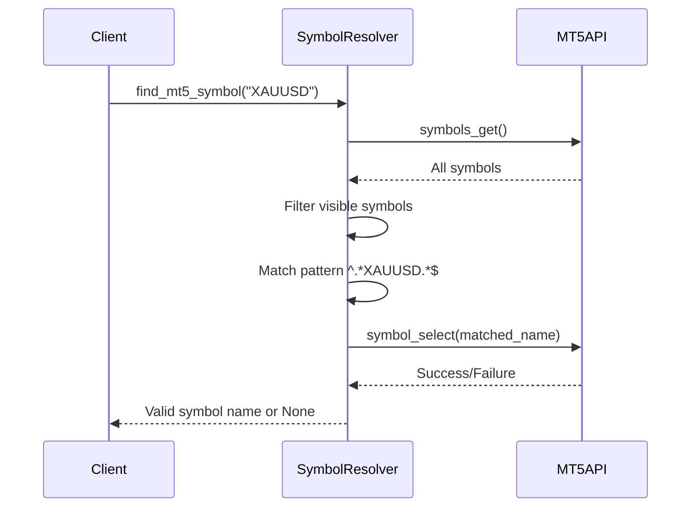

# Utility Functions and Cross-Cutting Concerns

<cite>
**Referenced Files in This Document**   
- [validation.py](file://core/utils/validation.py)
- [logger.py](file://core/utils/logger.py)
- [symbols.py](file://core/utils/symbols.py)
- [mt5.py](file://core/utils/mt5.py)
- [helpers.py](file://core/helpers.py)
</cite>

## Table of Contents
1. [Introduction](#introduction)
2. [Validation Layer: Ensuring Data Integrity](#validation-layer-ensuring-data-integrity)
3. [Logging Framework: Debugging and Monitoring](#logging-framework-debugging-and-monitoring)
4. [Symbol Management: Instrument Filtering and Discovery](#symbol-management-instrument-filtering-and-discovery)
5. [MT5 Integration Helpers: Trading Operations Abstraction](#mt5-integration-helpers-trading-operations-abstraction)
6. [Shared Utilities: Cross-Module Functionality](#shared-utilities-cross-module-functionality)
7. [Performance Implications and Optimization](#performance-implications-and-optimization)

## Introduction
The QuantumBotX platform relies on a robust set of utility functions to ensure data integrity, enable debugging, manage tradable instruments, and interface with the MetaTrader 5 (MT5) trading environment. These utilities form a foundational layer that supports core trading logic, API interactions, and strategy execution. This document provides a comprehensive analysis of the key utility modules: `validation.py`, `logger.py`, `symbols.py`, `mt5.py`, and `helpers.py`. Each component is examined for its functionality, integration points, and performance characteristics, with practical examples and optimization recommendations.

## Validation Layer: Ensuring Data Integrity

The `validation.py` module implements a critical data integrity mechanism for the QuantumBotX system. It ensures that user inputs—particularly those related to bot configuration—are sanitized and conform to expected formats before being processed by the trading engine.

The primary function, `validate_bot_params(data)`, performs schema-level validation on incoming bot configuration data. It checks for required fields and validates their types and value constraints:

```python
def validate_bot_params(data):
    required_fields = ['name', 'market', 'lot_size', 'sl_pips', 'tp_pips', 'timeframe', 'check_interval_seconds', 'strategy']
    errors = []

    for field in required_fields:
        if field not in data:
            errors.append(f"Field '{field}' is required.")

    if not isinstance(data.get('lot_size'), (int, float)) or data['lot_size'] <= 0:
        errors.append("Lot size must be a positive number.")

    if not isinstance(data.get('sl_pips'), int) or data['sl_pips'] <= 0:
        errors.append("SL (Stop Loss) must be a positive integer.")

    if not isinstance(data.get('tp_pips'), int) or data['tp_pips'] <= 0:
        errors.append("TP (Take Profit) must be a positive integer.")

    return errors
```

This function returns a list of error messages, enabling comprehensive feedback to users. For example, if a request omits the `strategy` field and provides a negative `lot_size`, both issues are reported simultaneously.

**Example Usage:**
```python
params = {
    "name": "GoldTrader",
    "market": "XAUUSD",
    "lot_size": 0.1,
    "sl_pips": 100,
    "tp_pips": 200,
    "timeframe": "H1",
    "check_interval_seconds": 60,
    "strategy": "quantum_velocity"
}

errors = validate_bot_params(params)
if errors:
    print("Validation failed:", errors)
else:
    print("Configuration is valid")
```

This validation pattern prevents malformed configurations from propagating into the system, reducing runtime errors and enhancing security by rejecting invalid input early.

**Section sources**
- [validation.py](file://core/utils/validation.py#L2-L19)

## Logging Framework: Debugging and Monitoring

The `logger.py` module establishes a centralized logging framework that is essential for monitoring system behavior, diagnosing issues, and auditing trading activities. It configures both file and console logging with a consistent format and configurable log levels.

Key features of the logging setup include:
- **Configurable Log Level**: Controlled via the `LOG_LEVEL` environment variable (default: `INFO`)
- **Dual Output**: Logs are written to both a file (`quantumbotx.log`) and the console
- **Standardized Format**: `[timestamp] [level] message` for easy parsing and readability
- **Non-Propagating Logger**: Prevents log duplication in parent loggers

```python
import logging
import os

LOG_LEVEL = os.getenv("LOG_LEVEL", "INFO").upper()
LOG_FILE = os.getenv("LOG_FILE", "quantumbotx.log")

formatter = logging.Formatter('[%(asctime)s] [%(levelname)s] %(message)s')

file_handler = logging.FileHandler(LOG_FILE)
file_handler.setFormatter(formatter)

console_handler = logging.StreamHandler()
console_handler.setFormatter(formatter)

logger = logging.getLogger("QuantumBotX")
logger.setLevel(getattr(logging, LOG_LEVEL, logging.INFO))
logger.addHandler(file_handler)
logger.addHandler(console_handler)
logger.propagate = False
```

This logger is imported and used across the codebase to preserve context during debugging. For instance, in backtesting workflows, detailed logs track trade entries, exits, risk calculations, and volatility adjustments, enabling precise post-trade analysis.

**Example Log Output:**
```
[2023-10-05 14:22:10] [INFO] Trade closed: BUY | Entry: 1920.45 | Exit: 1935.70 | Lot: 0.1 | Profit: 152.50
[2023-10-05 14:22:10] [WARNING] GOLD EXTREME VOLATILITY: ATR=15.20 > 10.00, lot size reduced to 0.05
```

The use of `exc_info=True` in error logging ensures full stack traces are captured, which is critical for diagnosing exceptions in production environments.

**Section sources**
- [logger.py](file://core/utils/logger.py#L1-L25)
- [backtesting/engine.py](file://core/backtesting/engine.py#L74-L252)

## Symbol Management: Instrument Filtering and Discovery

The `symbols.py` module provides intelligent filtering and discovery of tradable instruments from the MT5 platform. It categorizes financial instruments based on their metadata, enabling the system to dynamically identify stocks and forex pairs.

The module uses two primary filtering strategies:
1. **Stock Detection**: Searches for keywords like `stock`, `share`, `equity`, or `saham` in the symbol's path
2. **Forex Detection**: Matches symbols whose path starts with `forex\`

```python
STOCK_KEYWORDS = ['stock', 'share', 'equity', 'saham']
FOREX_PREFIX = 'forex\\'
```

The `get_stock_symbols(limit=20)` function retrieves all symbols, filters for stocks, and ranks them by daily trading volume (`volumehigh`), returning the most liquid instruments:

```python
def get_stock_symbols(limit=20):
    all_symbols = get_all_symbols_from_mt5()
    stock_details = []

    for s in all_symbols:
        if any(keyword in s.path.lower() for keyword in STOCK_KEYWORDS):
            info = mt5.symbol_info(s.name)
            if info:
                stock_details.append({
                    "name": s.name,
                    "description": s.description,
                    "daily_volume": info.volumehigh
                })

    sorted_stocks = sorted(stock_details, key=lambda x: x.get('daily_volume', 0), reverse=True)
    return sorted_stocks[:limit]
```

Similarly, `get_forex_symbols()` retrieves forex pairs with current pricing data (ask, bid, spread, digits).

This symbol management layer enables the platform to adapt to different broker offerings and maintain a dynamic watchlist of high-liquidity instruments.

**Section sources**
- [symbols.py](file://core/utils/symbols.py#L1-L85)

## MT5 Integration Helpers: Trading Operations Abstraction

The `mt5.py` module encapsulates all interactions with the MetaTrader 5 API, providing a clean, high-level interface for trading operations and data retrieval. It abstracts away low-level MT5 API complexities and includes robust error handling.

Key functions include:
- `initialize_mt5()`: Establishes connection to MT5 with login credentials
- `get_rates_mt5()`: Retrieves historical price data as a pandas DataFrame
- `get_open_positions_mt5()`: Fetches active trades
- `get_trade_history_mt5()`: Retrieves closed deals
- `get_todays_profit_mt5()`: Calculates daily profit
- `find_mt5_symbol()`: Resolves symbol naming variations (e.g., XAUUSD vs XAUUSD.pro)

The `find_mt5_symbol()` function is particularly important for handling broker-specific symbol naming conventions. It uses regex pattern matching to find valid, visible symbols that match a base name, ensuring compatibility across different MT5 brokers.



**Diagram sources**
- [mt5.py](file://core/utils/mt5.py#L100-L144)

**Section sources**
- [mt5.py](file://core/utils/mt5.py#L1-L144)

## Shared Utilities: Cross-Module Functionality

The `helpers.py` module in the core directory provides essential utility functions that are shared across multiple components of the application. These functions handle common tasks such as decimal parsing, MT5 initialization, and trade execution.

Notable functions include:
- `parse_decimal(val)`: Converts string or numeric input to float, handling comma decimal separators
- `initialize_mt5(account, password, server)`: Initializes and logs into MT5
- `place_trade()`: Executes a market order with configurable SL/TP
- `close_trade(position)`: Closes an open position

The `place_trade()` function constructs a comprehensive MT5 order request with proper price calculation, stop loss, take profit, and filling modes. It handles both buy and sell orders and provides clear feedback on order success or failure.

These helpers reduce code duplication and ensure consistent behavior across different trading strategies and bot instances.

**Section sources**
- [helpers.py](file://core/helpers.py#L1-L68)

## Performance Implications and Optimization

While the utility functions provide essential functionality, their use in high-frequency trading loops can introduce performance bottlenecks. Key considerations include:

1. **MT5 API Calls**: Functions like `get_rates_mt5()` and `get_open_positions_mt5()` involve network calls and should be rate-limited or cached in high-frequency contexts.
2. **Symbol Discovery**: `get_all_symbols_from_mt5()` retrieves all symbols on every call; consider caching the result with a TTL.
3. **Logging Overhead**: Excessive `INFO` or `DEBUG` logging in tight loops can degrade performance; use conditional logging or sampling in production.
4. **Validation Frequency**: Validate user inputs once at ingestion, not repeatedly during strategy execution.

**Optimization Recommendations:**
- Implement in-memory caching for symbol lists and historical data
- Use asynchronous logging to prevent I/O blocking
- Batch MT5 API calls where possible
- Pre-validate and sanitize strategy parameters at initialization
- Profile critical paths using Python's `cProfile` to identify bottlenecks

By following these practices, the utility layer can maintain its robustness while minimizing impact on trading performance.