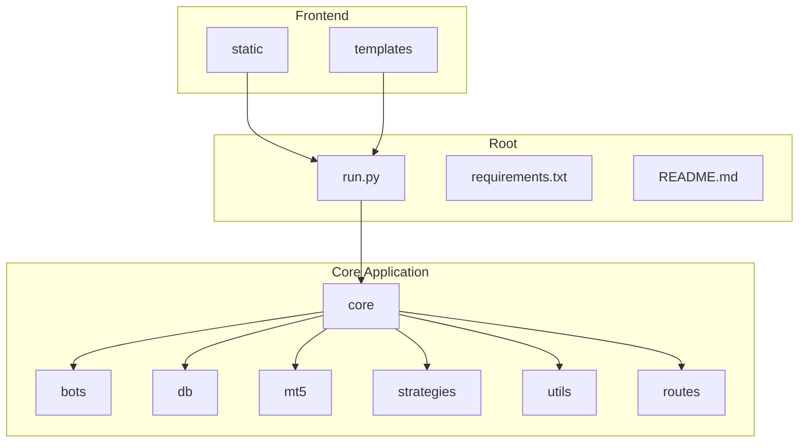
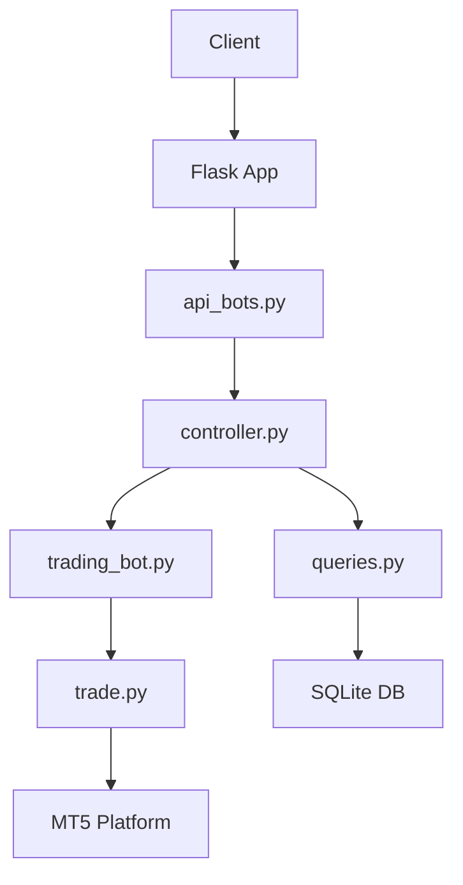
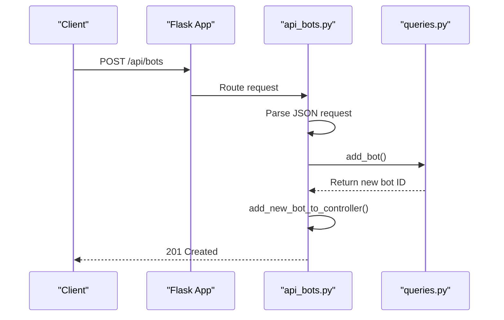
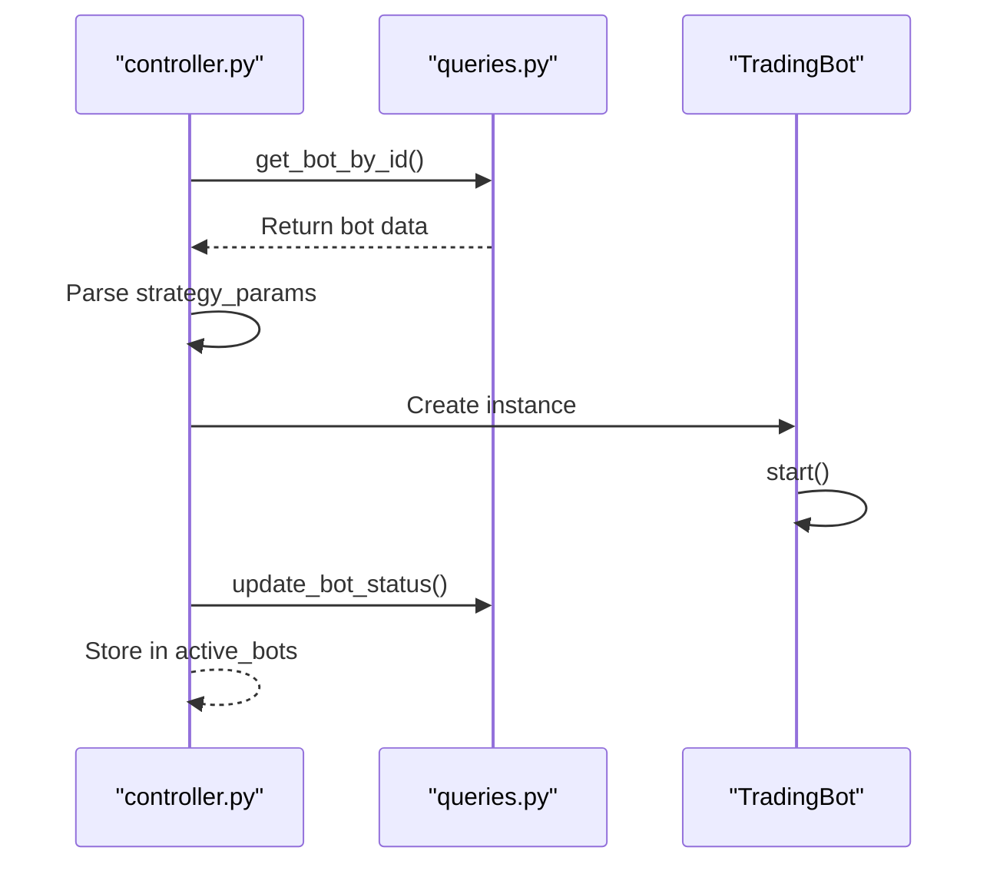
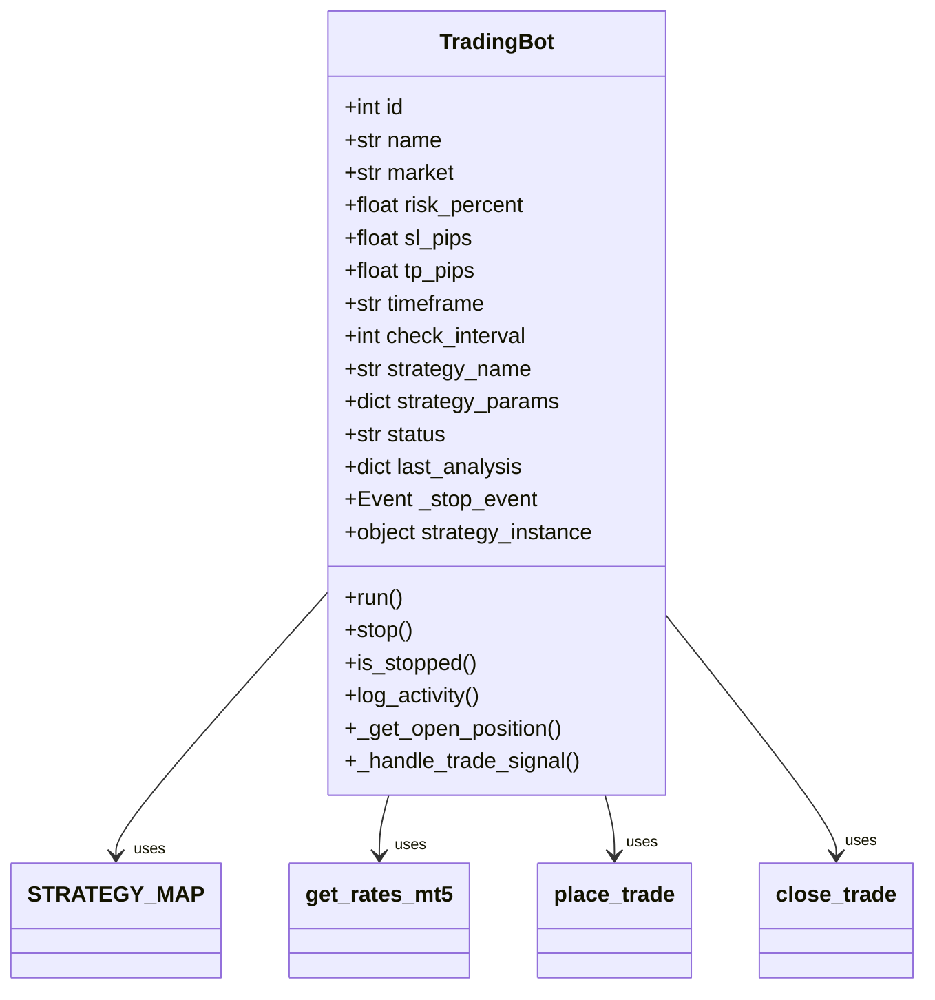
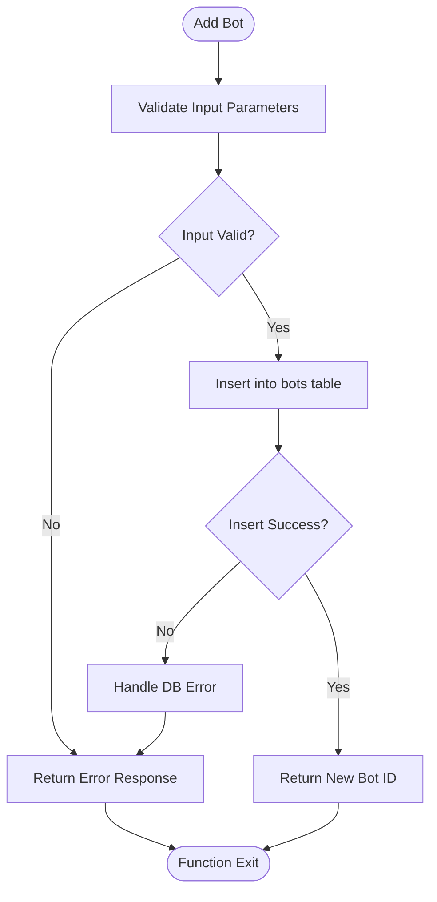
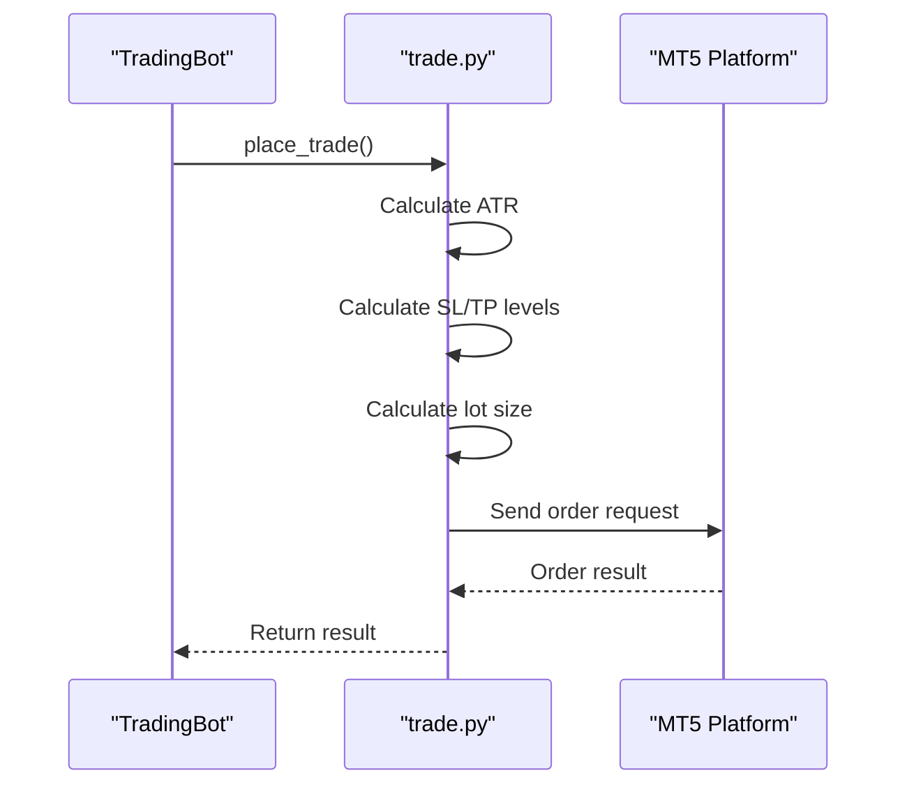
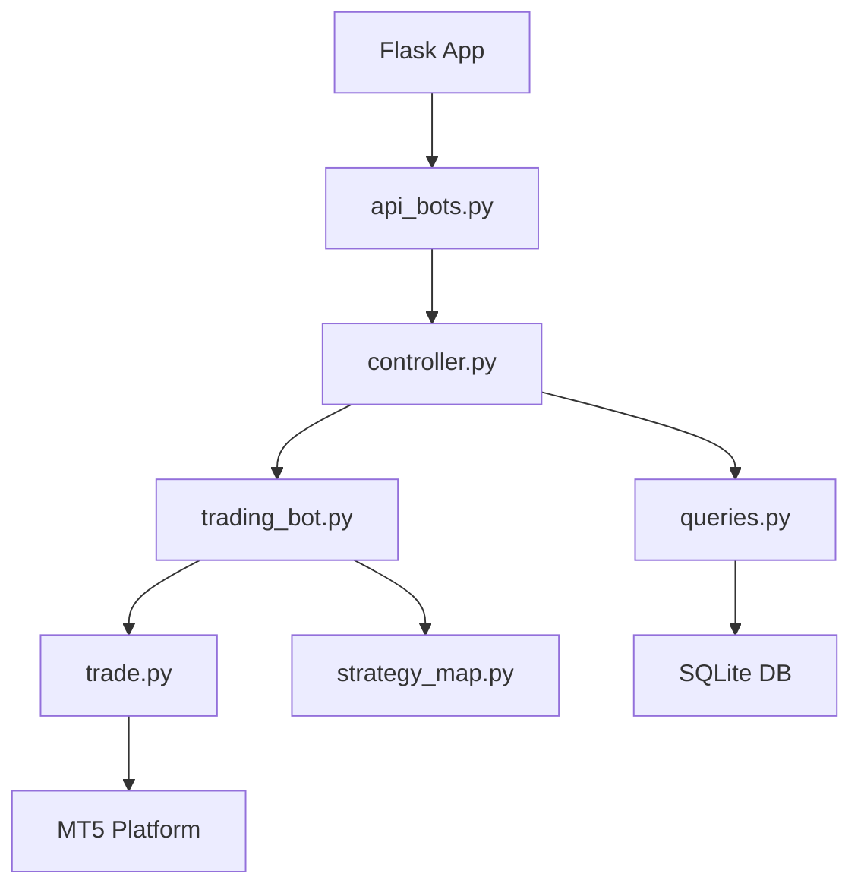

# Request-Response Data Flow

<cite>
**Referenced Files in This Document**   
- [api_bots.py](file://core/routes/api_bots.py)
- [controller.py](file://core/bots/controller.py)
- [trading_bot.py](file://core/bots/trading_bot.py)
- [queries.py](file://core/db/queries.py)
- [trade.py](file://core/mt5/trade.py)
- [run.py](file://run.py)
- [__init__.py](file://core/__init__.py)
</cite>

## Table of Contents
1. [Introduction](#introduction)
2. [Project Structure](#project-structure)
3. [Core Components](#core-components)
4. [Architecture Overview](#architecture-overview)
5. [Detailed Component Analysis](#detailed-component-analysis)
6. [Dependency Analysis](#dependency-analysis)
7. [Performance Considerations](#performance-considerations)
8. [Troubleshooting Guide](#troubleshooting-guide)
9. [Conclusion](#conclusion)

## Introduction
This document provides a comprehensive analysis of the end-to-end data flow in the quantumbotx application, focusing on the lifecycle of an HTTP request to create a trading bot via the `POST /api/bots` endpoint. The analysis traces the request through Flask routing, blueprint handling, controller invocation, database operations, and final execution on the MetaTrader 5 (MT5) platform. The goal is to provide a clear, accessible understanding of the system's architecture, data transformations, error handling, and integration points for both technical and non-technical users.

## Project Structure
The quantumbotx project is organized into a modular structure, with components grouped by functionality. The core application logic resides in the `core` directory, which contains subdirectories for bots, database operations, MT5 integration, strategies, and utilities. API routes are defined in the `core/routes` directory as Flask blueprints. Static assets and templates are stored in separate directories for frontend resources.

**Diagram sources**
- [run.py](file://run.py#L1-L52)
- [__init__.py](file://core/__init__.py#L1-L138)

**Section sources**
- [run.py](file://run.py#L1-L52)
- [__init__.py](file://core/__init__.py#L1-L138)

## Core Components
The core components of the quantumbotx application include the Flask web server, the bot controller, the TradingBot class, database query functions, and the MT5 trade execution module. These components work together to handle HTTP requests, manage bot lifecycle, execute trading strategies, and interact with the MT5 platform.

**Section sources**
- [api_bots.py](file://core/routes/api_bots.py#L1-L168)
- [controller.py](file://core/bots/controller.py#L1-L177)
- [trading_bot.py](file://core/bots/trading_bot.py#L1-L170)
- [queries.py](file://core/db/queries.py#L1-L175)
- [trade.py](file://core/mt5/trade.py#L1-L153)

## Architecture Overview
The quantumbotx application follows a layered architecture with clear separation of concerns. The Flask web server handles HTTP requests and routes them to the appropriate blueprint. The bot controller manages the lifecycle of trading bots, while the TradingBot class encapsulates the logic for executing trading strategies. Database operations are abstracted through query functions, and MT5 interactions are handled by dedicated trade functions.

**Diagram sources**
- [api_bots.py](file://core/routes/api_bots.py#L1-L168)
- [controller.py](file://core/bots/controller.py#L1-L177)
- [trading_bot.py](file://core/bots/trading_bot.py#L1-L170)
- [queries.py](file://core/db/queries.py#L1-L175)
- [trade.py](file://core/mt5/trade.py#L1-L153)

## Detailed Component Analysis

### API Routing and Blueprint Handling
The `api_bots.py` file defines a Flask blueprint that handles all bot-related API endpoints. The `POST /api/bots` endpoint is responsible for creating a new trading bot. When a request is received, the endpoint extracts JSON data from the request body, converts strategy parameters to a JSON string, and calls the `add_bot` function from the `queries.py` module.

**Diagram sources**
- [api_bots.py](file://core/routes/api_bots.py#L58-L90)

**Section sources**
- [api_bots.py](file://core/routes/api_bots.py#L58-L90)

### Controller Function Invocation
The `controller.py` file contains the `add_new_bot_to_controller` function, which is called after a new bot is added to the database. This function retrieves the bot's configuration from the database and starts the bot if its status is 'Aktif'. The `mulai_bot` function creates a new `TradingBot` instance, starts it as a thread, and stores it in the `active_bots` dictionary.

**Diagram sources**
- [controller.py](file://core/bots/controller.py#L1-L177)

**Section sources**
- [controller.py](file://core/bots/controller.py#L1-L177)

### TradingBot Class Interaction
The `TradingBot` class, defined in `trading_bot.py`, is a threaded class that executes trading strategies. When started, it connects to the MT5 platform, retrieves market data, and runs the strategy in a loop. The bot checks for trading signals at regular intervals and executes trades based on the strategy's output.

**Diagram sources**
- [trading_bot.py](file://core/bots/trading_bot.py#L13-L168)

**Section sources**
- [trading_bot.py](file://core/bots/trading_bot.py#L13-L168)

### Database Operations
The `queries.py` file contains functions for interacting with the SQLite database. The `add_bot` function inserts a new bot record into the `bots` table, while the `update_bot` and `delete_bot` functions modify or remove existing records. The `get_all_bots` and `get_bot_by_id` functions retrieve bot data for display in the UI.

**Diagram sources**
- [queries.py](file://core/db/queries.py#L1-L175)

**Section sources**
- [queries.py](file://core/db/queries.py#L1-L175)

### MT5 Platform Execution
The `trade.py` file contains functions for executing trades on the MT5 platform. The `place_trade` function calculates dynamic stop-loss and take-profit levels based on the Average True Range (ATR) indicator, computes the appropriate lot size based on risk percentage, and sends a trade order to MT5. The `close_trade` function closes an existing position.

**Diagram sources**
- [trade.py](file://core/mt5/trade.py#L72-L128)

**Section sources**
- [trade.py](file://core/mt5/trade.py#L72-L128)

## Dependency Analysis
The quantumbotx application has a clear dependency hierarchy, with higher-level components depending on lower-level utilities. The Flask app depends on the `api_bots.py` blueprint, which in turn depends on the `controller.py` module. The controller depends on both the `trading_bot.py` class and the `queries.py` database functions. The `TradingBot` class depends on the MT5 trade functions and strategy classes.

**Diagram sources**
- [api_bots.py](file://core/routes/api_bots.py#L1-L168)
- [controller.py](file://core/bots/controller.py#L1-L177)
- [trading_bot.py](file://core/bots/trading_bot.py#L1-L170)
- [queries.py](file://core/db/queries.py#L1-L175)
- [trade.py](file://core/mt5/trade.py#L1-L153)

**Section sources**
- [api_bots.py](file://core/routes/api_bots.py#L1-L168)
- [controller.py](file://core/bots/controller.py#L1-L177)
- [trading_bot.py](file://core/bots/trading_bot.py#L1-L170)
- [queries.py](file://core/db/queries.py#L1-L175)
- [trade.py](file://core/mt5/trade.py#L1-L153)

## Performance Considerations
The quantumbotx application is designed to handle multiple trading bots concurrently using Python threads. Each bot runs in its own thread, allowing for independent execution of trading strategies. The application uses efficient database queries and caching to minimize latency. The MT5 platform connection is initialized once at startup, reducing overhead for trade execution.

## Troubleshooting Guide
Common issues in the quantumbotx application include database connection errors, MT5 platform connectivity problems, and strategy execution failures. Error handling is implemented at each layer, with detailed logging to aid in debugging. The application logs all activities, including bot starts, stops, and trade executions, to both a file and the database.

**Section sources**
- [controller.py](file://core/bots/controller.py#L1-L177)
- [trading_bot.py](file://core/bots/trading_bot.py#L1-L170)
- [trade.py](file://core/mt5/trade.py#L1-L153)

## Conclusion
The quantumbotx application provides a robust framework for creating and managing automated trading bots. The end-to-end data flow from HTTP request to MT5 trade execution is well-structured and modular, with clear separation of concerns. The use of Flask blueprints, threaded bot execution, and dynamic trade calculation enables a scalable and maintainable system for algorithmic trading.