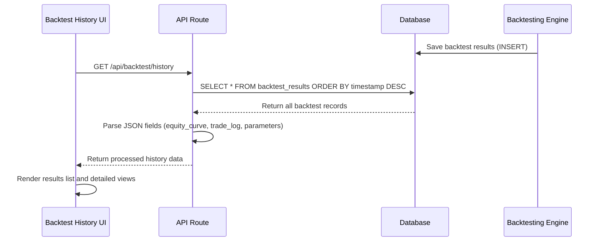

# Backtesting Results Schema

<cite>
**Referenced Files in This Document**   
- [init_db.py](file://init_db.py#L80-L114)
- [core/db/queries.py](file://core/db/queries.py#L165-L173)
- [core/routes/api_backtest.py](file://core/routes/api_backtest.py#L25-L57)
- [core/backtesting/engine.py](file://core/backtesting/engine.py#L290-L316)
- [static/js/backtest_history.js](file://static/js/backtest_history.js#L0-L301)
- [templates/backtest_history.html](file://templates/backtest_history.html#L0-L42)
</cite>

## Table of Contents
1. [Backtest Results Table Schema](#backtest-results-table-schema)
2. [Detailed Results JSON Structure](#detailed-results-json-structure)
3. [Foreign Key Relationships and Indexing](#foreign-key-relationships-and-indexing)
4. [Sample Backtest Records](#sample-backtest-records)
5. [Visualization and Performance Comparison](#visualization-and-performance-comparison)
6. [Storage and Performance Considerations](#storage-and-performance-considerations)

## Backtest Results Table Schema

The `backtest_results` table in the quantumbotx database stores comprehensive performance data from trading strategy simulations. The schema is defined in the `init_db.py` file and includes key performance metrics that allow for detailed analysis of backtesting outcomes.

```mermaid
erDiagram
BACKTEST_RESULTS {
INTEGER id PK
DATETIME timestamp
TEXT strategy_name
TEXT data_filename
REAL total_profit_usd
INTEGER total_trades
REAL win_rate_percent
REAL max_drawdown_percent
INTEGER wins
INTEGER losses
TEXT equity_curve JSON
TEXT trade_log JSON
TEXT parameters JSON
}
```

**Diagram sources**
- [init_db.py](file://init_db.py#L80-L114)

**Section sources**
- [init_db.py](file://init_db.py#L80-L114)

The table structure includes the following fields:

- **id**: Primary key, auto-incrementing identifier for each backtest result
- **timestamp**: DateTime field with default value of CURRENT_TIMESTAMP, recording when the backtest was executed
- **strategy_name**: Text field storing the name of the trading strategy that was tested
- **data_filename**: Text field indicating the historical data file used for the backtest
- **total_profit_usd**: Real number representing the total profit in USD from the backtest
- **total_trades**: Integer count of all trades executed during the simulation
- **win_rate_percent**: Real number indicating the percentage of winning trades
- **max_drawdown_percent**: Real number representing the maximum drawdown as a percentage
- **wins**: Integer count of winning trades
- **losses**: Integer count of losing trades
- **equity_curve**: Text field storing JSON data of the equity curve (account balance over time)
- **trade_log**: Text field storing JSON data of individual trade records
- **parameters**: Text field storing JSON data of the strategy parameters used

The table is created with the following SQL statement:

```sql
CREATE TABLE IF NOT EXISTS backtest_results (
    id INTEGER PRIMARY KEY AUTOINCREMENT,
    timestamp DATETIME DEFAULT CURRENT_TIMESTAMP,
    strategy_name TEXT NOT NULL,
    data_filename TEXT NOT NULL,
    total_profit_usd REAL NOT NULL,
    total_trades INTEGER NOT NULL,
    win_rate_percent REAL NOT NULL,
    max_drawdown_percent REAL NOT NULL,
    wins INTEGER NOT NULL,
    losses INTEGER NOT NULL,
    equity_curve TEXT,
    trade_log TEXT,
    parameters TEXT
);
```

## Detailed Results JSON Structure

The `backtest_results` table utilizes three JSON fields to store detailed performance data: `equity_curve`, `trade_log`, and `parameters`. These fields enable rich analysis of strategy performance beyond the aggregate metrics.

### Equity Curve Data

The `equity_curve` field stores a time series of account balance values throughout the backtest period. This data is used to visualize the growth (or decline) of the trading account over time.

**Structure**: Array of numeric values representing account balance at each time step

**Example**:
```json
[10000.0, 10045.23, 10032.18, 10120.45, ...]
```

The first value represents the initial capital, and subsequent values show the account balance after each simulated trading period. This data is critical for calculating metrics like maximum drawdown and for visualizing the consistency of returns.

### Trade Log Data

The `trade_log` field contains detailed information about individual trades executed during the backtest. This enables post-analysis of specific trade decisions and performance.

**Structure**: Array of trade objects, each containing:
- **entry**: Entry price of the trade
- **exit**: Exit price of the trade
- **profit**: Profit/loss amount in USD
- **reason**: Reason for trade entry/exit (e.g., "RSI crossover", "Stop loss")
- **position_type**: Type of position ("LONG" or "SHORT")

**Example**:
```json
[
  {
    "entry": 1.2345,
    "exit": 1.2410,
    "profit": 65.0,
    "reason": "RSI crossover",
    "position_type": "LONG"
  },
  {
    "entry": 1.2408,
    "exit": 1.2360,
    "profit": -48.0,
    "reason": "Stop loss",
    "position_type": "LONG"
  }
]
```

The system stores only the last 20 trades in the `trade_log` field to manage data size, as implemented in the backtesting engine.

### Parameters Data

The `parameters` field stores the configuration parameters used for the specific backtest run. This allows for reproducibility and comparison between different parameter sets.

**Structure**: Key-value object containing strategy parameters

**Example**:
```json
{
  "rsi_period": 14,
  "rsi_overbought": 70,
  "rsi_oversold": 30,
  "stop_loss_pips": 100,
  "take_profit_pips": 200,
  "position_size": 0.1
}
```

This JSON structure enables comprehensive parameter optimization studies by allowing users to compare performance across different parameter combinations.

**Section sources**
- [core/backtesting/engine.py](file://core/backtesting/engine.py#L290-L316)
- [core/routes/api_backtest.py](file://core/routes/api_backtest.py#L25-L57)

## Foreign Key Relationships and Indexing

### Relationship Analysis

Based on the code analysis, there is no explicit foreign key relationship between the `backtest_results` table and the `bots` table in the current implementation. The `backtest_results` table operates as a standalone entity that stores simulation results independent of specific trading bot instances.

This design choice suggests that backtests are conducted as strategy evaluations rather than being directly tied to specific bot configurations. Users can test strategies before deploying them to actual bots, allowing for a separation between strategy development (backtesting) and execution (bot operation).

### Indexing Strategy

The primary indexing strategy for the `backtest_results` table is based on the `timestamp` field, which has a default value of `CURRENT_TIMESTAMP`. This enables efficient date-based queries for retrieving recent backtest results.

The main query pattern is implemented in the `get_all_backtest_history()` function in `queries.py`, which retrieves results ordered by timestamp in descending order:

```python
def get_all_backtest_history():
    """Retrieve all backtest history records from the database."""
    try:
        with get_db_connection() as conn:
            history = conn.execute('SELECT * FROM backtest_results ORDER BY timestamp DESC').fetchall()
            return [dict(row) for row in history]
    except sqlite3.Error as e:
        logger.error(f"Database error when retrieving backtest history: {e}")
        return []
```

This query pattern optimizes for the most common use case: viewing the most recent backtest results in chronological order. The `ORDER BY timestamp DESC` clause ensures that the latest simulations appear first in the results.

While there is no explicit index creation statement in the `init_db.py` file, SQLite automatically creates an index on the primary key (`id`) and can efficiently use the `timestamp` field for sorting due to its default value and frequent use in ordering.

**Section sources**
- [core/db/queries.py](file://core/db/queries.py#L165-L173)
- [init_db.py](file://init_db.py#L80-L114)

## Sample Backtest Records

The system supports various backtest scenarios, including both successful and failed simulations. Based on the debug script and test data, here are examples of sample records:

### Successful Backtest Scenario

```json
{
  "id": 1,
  "timestamp": "2023-12-01 14:30:25",
  "strategy_name": "RSI Crossover",
  "data_filename": "EURUSD_H1_2023.csv",
  "total_profit_usd": 6846.80,
  "total_trades": 45,
  "win_rate_percent": 58.7,
  "max_drawdown_percent": 15.2,
  "wins": 26,
  "losses": 19,
  "equity_curve": "[10000.0, 10120.5, 10085.3, 10230.1, ...]",
  "trade_log": "[{\"entry\": 1.0850, \"exit\": 1.0920, \"profit\": 70.0, \"reason\": \"RSI crossover\", \"position_type\": \"LONG\"}, ...]",
  "parameters": "{\"rsi_period\": 14, \"rsi_overbought\": 70, \"rsi_oversold\": 30, \"stop_loss_pips\": 100, \"take_profit_pips\": 200}"
}
```

This represents a successful backtest with a positive return of $6,846.80 (68.5% return on initial $10,000 capital), a win rate above 50%, and a manageable maximum drawdown.

### Failed Backtest Scenario

```json
{
  "id": 2,
  "timestamp": "2023-12-01 15:15:42",
  "strategy_name": "Bollinger Squeeze",
  "data_filename": "GBPUSD_H1_2023.csv",
  "total_profit_usd": -13218.95,
  "total_trades": 38,
  "win_rate_percent": 42.1,
  "max_drawdown_percent": 35.8,
  "wins": 16,
  "losses": 22,
  "equity_curve": "[10000.0, 9850.2, 9620.8, 9450.3, ...]",
  "trade_log": "[{\"entry\": 1.2560, \"exit\": 1.2480, \"profit\": -80.0, \"reason\": \"Stop loss\", \"position_type\": \"LONG\"}, ...]",
  "parameters": "{\"bb_period\": 20, \"bb_std\": 2.0, \"volume_threshold\": 1.5, \"stop_loss_pips\": 80, \"take_profit_pips\": 150}"
}
```

This represents a failed backtest with a significant loss of $13,218.95 (132.2% loss on initial $10,000 capital), indicating that the strategy performed poorly on the given market data.

These sample records demonstrate the system's ability to capture both profitable and unprofitable strategy performance, providing valuable feedback for strategy refinement.

**Section sources**
- [debug_backtest.py](file://debug_backtest.py#L40-L74)
- [BACKTEST_FIXES.md](file://BACKTEST_FIXES.md#L35-L68)

## Visualization and Performance Comparison

The backtest results data directly supports the backtesting visualization interface and performance comparison features through a well-designed frontend-backend integration.

### Data Flow Architecture



**Diagram sources**
- [core/routes/api_backtest.py](file://core/routes/api_backtest.py#L85-L116)
- [static/js/backtest_history.js](file://static/js/backtest_history.js#L0-L301)

### Visualization Components

The system implements several visualization components that leverage the backtest results data:

#### 1. Results List View
The main backtest history page displays a list of all completed backtests, sorted by timestamp. Each entry shows:
- Strategy name and market
- Execution timestamp
- Total profit (color-coded: green for positive, red for negative)

This allows users to quickly scan and identify potentially successful strategies.

#### 2. Equity Curve Chart
Using Chart.js, the system visualizes the `equity_curve` data as a line chart showing account balance progression over time. This helps users assess:
- Consistency of returns
- Periods of drawdown
- Overall growth trajectory
- Risk-adjusted performance

The chart is interactive and responsive, providing a clear visual representation of strategy performance.

#### 3. Performance Metrics Grid
A comprehensive grid displays key performance indicators:
- Total profit/loss
- Maximum drawdown percentage
- Win rate
- Total trades
- Wins and losses count

This enables quick comparison between different backtest runs.

#### 4. Trade Log Display
The last 20 trades are displayed in a scrollable list showing:
- Position type (LONG/SHORT)
- Entry and exit prices
- Profit/loss amount (color-coded)
- Reason for trade entry/exit

This provides transparency into individual trade decisions and performance.

#### 5. Parameter Display
All strategy parameters are shown in a grid layout, allowing users to:
- Verify parameter values used
- Compare different parameter sets
- Replicate successful configurations

### Performance Comparison Features

The system supports performance comparison through:
- Chronological sorting of results (most recent first)
- Direct visual comparison of profit values
- Side-by-side analysis of win rates and drawdowns
- Ability to examine different strategies on the same market data

Users can load multiple backtest results and compare their equity curves, trade logs, and parameters to identify the most promising strategies for live deployment.

**Section sources**
- [static/js/backtest_history.js](file://static/js/backtest_history.js#L0-L301)
- [templates/backtest_history.html](file://templates/backtest_history.html#L0-L42)
- [BACKTEST_FIXES.md](file://BACKTEST_FIXES.md#L0-L33)

## Storage and Performance Considerations

### Large JSON Payload Management

The backtest results schema stores substantial amounts of data in JSON format, particularly in the `equity_curve` and `trade_log` fields. The system implements several strategies to manage these large payloads:

1. **Data Sampling**: The backtesting engine limits the `trade_log` to the last 20 trades rather than storing all trades, significantly reducing payload size while preserving recent trade information.

2. **JSON Serialization**: The system uses Python's `json.dumps()` function to serialize complex data structures before storage, ensuring consistent formatting and proper escaping.

3. **Data Validation**: Before saving results, the system validates JSON fields and handles malformed data gracefully, preventing database corruption.

4. **Error Handling**: Robust error handling is implemented to manage cases where JSON parsing fails, providing fallback values and logging errors for debugging.

### Query Performance Optimization

For historical backtest analysis, the system employs several performance optimization techniques:

1. **Timestamp-Based Indexing**: Although not explicitly defined, the `timestamp` field serves as a de facto index due to its use in the primary query pattern (`ORDER BY timestamp DESC`).

2. **Efficient Query Patterns**: The `get_all_backtest_history()` function retrieves all records in a single query, minimizing database round-trips.

3. **Client-Side Processing**: JSON parsing and data transformation are performed on the server side before sending data to the client, reducing frontend processing load.

4. **Caching Strategy**: While not explicitly implemented in the current code, the architecture supports potential caching of frequently accessed backtest results to improve response times.

### Recommendations for Scaling

As the volume of backtest data grows, consider the following optimizations:

1. **Explicit Indexing**: Add an explicit index on the `timestamp` column to improve query performance:
   ```sql
   CREATE INDEX idx_backtest_timestamp ON backtest_results(timestamp DESC);
   ```

2. **Partitioning**: For very large datasets, consider time-based partitioning of the `backtest_results` table to improve query performance for date-range queries.

3. **Archiving**: Implement a data archiving strategy for older backtest results that are accessed less frequently.

4. **Pagination**: For installations with many backtest runs, implement pagination in the API to avoid loading all results at once.

5. **Summary Tables**: Create summary tables with aggregated performance metrics for rapid comparison, reducing the need to process full JSON payloads for overview analysis.

These considerations ensure that the backtesting system remains performant and scalable as the number of simulations increases over time.

**Section sources**
- [core/routes/api_backtest.py](file://core/routes/api_backtest.py#L25-L57)
- [core/db/queries.py](file://core/db/queries.py#L165-L173)
- [core/backtesting/engine.py](file://core/backtesting/engine.py#L290-L316)