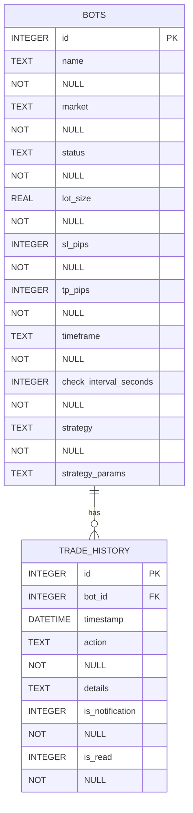
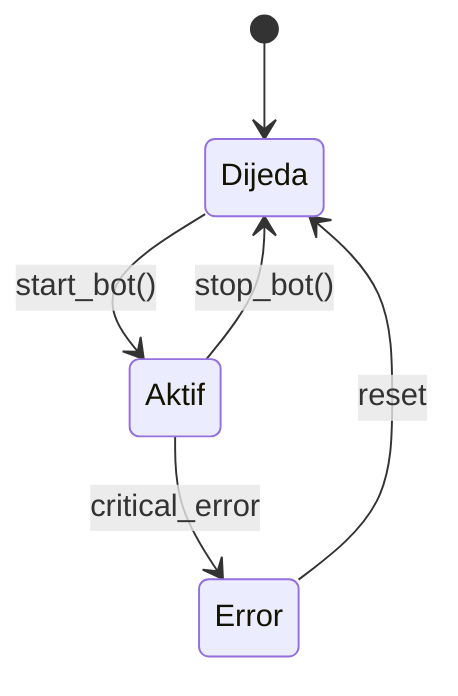
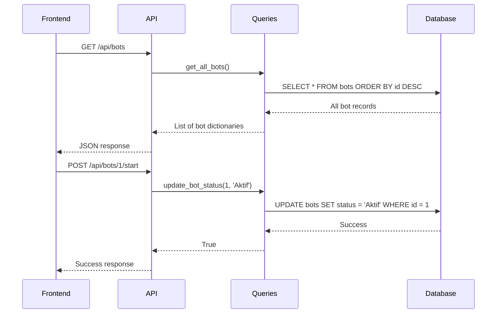

# Bots Table Schema

<cite>
**Referenced Files in This Document**   
- [init_db.py](file://init_db.py#L49-L78)
- [queries.py](file://core/db/queries.py#L0-L41)
- [trading_bot.py](file://core/bots/trading_bot.py#L13-L168)
</cite>

## Table of Contents
1. [Bots Table Schema](#bots-table-schema)
2. [Field Specifications](#field-specifications)
3. [Constraints and Keys](#constraints-and-keys)
4. [Status Transitions](#status-transitions)
5. [Parameter Storage Format](#parameter-storage-format)
6. [Sample Records](#sample-records)
7. [Query Patterns](#query-patterns)
8. [Indexing Strategy](#indexing-strategy)
9. [Data Integrity and Validation](#data-integrity-and-validation)

## Field Specifications

The bots table contains the following fields, each serving a specific purpose in the trading bot system:

- **id**: Unique identifier for each bot (INTEGER, PRIMARY KEY, AUTOINCREMENT)
- **name**: User-defined name for the bot (TEXT, NOT NULL)
- **market**: Financial instrument or market the bot trades on (TEXT, NOT NULL)
- **status**: Current operational state of the bot (TEXT, NOT NULL, DEFAULT 'Dijeda')
- **lot_size**: Trade size in lots (REAL, NOT NULL, DEFAULT 0.01)
- **sl_pips**: Stop-loss distance in pips (INTEGER, NOT NULL, DEFAULT 100)
- **tp_pips**: Take-profit distance in pips (INTEGER, NOT NULL, DEFAULT 200)
- **timeframe**: Chart timeframe for analysis (TEXT, NOT NULL, DEFAULT 'H1')
- **check_interval_seconds**: Frequency of market analysis in seconds (INTEGER, NOT NULL, DEFAULT 60)
- **strategy**: Name of the trading strategy implemented (TEXT, NOT NULL)
- **strategy_params**: JSON-formatted parameters specific to the strategy (TEXT)

**Section sources**
- [init_db.py](file://init_db.py#L49-L78)
- [trading_bot.py](file://core/bots/trading_bot.py#L13-L168)

## Constraints and Keys

The bots table enforces several constraints to maintain data integrity:

- **Primary Key**: The `id` field serves as the primary key, ensuring each bot has a unique identifier.
- **NOT NULL Constraints**: All fields except `strategy_params` are marked as NOT NULL, requiring values upon bot creation.
- **Default Values**: Several fields have default values to simplify bot creation:
  - `status`: 'Dijeda' (Paused)
  - `lot_size`: 0.01
  - `sl_pips`: 100
  - `tp_pips`: 200
  - `timeframe`: 'H1'
  - `check_interval_seconds`: 60

The table has a foreign key relationship with the trade_history table through the `id` field, which is referenced as `bot_id` in the trade_history table with ON DELETE CASCADE.



**Diagram sources**
- [init_db.py](file://init_db.py#L49-L78)
- [init_db.py](file://init_db.py#L79-L100)

**Section sources**
- [init_db.py](file://init_db.py#L49-L100)

## Status Transitions

The bot status field supports the following states with specific business rules governing transitions:

- **Dijeda (Paused)**: Initial state when a bot is created. The bot is not actively trading.
- **Aktif (Active)**: The bot is running and actively analyzing the market and executing trades.
- **Error**: The bot encountered a critical error and has stopped.

Valid status transitions:
- **Dijeda → Aktif**: When a user starts a paused bot via the UI or API.
- **Aktif → Dijeda**: When a user stops an active bot.
- **Aktif → Error**: When the bot encounters a critical error during execution.

The application enforces these transitions through the controller methods that validate state changes before updating the database.



**Diagram sources**
- [trading_bot.py](file://core/bots/trading_bot.py#L13-L168)
- [queries.py](file://core/db/queries.py#L70-L78)

**Section sources**
- [trading_bot.py](file://core/bots/trading_bot.py#L13-L168)
- [queries.py](file://core/db/queries.py#L70-L78)

## Parameter Storage Format

Strategy-specific parameters are stored in the `strategy_params` field as a JSON string. This flexible format allows different strategies to have their own unique parameter sets without requiring schema changes.

The application handles parameter serialization and deserialization:
- When saving to the database, Python dictionaries are converted to JSON strings using `json.dumps()`
- When retrieving from the database, JSON strings are converted back to Python dictionaries using `json.loads()`

This approach enables strategies like Bollinger Squeeze, Ichimoku Cloud, or RSI Crossover to store their specific configuration parameters (e.g., period lengths, threshold values) in a standardized way.

**Section sources**
- [trading_bot.py](file://core/bots/trading_bot.py#L13-L168)
- [queries.py](file://core/db/queries.py#L30-L41)

## Sample Records

Example bot configurations demonstrating different strategies and parameters:

```json
{
  "id": 1,
  "name": "Forex Momentum Trader",
  "market": "EURUSD",
  "status": "Aktif",
  "lot_size": 0.1,
  "sl_pips": 150,
  "tp_pips": 300,
  "timeframe": "H1",
  "check_interval_seconds": 300,
  "strategy": "bollinger_squeeze",
  "strategy_params": "{\"bb_period\": 20, \"bb_std\": 2, \"volume_threshold\": 1.5}"
}
```

```json
{
  "id": 2,
  "name": "Crypto Scalper",
  "market": "BTCUSD",
  "status": "Dijeda",
  "lot_size": 0.05,
  "sl_pips": 50,
  "tp_pips": 100,
  "timeframe": "M15",
  "check_interval_seconds": 60,
  "strategy": "rsi_crossover",
  "strategy_params": "{\"rsi_period\": 14, \"rsi_overbought\": 70, \"rsi_oversold\": 30}"
}
```

```json
{
  "id": 3,
  "name": "Trend Follower",
  "market": "GBPUSD",
  "status": "Aktif",
  "lot_size": 0.2,
  "sl_pips": 200,
  "tp_pips": 400,
  "timeframe": "H4",
  "check_interval_seconds": 600,
  "strategy": "ichimoku_cloud",
  "strategy_params": "{\"tenkan_period\": 9, \"kijun_period\": 26, \"senkou_span_b_period\": 52}"
}
```

**Section sources**
- [trading_bot.py](file://core/bots/trading_bot.py#L13-L168)
- [init_db.py](file://init_db.py#L49-L78)

## Query Patterns

The application uses several common query patterns to interact with the bots table:

**Retrieve all bots (sorted by creation time):**
```sql
SELECT * FROM bots ORDER BY id DESC
```

**Retrieve a specific bot by ID:**
```sql
SELECT * FROM bots WHERE id = ?
```

**Filter active bots:**
```sql
SELECT * FROM bots WHERE status = 'Aktif'
```

**Search bots by name:**
```sql
SELECT * FROM bots WHERE name LIKE ? ORDER BY id DESC
```

**Update bot status:**
```sql
UPDATE bots SET status = ? WHERE id = ?
```

These queries are primarily executed through the functions in `queries.py` which provide a clean interface between the application logic and database operations.



**Diagram sources**
- [queries.py](file://core/db/queries.py#L0-L41)
- [trading_bot.py](file://core/bots/trading_bot.py#L13-L168)

**Section sources**
- [queries.py](file://core/db/queries.py#L0-L41)
- [trading_bot.py](file://core/bots/trading_bot.py#L13-L168)

## Indexing Strategy

The current schema does not explicitly define indexes beyond the primary key index on `id`. However, query patterns suggest potential performance optimization opportunities:

- **Status-based queries**: Frequent filtering by status (e.g., active bots) suggests a potential index on the `status` column could improve performance.
- **Bot-specific queries**: The foreign key relationship with trade_history and frequent lookups by bot ID are already optimized by the primary key index.

While no explicit indexes are defined in the schema, the query patterns indicate that the most common access patterns are already reasonably optimized through the primary key. As the bot count grows, adding an index on the `status` column would improve the performance of status-based filtering operations.

**Section sources**
- [init_db.py](file://init_db.py#L49-L78)
- [queries.py](file://core/db/queries.py#L0-L41)

## Data Integrity and Validation

Data integrity is enforced at both the database and application levels:

**Database-level constraints:**
- NOT NULL constraints on critical fields
- Primary key uniqueness enforcement
- Foreign key relationship with trade_history table
- Default values for optional parameters

**Application-level validation:**
- Input validation in the controller layer before database operations
- State transition validation (e.g., preventing invalid status changes)
- Parameter validation specific to each trading strategy
- Error handling and logging for database operations

The system also implements soft integrity through the application logic:
- The `user_id` field mentioned in the documentation objective does not appear in the actual schema. The system appears to be designed for a single user, as evidenced by the profile API accessing user ID 1 directly.
- All bot operations are validated through the controller layer, which acts as a gatekeeper between the API and database.

The combination of database constraints and application-level validation ensures data consistency and prevents invalid states from being persisted.

**Section sources**
- [init_db.py](file://init_db.py#L49-L78)
- [queries.py](file://core/db/queries.py#L0-L41)
- [trading_bot.py](file://core/bots/trading_bot.py#L13-L168)